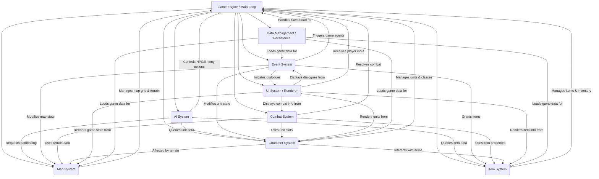

# System Architecture: Fire Emblem Thracia 776 Recreation

## 1. Introduction

This document outlines the high-level system architecture for the Fire Emblem Thracia 776 recreation project. The design is based on the functional specifications provided for the Map, Character & Class, Item, Combat, AI, and Game Flow & Event systems. The goal is to create a modular, extensible, and testable system.

## 2. Core Architectural Principles

*   **Modularity**: Each major system (e.g., Combat, AI, Map) is designed as a distinct module with well-defined responsibilities and interfaces. This allows for independent development, testing, and maintenance.
*   **Separation of Concerns**: Logic related to different aspects of the game (e.g., rendering, game rules, AI decision-making) is kept separate. For instance, the UI System handles rendering, while the Combat System handles battle calculations.
*   **Data-Driven Design**: Core game data (character stats, item properties, map layouts, event scripts) is externalized, allowing for easier modification and expansion without altering core system logic.
*   **Extensibility**: The architecture is designed to accommodate future features and modifications with minimal impact on existing components. Clear interfaces and modularity support this.
*   **Testability**: Each module can be tested independently. Interfaces between modules are clear, facilitating integration testing. The AI system is designed to potentially drive player units for automated playtesting.
*   **Security Considerations**: While not a primary focus for internal game logic, data loaded from external files (maps, scripts, game data) will undergo validation to prevent crashes or unexpected behavior due to malformed data. No hardcoded secrets or environment variables will be embedded in game data files.

## 3. High-Level Component Diagram

The following diagram illustrates the major components of the game and their primary relationships.

## 4. Component Responsibilities and Boundaries

### 4.1. Game Engine / Main Loop

*   **Description**: The central orchestrator of the game.
*   **Key Responsibilities**:
    *   Manages overall game state transitions (Title Screen, World Map, Chapter Gameplay, Game Over).
    *   Controls the main turn-based loop (Player Phase, Enemy Phase, NPC Phase).
    *   Initializes and coordinates all other systems.
    *   Receives high-level input from the UI system and delegates to appropriate systems.
    *   Manages chapter lifecycle (start, end, victory/loss conditions).
*   **Primary Data Managed**: Current game state, current chapter ID, turn number, active phase.

### 4.2. Map System

*   **Description**: Manages the game's spatial environment, including map structure, terrain, and tile properties. (Based on [`docs/spec/01_MapSystem.md`](docs/spec/01_MapSystem.md:0))
*   **Implementation Status**: Core implementation complete. Passed initial suite of 64 tests.
*   **Key Responsibilities**:
    *   Loads and stores map data, including grid dimensions and tile configurations.
    *   Manages various `TerrainType` definitions and their associated properties (e.g., movement costs, defensive bonuses, visual style).
    *   Manages `Tileset` data, which groups `TerrainType`s and their graphical representations.
    *   Provides `Map` objects, which are composed of a grid of `TileInstance` objects. Each `TileInstance` represents a specific tile on the map, holding its terrain type and any tile-specific state.
    *   Offers functionalities to query tile information (e.g., `get_terrain_type(x, y)`, `get_tile_instance(x, y)`).
    *   Supports pathfinding algorithms by providing necessary map data (e.g., traversability, movement costs).
    *   Interfaces with the UI System for rendering the map and its components.
*   **Primary Data Managed / Key Classes**:
    *   [`Map`](../../src/map_system/map.py:0): Represents the overall game map, containing a grid of `TileInstance`s and map metadata.
    *   [`TileInstance`](../../src/map_system/tile.py:0): Represents an individual tile on the map, holding its `TerrainType` and potentially other state.
    *   [`TerrainType`](../../src/map_system/terrain.py:0): Defines the properties of a specific type of terrain (e.g., plains, forest, mountain), including movement cost, defensiveness, and visual representation.
    *   [`Tileset`](../../src/map_system/tileset.py:0): A collection of `TerrainType`s that are used together to define the visual and functional characteristics of a map or a set of maps.

### 4.3. Character System

*   **Description**: Manages all aspects of game units, their abilities, and progression. (Based on [`docs/spec/02_CharacterAndClassSystem.md`](docs/spec/02_CharacterAndClassSystem.md:0))
*   **Key Responsibilities**:
    *   Manages `Character` definitions (base stats, growth rates, innate skills).
    *   Manages `GameClass` definitions (base/max stats, class skills, weapon ranks, promotion paths, movement types).
    *   Manages active `UnitInstance` data on the map (current HP, stats, level, experience, inventory, position, status effects, current class).
    *   Handles character progression: leveling up, experience gain, promotion.
    *   Calculates current unit stats based on character, class, items, skills, and status.
    *   Manages skill definitions and their application (passive effects, activation conditions).
    *   Handles mounting/dismounting mechanics.
*   **Primary Data Managed**: `Character` definitions, `GameClass` definitions, `UnitInstance` objects, `Skill` definitions, `MovementType` data.

### 4.4. Item System

*   **Description**: Manages all usable items in the game. (Based on [`docs/spec/03_ItemSystem.md`](docs/spec/03_ItemSystem.md:0))
*   **Key Responsibilities**:
    *   Manages `Item` definitions (weapons, staves, consumables, scrolls, keys).
    *   Defines item properties (type, uses, cost, icon, description).
    *   Defines `Weapon` properties (might, hit, crit, weight, range, rank, effectiveness, stat bonuses, special effects).
    *   Defines `Staff` properties (effect, potency, range, rank, EXP gain).
    *   Defines `UsableItem` effects (healing, stat boosts).
    *   Defines `Scroll` growth modifiers.
    *   Manages unit inventories and the convoy.
    *   Provides functions for item usability checks (e.g., `CanBeUsedBy(UnitInstance)`).
*   **Primary Data Managed**: `Item`, `Weapon`, `Staff`, `UsableItem`, `Scroll` definitions. Unit inventory lists.

### 4.5. Combat System

*   **Description**: Resolves combat encounters between units. (Based on [`docs/spec/04_CombatSystem.md`](docs/spec/04_CombatSystem.md:0))
*   **Key Responsibilities**:
    *   Manages the step-by-step flow of a combat round (initiation, first strike, counter-attack, follow-up attacks).
    *   Calculates combat parameters: Attack Speed, Hit Rate, Avoid Rate, Critical Rate, Damage.
    *   Applies effects of skills, weapon properties (effectiveness, brave, poison), and terrain during combat.
    *   Determines combat outcome (damage dealt, unit defeat).
    *   Awards experience points post-combat.
*   **Primary Data Managed**: Temporary combat state for an active encounter (attacker, defender, calculated stats for the round).

### 4.6. AI System

*   **Description**: Controls the behavior of non-player characters (enemies and NPCs). (Based on [`docs/spec/05_AISystem.md`](docs/spec/05_AISystem.md:0))
*   **Key Responsibilities**:
    *   Executes AI scripts assigned to `UnitInstance`s (movement AI, action AI).
    *   Performs decision-making for AI units: target selection, movement pathing, action choice (attack, staff, item use).
    *   Utilizes services from other systems (Map System for pathfinding, Character System for unit data, Item System for item data).
    *   Supports different AI personalities/roles (aggressive, defensive, healer, objective-focused).
    *   Can be configured to control player units for automated playtesting.
*   **Primary Data Managed**: `UnitAIAssignment` data, AI script definitions (conceptual, linked to `MovementAIScriptID`, `ActionAIScriptID`).

### 4.7. Event System

*   **Description**: Manages scripted sequences and dynamic occurrences within chapters. (Based on [`docs/spec/06_GameFlowEventSystem.md`](docs/spec/06_GameFlowEventSystem.md:0))
*   **Key Responsibilities**:
    *   Parses and executes event scripts (e.g., from `.event` files).
    *   Handles various event triggers (chapter start, turn number, character talk, location visit, unit death, flags).
    *   Executes event commands: unit loading/movement, dialogue display, camera control, music/sound changes, item grants, flag manipulation.
    *   Manages event flags to control event flow and prevent re-triggering.
    *   Interacts with most other systems to enact event outcomes.
*   **Primary Data Managed**: Event script definitions, active event flags, `UnitGroup` definitions for placements.

### 4.8. UI System / Renderer & Input Handler

*   **Description**: Responsible for presenting the game to the player and handling player input.
*   **Key Responsibilities**:
    *   Renders the game world: map, tiles, units, and their animations.
    *   Displays game menus, dialogue boxes, combat forecasts, unit information panels.
    *   Handles player input for menu navigation, unit selection, command issuance.
    *   Plays visual effects and animations for combat and events.
    *   Presents narrative text and character portraits during dialogues.
*   **Primary Data Managed**: Current UI state, references to assets for rendering, input mappings.

### 4.9. Data Management / Persistence System

*   **Description**: Handles loading of game data and saving/loading of player progress.
*   **Key Responsibilities**:
    *   Loads all static game data at startup from various file formats (e.g., `.event` scripts, CSV tables, binary data for maps/tilesets). This includes, but is not limited to:
        *   `Character` definitions, `GameClass` definitions, `Skill` definitions, `MovementType` data.
        *   `Item`, `Weapon`, `Staff`, `UsableItem`, `Scroll` definitions.
        *   `Map` layouts, `Tileset` data, `TerrainType` definitions.
        *   `Event` scripts, `UnitGroup` definitions.
        *   AI script pointers (`MovementAIScriptID`, `ActionAIScriptID`), `AutolevelScheme` data.
        *   Other tabular data (e.g., `TerrainDefense.csv`, `TerrainAvoid.csv`, `WeaponEffectTable.csv`, `ScrollTable.csv`).
    *   Validates loaded static game data for integrity and correctness to prevent runtime errors and ensure consistency.
    *   Provides efficient and structured access to this static data for all other systems.
    *   Manages saving the current dynamic game state (active `UnitInstance`s, chapter progress, global and chapter event flags, convoy inventory, player gold, etc.) to a save file.
    *   Manages loading a previously saved game state, restoring all dynamic elements.
    *   Handles game configuration settings (e.g., volume, text speed, animation preferences).
*   **Primary Data Managed**: Parsed game data structures, save game file format, player preferences.

## 5. Key Interfaces and Data Flows

Interactions between systems are crucial for game functionality.

*   **Game Initialization**:
    1.  `Data Management` loads all static game data.
    2.  `Game Engine` initializes all systems, providing them with necessary data references.
*   **Chapter Start**:
    1.  `Game Engine` signals `Event System` to run opening events for the selected chapter.
    2.  `Event System` commands `Map System` to load the map.
    3.  `Event System` commands `Character System` (via `UnitGroup` definitions) to place initial `UnitInstance`s. These instances are populated with data from `Character`, `Class`, and `Item` systems.
    4.  `Event System` commands `UI System` to display opening dialogues, camera pans.
*   **Player Turn - Unit Action (e.g., Move & Attack)**:
    1.  `UI System` captures player input (select unit, select move destination).
    2.  `Game Engine` validates move with `Map System` (pathfinding, movement cost for unit's `MovementType` from `Character System`).
    3.  `Character System` updates `UnitInstance` position.
    4.  `UI System` captures player input (select attack, select target).
    5.  `Game Engine` initiates combat via `Combat System`.
    6.  `Combat System` queries `Character System` for attacker/defender stats, skills.
    7.  `Combat System` queries `Item System` for weapon properties.
    8.  `Combat System` queries `Map System` for terrain bonuses at unit positions.
    9.  `Combat System` resolves combat, returns results (damage, defeat, EXP).
    10. `Character System` updates `UnitInstance` HP, EXP, status.
    11. `UI System` displays combat animation and results.
*   **Enemy Turn**:
    1.  `Game Engine` activates `AI System`.
    2.  For each AI unit, `AI System`:
        *   Queries `Map System` for tactical positions and pathfinding.
        *   Queries `Character System` for its own capabilities and potential target data.
        *   Queries `Item System` for its weapon/staff capabilities.
        *   Decides on a move and action (e.g., move to X,Y; attack PlayerUnit Z).
        *   If attacking, `Game Engine` initiates combat via `Combat System` (similar to player attack).
*   **Event Trigger (e.g., Talk Event)**:
    1.  Player moves unit A next to unit B and selects "Talk" via `UI System`.
    2.  `Game Engine` informs `Event System` of the potential talk event.
    3.  `Event System` checks conditions (are A and B the correct characters? Is the event flag clear?).
    4.  If conditions met, `Event System` executes the talk script:
        *   Commands `UI System` to display dialogue.
        *   May command `Character System` to grant EXP or `Item System` to give an item.
        *   Sets the event flag to prevent re-triggering.

## 6. Support for AI-Driven Playtesting

The architecture supports AI-driven playtesting in several ways:

*   **Modular AI System**: The `AI System` is designed to control any `UnitInstance`. For playtesting, player units can be temporarily assigned AI behaviors.
*   **Scriptable AI**: Different AI scripts can be developed for playtesting scenarios (e.g., "aggressively complete objective," "test defensive formations," "explore all map locations").
*   **Data Interfaces**: The AI has access to the same data interfaces as a human player would need to make decisions (map data, unit stats, item properties).
*   **Event System Interaction**: The AI can trigger and be affected by events, allowing for testing of complex chapter scripts.
*   **Headless Mode Potential**: By separating game logic from rendering (UI System), it's feasible to run the game in a "headless" mode for faster automated testing, with the AI making decisions and the game state being logged or asserted against expected outcomes.

## 7. Conclusion

This architecture provides a robust foundation for recreating Fire Emblem Thracia 776. Its modular design, clear separation of concerns, and well-defined interfaces will facilitate development, testing, and future enhancements. The emphasis on data-driven design will allow for accurate representation of the original game's content and mechanics.