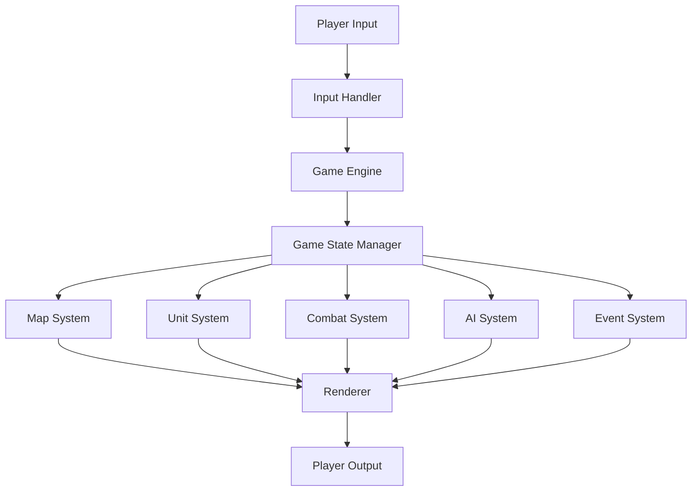

# Architecture Overview

## High-Level Architecture

The Fantasy Tactics Game (based on Fire Emblem: Thracia 776) is designed with a modular architecture that separates game logic from presentation. This allows for:

1. Text-based testing and later graphical upgrades
2. Clear separation of concerns
3. Easier maintenance and extension
4. Testability of individual components

## Core Components

### Game Engine

The central component that coordinates all other systems. Responsible for:
- Initializing the game
- Managing the game loop
- Coordinating between components
- Handling input and output

### Game State Manager

Maintains the current state of the game, including:
- Current turn and phase (Player/Enemy/NPC)
- Active units and their states
- Map state
- Game flags and variables
- History of actions for undo/replay

### Input Handler

Processes player input from various sources:
- Command-line interface (CLI)
- Future graphical interface
- Potential AI players

### Renderer

Responsible for displaying the game state to the player:
- Text-based renderer (initial implementation)
- Graphical renderer (future implementation)

### Map System

Represents the game map, terrain, and unit positioning:
- Map data structure
- Terrain types and effects
- Pathfinding
- Fog of War

### Unit System

Represents characters in the game with all their attributes and behaviors:
- Stats and derived values
- Inventory management
- Class system and promotion
- Skills and abilities
- Fatigue system

### Combat System

Handles all combat-related calculations and effects:
- Hit/miss calculation
- Damage calculation
- Critical hits and PCC system
- Follow-up attacks
- Status effects
- Capture mechanics

### AI System

Handles enemy and NPC behavior:
- Target selection
- Movement planning
- Action decision
- Special behaviors (thieves, healers, etc.)

### Event System

Manages in-game events and triggers:
- Turn events
- Story events
- Reinforcements
- Victory/defeat conditions

## Component Interactions

Components interact through well-defined interfaces:

1. **Game Engine** coordinates all components and manages the game loop
2. **Game State Manager** provides access to the current state for all components
3. **Input Handler** translates player input into game actions
4. **Renderer** displays the current state to the player
5. **Map System** provides terrain information to other systems
6. **Unit System** manages unit data and actions
7. **Combat System** calculates combat outcomes
8. **AI System** determines enemy and NPC actions
9. **Event System** triggers events based on game state

## Data Flow

## Design Patterns

The architecture incorporates several design patterns:

1. **Model-View-Controller (MVC)**
   - Model: Game State, Map, Units
   - View: Renderer
   - Controller: Input Handler, Game Engine

2. **Command Pattern**
   - Player actions are encapsulated as command objects
   - Enables undo/redo functionality
   - Facilitates action history and replay

3. **Observer Pattern**
   - Components observe the game state for changes
   - Renderer updates when game state changes
   - Event system triggers based on state changes

4. **Strategy Pattern**
   - Different AI behaviors implemented as strategies
   - Various combat calculation strategies
   - Different rendering strategies (text vs. graphical)

5. **Factory Pattern**
   - Creation of units, items, and map elements
   - Standardized creation process
   - Centralized object creation logic