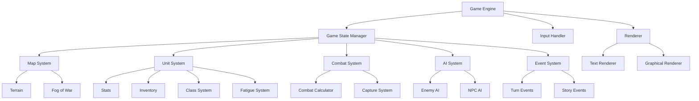
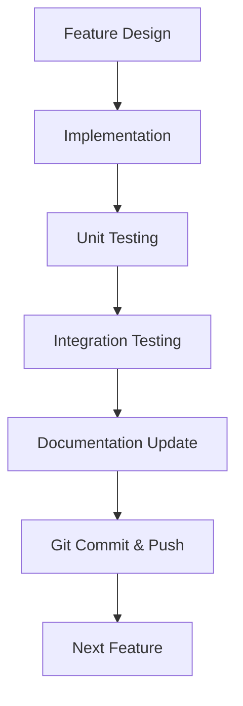

# Fire Emblem: Thracia 776 Recreation - Design Document & Implementation Plan

## Project Overview

This document outlines a plan to recreate Fire Emblem: Thracia 776, starting with a text-based implementation and gradually adding graphical elements. The implementation will prioritize testability through a command-line interface to ensure all game mechanics function correctly before visual elements are added.

## Core Design Philosophy

1. **Modular Architecture**: Separate game logic from presentation to allow for text-based testing and later graphical upgrades
2. **Incremental Implementation**: Build core mechanics first, then add complexity
3. **Test-Driven Development**: Create robust testing for each component
4. **Command-Line First**: Ensure all game features are accessible and testable via CLI
5. **Data-Driven Design**: Store game data (units, weapons, maps) in external files for easy modification

## System Architecture



## Implementation Phases

### Phase 1: Core Engine & Data Structures
- Game state management
- Basic data structures for units, maps, items
- Turn-based system implementation
- Simple text-based rendering
- Command parsing for player input

### Phase 2: Map & Movement Systems
- Map representation and terrain effects
- Unit placement and movement
- Pathfinding algorithms
- Terrain costs and restrictions
- Zone of control implementation

### Phase 3: Combat System Basics
- Basic attack mechanics
- Hit/miss calculation
- Damage calculation
- Weapon types and effectiveness
- Death/defeat handling

### Phase 4: Advanced Combat Features
- Weapon triangle
- Critical hits and PCC system
- Follow-up attacks (doubling)
- Range implementation
- Status effects

### Phase 5: Unit Systems
- Stats and growth implementation
- Class system and promotion
- Inventory management
- Weapon ranks and experience
- Fatigue system

### Phase 6: Special Mechanics
- Capture and rescue mechanics
- Trading system
- Dismounting
- Support and leadership bonuses
- Skills implementation

### Phase 7: AI Implementation
- Basic enemy AI
- Target selection
- Movement patterns
- Special AI behaviors (thieves, healers, etc.)
- NPC ally AI

### Phase 8: Events & Objectives
- Chapter objectives (seize, escape, defend)
- Turn events and triggers
- Reinforcements
- Conversations and recruitment
- Victory/defeat conditions

### Phase 9: Enhanced CLI & Testing
- Improved text-based UI
- Comprehensive testing suite
- Debug commands and tools
- Save/load functionality
- Game balance testing

### Phase 10: Graphical Implementation
- Basic sprite rendering
- Animation system
- UI elements and menus
- Sound integration
- Visual effects

## Development Workflow

### Feature Implementation Process

For each feature:

1. **Design**: Document the feature's requirements and design
2. **Implementation**: Code the feature
3. **Testing**: Create and run tests for the feature
4. **Documentation**: Update documentation
5. **Version Control**: Commit and push changes



### Testing Strategy

#### Unit Testing

Each component will have comprehensive unit tests:

```python
# Example unit test for combat calculation
def test_combat_damage_calculation():
    # Arrange
    attacker = Unit(name="Leif", strength=10)
    attacker.equip(Weapon(name="Iron Sword", might=5))
    defender = Unit(name="Enemy", defense=5)
    
    # Act
    damage = combat_system.calculate_damage(attacker, defender)
    
    # Assert
    assert damage == 10, f"Expected damage to be 10, got {damage}"
```

#### Integration Testing

Test interactions between components:

```python
# Example integration test for combat execution
def test_combat_execution():
    # Arrange
    game_state = GameState()
    attacker = game_state.create_unit("Leif", position=(1, 1))
    defender = game_state.create_unit("Enemy", position=(1, 2))
    
    # Act
    result = game_state.execute_combat(attacker, defender)
    
    # Assert
    assert defender.current_hp < defender.max_hp, "Defender should take damage"
    assert result.hit, "Attack should hit"
```

#### Command-Line Testing

Create CLI commands to test game features:

```
# Example CLI test commands
> create_unit Leif Lord 5,5
> move_unit 5,5 7,6
> attack 7,6 7,7
> show_stats 7,6
```

### Documentation Standards

#### Code Documentation

All code will be documented with:
- Function/method descriptions
- Parameter explanations
- Return value descriptions
- Examples where appropriate

```python
def calculate_attack_speed(unit, weapon):
    """
    Calculate a unit's Attack Speed based on their Speed stat and weapon weight.
    
    Args:
        unit (Unit): The unit to calculate Attack Speed for
        weapon (Weapon): The weapon the unit is using
        
    Returns:
        int: The calculated Attack Speed
        
    Formula: AS = Speed - max(0, (Weapon Weight - Constitution))
    For magic weapons, Constitution is not considered.
    """
    # Implementation
```

#### Feature Documentation

For each implemented feature:

1. **Overview**: Brief description of the feature
2. **Implementation Details**: How the feature is implemented
3. **Usage Examples**: How to use the feature
4. **Testing**: How to test the feature
5. **Known Limitations**: Any current limitations or TODOs

### Git Workflow

#### Commit Standards

Each commit should:
1. Focus on a single feature or fix
2. Include a descriptive message
3. Reference any relevant documentation or issues

```bash
# Example commit
git add combat_system.py tests/test_combat_system.py docs/combat_system.md
git commit -m "Implement basic combat system with hit/damage calculation

- Added hit rate formula based on Thracia 776 mechanics
- Implemented damage calculation for physical attacks
- Added unit tests for various combat scenarios
- Updated documentation with examples

Refs: #12"
git push
```

#### Branch Strategy

- `main`: Stable, working version
- `develop`: Integration branch for features
- `feature/X`: Individual feature branches

## CLI Testing Interface

To facilitate testing through the command line, we'll implement a robust CLI that allows for:

```
# Game control commands
> start_chapter 1
> end_turn
> save_game save1
> load_game save1

# Unit commands
> move 5,5 7,7
> attack 7,7 8,7
> use_item 7,7 Vulnerary
> trade 7,7 8,7
> capture 7,7 8,7
> rescue 7,7 8,7
> release 7,7
> wait 7,7

# Information commands
> show_map
> show_unit 7,7
> show_range 7,7
> show_path 7,7 10,10
> show_combat_forecast 7,7 8,7

# Debug commands
> set_stat 7,7 strength 15
> add_item 7,7 Iron_Sword
> kill_unit 8,7
> toggle_fog
> spawn_enemy Fighter 10,10
```

## Documentation Structure

```
/docs
  /architecture
    overview.md
    component_diagram.md
  /systems
    game_state.md
    unit_system.md
    combat_system.md
    map_system.md
    ai_system.md
  /features
    movement.md
    combat.md
    capture.md
    fatigue.md
  /data_formats
    units.md
    maps.md
    items.md
  /testing
    unit_tests.md
    cli_testing.md
  /development
    workflow.md
    git_standards.md