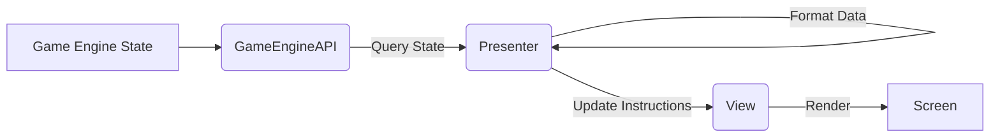
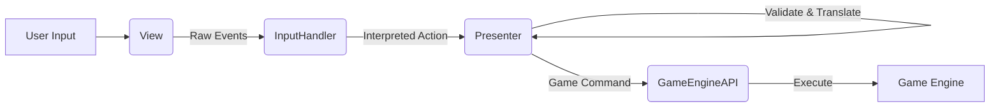

# GUI Architecture Specification

## 1. Overview

This document outlines the architecture for the Graphical User Interface (GUI) of the Fantasy Tactics Game. It defines the chosen architectural pattern, identifies key components and their responsibilities, recommends a suitable library, and describes the data flow between the GUI and the core game engine.

## 2. Architectural Pattern: Model-View-Presenter (MVP)

### 2.1. Choice: Model-View-Presenter (MVP)

The MVP pattern is selected for the GUI architecture. This pattern separates concerns into three distinct components:

*   **Model:** Represents the application's data and business logic (in this case, primarily the game state provided by the Game Engine). The GUI's Model component is essentially a *proxy* or *adapter* to the actual game state managed by the core engine.
*   **View:** Responsible for displaying the data (the visual representation of the game state) and routing user input to the Presenter. The View should be as passive as possible, containing no application logic.
*   **Presenter:** Acts as the intermediary between the Model and the View. It retrieves data from the Model, formats it for display in the View, and processes user input received from the View to update the Model (by sending commands to the Game Engine).

### 2.2. Justification

*   **Separation of Concerns:** MVP clearly separates the presentation logic (Presenter) from the UI rendering (View) and the application data/logic (Model/Game Engine). This improves modularity and maintainability.
*   **Testability:** The Presenter and Model components can be tested independently of the UI framework (View), facilitating unit testing. The View can be tested with UI-specific tools or mocked.
*   **Flexibility:** Decoupling the View allows for easier changes to the UI implementation (e.g., switching rendering libraries) without significantly impacting the Presenter or Model logic.
*   **Clear Data Flow:** The pattern establishes a well-defined flow for user input and game state updates.

## 3. Core Components

### 3.1. GameEngineAPI (Model Interface)

*   **Responsibility:** Provides a stable interface for the GUI (specifically the Presenter) to interact with the core game engine. It exposes methods to query the current game state (map, units, menus, etc.) and to send player commands (move unit, attack, end turn, etc.).
*   **Interaction:** The Presenter calls methods on the `GameEngineAPI` to get data needed by the View and to execute actions based on user input. It acts as the GUI's window into the game's core logic and state.

### 3.2. View (Pygame-based)

*   **Responsibility:** Renders the visual elements of the game based on data provided by the Presenter. This includes drawing the map, units, menus, dialog boxes, status indicators, etc. It also captures raw user input events (keyboard presses, mouse clicks, mouse movement) and forwards them to the `InputHandler`.
*   **Implementation:** Will utilize the chosen GUI library (Pygame) for drawing operations and event handling. It should expose methods for the Presenter to call, such as `draw_map(map_data)`, `draw_unit(unit_data)`, `show_menu(menu_options)`, `get_input_events()`. It holds no game logic itself.

### 3.3. Presenter

*   **Responsibility:** Orchestrates the GUI's behavior.
    *   Retrieves game state data from the `GameEngineAPI`.
    *   Formats this data as needed for display.
    *   Instructs the `View` on what and how to render.
    *   Receives interpreted user actions from the `InputHandler`.
    *   Validates user actions (where appropriate within the GUI context, e.g., clicking a valid menu option).
    *   Translates valid user actions into commands and sends them to the `GameEngineAPI`.
    *   Manages the GUI's internal state (e.g., selected unit, current menu context).
*   **Interaction:** Communicates with both the `GameEngineAPI` (for data and commands) and the `View` (for rendering instructions). It also receives processed input from the `InputHandler`.

### 3.4. InputHandler

*   **Responsibility:** Processes raw input events received from the `View` (e.g., `MOUSEBUTTONDOWN`, `KEYDOWN`) and translates them into meaningful user actions relevant to the current game context (e.g., `SelectUnitAction(x, y)`, `OpenMenuAction()`, `ConfirmAction()`). It understands the mapping between raw inputs and game actions based on the current state managed by the Presenter.
*   **Interaction:** Receives raw events from the `View`. Sends interpreted action objects or calls methods on the `Presenter` corresponding to the user's intent. This decouples the Presenter from raw input event details.

## 4. Recommended Library: Pygame

### 4.1. Choice: Pygame

Pygame is recommended as the primary library for implementing the `View` component.

### 4.2. Justification

*   **Suitability for 2D Games:** Pygame is specifically designed for 2D game development, offering necessary functionalities like sprite handling, drawing primitives, event management, sound, etc.
*   **Python Integration:** As the core engine is likely Python-based, Pygame integrates seamlessly.
*   **Maturity and Community:** Pygame is a mature library with extensive documentation and a large community, providing ample resources and support.
*   **Performance:** While not the absolute highest performance option available, Pygame offers sufficient performance for a turn-based tactics game.
*   **Simplicity:** Relatively easy to learn and use for the required scope.

## 5. Data Flow

The interaction between the components follows these primary flows:

### 5.1. Game State Update Flow (Engine -> GUI)

1.  **Game Engine:** Internal state changes (e.g., unit moved, combat resolved, turn ended).
2.  **Presenter:** Periodically or reactively queries the `GameEngineAPI` for the latest game state relevant to the display.
3.  **Presenter:** Processes the retrieved data (e.g., unit positions, stats, available actions).
4.  **Presenter:** Calls methods on the `View` to update the display (`draw_map`, `draw_units`, `update_ui_elements`).
5.  **View:** Renders the changes to the screen using Pygame.

### 5.2. User Input Flow (GUI -> Engine)

1.  **User:** Interacts with the game (e.g., clicks mouse, presses key).
2.  **View (Pygame):** Captures the raw input event.
3.  **View:** Forwards the raw event(s) to the `InputHandler`.
4.  **InputHandler:** Interprets the raw event(s) based on the current context (provided by the Presenter) into a specific user action (e.g., `SelectTileAction(5, 10)`).
5.  **InputHandler:** Notifies the `Presenter` of the interpreted action.
6.  **Presenter:** Validates the action (if necessary) and determines the corresponding game command.
7.  **Presenter:** Calls the appropriate method on the `GameEngineAPI` to execute the command (e.g., `engine_api.select_unit_at(5, 10)`).
8.  **GameEngineAPI:** Forwards the command to the core Game Engine.
9.  **Game Engine:** Processes the command, potentially changing the game state (which triggers the update flow).

## 6. Modularity and Extensibility

*   The `GameEngineAPI` provides a clear boundary between the core logic and the GUI.
*   The MVP pattern allows the `View` implementation (Pygame) to be potentially swapped or augmented with minimal changes to the `Presenter` or `GameEngineAPI`.
*   The `InputHandler` isolates input processing logic, making it easier to modify controls or support different input devices.

## 7. Future Considerations

*   **UI Toolkit:** While Pygame is suitable, consider integrating a higher-level UI toolkit (like Pygame GUI) for complex menu systems if needed, interacting with it via the `View` and `Presenter`.
*   **Asynchronous Updates:** For potentially long-running engine operations, explore mechanisms (e.g., callbacks, event queues) for the engine to notify the GUI of updates asynchronously rather than relying solely on polling.