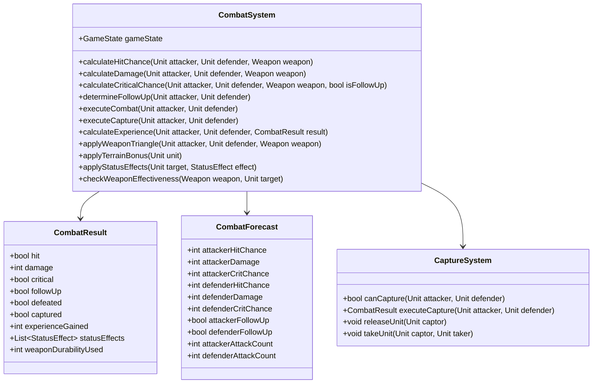

# Combat System

## Overview

The Combat System handles all battle-related calculations and effects in the game. It determines hit chances, damage, critical hits, follow-up attacks, and special combat mechanics like capturing. This system is crucial for the game's tactical depth and implements Thracia 776's unique combat formulas and mechanics.

## Responsibilities

- Calculate hit and avoid rates
- Determine damage values
- Handle critical hit calculations, including the PCC system
- Process follow-up attacks (doubling)
- Manage weapon triangle bonuses
- Handle special weapon effects
- Process combat skills
- Manage the capture system
- Calculate and award experience
- Handle status effects from combat
- Process weapon durability

## Class Structure



## Key Formulas

### Hit and Avoid

The hit chance in Thracia 776 is calculated as:

```
Hit Chance = Attacker's Hit - Defender's Avoid
```

Where:

```
Attacker's Hit = Weapon Hit + (2 × Skill) + Luck + Support bonuses + Leadership bonuses + Charisma bonus + Weapon Triangle bonus
```

```
Defender's Avoid = (2 × Attack Speed) + Luck + Support bonus + Leadership bonus + Charisma bonus + Terrain bonus
```

The final hit chance is clamped between 1% and 99%, meaning there's always at least a 1% chance to miss and a 1% chance to hit.

### Damage Calculation

Physical damage is calculated as:

```
Physical Damage = (Attacker's Strength + Weapon Might × Effective Bonus) - Defender's Physical Defense
```

Where:
- Physical Defense = Defender's Defense + terrain defense bonus
- Effective Bonus = 3 if weapon is effective vs the target, otherwise 1

Magical damage is calculated as:

```
Magical Damage = (Attacker's Magic + Weapon Might × Effective Bonus) - Defender's Magical Defense
```

Where:
- Magical Defense = Defender's Magic + any active Mag bonus + terrain bonus

### Critical Rate and PCC

Critical rate is calculated as:

```
Critical Rate = (Weapon Critical + Skill + Support bonus) - enemy's Critical Evade
```

Where:
- Critical Evade = (Luck / 2) + support bonus

Thracia 776 has a unique Pursuit Critical Coefficient (PCC) system that affects critical rates on follow-up attacks:

- On the first attack, critical rate is capped at 25%
- On follow-up attacks, critical rate is multiplied by the unit's PCC value

### Follow-Up Attacks

A unit can perform a follow-up attack if their Attack Speed exceeds the enemy's Attack Speed by 4 or more points:

```
Can Follow-Up = Attacker's AS >= Defender's AS + 4
```

Where Attack Speed (AS) is calculated as:

```
AS = Speed - max(0, (Weapon Weight - Constitution))
```

For magic weapons, Constitution doesn't offset weight:

```
AS = Speed - Weapon Weight
```

### Weapon Triangle

The weapon triangle provides a +5 hit bonus when at advantage and a -5 hit penalty when at disadvantage:

- Swords beat Axes
- Axes beat Lances
- Lances beat Swords

For magic:
- Fire beats Wind
- Wind beats Thunder
- Thunder beats Fire

Light and Dark magic are outside the Anima triangle and are considered superior to Anima magic.

### Experience Calculation

Experience gained from combat depends on the relative levels of the units and the outcome:

```
Base EXP = 10 + (Defender's Level + Class Bonus - Attacker's Level)
```

- If the defender is defeated: EXP = Base EXP
- If the defender is not defeated: EXP = Base EXP / 2
- If the attacker is a boss: EXP = Base EXP + 40
- If the attacker is a thief: EXP = Base EXP + 20

The final EXP is clamped between 1 and 100.

## Implementation

### Combat Execution

```python
def execute_combat(self, attacker, defender):
    """
    Execute a combat between two units.
    
    This method:
    1. Calculates hit chances, damage, and critical rates
    2. Determines the combat sequence (who attacks when)
    3. Executes each attack in the sequence
    4. Applies results (damage, status effects, etc.)
    5. Calculates and awards experience
    6. Updates weapon durability
    
    Args:
        attacker (Unit): The unit initiating the attack
        defender (Unit): The target unit
        
    Returns:
        CombatResult: The result of the combat
    """
    # Get weapons
    attacker_weapon = attacker.inventory.get_equipped_weapon()
    defender_weapon = defender.inventory.get_equipped_weapon()
    
    if not attacker_weapon:
        raise NoCombatWeaponError("Attacker has no equipped weapon")
    
    # Check if in range
    if not self._is_in_range(attacker, defender, attacker_weapon):
        raise OutOfRangeError("Target is out of range")
    
    # Determine combat sequence
    sequence = self._determine_combat_sequence(attacker, defender, attacker_weapon, defender_weapon)
    
    # Execute each attack in the sequence
    results = []
    for unit, target, weapon, is_counter, is_follow_up in sequence:
        # Skip if unit or target is defeated
        if unit.is_defeated() or target.is_defeated():
            continue
        
        # Calculate hit chance
        hit_chance = self.calculate_hit_chance(unit, target, weapon)
        
        # Roll for hit
        hit_roll = random.randint(1, 100)
        hit = hit_roll <= hit_chance
        
        if hit:
            # Calculate damage
            damage = self.calculate_damage(unit, target, weapon)
            
            # Calculate critical chance
            crit_chance = self.calculate_critical_chance(unit, target, weapon, is_follow_up)
            
            # Roll for critical
            crit_roll = random.randint(1, 100)
            critical = crit_roll <= crit_chance
            
            # Apply critical multiplier
            if critical:
                damage *= 2
            
            # Apply damage
            target.take_damage(damage)
            
            # Check for defeat
            defeated = target.is_defeated()
            
            # Check for status effects
            status_effects = self._check_weapon_status_effects(weapon)
            for effect in status_effects:
                self.apply_status_effect(target, effect)
            
            # Update weapon durability
            weapon.use()
            
            results.append({
                "attacker": unit,
                "defender": target,
                "weapon": weapon,
                "hit": True,
                "damage": damage,
                "critical": critical,
                "defeated": defeated,
                "status_effects": status_effects,
                "is_counter": is_counter,
                "is_follow_up": is_follow_up
            })
        else:
            # Miss
            results.append({
                "attacker": unit,
                "defender": target,
                "weapon": weapon,
                "hit": False,
                "damage": 0,
                "critical": False,
                "defeated": False,
                "status_effects": [],
                "is_counter": is_counter,
                "is_follow_up": is_follow_up
            })
    
    # Calculate experience
    if attacker.type == UnitType.PLAYER:
        exp = self.calculate_experience(attacker, defender, results)
        attacker.add_experience(exp)
    elif defender.type == UnitType.PLAYER:
        exp = self.calculate_experience(defender, attacker, results, is_defender=True)
        defender.add_experience(exp)
    
    # Add fatigue
    if attacker.type == UnitType.PLAYER:
        self.game_state.fatigue_system.add_combat_fatigue(attacker)
    if defender.type == UnitType.PLAYER:
        self.game_state.fatigue_system.add_combat_fatigue(defender)
    
    # Create and return the final result
    return CombatResult(results)
```

### Hit Chance Calculation

```python
def calculate_hit_chance(self, attacker, defender, weapon):
    """
    Calculate the hit chance for an attack.
    
    Args:
        attacker (Unit): The attacking unit
        defender (Unit): The defending unit
        weapon (Weapon): The weapon being used
        
    Returns:
        int: The hit chance (1-99)
    """
    # Calculate attacker's hit
    attacker_hit = weapon.hit
    attacker_hit += 2 * attacker.base_stats.skill
    attacker_hit += attacker.base_stats.luck
    
    # Add support bonuses
    attacker_hit += self._calculate_support_hit_bonus(attacker)
    
    # Add leadership bonuses
    attacker_hit += self._calculate_leadership_bonus(attacker)
    
    # Add charisma bonus
    attacker_hit += self._calculate_charisma_bonus(attacker)
    
    # Add weapon triangle bonus
    attacker_hit += self._calculate_weapon_triangle_hit_bonus(attacker, defender, weapon)
    
    # Calculate defender's avoid
    defender_avoid = 2 * defender.calculate_attack_speed()
    defender_avoid += defender.base_stats.luck
    
    # Add support bonuses
    defender_avoid += self._calculate_support_avoid_bonus(defender)
    
    # Add leadership bonuses
    defender_avoid += self._calculate_leadership_bonus(defender)
    
    # Add charisma bonus
    defender_avoid += self._calculate_charisma_bonus(defender)
    
    # Add terrain bonus
    defender_avoid += self._calculate_terrain_avoid_bonus(defender)
    
    # Calculate final hit chance
    hit_chance = attacker_hit - defender_avoid
    
    # Clamp between 1 and 99
    return max(1, min(99, hit_chance))
```

### Damage Calculation

```python
def calculate_damage(self, attacker, defender, weapon):
    """
    Calculate the damage for an attack.
    
    Args:
        attacker (Unit): The attacking unit
        defender (Unit): The defending unit
        weapon (Weapon): The weapon being used
        
    Returns:
        int: The damage amount
    """
    # Check for effectiveness
    effective_bonus = self._check_weapon_effectiveness(weapon, defender)
    
    # Calculate base damage
    if weapon.is_magic():
        # Magical damage
        damage = attacker.base_stats.magic + (weapon.might * effective_bonus)
        defense = defender.base_stats.magic
        
        # Add any magic bonuses (e.g., from M Up/Holy Water)
        defense += self._calculate_magic_defense_bonus(defender)
        
        # Add terrain magic defense bonus
        defense += self._calculate_terrain_magic_defense_bonus(defender)
    else:
        # Physical damage
        damage = attacker.base_stats.strength + (weapon.might * effective_bonus)
        defense = defender.base_stats.defense
        
        # Add terrain defense bonus
        defense += self._calculate_terrain_defense_bonus(defender)
    
    # Calculate final damage
    final_damage = damage - defense
    
    # Ensure minimum damage is 0
    return max(0, final_damage)
```

### Critical Chance Calculation

```python
def calculate_critical_chance(self, attacker, defender, weapon, is_follow_up):
    """
    Calculate the critical chance for an attack.
    
    Args:
        attacker (Unit): The attacking unit
        defender (Unit): The defending unit
        weapon (Weapon): The weapon being used
        is_follow_up (bool): Whether this is a follow-up attack
        
    Returns:
        int: The critical chance (0-100)
    """
    # Check if defender has a scroll (negates crits)
    if self._has_scroll(defender) and not self._has_wrath_active(defender):
        return 0
    
    # Calculate base critical rate
    crit_rate = weapon.critical + attacker.base_stats.skill
    
    # Add support bonuses
    crit_rate += self._calculate_support_crit_bonus(attacker)
    
    # Calculate defender's critical evade
    crit_evade = defender.base_stats.luck // 2
    
    # Add support bonuses
    crit_evade += self._calculate_support_dodge_bonus(defender)
    
    # Calculate final critical chance
    crit_chance = crit_rate - crit_evade
    
    # Apply PCC for follow-up attacks
    if is_follow_up:
        crit_chance *= attacker.pcc
    else:
        # First attack crit is capped at 25%
        crit_chance = min(25, crit_chance)
    
    # Check for Wrath skill
    if self._has_wrath_active(attacker):
        return 100
    
    # Ensure critical chance is between 0 and 100
    return max(0, min(100, crit_chance))
```

## Capture System

The Capture System is a unique mechanic in Thracia 776 that allows units to capture enemies instead of killing them:

```python
class CaptureSystem:
    def __init__(self, game_state):
        self.game_state = game_state
    
    def can_capture(self, attacker, defender):
        """
        Check if a unit can capture another unit.
        
        Args:
            attacker (Unit): The unit attempting to capture
            defender (Unit): The target unit
            
        Returns:
            bool: True if capture is possible, False otherwise
        """
        # Check if defender can be captured
        if defender.base_stats.constitution >= 20:
            return False
        
        if defender.is_mounted and not defender.state == UnitState.SLEEP:
            return False
        
        # Check if attacker can capture the defender
        if not attacker.is_mounted and attacker.base_stats.constitution <= defender.base_stats.constitution:
            return False
        
        # Check if attacker has a weapon
        if not attacker.inventory.get_equipped_weapon():
            return False
        
        return True
    
    def capture_unit(self, captor, captive):
        """
        Capture a unit.
        
        Args:
            captor (Unit): The unit doing the capturing
            captive (Unit): The unit being captured
            
        Returns:
            bool: True if the capture was successful
        """
        # Set the captive's state
        captive.state = UnitState.CAPTURED
        
        # Add the captive to the captor's "inventory"
        captor.captured_unit = captive
        
        # Remove the captive from the map
        self.game_state.remove_unit_from_map(captive)
        
        # Apply stat penalties to the captor (same as rescue penalties)
        self._apply_rescue_penalties(captor)
        
        return True
    
    def release_unit(self, captor):
        """
        Release a captured unit.
        
        Args:
            captor (Unit): The unit releasing the captive
            
        Returns:
            Unit or None: The released unit, or None if no unit was captured
        """
        if not hasattr(captor, "captured_unit") or not captor.captured_unit:
            return None
        
        captive = captor.captured_unit
        captor.captured_unit = None
        
        # Remove the captive from the game
        # In Thracia 776, releasing a captured enemy removes them from the map
        
        # Remove stat penalties from the captor
        self._remove_rescue_penalties(captor)
        
        return captive
```

## Usage Examples

### Basic Combat

```python
# Initialize the combat system
combat_system = CombatSystem(game_state)

# Get units
attacker = game_state.get_unit_at(Position(5, 5))
defender = game_state.get_unit_at(Position(5, 6))

# Generate combat forecast
forecast = combat_system.generate_combat_forecast(attacker, defender)

print(f"Attacker: {attacker.name}")
print(f"Hit: {forecast.attacker_hit_chance}%")
print(f"Damage: {forecast.attacker_damage}")
print(f"Crit: {forecast.attacker_crit_chance}%")
print(f"Attacks: {forecast.attacker_attack_count}")

print(f"Defender: {defender.name}")
print(f"Hit: {forecast.defender_hit_chance}%")
print(f"Damage: {forecast.defender_damage}")
print(f"Crit: {forecast.defender_crit_chance}%")
print(f"Attacks: {forecast.defender_attack_count}")

# Execute combat
result = combat_system.execute_combat(attacker, defender)

print("Combat Results:")
for attack in result.attacks:
    if attack.hit:
        print(f"{attack.attacker.name} hit {attack.defender.name} for {attack.damage} damage{' (Critical!)' if attack.critical else ''}")
    else:
        print(f"{attack.attacker.name} missed {attack.defender.name}")

if result.defeated:
    print(f"{result.defeated.name} was defeated")

print(f"{attacker.name} gained {result.experience_gained} experience")
```

### Capture System

```python
# Check if capture is possible
if combat_system.capture_system.can_capture(attacker, defender):
    # Execute capture
    result = combat_system.execute_capture(attacker, defender)
    
    if result.captured:
        print(f"{attacker.name} captured {defender.name}")
        
        # Trade with the captured unit
        captured_weapon = defender.inventory.get_item(0)
        attacker.inventory.add_item(captured_weapon)
        defender.inventory.remove_item(captured_weapon)
        
        print(f"{attacker.name} took {captured_weapon.name} from {defender.name}")
        
        # Release the captured unit
        combat_system.capture_system.release_unit(attacker)
        print(f"{defender.name} was released")
```

## Testing

### Unit Tests

```python
def test_hit_calculation():
    # Arrange
    attacker = Unit(
        name="Test Attacker",
        base_stats=Stats(skill=10, luck=5),
        pcc=1
    )
    defender = Unit(
        name="Test Defender",
        base_stats=Stats(speed=8, luck=5),
        pcc=1
    )
    weapon = Weapon(
        name="Test Weapon",
        hit=80,
        might=5,
        weight=5
    )
    combat_system = CombatSystem(None)
    
    # Act
    hit_chance = combat_system.calculate_hit_chance(attacker, defender, weapon)
    
    # Assert
    # Expected: 80 (weapon) + 20 (2*skill) + 5 (luck) - (16 (2*speed) + 5 (luck)) = 84
    assert hit_chance == 84

def test_damage_calculation():
    # Arrange
    attacker = Unit(
        name="Test Attacker",
        base_stats=Stats(strength=10),
        pcc=1
    )
    defender = Unit(
        name="Test Defender",
        base_stats=Stats(defense=5),
        pcc=1
    )
    weapon = Weapon(
        name="Test Weapon",
        might=5,
        weight=5
    )
    combat_system = CombatSystem(None)
    
    # Act
    damage = combat_system.calculate_damage(attacker, defender, weapon)
    
    # Assert
    # Expected: 10 (strength) + 5 (might) - 5 (defense) = 10
    assert damage == 10
```

## Implementation Considerations

1. **Random Number Generation**: Thracia 776 uses a 1 RN system for hit rates, which should be replicated for authentic gameplay.

2. **PCC System**: The Pursuit Critical Coefficient system is unique to Thracia 776 and affects critical rates on follow-up attacks.

3. **Capture Mechanics**: The capture system is a key feature that allows players to obtain items from enemies.

4. **Combat Sequence**: The order of attacks in combat is important, especially with brave weapons and follow-up attacks.

5. **Weapon Triangle**: The weapon triangle provides small but significant bonuses that can affect combat outcomes.

6. **Terrain Effects**: Terrain bonuses to avoid and defense should be applied correctly in combat calculations.

7. **Scrolls and Critical Immunity**: Units holding scrolls are immune to critical hits, which is a key strategic element.

8. **Status Effects**: Some weapons can inflict status effects, which should be applied after combat.

9. **Experience Calculation**: Experience gained from combat depends on various factors and should be calculated correctly.

10. **Fatigue System**: Combat actions contribute to fatigue, which should be tracked and applied.

## Future Enhancements

1. **Combat Animation System**: Add a system to visualize combat with animations.

2. **Combat Log**: Implement a detailed combat log for debugging and player information.

3. **AI Combat Decision Making**: Enhance the AI's ability to make intelligent combat decisions.

4. **Advanced Combat Skills**: Implement more complex skills like Astra, Sol, and Luna.

5. **Combat Replay**: Add the ability to replay combat for analysis.
