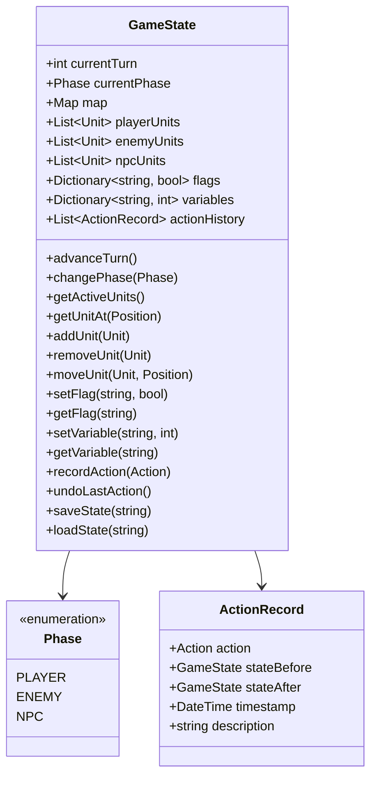

# Game State Manager

## Overview

The Game State Manager is the central component that maintains the current state of the game. It tracks turns, phases, units, map state, and game flags. It serves as the source of truth for all other components and coordinates state transitions.

## Responsibilities

- Track the current turn number
- Manage game phases (Player Phase, Enemy Phase, NPC Phase)
- Store references to all units in the game
- Maintain the current map state
- Track game flags and variables
- Provide methods to query and modify the game state
- Handle state transitions (e.g., advancing turns, changing phases)
- Support saving and loading game state

## Class Structure



## Key Methods

### Turn and Phase Management

```python
def advance_turn(self):
    """
    Advance to the next turn.
    
    This method:
    1. Increments the turn counter
    2. Resets the phase to PLAYER
    3. Triggers any turn-start events
    4. Refreshes player units (e.g., movement)
    
    Returns:
        bool: True if the turn was advanced successfully
    """
    self.current_turn += 1
    self.current_phase = Phase.PLAYER
    self._trigger_turn_start_events()
    self._refresh_player_units()
    return True

def change_phase(self, new_phase):
    """
    Change the current phase.
    
    This method:
    1. Validates the phase transition
    2. Updates the current phase
    3. Triggers any phase-start events
    4. Refreshes units for the new phase
    
    Args:
        new_phase (Phase): The phase to change to
        
    Returns:
        bool: True if the phase was changed successfully
    
    Raises:
        InvalidPhaseTransitionError: If the phase transition is invalid
    """
    if not self._is_valid_phase_transition(self.current_phase, new_phase):
        raise InvalidPhaseTransitionError(
            f"Cannot transition from {self.current_phase} to {new_phase}"
        )
    
    self.current_phase = new_phase
    self._trigger_phase_start_events()
    self._refresh_units_for_phase(new_phase)
    return True
```

### Unit Management

```python
def get_active_units(self):
    """
    Get the units that are active in the current phase.
    
    Returns:
        List[Unit]: The active units
    """
    if self.current_phase == Phase.PLAYER:
        return self.player_units
    elif self.current_phase == Phase.ENEMY:
        return self.enemy_units
    elif self.current_phase == Phase.NPC:
        return self.npc_units
    else:
        return []

def get_unit_at(self, position):
    """
    Get the unit at the specified position.
    
    Args:
        position (Position): The position to check
        
    Returns:
        Unit or None: The unit at the position, or None if no unit is present
    """
    for unit in self.player_units + self.enemy_units + self.npc_units:
        if unit.position == position:
            return unit
    return None

def move_unit(self, unit, new_position):
    """
    Move a unit to a new position.
    
    This method:
    1. Validates the move
    2. Updates the unit's position
    3. Records the action in the history
    
    Args:
        unit (Unit): The unit to move
        new_position (Position): The position to move to
        
    Returns:
        bool: True if the unit was moved successfully
        
    Raises:
        InvalidMoveError: If the move is invalid
    """
    if not self.map.is_valid_position(new_position):
        raise InvalidMoveError("Position is outside the map boundaries")
    
    if self.get_unit_at(new_position) is not None:
        raise InvalidMoveError("Position is already occupied")
    
    old_position = unit.position
    unit.position = new_position
    
    self.record_action(MoveAction(unit, old_position, new_position))
    return True
```

### State Management

```python
def set_flag(self, flag_name, value):
    """
    Set a game flag.
    
    Args:
        flag_name (str): The name of the flag
        value (bool): The value to set
        
    Returns:
        bool: The new value of the flag
    """
    self.flags[flag_name] = value
    return value

def get_flag(self, flag_name, default=False):
    """
    Get the value of a game flag.
    
    Args:
        flag_name (str): The name of the flag
        default (bool): The default value if the flag is not set
        
    Returns:
        bool: The value of the flag
    """
    return self.flags.get(flag_name, default)

def record_action(self, action):
    """
    Record an action in the action history.
    
    Args:
        action (Action): The action to record
        
    Returns:
        ActionRecord: The created action record
    """
    state_before = self._create_state_snapshot()
    action.execute()
    state_after = self._create_state_snapshot()
    
    record = ActionRecord(
        action=action,
        state_before=state_before,
        state_after=state_after,
        timestamp=datetime.now(),
        description=str(action)
    )
    
    self.action_history.append(record)
    return record

def undo_last_action(self):
    """
    Undo the last action.
    
    Returns:
        bool: True if an action was undone, False if there are no actions to undo
    """
    if not self.action_history:
        return False
    
    last_record = self.action_history.pop()
    self._restore_state_snapshot(last_record.state_before)
    return True
```

### Save/Load

```python
def save_state(self, filename):
    """
    Save the current game state to a file.
    
    Args:
        filename (str): The name of the file to save to
        
    Returns:
        bool: True if the state was saved successfully
    """
    state_data = {
        'current_turn': self.current_turn,
        'current_phase': self.current_phase.name,
        'map': self.map.serialize(),
        'player_units': [unit.serialize() for unit in self.player_units],
        'enemy_units': [unit.serialize() for unit in self.enemy_units],
        'npc_units': [unit.serialize() for unit in self.npc_units],
        'flags': self.flags,
        'variables': self.variables
    }
    
    with open(filename, 'w') as f:
        json.dump(state_data, f, indent=2)
    
    return True

def load_state(self, filename):
    """
    Load a game state from a file.
    
    Args:
        filename (str): The name of the file to load from
        
    Returns:
        bool: True if the state was loaded successfully
        
    Raises:
        FileNotFoundError: If the file does not exist
        InvalidStateFileError: If the file contains invalid state data
    """
    try:
        with open(filename, 'r') as f:
            state_data = json.load(f)
        
        self.current_turn = state_data['current_turn']
        self.current_phase = Phase[state_data['current_phase']]
        self.map = Map.deserialize(state_data['map'])
        self.player_units = [Unit.deserialize(data) for data in state_data['player_units']]
        self.enemy_units = [Unit.deserialize(data) for data in state_data['enemy_units']]
        self.npc_units = [Unit.deserialize(data) for data in state_data['npc_units']]
        self.flags = state_data['flags']
        self.variables = state_data['variables']
        
        # Clear action history when loading a state
        self.action_history = []
        
        return True
    
    except FileNotFoundError:
        raise
    except (json.JSONDecodeError, KeyError, ValueError) as e:
        raise InvalidStateFileError(f"Invalid state file: {str(e)}")
```

## Events and Hooks

The GameState provides hooks for other components to respond to state changes:

```python
def register_turn_start_handler(self, handler):
    """
    Register a handler to be called at the start of each turn.
    
    Args:
        handler (callable): A function to call at the start of each turn
    """
    self.turn_start_handlers.append(handler)

def register_phase_change_handler(self, handler):
    """
    Register a handler to be called when the phase changes.
    
    Args:
        handler (callable): A function to call when the phase changes
    """
    self.phase_change_handlers.append(handler)

def register_unit_moved_handler(self, handler):
    """
    Register a handler to be called when a unit moves.
    
    Args:
        handler (callable): A function to call when a unit moves
    """
    self.unit_moved_handlers.append(handler)
```

## Usage Examples

### Basic Turn Management

```python
# Initialize the game state
game_state = GameState()
game_state.initialize_map("chapter1.map")
game_state.load_units("chapter1.units")

# Start the game
print(f"Starting Chapter 1, Turn {game_state.current_turn}")
print(f"Current Phase: {game_state.current_phase}")

# Player phase actions
player_units = game_state.get_active_units()
for unit in player_units:
    # Move and act with each unit
    game_state.move_unit(unit, Position(5, 5))
    # ... other actions

# End player phase
game_state.change_phase(Phase.ENEMY)

# Enemy phase (AI controlled)
# ...

# End enemy phase
game_state.change_phase(Phase.NPC)

# NPC phase (AI controlled)
# ...

# End turn
game_state.advance_turn()
print(f"Now on Turn {game_state.current_turn}")
```

### Saving and Loading

```python
# During gameplay
game_state.set_flag("bridge_destroyed", True)
game_state.set_variable("enemy_reinforcements_remaining", 5)

# Save the game
game_state.save_state("save_chapter1_turn3.json")

# Later, load the game
new_game_state = GameState()
new_game_state.load_state("save_chapter1_turn3.json")

# Continue from the loaded state
print(f"Loaded game at Turn {new_game_state.current_turn}")
print(f"Bridge destroyed: {new_game_state.get_flag('bridge_destroyed')}")
print(f"Reinforcements remaining: {new_game_state.get_variable('enemy_reinforcements_remaining')}")
```

## Testing

### Unit Tests

```python
def test_advance_turn():
    # Arrange
    game_state = GameState()
    game_state.current_turn = 1
    game_state.current_phase = Phase.NPC
    
    # Act
    result = game_state.advance_turn()
    
    # Assert
    assert result is True
    assert game_state.current_turn == 2
    assert game_state.current_phase == Phase.PLAYER

def test_change_phase():
    # Arrange
    game_state = GameState()
    game_state.current_phase = Phase.PLAYER
    
    # Act
    result = game_state.change_phase(Phase.ENEMY)
    
    # Assert
    assert result is True
    assert game_state.current_phase == Phase.ENEMY

def test_move_unit():
    # Arrange
    game_state = GameState()
    unit = Unit(name="Test Unit")
    unit.position = Position(1, 1)
    game_state.player_units.append(unit)
    
    # Act
    result = game_state.move_unit(unit, Position(2, 2))
    
    # Assert
    assert result is True
    assert unit.position == Position(2, 2)
    assert len(game_state.action_history) == 1
    assert isinstance(game_state.action_history[0].action, MoveAction)
```

### CLI Testing

```
# Game state commands
> show_turn
Current Turn: 3
Current Phase: PLAYER

> end_player_phase
Phase changed to ENEMY

> advance_turn
Turn advanced to 4
Current Phase: PLAYER

> set_flag bridge_destroyed true
Flag 'bridge_destroyed' set to True

> get_flag bridge_destroyed
Flag 'bridge_destroyed' is True

> save_game mysave
Game saved to 'mysave.json'

> load_game mysave
Game loaded from 'mysave.json'
```

## Implementation Considerations

1. **Thread Safety**: The GameState should be thread-safe if multiple components might access it concurrently.

2. **Memory Management**: State snapshots for undo/redo should be optimized to avoid excessive memory usage.

3. **Validation**: All state changes should be validated to maintain game consistency.

4. **Event Propagation**: State changes should trigger appropriate events to notify observers.

5. **Serialization**: The state should be fully serializable for save/load functionality.

## Future Enhancements

1. **Replay System**: Extend the action history to support full game replay.

2. **Checkpoints**: Add support for automatic state checkpoints at key moments.

3. **State Diffing**: Optimize state snapshots by storing only the differences between states.

4. **Transaction System**: Implement a transaction system for atomic state changes.

5. **State Validation**: Add comprehensive validation to ensure the game state remains consistent.