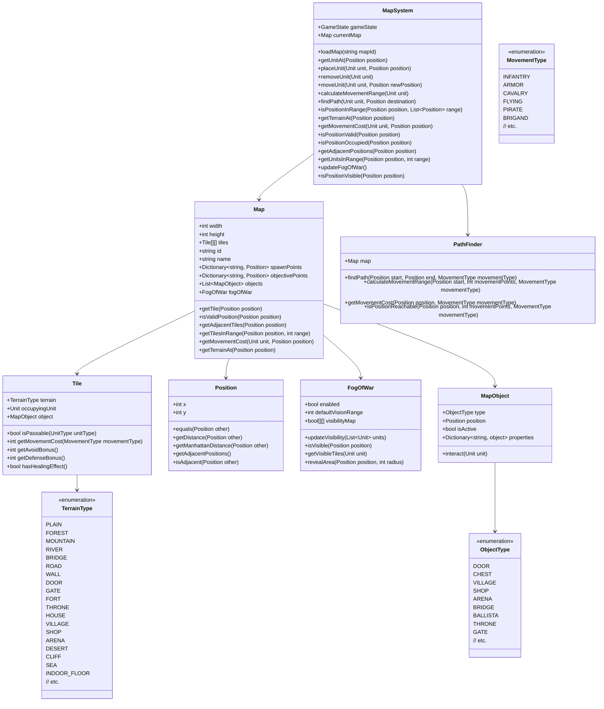

# Map System

## Overview

The Map System represents the game's battlefield, handling terrain, unit positioning, movement costs, pathfinding, and fog of war. It provides the spatial foundation for all gameplay, determining where units can move, terrain effects on combat, and visibility in fog of war conditions.

## Responsibilities

- Represent the game map and terrain types
- Track unit positions on the map
- Calculate movement costs and ranges
- Handle pathfinding for unit movement
- Manage terrain effects on combat
- Implement fog of war mechanics
- Process map-based events and triggers
- Handle map-related commands (visit, seize, etc.)
- Manage doors, chests, and other map objects

## Class Structure



## Key Components

### Map

The Map class represents the game map:

```python
class Map:
    def __init__(self, width, height, id, name):
        self.width = width
        self.height = height
        self.tiles = [[Tile(TerrainType.PLAIN) for y in range(height)] for x in range(width)]
        self.id = id
        self.name = name
        self.spawn_points = {}
        self.objective_points = {}
        self.objects = []
        self.fog_of_war = FogOfWar(width, height)
    
    def get_tile(self, position):
        """
        Get the tile at the specified position.
        
        Args:
            position (Position): The position to get the tile for
            
        Returns:
            Tile or None: The tile at the position, or None if the position is invalid
        """
        if not self.is_valid_position(position):
            return None
        
        return self.tiles[position.x][position.y]
    
    def is_valid_position(self, position):
        """
        Check if a position is valid (within the map boundaries).
        
        Args:
            position (Position): The position to check
            
        Returns:
            bool: True if the position is valid, False otherwise
        """
        return (
            position.x >= 0 and
            position.x < self.width and
            position.y >= 0 and
            position.y < self.height
        )
    
    def get_adjacent_tiles(self, position):
        """
        Get all tiles adjacent to the specified position.
        
        Args:
            position (Position): The position to get adjacent tiles for
            
        Returns:
            List[Tuple[Position, Tile]]: A list of (position, tile) tuples for adjacent tiles
        """
        adjacent_positions = position.get_adjacent_positions()
        adjacent_tiles = []
        
        for adj_pos in adjacent_positions:
            if self.is_valid_position(adj_pos):
                adjacent_tiles.append((adj_pos, self.get_tile(adj_pos)))
        
        return adjacent_tiles
    
    def get_tiles_in_range(self, position, range_value):
        """
        Get all tiles within a certain range of the specified position.
        
        Args:
            position (Position): The center position
            range_value (int): The range to check
            
        Returns:
            List[Tuple[Position, Tile]]: A list of (position, tile) tuples for tiles in range
        """
        tiles_in_range = []
        
        for x in range(max(0, position.x - range_value), min(self.width, position.x + range_value + 1)):
            for y in range(max(0, position.y - range_value), min(self.height, position.y + range_value + 1)):
                pos = Position(x, y)
                if position.get_distance(pos) <= range_value:
                    tiles_in_range.append((pos, self.tiles[x][y]))
        
        return tiles_in_range
    
    def get_movement_cost(self, unit, position):
        """
        Get the movement cost for a unit to move to a position.
        
        Args:
            unit (Unit): The unit to check movement cost for
            position (Position): The position to check
            
        Returns:
            int or None: The movement cost, or None if the position is impassable
        """
        tile = self.get_tile(position)
        if not tile:
            return None
        
        # Get the unit's movement type
        movement_type = unit.get_movement_type()
        
        # Check if the tile is passable for this unit
        if not tile.is_passable(unit.type):
            return None
        
        # Get the movement cost
        return tile.get_movement_cost(movement_type)
```

### Tile

The Tile class represents a single tile on the map:

```python
class Tile:
    def __init__(self, terrain, occupying_unit=None, object=None):
        self.terrain = terrain
        self.occupying_unit = occupying_unit
        self.object = object
    
    def is_passable(self, unit_type):
        """
        Check if this tile is passable for a unit type.
        
        Args:
            unit_type (UnitType): The unit type to check
            
        Returns:
            bool: True if the tile is passable, False otherwise
        """
        # If the tile is occupied, it's not passable
        if self.occupying_unit:
            return False
        
        # Check if the terrain is passable for this unit type
        return TERRAIN_PASSABILITY[self.terrain][unit_type]
    
    def get_movement_cost(self, movement_type):
        """
        Get the movement cost for a movement type.
        
        Args:
            movement_type (MovementType): The movement type to check
            
        Returns:
            int or None: The movement cost, or None if impassable
        """
        # Look up the movement cost in the terrain movement cost table
        cost = TERRAIN_MOVEMENT_COSTS[self.terrain][movement_type]
        
        # None or -1 indicates impassable
        if cost is None or cost < 0:
            return None
        
        return cost
    
    def get_avoid_bonus(self):
        """
        Get the avoid bonus provided by this tile's terrain.
        
        Returns:
            int: The avoid bonus
        """
        return TERRAIN_AVOID_BONUS.get(self.terrain, 0)
    
    def get_defense_bonus(self):
        """
        Get the defense bonus provided by this tile's terrain.
        
        Returns:
            int: The defense bonus
        """
        return TERRAIN_DEFENSE_BONUS.get(self.terrain, 0)
    
    def has_healing_effect(self):
        """
        Check if this tile has a healing effect.
        
        Returns:
            bool: True if the tile has a healing effect, False otherwise
        """
        return self.terrain in HEALING_TERRAIN_TYPES
```

### Position

The Position class represents a position on the map:

```python
class Position:
    def __init__(self, x, y):
        self.x = x
        self.y = y
    
    def __eq__(self, other):
        if not isinstance(other, Position):
            return False
        
        return self.x == other.x and self.y == other.y
    
    def __hash__(self):
        return hash((self.x, self.y))
    
    def get_distance(self, other):
        """
        Get the Euclidean distance to another position.
        
        Args:
            other (Position): The other position
            
        Returns:
            float: The distance
        """
        return math.sqrt((self.x - other.x) ** 2 + (self.y - other.y) ** 2)
    
    def get_manhattan_distance(self, other):
        """
        Get the Manhattan distance to another position.
        
        Args:
            other (Position): The other position
            
        Returns:
            int: The Manhattan distance
        """
        return abs(self.x - other.x) + abs(self.y - other.y)
    
    def get_adjacent_positions(self):
        """
        Get all positions adjacent to this one.
        
        Returns:
            List[Position]: A list of adjacent positions
        """
        return [
            Position(self.x + 1, self.y),
            Position(self.x - 1, self.y),
            Position(self.x, self.y + 1),
            Position(self.x, self.y - 1)
        ]
    
    def is_adjacent(self, other):
        """
        Check if this position is adjacent to another.
        
        Args:
            other (Position): The other position
            
        Returns:
            bool: True if the positions are adjacent, False otherwise
        """
        return self.get_manhattan_distance(other) == 1
```

### PathFinder

The PathFinder class handles pathfinding and movement range calculation:

```python
class PathFinder:
    def __init__(self, map):
        self.map = map
    
    def find_path(self, start, end, movement_type, movement_points):
        """
        Find a path from start to end.
        
        Args:
            start (Position): The starting position
            end (Position): The ending position
            movement_type (MovementType): The movement type
            movement_points (int): The available movement points
            
        Returns:
            List[Position] or None: The path, or None if no path exists
        """
        # Implementation of A* pathfinding algorithm
        open_set = []
        closed_set = set()
        
        # Add the start position to the open set
        heapq.heappush(open_set, (0, start, []))
        
        while open_set:
            # Get the position with the lowest f_score
            current_f, current_pos, current_path = heapq.heappop(open_set)
            
            # If we've reached the end, return the path
            if current_pos == end:
                return current_path + [current_pos]
            
            # Add the current position to the closed set
            closed_set.add(current_pos)
            
            # Check each adjacent position
            for adj_pos in current_pos.get_adjacent_positions():
                # Skip if the position is invalid or already in the closed set
                if not self.map.is_valid_position(adj_pos) or adj_pos in closed_set:
                    continue
                
                # Get the movement cost for this position
                cost = self.map.get_tile(adj_pos).get_movement_cost(movement_type)
                
                # Skip if the position is impassable
                if cost is None:
                    continue
                
                # Calculate the g_score (cost from start to this position)
                g_score = len(current_path) + 1
                
                # Calculate the h_score (heuristic cost from this position to end)
                h_score = adj_pos.get_manhattan_distance(end)
                
                # Calculate the f_score (total cost)
                f_score = g_score + h_score
                
                # Add the position to the open set
                heapq.heappush(open_set, (f_score, adj_pos, current_path + [current_pos]))
        
        # No path found
        return None
```

## Terrain Types and Movement Costs

Thracia 776 has a variety of terrain types, each with different effects on movement and combat:

### Terrain Types

- **Plain**: Basic terrain with no special effects.
- **Forest**: Provides defensive bonuses (+20 Avoid, +2 Defense) but slows movement.
- **Mountain**: Difficult terrain with high defensive bonuses (+30 Avoid, +5 Defense) that is impassable for cavalry.
- **River**: Slows movement and is impassable for most units except Pirates and fliers.
- **Bridge**: Allows crossing rivers.
- **Road**: Provides movement bonuses.
- **Wall**: Impassable terrain that blocks movement and line of sight.
- **Door**: Impassable until opened with a key or thief.
- **Gate**: Similar to doors but can be seized.
- **Fort**: Provides defensive bonuses (+20 Avoid, +10 Defense) and heals units each turn.
- **Throne**: Provides high defensive bonuses (+30 Avoid, +10 Defense) and heals units each turn.
- **House/Village**: Can be visited for items or information.
- **Shop**: Can be visited to buy items.
- **Arena**: Can be used to fight for gold and experience.
- **Desert**: Slows movement significantly.
- **Cliff**: Impassable for most units except fliers.
- **Sea**: Impassable for most units except Pirates and fliers.
- **Indoor Floor**: Used in indoor maps, cavalry must dismount.

### Movement Cost Table

The movement cost for each terrain type depends on the unit's movement type:

| Terrain Type | Infantry | Armor | Cavalry | Flying | Pirate | Brigand |
|--------------|----------|-------|---------|--------|--------|---------|
| Plain        | 1        | 1     | 1       | 1      | 1      | 1       |
| Forest       | 2        | 2     | 3       | 1      | 2      | 2       |
| Mountain     | 2        | 1     | -       | 1      | 2      | 2       |
| River        | -        | -     | -       | 1      | 4      | -       |
| Bridge       | 1        | 1     | 1       | 1      | 1      | 1       |
| Road         | 1        | 1     | 1       | 1      | 1      | 1       |
| Wall         | -        | -     | -       | -      | -      | -       |
| Door (closed)| -        | -     | -       | -      | -      | -       |
| Door (open)  | 1        | 1     | 1       | 1      | 1      | 1       |
| Gate (closed)| -        | -     | -       | -      | -      | -       |
| Gate (open)  | 1        | 1     | 1       | 1      | 1      | 1       |
| Fort         | 1        | 1     | 1       | 1      | 1      | 1       |
| Throne       | 1        | 1     | 1       | 1      | 1      | 1       |
| House/Village| 1        | 1     | 1       | 1      | 1      | 1       |
| Shop         | 1        | 1     | 1       | 1      | 1      | 1       |
| Arena        | 1        | 1     | 1       | 1      | 1      | 1       |
| Desert       | 2        | 3     | 4       | 1      | 3      | 3       |
| Cliff        | -        | -     | -       | 1      | -      | -       |
| Sea          | -        | -     | -       | 1      | 4      | -       |
| Indoor Floor | 1        | 1     | -       | 1      | 1      | 1       |

Note: "-" indicates impassable terrain.

### Terrain Combat Bonuses

Terrain can provide defensive bonuses in combat:

| Terrain Type | Avoid Bonus | Defense Bonus | Healing |
|--------------|-------------|---------------|---------|
| Plain        | 5%          | 0             | No      |
| Forest       | 20%         | 2             | No      |
| Mountain     | 30%         | 5             | No      |
| River        | 10%         | 0             | No      |
| Bridge       | 0%          | 0             | No      |
| Road         | 0%          | 0             | No      |
| Fort         | 20%         | 10            | Yes     |
| Throne       | 30%         | 10            | Yes     |
| Gate         | 20%         | 5             | Yes     |
| House/Village| 10%         | 1             | No      |
| Shop         | 10%         | 1             | No      |
| Arena        | 0%          | 0             | No      |
| Desert       | 5%          | 0             | No      |

## Usage Examples

### Loading a Map

```python
# Initialize the map system
map_system = MapSystem(game_state)

# Load a map
map_system.load_map("chapter1")

# Get map information
print(f"Map: {map_system.current_map.name}")
print(f"Size: {map_system.current_map.width}x{map_system.current_map.height}")
print(f"Fog of War: {'Enabled' if map_system.current_map.fog_of_war.enabled else 'Disabled'}")
```

### Unit Placement and Movement

```python
# Place a unit on the map
unit = game_state.create_unit("Leif", UnitType.PLAYER, ClassType.LORD)
map_system.place_unit(unit, Position(5, 5))

# Calculate movement range
movement_range = map_system.calculate_movement_range(unit)

# Print movement range
print(f"{unit.name} can move to:")
for position, cost in movement_range.items():
    print(f"  ({position.x}, {position.y}) - Cost: {cost}")

# Find a path to a destination
destination = Position(8, 8)
path = map_system.find_path(unit, destination)

if path:
    print(f"Path to ({destination.x}, {destination.y}):")
    for position in path:
        print(f"  ({position.x}, {position.y})")
else:
    print(f"No path to ({destination.x}, {destination.y})")

# Move the unit
if map_system.move_unit(unit, destination):
    print(f"{unit.name} moved to ({destination.x}, {destination.y})")
else:
    print(f"{unit.name} could not move to ({destination.x}, {destination.y})")
```

## Implementation Considerations

1. **Pathfinding Efficiency**: The A* algorithm is used for pathfinding, but for large maps, optimizations may be needed.

2. **Fog of War Visibility**: Fog of War calculations can be complex, especially with line-of-sight considerations.

3. **Terrain Effects**: Terrain affects both movement and combat, so these effects need to be properly integrated with other systems.

4. **Map Data Format**: Maps should be stored in a format that is easy to load and modify, such as JSON or XML.

5. **Object Interaction**: Map objects like doors, chests, and villages need to be interactable by units.

6. **Movement Range Visualization**: The movement range should be visually displayed to the player.

7. **Path Validation**: Paths need to be validated to ensure they don't exceed the unit's movement points.

8. **Terrain Passability**: Different unit types have different terrain passability rules.

9. **Indoor/Outdoor Maps**: Indoor maps have special rules, such as requiring cavalry to dismount.

10. **Map Events**: Maps can have events triggered by unit positions or actions.
