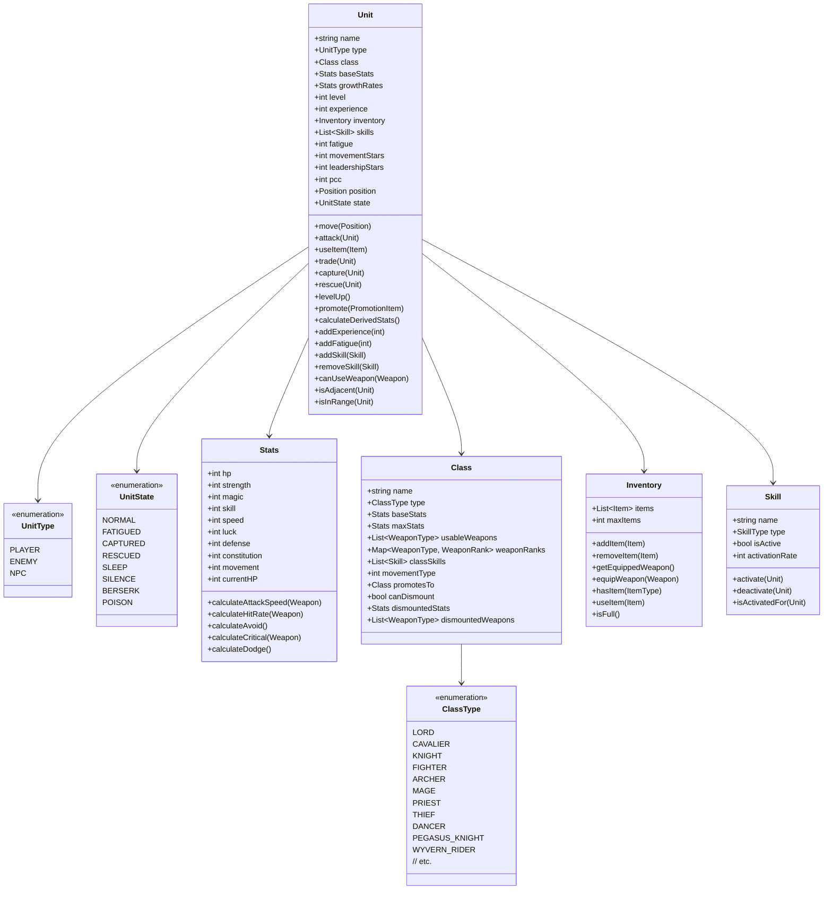

# Unit System

## Overview

The Unit System manages all characters in the game, including player units, enemy units, and NPCs. It handles unit attributes, stats, inventory, skills, and actions. This system is central to the game as it represents the characters that players control and interact with.

## Responsibilities

- Manage unit attributes (name, class, level, etc.)
- Handle unit stats and derived values
- Manage unit inventory and equipment
- Process unit actions (move, attack, use item, etc.)
- Handle unit state changes (level up, promotion, status effects)
- Track unit fatigue
- Manage unit skills and abilities
- Handle unit relationships (support, leadership)

## Class Structure



## Key Components

### Stats

The Stats class represents a unit's attributes:

```python
class Stats:
    def __init__(self, hp=0, strength=0, magic=0, skill=0, speed=0, luck=0, 
                 defense=0, constitution=0, movement=0):
        self.hp = hp
        self.strength = strength
        self.magic = magic
        self.skill = skill
        self.speed = speed
        self.luck = luck
        self.defense = defense
        self.constitution = constitution
        self.movement = movement
        self.current_hp = hp
    
    def calculate_attack_speed(self, weapon):
        """
        Calculate Attack Speed based on Speed and weapon weight.
        
        For physical weapons: AS = Speed - max(0, (Weapon Weight - Constitution))
        For magic weapons: AS = Speed - Weapon Weight (Con doesn't offset)
        
        Args:
            weapon (Weapon): The weapon to calculate AS with
            
        Returns:
            int: The calculated Attack Speed
        """
        if weapon.is_magic():
            return self.speed - weapon.weight
        else:
            weight_penalty = max(0, weapon.weight - self.constitution)
            return self.speed - weight_penalty
    
    def calculate_hit_rate(self, weapon):
        """
        Calculate Hit Rate based on Skill, Luck, and weapon hit.
        
        Formula: Hit = Weapon Hit + (2 × Skill) + Luck
        
        Args:
            weapon (Weapon): The weapon to calculate hit rate with
            
        Returns:
            int: The calculated Hit Rate
        """
        return weapon.hit + (2 * self.skill) + self.luck
    
    def calculate_avoid(self):
        """
        Calculate Avoid based on Attack Speed and Luck.
        
        Formula: Avoid = (2 × Attack Speed) + Luck
        
        Returns:
            int: The calculated Avoid
        """
        # This is a simplified version; in actual implementation,
        # we would need the equipped weapon to calculate AS
        return (2 * self.speed) + self.luck
    
    def calculate_critical(self, weapon):
        """
        Calculate Critical Rate based on Skill and weapon critical.
        
        Formula: Critical = Weapon Critical + Skill
        
        Args:
            weapon (Weapon): The weapon to calculate critical rate with
            
        Returns:
            int: The calculated Critical Rate
        """
        return weapon.critical + self.skill
    
    def calculate_dodge(self):
        """
        Calculate Critical Evade (Dodge) based on Luck.
        
        Formula: Dodge = Luck / 2
        
        Returns:
            int: The calculated Dodge
        """
        return self.luck // 2
```

### Class

The Class class represents a unit's class, which determines their capabilities:

```python
class Class:
    def __init__(self, name, type, base_stats, max_stats, usable_weapons, 
                 weapon_ranks, class_skills, movement_type, promotes_to=None, 
                 can_dismount=False, dismounted_stats=None, dismounted_weapons=None):
        self.name = name
        self.type = type
        self.base_stats = base_stats
        self.max_stats = max_stats
        self.usable_weapons = usable_weapons
        self.weapon_ranks = weapon_ranks
        self.class_skills = class_skills
        self.movement_type = movement_type
        self.promotes_to = promotes_to
        self.can_dismount = can_dismount
        self.dismounted_stats = dismounted_stats
        self.dismounted_weapons = dismounted_weapons
    
    def can_use_weapon_type(self, weapon_type):
        """
        Check if this class can use the specified weapon type.
        
        Args:
            weapon_type (WeaponType): The weapon type to check
            
        Returns:
            bool: True if the class can use the weapon type, False otherwise
        """
        return weapon_type in self.usable_weapons
    
    def get_weapon_rank(self, weapon_type):
        """
        Get the class's rank with the specified weapon type.
        
        Args:
            weapon_type (WeaponType): The weapon type to check
            
        Returns:
            WeaponRank or None: The class's rank with the weapon type, or None if not usable
        """
        return self.weapon_ranks.get(weapon_type)
    
    def get_movement_cost(self, terrain_type):
        """
        Get the movement cost for this class on the specified terrain type.
        
        Args:
            terrain_type (TerrainType): The terrain type to check
            
        Returns:
            int or None: The movement cost, or None if impassable
        """
        # This would reference a movement cost table based on movement_type
        return MOVEMENT_COSTS[self.movement_type][terrain_type]
    
    def dismount(self):
        """
        Get the dismounted version of this class.
        
        Returns:
            Class or None: The dismounted class, or None if can't dismount
        """
        if not self.can_dismount:
            return None
        
        # Create a new class representing the dismounted version
        dismounted = Class(
            name=f"Dismounted {self.name}",
            type=self.type,
            base_stats=self.dismounted_stats or self.base_stats,
            max_stats=self.max_stats,
            usable_weapons=self.dismounted_weapons or self.usable_weapons,
            weapon_ranks=self.weapon_ranks,
            class_skills=self.class_skills,
            movement_type=MOVEMENT_TYPE_INFANTRY,  # Dismounted units use infantry movement
            promotes_to=self.promotes_to,
            can_dismount=False  # Can't dismount again
        )
        
        return dismounted
```

### Unit

The Unit class represents a character in the game:

```python
class Unit:
    def __init__(self, name, type, class_obj, base_stats, growth_rates, level=1, 
                 skills=None, pcc=0, movement_stars=0, leadership_stars=0):
        self.name = name
        self.type = type
        self.class_obj = class_obj
        self.base_stats = base_stats
        self.growth_rates = growth_rates
        self.level = level
        self.experience = 0
        self.inventory = Inventory()
        self.skills = skills or []
        self.fatigue = 0
        self.pcc = pcc
        self.movement_stars = movement_stars
        self.leadership_stars = leadership_stars
        self.position = None
        self.state = UnitState.NORMAL
        self.is_mounted = not class_obj.can_dismount  # If can't dismount, always mounted
        
        # Add class skills
        for skill in class_obj.class_skills:
            if skill not in self.skills:
                self.skills.append(skill)
    
    def calculate_derived_stats(self):
        """
        Calculate derived stats based on base stats, class, and equipment.
        
        Returns:
            dict: A dictionary of derived stats
        """
        weapon = self.inventory.get_equipped_weapon()
        
        derived_stats = {
            'atk': 0,
            'as': 0,
            'hit': 0,
            'avo': 0,
            'crit': 0,
            'ddg': 0,
            'rng': '0'
        }
        
        if weapon:
            # Physical attack
            if not weapon.is_magic():
                derived_stats['atk'] = self.base_stats.strength + weapon.might
            # Magical attack
            else:
                derived_stats['atk'] = self.base_stats.magic + weapon.might
            
            derived_stats['as'] = self.base_stats.calculate_attack_speed(weapon)
            derived_stats['hit'] = self.base_stats.calculate_hit_rate(weapon)
            derived_stats['crit'] = self.base_stats.calculate_critical(weapon)
            derived_stats['rng'] = weapon.range
        
        derived_stats['avo'] = self.base_stats.calculate_avoid()
        derived_stats['ddg'] = self.base_stats.calculate_dodge()
        
        return derived_stats
    
    def can_double_attack(self, target):
        """
        Check if this unit can perform a follow-up attack against the target.
        
        A unit can double if their AS is at least 4 higher than the target's AS.
        
        Args:
            target (Unit): The target unit
            
        Returns:
            bool: True if the unit can double attack, False otherwise
        """
        weapon = self.inventory.get_equipped_weapon()
        if not weapon:
            return False
        
        attacker_as = self.base_stats.calculate_attack_speed(weapon)
        
        target_weapon = target.inventory.get_equipped_weapon()
        if not target_weapon:
            target_as = target.base_stats.speed
        else:
            target_as = target.base_stats.calculate_attack_speed(target_weapon)
        
        return attacker_as >= target_as + 4
    
    def level_up(self):
        """
        Level up the unit based on growth rates.
        
        Returns:
            dict: A dictionary of stat increases
        """
        increases = {}
        
        # Check each stat for growth
        for stat, growth in self.growth_rates.__dict__.items():
            if stat == 'current_hp':
                continue
                
            # Roll for growth (1 RN system)
            if random.randint(1, 100) <= growth:
                # Increase the stat
                current = getattr(self.base_stats, stat)
                setattr(self.base_stats, stat, current + 1)
                increases[stat] = 1
            else:
                increases[stat] = 0
        
        # Update current HP if max HP increased
        if increases.get('hp', 0) > 0:
            self.base_stats.current_hp += increases['hp']
        
        # Increase level
        self.level += 1
        self.experience = 0
        
        return increases
```

## Fatigue System

The Fatigue system is a unique mechanic in Thracia 776 that forces players to rotate their units:

```python
class FatigueSystem:
    def __init__(self, game_state):
        self.game_state = game_state
        self.enabled = False  # Fatigue is disabled until Chapter 8
    
    def enable(self):
        """
        Enable the fatigue system.
        """
        self.enabled = True
    
    def disable(self):
        """
        Disable the fatigue system.
        """
        self.enabled = False
    
    def add_fatigue(self, unit, amount):
        """
        Add fatigue to a unit.
        
        Args:
            unit (Unit): The unit to add fatigue to
            amount (int): The amount of fatigue to add
            
        Returns:
            int: The new fatigue value
        """
        if not self.enabled:
            return unit.fatigue
        
        # Leif is exempt from fatigue
        if unit.name == "Leif":
            return unit.fatigue
        
        unit.add_fatigue(amount)
        return unit.fatigue
    
    def add_combat_fatigue(self, unit):
        """
        Add fatigue for combat actions.
        
        Args:
            unit (Unit): The unit that performed combat
            
        Returns:
            int: The new fatigue value
        """
        return self.add_fatigue(unit, 1)
    
    def add_staff_fatigue(self, unit, staff):
        """
        Add fatigue for staff use.
        
        Args:
            unit (Unit): The unit that used the staff
            staff (Staff): The staff that was used
            
        Returns:
            int: The new fatigue value
        """
        # Fatigue depends on staff rank
        fatigue_amount = {
            WeaponRank.E: 1,
            WeaponRank.D: 2,
            WeaponRank.C: 3,
            WeaponRank.B: 4,
            WeaponRank.A: 5,
            WeaponRank.S: 5
        }.get(staff.rank, 1)
        
        return self.add_fatigue(unit, fatigue_amount)
    
    def is_fatigued(self, unit):
        """
        Check if a unit is fatigued.
        
        Args:
            unit (Unit): The unit to check
            
        Returns:
            bool: True if the unit is fatigued, False otherwise
        """
        if not self.enabled:
            return False
        
        # Leif is exempt from fatigue
        if unit.name == "Leif":
            return False
        
        return unit.fatigue >= unit.base_stats.hp
    
    def reset_fatigue(self, unit):
        """
        Reset a unit's fatigue to 0.
        
        Args:
            unit (Unit): The unit to reset fatigue for
            
        Returns:
            int: The previous fatigue value
        """
        return unit.reset_fatigue()
```

## Skills System

The Skills system handles character abilities:

```python
class Skill:
    def __init__(self, name, type, activation_rate=100, is_active=True):
        self.name = name
        self.type = type
        self.activation_rate = activation_rate
        self.is_active = is_active
    
    def activate(self, unit):
        """
        Activate the skill for a unit.
        
        Args:
            unit (Unit): The unit to activate the skill for
            
        Returns:
            bool: True if the skill was activated, False otherwise
        """
        if not self.is_active:
            self.is_active = True
            return True
        
        return False
    
    def deactivate(self, unit):
        """
        Deactivate the skill for a unit.
        
        Args:
            unit (Unit): The unit to deactivate the skill for
            
        Returns:
            bool: True if the skill was deactivated, False otherwise
        """
        if self.is_active:
            self.is_active = False
            return True
        
        return False
    
    def is_activated_for(self, unit):
        """
        Check if the skill is activated for a unit.
        
        Args:
            unit (Unit): The unit to check
            
        Returns:
            bool: True if the skill is activated, False otherwise
        """
        if not self.is_active:
            return False
        
        # Check activation rate
        if self.activation_rate < 100:
            return random.randint(1, 100) <= self.activation_rate
        
        return True

class WrathSkill(Skill):
    def __init__(self):
        super().__init__("Wrath", SkillType.COMBAT, 100)
    
    def is_activated_for(self, unit):
        """
        Wrath activates when the unit is counterattacking.
        
        Args:
            unit (Unit): The unit to check
            
        Returns:
            bool: True if Wrath is activated, False otherwise
        """
        if not super().is_activated_for(unit):
            return False
        
        # Wrath activates on counterattack
        return unit.is_counterattacking

class AdeptSkill(Skill):
    def __init__(self):
        super().__init__("Adept", SkillType.COMBAT, 0)  # Activation rate is based on Skill
    
    def is_activated_for(self, unit):
        """
        Adept has a Skill% chance to activate.
        
        Args:
            unit (Unit): The unit to check
            
        Returns:
            bool: True if Adept is activated, False otherwise
        """
        if not super().is_activated_for(unit):
            return False
        
        # Adept has a Skill% chance to activate
        return random.randint(1, 100) <= unit.base_stats.skill
```

## Usage Examples

### Creating a Unit

```python
# Create a unit
leif = Unit(
    name="Leif",
    type=UnitType.PLAYER,
    class_obj=Class.LORD,
    base_stats=Stats(
        hp=22,
        strength=6,
        magic=2,
        skill=6,
        speed=8,
        luck=6,
        defense=4,
        constitution=6,
        movement=6
    ),
    growth_rates=Stats(
        hp=70,
        strength=35,
        magic=10,
        skill=40,
        speed=50,
        luck=40,
        defense=25,
        constitution=5,
        movement=3
    ),
    level=1,
    skills=[],
    pcc=1,
    movement_stars=0,
    leadership_stars=1
)

# Add items to inventory
leif.inventory.add_item(Weapon.LIGHT_BRAND)
leif.inventory.add_item(Weapon.IRON_SWORD)
leif.inventory.add_item(Item.VULNERARY)

# Equip a weapon
leif.inventory.equip_weapon(Weapon.LIGHT_BRAND)

# Place on map
leif.position = Position(5, 5)
```

### Combat Interaction

```python
# Combat between two units
def execute_combat(attacker, defender, game_state):
    # Get weapons
    attacker_weapon = attacker.inventory.get_equipped_weapon()
    defender_weapon = defender.inventory.get_equipped_weapon()
    
    if not attacker_weapon:
        return False
    
    # Check if in range
    if not attacker.is_in_range(defender, attacker_weapon):
        return False
    
    # Calculate hit chance
    hit_chance = attacker.base_stats.calculate_hit_rate(attacker_weapon)
    hit_chance -= defender.base_stats.calculate_avoid()
    hit_chance = max(1, min(99, hit_chance))  # Clamp between 1 and 99
    
    # Calculate damage
    if attacker_weapon.is_magic():
        damage = attacker.base_stats.magic + attacker_weapon.might
        damage -= defender.base_stats.magic
    else:
        damage = attacker.base_stats.strength + attacker_weapon.might
        damage -= defender.base_stats.defense
    
    damage = max(0, damage)
    
    # Calculate critical chance
    crit_chance = attacker.base_stats.calculate_critical(attacker_weapon)
    crit_chance -= defender.base_stats.calculate_dodge()
    crit_chance = max(0, min(100, crit_chance))
    
    # Check for PCC on follow-up attacks
    is_follow_up = False  # Set to true for second attack
    
    if is_follow_up:
        crit_chance *= attacker.pcc
    else:
        crit_chance = min(25, crit_chance)  # First attack capped at 25%
    
    # Roll for hit
    hit_roll = random.randint(1, 100)
    if hit_roll > hit_chance:
        return {"hit": False, "damage": 0, "critical": False}
    
    # Roll for critical
    crit_roll = random.randint(1, 100)
    is_critical = crit_roll <= crit_chance
    
    # Apply damage
    final_damage = damage
    if is_critical:
        final_damage *= 2
    
    defender.base_stats.current_hp -= final_damage
    
    # Check for defeat
    defeated = defender.base_stats.current_hp <= 0
    
    # Add fatigue
    game_state.fatigue_system.add_combat_fatigue(attacker)
    
    return {
        "hit": True,
        "damage": final_damage,
        "critical": is_critical,
        "defeated": defeated
    }
```

### Fatigue Management

```python
# At the start of Chapter 8
game_state.fatigue_system.enable()

# After combat
game_state.fatigue_system.add_combat_fatigue(unit)

# After using a staff
game_state.fatigue_system.add_staff_fatigue(unit, staff)

# Check if a unit is fatigued
if game_state.fatigue_system.is_fatigued(unit):
    print(f"{unit.name} is fatigued and cannot be deployed next chapter")

# At the end of a chapter, reset fatigue for units that weren't deployed
game_state.fatigue_system.reset_all_fatigue()

# Use a Stamina Drink to reset fatigue
game_state.fatigue_system.use_stamina_drink(unit)
```

## Testing

### Unit Tests

```python
def test_unit_creation():
    # Arrange
    unit = Unit(
        name="Test Unit",
        type=UnitType.PLAYER,
        class_obj=Class.FIGHTER,
        base_stats=Stats(hp=20, strength=8, skill=6, speed=7),
        growth_rates=Stats(hp=70, strength=40, skill=35, speed=45),
        level=1
    )
    
    # Assert
    assert unit.name == "Test Unit"
    assert unit.type == UnitType.PLAYER
    assert unit.class_obj == Class.FIGHTER
    assert unit.base_stats.hp == 20
    assert unit.base_stats.strength == 8
    assert unit.level == 1
    assert unit.experience == 0
    assert unit.fatigue == 0

def test_level_up():
    # Arrange
    unit = Unit(
        name="Test Unit",
        type=UnitType.PLAYER,
        class_obj=Class.FIGHTER,
        base_stats=Stats(hp=20, strength=8, skill=6, speed=7),
        growth_rates=Stats(hp=100, strength=0, skill=100, speed=0),  # 100% HP/Skill, 0% Str/Spd
        level=1
    )
    
    # Act
    increases = unit.level_up()
    
    # Assert
    assert unit.level == 2
    assert unit.experience == 0
    assert unit.base_stats.hp == 21
    assert unit.base_stats.strength == 8  # No increase (0% growth)
    assert unit.base_stats.skill == 7
    assert unit.base_stats.speed == 7  # No increase (0% growth)
    assert increases['hp'] == 1
    assert increases['strength'] == 0
    assert increases['skill'] == 1
    assert increases['speed'] == 0

def test_fatigue():
    # Arrange
    unit = Unit(
        name="Test Unit",
        type=UnitType.PLAYER,
        class_obj=Class.FIGHTER,
        base_stats=Stats(hp=20),
        growth_rates=Stats(),
        level=1
    )
    fatigue_system = FatigueSystem(None)
    fatigue_system.enable()
    
    # Act
    for _ in range(19):
        fatigue_system.add_combat_fatigue(unit)
    
    # Assert
    assert unit.fatigue == 19
    assert not fatigue_system.is_fatigued(unit)
    
    # Act - one more fatigue point
    fatigue_system.add_combat_fatigue(unit)
    
    # Assert
    assert unit.fatigue == 20
    assert fatigue_system.is_fatigued(unit)
    
    # Act - reset fatigue
    fatigue_system.reset_fatigue(unit)
    
    # Assert
    assert unit.fatigue == 0
    assert not fatigue_system.is_fatigued(unit)
```

### CLI Testing

```
# Unit commands
> create_unit Leif Lord 5,5
Unit 'Leif' created at position (5, 5)

> show_unit 5,5
Name: Leif
Class: Lord
Level: 1
HP: 22/22
Str: 6  Mag: 2  Skl: 6  Spd: 8  Luk: 6  Def: 4  Con: 6  Mov: 6
Weapon: Light Brand
Items: Light Brand, Iron Sword, Vulnerary
Skills: -
Fatigue: 0

> level_up 5,5
Leif leveled up!
HP +1, Str +0, Mag +0, Skl +1, Spd +1, Luk +0, Def +0, Con +0, Mov +0
Now Level 2

> add_fatigue 5,5 10
Added 10 fatigue to Leif
Current fatigue: 10/22

> reset_fatigue 5,5
Reset fatigue for Leif
Current fatigue: 0/22
```

## Implementation Considerations

1. **Stat Calculation**: Ensure that derived stats (Atk, AS, Hit, etc.) are calculated correctly based on the formulas from Thracia 776.

2. **Random Number Generation**: Thracia 776 uses a 1 RN system for hit rates and growths, which should be replicated for authentic gameplay.

3. **PCC System**: The Pursuit Critical Coefficient system is unique to Thracia 776 and affects critical rates on follow-up attacks.

4. **Fatigue Management**: The fatigue system is a key mechanic that forces player unit rotation and should be implemented accurately.

5. **Dismounting**: Mounted units have different stats and weapon access when dismounted, which needs to be handled properly.

6. **Skill Activation**: Skills like Wrath, Adept, and Prayer have specific activation conditions that need to be checked during combat.

7. **Inventory Management**: Units can carry a limited number of items, and trading/capturing mechanics need to be implemented.

8. **Level-Up Randomization**: Stat increases on level-up are determined by growth rates, with a chance for Con and Mov to increase.

## Future Enhancements

1. **Support System**: Implement the support system where certain characters provide bonuses to each other when nearby.

2. **Leadership Stars**: Add the leadership star system that provides hit/avoid bonuses to all allied units.

3. **Capture Mechanics**: Expand the capture system to include all the nuances of Thracia 776's implementation.

4. **Movement Stars**: Implement the movement star system that gives units a chance for an extra turn.

5. **Scrolls**: Add the scroll system that provides growth bonuses and critical immunity.
