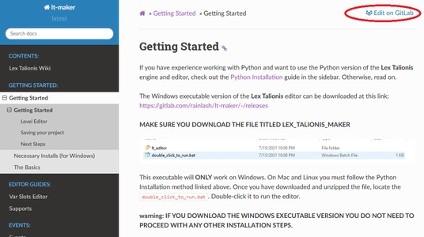
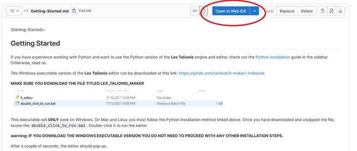
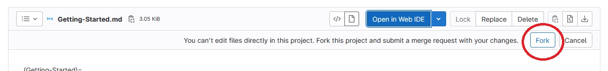
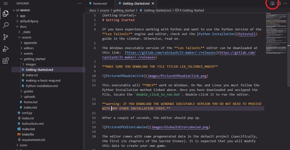
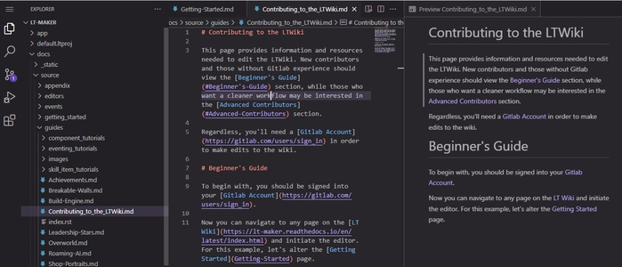
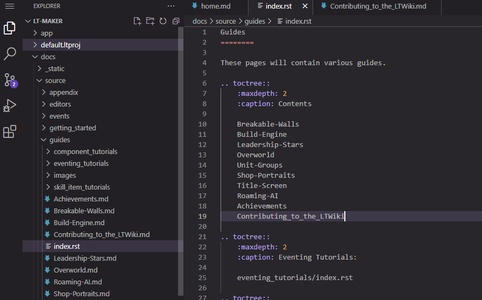
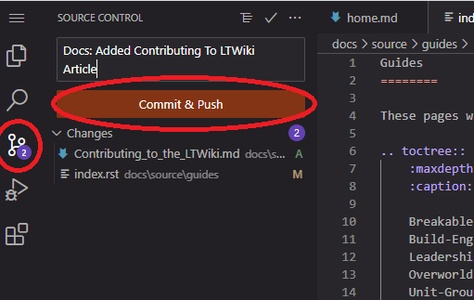
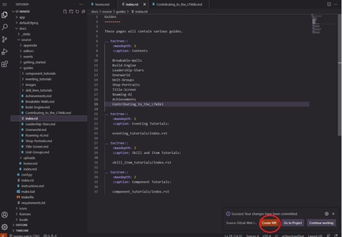
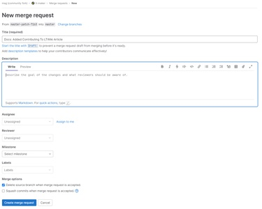

<a href="../../index.html" class="icon icon-home">lt-maker</a>

Contents:

- <a href="../home.html" class="reference internal">Lex Talionis Wiki</a>

Getting Started:

- <a href="../getting_started/index.html"
  class="reference internal">Getting Started</a>

Editor Guides:

- <a href="../editors/Editors-Overview.html"
  class="reference internal">Editors Overview</a>
- <a href="../editors/index.html" class="reference internal">Editors</a>

Events:

- <a href="../events/index.html" class="reference internal">Events</a>

Guides:

- <a href="../guides/Guides-Overview.html"
  class="reference internal">Guides Overview</a>
- <a href="../guides/index.html" class="reference internal">Guides</a>

appendix:

- <a href="Text-Formatting-Commands.html" class="reference internal">Text
  Formatting Commands</a>
- <a href="Item-Component-Reference.html" class="reference internal">Item
  Component Dictionary</a>
- <a href="Skill-Component-Reference.html"
  class="reference internal">Skill Component Dictionary</a>
- <a href="Special-Variables.html" class="reference internal">Special
  Variables</a>
- <a href="Special-Tags.html" class="reference internal">Special Tags</a>
- <a href="trigger-reference.html" class="reference internal">Event
  Triggers</a>
- <a href="Random-Seed-Mechanics.html" class="reference internal">Random
  Seed Mechanics</a>
- <a href="FAQ.html" class="reference internal">Frequently Asked
  Questions</a>
- <a href="Contributing_to_the_LTWiki.html#"
  class="current reference internal">Contributing to the LTWiki</a>
  - <a href="Contributing_to_the_LTWiki.html#beginner-s-guide"
    class="reference internal">Beginner’s Guide</a>
  - <a href="Contributing_to_the_LTWiki.html#advanced-contributors"
    class="reference internal">Advanced Contributors</a>
    - <a href="Contributing_to_the_LTWiki.html#editing"
      class="reference internal">Editing</a>
    - <a href="Contributing_to_the_LTWiki.html#building-docs"
      class="reference internal">Building Docs</a>
- <a href="index.html" class="reference internal">Code Documentation</a>

[lt-maker](../../index.html)

- 
- Contributing to the LTWiki
- <a
  href="https://gitlab.com/rainlash/lt-maker/blob/master/docs/source/appendix/Contributing_to_the_LTWiki.md"
  class="fa fa-gitlab">Edit on GitLab</a>

------------------------------------------------------------------------

# Contributing to the LTWiki<a href="Contributing_to_the_LTWiki.html#contributing-to-the-ltwiki"
class="headerlink" title="Link to this heading"></a>

This page provides information and resources needed to edit the LTWiki.
New contributors and those without Gitlab experience should view the
<a href="Contributing_to_the_LTWiki.html#beginner-s-guide"
class="reference internal">Beginner’s Guide</a> section, while those who
want a cleaner workflow may be interested in the
<a href="Contributing_to_the_LTWiki.html#advanced-contributors"
class="reference internal">Advanced Contributors</a> section.

Regardless, you’ll need a <a href="https://gitlab.com/users/sign_in"
class="reference external">Gitlab Account</a> in order to make edits to
the wiki.

## Beginner’s Guide<a href="Contributing_to_the_LTWiki.html#beginner-s-guide"
class="headerlink" title="Link to this heading"></a>

To begin with, you should be signed into your
<a href="https://gitlab.com/users/sign_in"
class="reference external">Gitlab Account</a>.

Now you can navigate to any page on the
<a href="../../index.html" class="reference external">LT Wiki</a> and
initiate the editor. For this example, let’s alter the
<a href="../getting_started/Getting-Started.html#getting-started"
class="reference internal">Getting
Started</a> page.

You can click on the
`Edit`` ``on`` ``Gitlab`
link on the top left. This will take you to the repository. You can now
click on the
`Open`` ``in`` ``Web`` ``IDE`
button:

If you haven’t done this before, it will prompt you to
`Fork` the project. This will create a copy of
the project on your account, which is necessary to make merge requests.
Go ahead and click `Fork`:

Wait for the fork to finish. This will take a few seconds. The good news
is, you only need to do this once. Once the initial fork is done, you
will be free to make merge requests directly.

In either case, you should now be able to see the editor. If you want,
you can click on the `Preview` button to see
how the page is laid out. This helps in understanding the formatting
syntax:

In either case, you can now make edits freely! Change whatever text you
want (as long as it’s for the good of the wiki). For this tutorial,
let’s make a new article. This one is actually easy to do. Just click
`New`` ``File` in the
left pane and it’ll make a new article in the current directory. Use
your best judgement as to where the article goes. I’m going to make an
article in `Guides` called
`Contributing`` ``to`` ``the`` ``LTWiki`:

If I add a new file, I also need to add it to the
`index.rst` file in that directory:

Now that I’ve finished, how do I merge it? This step is quick. Go to the
`Source`` ``Control`
icon on the side.

Add a commit message describing your new article.

Finally, click
`Commit`` ``and`` ``Push`.

Hit `Enter` through the dialogs - they aren’t
important. You’ll see a dialog pop up telling you that your commit was a
success. Now, you’ll click the
`Create`` ``MR`
button, and it’ll take you to the final page:

Where you can fill out some more information on what you changed.
Finally, click the
`Create`` ``Merge`` ``Request`
button.

One of the owners of the repository will approve of your new article,
and after that happens, it’ll be there forever!

## Advanced Contributors<a href="Contributing_to_the_LTWiki.html#advanced-contributors"
class="headerlink" title="Link to this heading"></a>

If you’re already a developer, then you should be generally aware of how
to <a
href="https://docs.gitlab.com/ee/user/project/repository/forking_workflow.html"
class="reference external">fork projects</a>, how to clone projects, and
make upstream merge requests from your own repository.

The LT documentation is kept within the repository, in the
`docs/` folder. The following commands assumes
that the cwd is inside `docs/`.

### Editing<a href="Contributing_to_the_LTWiki.html#editing" class="headerlink"
title="Link to this heading"></a>

The documentation source can be found in
`source/`.

### Building Docs<a href="Contributing_to_the_LTWiki.html#building-docs"
class="headerlink" title="Link to this heading"></a>

Instructions for how to do this can be found in the
`DEV_README.md` file.

<a href="FAQ.html" class="btn btn-neutral float-left" accesskey="p"
rel="prev" title="Frequently Asked Questions"> Previous</a>
<a href="index.html" class="btn btn-neutral float-right" accesskey="n"
rel="next" title="Code Documentation">Next </a>

------------------------------------------------------------------------

© Copyright 2024, rainlash.

Built with [Sphinx](https://www.sphinx-doc.org/) using a
[theme](https://github.com/readthedocs/sphinx_rtd_theme) provided by
[Read the Docs](https://readthedocs.org).

