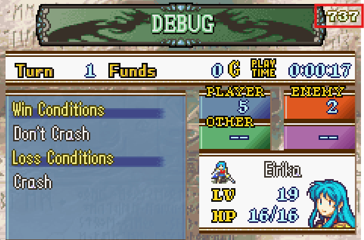
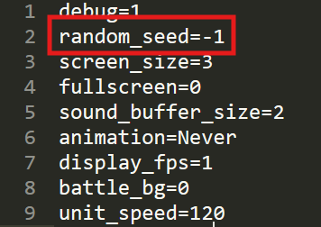
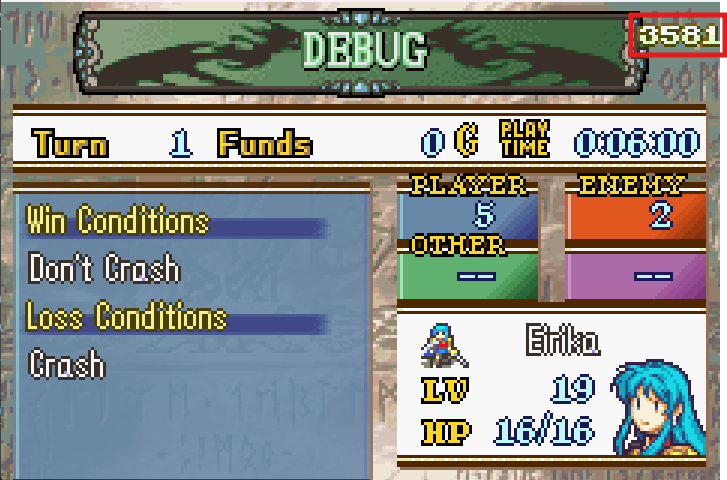

<a href="../../index.html" class="icon icon-home">lt-maker</a>

Contents:

- <a href="../home.html" class="reference internal">Lex Talionis Wiki</a>

Getting Started:

- <a href="../getting_started/index.html"
  class="reference internal">Getting Started</a>

Editor Guides:

- <a href="../editors/Editors-Overview.html"
  class="reference internal">Editors Overview</a>
- <a href="../editors/index.html" class="reference internal">Editors</a>

Events:

- <a href="../events/index.html" class="reference internal">Events</a>

Guides:

- <a href="../guides/Guides-Overview.html"
  class="reference internal">Guides Overview</a>
- <a href="../guides/index.html" class="reference internal">Guides</a>

appendix:

- <a href="Text-Formatting-Commands.html" class="reference internal">Text
  Formatting Commands</a>
- <a href="Item-Component-Reference.html" class="reference internal">Item
  Component Dictionary</a>
- <a href="Skill-Component-Reference.html"
  class="reference internal">Skill Component Dictionary</a>
- <a href="Special-Variables.html" class="reference internal">Special
  Variables</a>
- <a href="Special-Tags.html" class="reference internal">Special Tags</a>
- <a href="trigger-reference.html" class="reference internal">Event
  Triggers</a>
- <a href="Random-Seed-Mechanics.html#"
  class="current reference internal">Random Seed Mechanics</a>
  - <a href="Random-Seed-Mechanics.html#assigning-a-specific-seed"
    class="reference internal">Assigning a specific seed</a>
- <a href="FAQ.html" class="reference internal">Frequently Asked
  Questions</a>
- <a href="Contributing_to_the_LTWiki.html"
  class="reference internal">Contributing to the LTWiki</a>
- <a href="index.html" class="reference internal">Code Documentation</a>

[lt-maker](../../index.html)

- 
- Random Seed Mechanics
- <a
  href="https://gitlab.com/rainlash/lt-maker/blob/master/docs/source/appendix/Random-Seed-Mechanics.md"
  class="fa fa-gitlab">Edit on GitLab</a>

------------------------------------------------------------------------

# Random Seed Mechanics<a href="Random-Seed-Mechanics.html#random-seed-mechanics"
class="headerlink" title="Link to this heading"></a>

You may notice a number on the top right of the Objective menu:

This is the random seed. When you start a new game, you will be assigned
a random seed for the game. This seed will stick with you throughout the
game. It controls what happens whenever a random outcome is required.

If you turnwheel back in time and then do the exact same actions in the
exact same order, the exact same outcome will occur. Only changing the
seed will cause a different outcome from the same actions.

Because the random seed does not change, your units will always level up
identically in your game, even if you turnwheel back to before they
leveled up. This prevents RNG abuse to guarantee good level ups.

## Assigning a specific seed<a href="Random-Seed-Mechanics.html#assigning-a-specific-seed"
class="headerlink" title="Link to this heading"></a>

You can assign a specific random seed before you start a new game by
modifying your `config.ini` file here:

By default, it is -1, which causes a random seed between 0 and 1024 to
be chosen at random on start of a new game. You can set it to any
integer if you want though. It won’t necessarily display all the
characters of that integer though, since there isn’t enough room.

<a href="trigger-reference.html" class="btn btn-neutral float-left"
accesskey="p" rel="prev" title="Event Triggers"> Previous</a>
<a href="FAQ.html" class="btn btn-neutral float-right" accesskey="n"
rel="next" title="Frequently Asked Questions">Next </a>

------------------------------------------------------------------------

© Copyright 2024, rainlash.

Built with [Sphinx](https://www.sphinx-doc.org/) using a
[theme](https://github.com/readthedocs/sphinx_rtd_theme) provided by
[Read the Docs](https://readthedocs.org).

