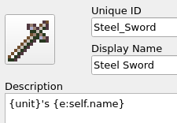
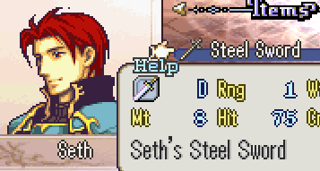

<a href="../../index.html" class="icon icon-home">lt-maker</a>

Contents:

- <a href="../home.html" class="reference internal">Lex Talionis Wiki</a>

Getting Started:

- <a href="../getting_started/index.html"
  class="reference internal">Getting Started</a>

Editor Guides:

- <a href="../editors/Editors-Overview.html"
  class="reference internal">Editors Overview</a>
- <a href="../editors/index.html" class="reference internal">Editors</a>

Events:

- <a href="../events/index.html" class="reference internal">Events</a>

Guides:

- <a href="../guides/Guides-Overview.html"
  class="reference internal">Guides Overview</a>
- <a href="../guides/index.html" class="reference internal">Guides</a>

appendix:

- <a href="Text-Formatting-Commands.html#"
  class="current reference internal">Text Formatting Commands</a>
  - <a href="Text-Formatting-Commands.html#dialogue-formatting-commands"
    class="reference internal">Dialogue Formatting Commands</a>
  - <a href="Text-Formatting-Commands.html#general-formatting-commands"
    class="reference internal">General Formatting Commands</a>
  - <a href="Text-Formatting-Commands.html#evaluated-descriptions"
    class="reference internal">Evaluated Descriptions</a>
    - <a href="Text-Formatting-Commands.html#what-are-they"
      class="reference internal">What Are They</a>
    - <a href="Text-Formatting-Commands.html#evaluated-variables"
      class="reference internal">Evaluated Variables</a>
    - <a href="Text-Formatting-Commands.html#examples"
      class="reference internal">Examples</a>
      - <a href="Text-Formatting-Commands.html#item-ownership"
        class="reference internal">Item Ownership</a>
      - <a href="Text-Formatting-Commands.html#dynamic-gender-and-pronouns"
        class="reference internal">Dynamic Gender and Pronouns</a>
      - <a href="Text-Formatting-Commands.html#kill-tracker"
        class="reference internal">Kill Tracker</a>
    - <a href="Text-Formatting-Commands.html#advanced-usage"
      class="reference internal">Advanced Usage</a>
- <a href="Item-Component-Reference.html" class="reference internal">Item
  Component Dictionary</a>
- <a href="Skill-Component-Reference.html"
  class="reference internal">Skill Component Dictionary</a>
- <a href="Special-Variables.html" class="reference internal">Special
  Variables</a>
- <a href="Special-Tags.html" class="reference internal">Special Tags</a>
- <a href="trigger-reference.html" class="reference internal">Event
  Triggers</a>
- <a href="Random-Seed-Mechanics.html" class="reference internal">Random
  Seed Mechanics</a>
- <a href="FAQ.html" class="reference internal">Frequently Asked
  Questions</a>
- <a href="Contributing_to_the_LTWiki.html"
  class="reference internal">Contributing to the LTWiki</a>
- <a href="index.html" class="reference internal">Code Documentation</a>

[lt-maker](../../index.html)

- 
- Text Formatting Commands
- <a
  href="https://gitlab.com/rainlash/lt-maker/blob/master/docs/source/appendix/Text-Formatting-Commands.md"
  class="fa fa-gitlab">Edit on GitLab</a>

------------------------------------------------------------------------

# Text Formatting Commands<a href="Text-Formatting-Commands.html#text-formatting-commands"
class="headerlink" title="Link to this heading"></a>

*written by rainlash* *last updated 2024-11-13*

## Dialogue Formatting Commands<a href="Text-Formatting-Commands.html#dialogue-formatting-commands"
class="headerlink" title="Link to this heading"></a>

In order to have your in-game dialog between characters or between the
narrator and the player flow well and be more interesting to read, you
can use several special dialog commands.

`{w},`` ``{wait}`:
Waits for the user to press A. Automatically placed at the end of any
speak command unless text ends with {no_wait}.

`{no_wait}`: Place at the end of a dialog and
the dialog will not wait for the user to press A.

`{br},`` ``{break}`:
Line break.

`{clear}`: Clear the text and line break.

`|`: shorthand for
`{w}{br}` in sequence.

`{semicolon}`: Adds a
`;`

`{lt}`: Adds a `<`

`{gt}`: Adds a `>`

`{lcb}`: Adds a `{`

`{rcb}`: Adds a `}`

`{tgs}`: Toggles whether the speaking sound
occurs.

`{tgm}`: Toggles whether the portrait’s mouth
will move while talking.

`{max_speed}`: After this command, dialog will
be drawn immediately to the screen.

`{starting_speed}`: After this command, dialog
will be drawn at the normal speed to the screen.

`{command:??},`` ``{c:??}`:
Allows you to run any event command inline while dialog is being drawn
to the screen. For instance:
`s;Eirika;I'm...`` ``so....`` ``{c:set_expression;Eirika;CloseEyes}`` ``sleepy...`

## General Formatting Commands<a href="Text-Formatting-Commands.html#general-formatting-commands"
class="headerlink" title="Link to this heading"></a>

The below formatting can be used in both dialogue and most description
boxes for units/items/skills/etc.

`<red>`: Can be used to turn the font to red
color. Turn back to normal with `</red>` or
`</>`. Can also use
`<blue>`, `<green>`,
etc.

`<icon>??</>`: Paste any 16x16 icon with a name
directly into the text. For instance,
`<icon>Waffle</>`.

`<text>`: Can be used to change the font. Turn
back to normal with `</text>` or
`</>`. Can also use
`<nconvo>`,
`<narrow>`,
`<iconvo>`,
`<bconvo>`, etc.

`<wave>`: Can be used to change the text
effect. Turn back to normal with `</wave>` or
`</>`. Can also use
`<wave2>`, `<sin>`,
`<jitter>`,
`<jitter2>`, etc. Advanced usage: some text
effects may have arguments that can be used to customize the effect. For
example, wave has a `amplitude` argument that
can be used to customize the amplitude of vertical wave oscillation. The
exact usage would look like
`<wave`` ``amplitude=4.5>some`` ``text</>`.
The general format for effect arguments is
`<effect`` ``arg1=val1`` ``arg2=val2`` ``...>`.
Parsing for arguments is whitespace and case sensitive. For a full
effect list look at
`app/engine/graphics/text/text_effects.py`.
Both `TextEffect` and
`CoordinatedTextEffect` classes are available
to use as text effects in dialog, and the corresponding names for each
effect is under the effect class as its `nid`
and the available arguments for each effect is the arguments to its
`__init__` function excluding
`self` and `idx`
arguments.

## Evaluated Descriptions<a href="Text-Formatting-Commands.html#evaluated-descriptions"
class="headerlink" title="Link to this heading"></a>

### What Are They<a href="Text-Formatting-Commands.html#what-are-they" class="headerlink"
title="Link to this heading"></a>

Some descriptions in the editor allow you to use evaluated text. These
are things like `{v:}` and
`{e:}`.

Specifically at the moment this includes:

1.  Unit descriptions

2.  Item descriptions and skill descriptions

### Evaluated Variables<a href="Text-Formatting-Commands.html#evaluated-variables"
class="headerlink" title="Link to this heading"></a>

The evaluated text for the statements above all have access to a few
common variables.

Like all evaluated statements evaluated text has access to a variable
called `game`. This is the variable for the
game state.

All descriptions also have access to a variable called
`self`. This refers to the variable in the
engine code that represents the object that the description belongs to.
For example, the `self` variable for a unit
description refers to a unit object in the engine code. Likewise for
items and skills.

Items and skill descriptions have access to an additional variable
called `unit`. This variable refers to the unit
that currently owns this item or skill. This is equivalent to the
statement `{e:game.get_unit(self.owner_nid)}`
and is just a convenience variable.

### Examples<a href="Text-Formatting-Commands.html#examples" class="headerlink"
title="Link to this heading"></a>

#### Item Ownership<a href="Text-Formatting-Commands.html#item-ownership"
class="headerlink" title="Link to this heading"></a>

This is a simple concrete example. We can add a description for who’s
item it is in the item description. For example if Seth is holding a
Steel Sword, we can modify the description of a Steel Sword to be
`{unit}'s`` ``{e:self.name}`

This will be evaluated and displayed as
`Seth's`` ``Steel`` ``Sword`.

#### Dynamic Gender and Pronouns<a href="Text-Formatting-Commands.html#dynamic-gender-and-pronouns"
class="headerlink" title="Link to this heading"></a>

If we wanted to add dynamic gender we can use this feature. For example
if we wanted dynamic gender for a certain unit, we can set a persistent
variable during unit creation and use it in the description.

`"A`` ``wild`` ``{e:"man"`` ``if`` ``"{v:WildPronoun}"`` ``==`` ``"He"`` ``else`` ``"woman"`` ``if`` ``"{v:WildPronoun}"`` ``==`` ``"She"`` ``else`` ``"person"}`` ``raised`` ``in`` ``the`` ``forests`` ``of`` ``Nabu.`` ``Has`` ``a`` ``fear`` ``of`` ``blood`` ``and`` ``hates`` ``spiders."`

Lets say `WildPronoun` was set to
`"He"` then the entire description would
evaluate to:
`A`` ``wild`` ``man`` ``raised`` ``in`` ``the`` ``forests`` ``of`` ``Nabu.`` ``Has`` ``a`` ``fear`` ``of`` ``blood`` ``and`` ``hates`` ``spiders.`

#### Kill Tracker<a href="Text-Formatting-Commands.html#kill-tracker" class="headerlink"
title="Link to this heading"></a>

We can add a kill tracker to an item or skill using this feature. We can
set a persistent variable tracking the number of kills a unique weapon
has been used for and show it in the description.

`"A`` ``blade`` ``that`` ``has`` ``taken`` ``{v:UniqueWeaponKills}`` ``lives."`

Lets say `UniqueWeaponKills` has tracked 10
kills so fa, then this description would evaluate to:
`A`` ``blade`` ``that`` ``has`` ``taken`` ``10`` ``lives.`

### Advanced Usage<a href="Text-Formatting-Commands.html#advanced-usage"
class="headerlink" title="Link to this heading"></a>

Since `self` refers to the object that the
description belongs to, you have access to all variables accessible from
that object. You can use that knowledge however you like.

<a href="../guides/skill_item_tutorials/Nihil.html"
class="btn btn-neutral float-left" accesskey="p" rel="prev"
title="Nihil"> Previous</a>
<a href="Item-Component-Reference.html"
class="btn btn-neutral float-right" accesskey="n" rel="next"
title="Item Component Dictionary">Next </a>

------------------------------------------------------------------------

© Copyright 2024, rainlash.

Built with [Sphinx](https://www.sphinx-doc.org/) using a
[theme](https://github.com/readthedocs/sphinx_rtd_theme) provided by
[Read the Docs](https://readthedocs.org).

