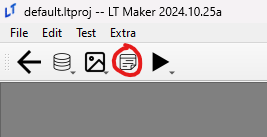

<a href="../../index.html" class="icon icon-home">lt-maker</a>

Contents:

- <a href="../home.html" class="reference internal">Lex Talionis Wiki</a>

Getting Started:

- <a href="../getting_started/index.html"
  class="reference internal">Getting Started</a>

Editor Guides:

- <a href="Editors-Overview.html" class="reference internal">Editors
  Overview</a>
- <a href="index.html" class="reference internal">Editors</a>
  - <a href="Editors-Overview.html" class="reference internal">Editors
    Overview</a>
  - <a href="Level-Editor.html" class="reference internal">Level Editor</a>
  - <a href="Overworld-Editor.html" class="reference internal">Overworld
    Editor</a>
  - <a href="Event-Editor.html#" class="current reference internal">Event
    Editor</a>
  - <a href="database-editors/index.html"
    class="reference internal">Database Editors</a>
  - <a href="resource-editors/index.html"
    class="reference internal">Resource Editors</a>

Events:

- <a href="../events/index.html" class="reference internal">Events</a>

Guides:

- <a href="../guides/Guides-Overview.html"
  class="reference internal">Guides Overview</a>
- <a href="../guides/index.html" class="reference internal">Guides</a>

appendix:

- <a href="../appendix/Text-Formatting-Commands.html"
  class="reference internal">Text Formatting Commands</a>
- <a href="../appendix/Item-Component-Reference.html"
  class="reference internal">Item Component Dictionary</a>
- <a href="../appendix/Skill-Component-Reference.html"
  class="reference internal">Skill Component Dictionary</a>
- <a href="../appendix/Special-Variables.html"
  class="reference internal">Special Variables</a>
- <a href="../appendix/Special-Tags.html"
  class="reference internal">Special Tags</a>
- <a href="../appendix/trigger-reference.html"
  class="reference internal">Event Triggers</a>
- <a href="../appendix/Random-Seed-Mechanics.html"
  class="reference internal">Random Seed Mechanics</a>
- <a href="../appendix/FAQ.html" class="reference internal">Frequently
  Asked Questions</a>
- <a href="../appendix/Contributing_to_the_LTWiki.html"
  class="reference internal">Contributing to the LTWiki</a>
- <a href="../appendix/index.html" class="reference internal">Code
  Documentation</a>

[lt-maker](../../index.html)

- 
- [Editors](index.html)
- Event Editor
- <a
  href="https://gitlab.com/rainlash/lt-maker/blob/master/docs/source/editors/Event-Editor.md"
  class="fa fa-gitlab">Edit on GitLab</a>

------------------------------------------------------------------------

# Event Editor<a href="Event-Editor.html#event-editor" class="headerlink"
title="Link to this heading"></a>

*last updated 2024-11-11*

Refer to <a href="../events/Event-Overview.html#eventoverview"
class="reference internal">Event
Overview</a> for more detailed explanation about this editor.

<a href="Overworld-Editor.html" class="btn btn-neutral float-left"
accesskey="p" rel="prev" title="Overworld Editor"> Previous</a>
<a href="database-editors/index.html"
class="btn btn-neutral float-right" accesskey="n" rel="next"
title="Database Editors">Next </a>

------------------------------------------------------------------------

© Copyright 2024, rainlash.

Built with [Sphinx](https://www.sphinx-doc.org/) using a
[theme](https://github.com/readthedocs/sphinx_rtd_theme) provided by
[Read the Docs](https://readthedocs.org).

