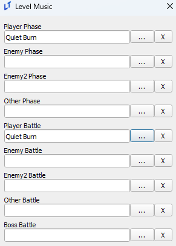
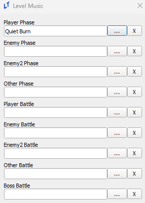
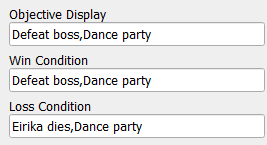
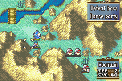
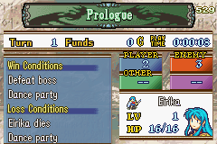
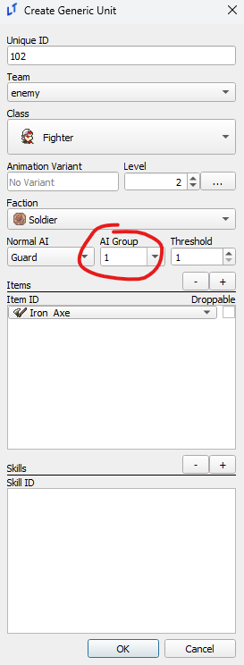
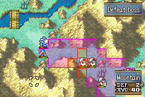

<a href="../../index.html" class="icon icon-home">lt-maker</a>

Contents:

- <a href="../home.html" class="reference internal">Lex Talionis Wiki</a>

Getting Started:

- <a href="../getting_started/index.html"
  class="reference internal">Getting Started</a>

Editor Guides:

- <a href="Editors-Overview.html" class="reference internal">Editors
  Overview</a>
- <a href="index.html" class="reference internal">Editors</a>
  - <a href="Editors-Overview.html" class="reference internal">Editors
    Overview</a>
  - <a href="Level-Editor.html#" class="current reference internal">Level
    Editor</a>
    - <a href="Level-Editor.html#level-music" class="reference internal">Level
      Music</a>
    - <a href="Level-Editor.html#display-formatting"
      class="reference internal">Display Formatting</a>
    - <a href="Level-Editor.html#formations-and-deployment"
      class="reference internal">Formations and Deployment</a>
    - <a href="Level-Editor.html#ai-groups" class="reference internal">AI
      Groups</a>
  - <a href="Overworld-Editor.html" class="reference internal">Overworld
    Editor</a>
  - <a href="Event-Editor.html" class="reference internal">Event Editor</a>
  - <a href="database-editors/index.html"
    class="reference internal">Database Editors</a>
  - <a href="resource-editors/index.html"
    class="reference internal">Resource Editors</a>

Events:

- <a href="../events/index.html" class="reference internal">Events</a>

Guides:

- <a href="../guides/Guides-Overview.html"
  class="reference internal">Guides Overview</a>
- <a href="../guides/index.html" class="reference internal">Guides</a>

appendix:

- <a href="../appendix/Text-Formatting-Commands.html"
  class="reference internal">Text Formatting Commands</a>
- <a href="../appendix/Item-Component-Reference.html"
  class="reference internal">Item Component Dictionary</a>
- <a href="../appendix/Skill-Component-Reference.html"
  class="reference internal">Skill Component Dictionary</a>
- <a href="../appendix/Special-Variables.html"
  class="reference internal">Special Variables</a>
- <a href="../appendix/Special-Tags.html"
  class="reference internal">Special Tags</a>
- <a href="../appendix/trigger-reference.html"
  class="reference internal">Event Triggers</a>
- <a href="../appendix/Random-Seed-Mechanics.html"
  class="reference internal">Random Seed Mechanics</a>
- <a href="../appendix/FAQ.html" class="reference internal">Frequently
  Asked Questions</a>
- <a href="../appendix/Contributing_to_the_LTWiki.html"
  class="reference internal">Contributing to the LTWiki</a>
- <a href="../appendix/index.html" class="reference internal">Code
  Documentation</a>

[lt-maker](../../index.html)

- 
- [Editors](index.html)
- Level Editor
- <a
  href="https://gitlab.com/rainlash/lt-maker/blob/master/docs/source/editors/Level-Editor.md"
  class="fa fa-gitlab">Edit on GitLab</a>

------------------------------------------------------------------------

# Level Editor<a href="Level-Editor.html#level-editor" class="headerlink"
title="Link to this heading"></a>

*last updated 2024-11-11*

## Level Music<a href="Level-Editor.html#level-music" class="headerlink"
title="Link to this heading"></a>

A lesser known behavior of the LT music system is that “battle”
variations of music will only play if the music is set to the battle
slot as well as the phase slot. If you set music to only the phase slot
but not the battle slot, the non-battle variant will continue playing.

The setup on the left will play the battle variation in combat, while
the one on the left will not. You can take advantage of this behavior
and set/unset battle music via an event midway through a chapter for
additional musical effect.

## Display Formatting<a href="Level-Editor.html#display-formatting" class="headerlink"
title="Link to this heading"></a>

Unlike the text in many other editors/eventing, the objective displays
use commas to break lines, like so.

## Formations and Deployment<a href="Level-Editor.html#formations-and-deployment" class="headerlink"
title="Link to this heading"></a>

Formation regions set your default deployment count for a chapter. For
those that want a greater control over deploy count, the
`_prep_slots` and
`_minimum_deployment` level variables can be
used to set upper and lower bounds for deployment count. More
information can be found in the
<a href="../appendix/Special-Variables.html#level-variables"
class="reference internal">Level
Variables</a> appendix entry.

## AI Groups<a href="Level-Editor.html#ai-groups" class="headerlink"
title="Link to this heading"></a>

AI Groups can be set in the units editor for both generics and normal
units, allowing units in the same group to all charge at once if a
number of units equal to the threshold could attack your army.

However, as seen below, enemies with the ‘Guard’ type AI will still have
a stationary range display. This is a lie; they will charge.

<a href="index.html" class="btn btn-neutral float-left" accesskey="p"
rel="prev" title="Editors"> Previous</a>
<a href="Overworld-Editor.html" class="btn btn-neutral float-right"
accesskey="n" rel="next" title="Overworld Editor">Next </a>

------------------------------------------------------------------------

© Copyright 2024, rainlash.

Built with [Sphinx](https://www.sphinx-doc.org/) using a
[theme](https://github.com/readthedocs/sphinx_rtd_theme) provided by
[Read the Docs](https://readthedocs.org).

