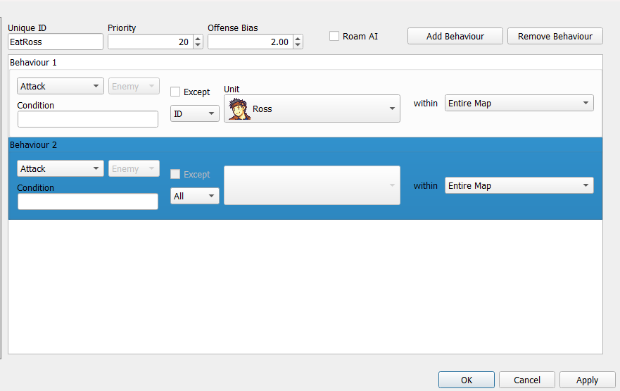
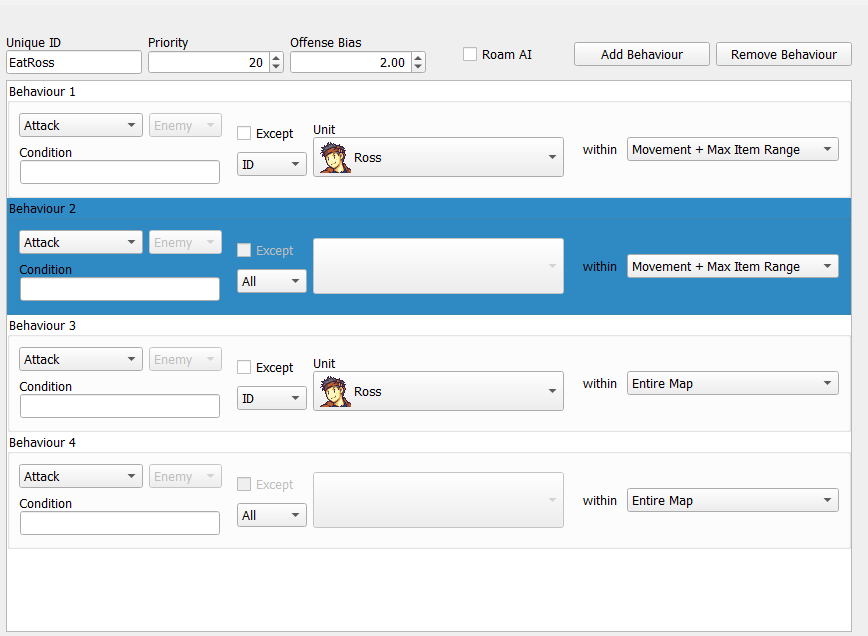
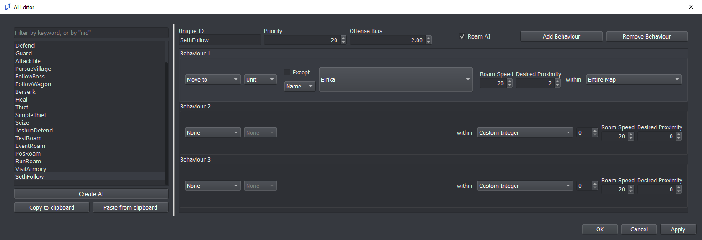
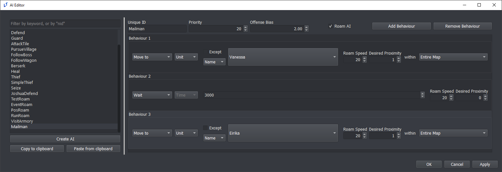
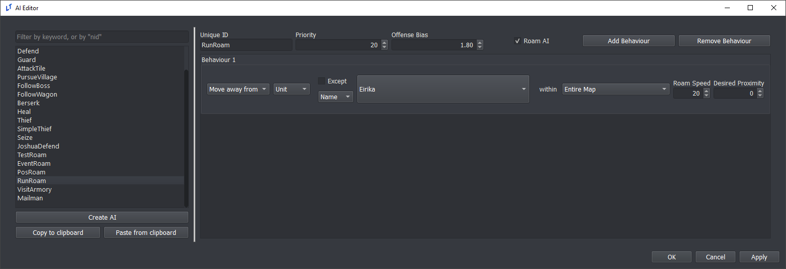

<a href="../../../index.html" class="icon icon-home">lt-maker</a>

Contents:

- <a href="../../home.html" class="reference internal">Lex Talionis
  Wiki</a>

Getting Started:

- <a href="../../getting_started/index.html"
  class="reference internal">Getting Started</a>

Editor Guides:

- <a href="../Editors-Overview.html" class="reference internal">Editors
  Overview</a>
- <a href="../index.html" class="reference internal">Editors</a>
  - <a href="../Editors-Overview.html" class="reference internal">Editors
    Overview</a>
  - <a href="../Level-Editor.html" class="reference internal">Level
    Editor</a>
  - <a href="../Overworld-Editor.html" class="reference internal">Overworld
    Editor</a>
  - <a href="../Event-Editor.html" class="reference internal">Event
    Editor</a>
  - <a href="index.html" class="reference internal">Database Editors</a>
    - <a href="Units-Editor.html" class="reference internal">Units Editor</a>
    - <a href="Teams-Editor.html" class="reference internal">Teams Editor</a>
    - <a href="Factions-Editor.html" class="reference internal">Factions
      Editor</a>
    - <a href="Party-Editor.html" class="reference internal">Party Editor</a>
    - <a href="Classes-Editor.html" class="reference internal">Classes
      Editor</a>
    - <a href="Tags-Editor.html" class="reference internal">Tags Editor</a>
    - <a href="Game-Vars-Editor.html" class="reference internal">Game Vars
      Editor</a>
    - <a href="Weapon-Types-Editor.html" class="reference internal">Weapon
      Types Editor</a>
    - <a href="Items-And-Skills-Editors.html" class="reference internal">Items
      And Skills Editors</a>
    - <a href="AI-Editor.html#" class="current reference internal">AI
      Editor</a>
      - <a href="AI-Editor.html#ai-layering-example-hates-one-guy"
        class="reference internal">AI Layering Example - Hates One Guy</a>
      - <a href="AI-Editor.html#free-roam-ai" class="reference internal">Free
        Roam AI</a>
    - <a href="Terrain-And-Movement-Costs-Editors.html"
      class="reference internal">Terrain and Movement Costs Editors</a>
    - <a href="Stats-Editor.html" class="reference internal">Stats Editor</a>
    - <a href="Equations-Editor.html" class="reference internal">Equations
      Editor</a>
    - <a href="Constants-Editor.html" class="reference internal">Constants
      Editor</a>
    - <a href="Difficulty-Modes-Editor.html"
      class="reference internal">Difficulty Modes Editor</a>
    - <a href="Supports-Editor.html" class="reference internal">Supports
      Editor</a>
    - <a href="Lore-Editor.html" class="reference internal">Lore Editor</a>
    - <a href="Raw-Data-Editor.html" class="reference internal">Raw Data
      Editor</a>
    - <a href="Translations-Editor.html"
      class="reference internal">Translations Editor</a>
  - <a href="../resource-editors/index.html"
    class="reference internal">Resource Editors</a>

Events:

- <a href="../../events/index.html" class="reference internal">Events</a>

Guides:

- <a href="../../guides/Guides-Overview.html"
  class="reference internal">Guides Overview</a>
- <a href="../../guides/index.html" class="reference internal">Guides</a>

appendix:

- <a href="../../appendix/Text-Formatting-Commands.html"
  class="reference internal">Text Formatting Commands</a>
- <a href="../../appendix/Item-Component-Reference.html"
  class="reference internal">Item Component Dictionary</a>
- <a href="../../appendix/Skill-Component-Reference.html"
  class="reference internal">Skill Component Dictionary</a>
- <a href="../../appendix/Special-Variables.html"
  class="reference internal">Special Variables</a>
- <a href="../../appendix/Special-Tags.html"
  class="reference internal">Special Tags</a>
- <a href="../../appendix/trigger-reference.html"
  class="reference internal">Event Triggers</a>
- <a href="../../appendix/Random-Seed-Mechanics.html"
  class="reference internal">Random Seed Mechanics</a>
- <a href="../../appendix/FAQ.html" class="reference internal">Frequently
  Asked Questions</a>
- <a href="../../appendix/Contributing_to_the_LTWiki.html"
  class="reference internal">Contributing to the LTWiki</a>
- <a href="../../appendix/index.html" class="reference internal">Code
  Documentation</a>

[lt-maker](../../../index.html)

- 
- [Editors](../index.html)
- [Database Editors](index.html)
- AI Editor
- <a
  href="https://gitlab.com/rainlash/lt-maker/blob/master/docs/source/editors/database-editors/AI-Editor.md"
  class="fa fa-gitlab">Edit on GitLab</a>

------------------------------------------------------------------------

# AI Editor<a href="AI-Editor.html#ai-editor" class="headerlink"
title="Link to this heading"></a>

## AI Layering Example - Hates One Guy<a href="AI-Editor.html#ai-layering-example-hates-one-guy"
class="headerlink" title="Link to this heading"></a>

Occasionally, you will require an AI that has two separate goals which
it prioritizes. In this case, we’ll consider an AI that causes a unit to
fight normally while specifically prioritizing one individual. We’ll
create an example AI that focuses on fighting Ross, while still
attacking other units.

An AI set up like the one above is what immediately comes to mind.
However, there is an issue: if Ross is anywhere on the map, the unit
will move to attack Ross, even if there are foes within striking range
already. This AI will only fight other enemies once Ross is not on the
field at all. For some, this could be the desired behavior. If it is
not, we must rectify it like so:

Now, the unit will attack Ross if in range, attack any other enemy if in
range, and then move towards either Ross or the closest enemy. There may
be other situations specific to your project where you would want to
layer AI in this way. Reference the ‘Seize’ AI in default.ltproj for
another example.

## Free Roam AI<a href="AI-Editor.html#free-roam-ai" class="headerlink"
title="Link to this heading"></a>

You may wish to create moving units in your free roam levels. Having
units that move around your city or castle can certainly help make it
feel more alive!

This tutorial will go over some example AIs you can create using the AI
system that exists in Lex Talionis.

Of the available AI behaviours, only a few have an effect in free roam.
Only Move To, Move Away From, Wait, and Interact maintain functionality.

### Followers<a href="AI-Editor.html#followers" class="headerlink"
title="Link to this heading"></a>

In many JRPGs party members will follow the lead unit around the map.
We’ll implement that here.

First, let’s set up an AI for our follower.

There’s nothing too complicated about this. At the top, you’ll notice
that we’ve checked “Roam AI?” - this simply tells the game to consider
units with this AI during free roam. It does not exclude the AI from
function during normal gameplay, however.

To the right in the behaviour boxes, Roam Speed is at its default of 20
and Desired Proximity is at 2. Roam Speed is the speed at which the unit
moves. As the value gets **closer to 0** the speed of the unit
**increases**. Desired Proximity is how close to a given target the unit
needs to be before it stops. The default is 0, which works well if you
want a unit to move to a particular position. However, we want some
personal space, so I’ve set it to 2.

Below that, we’ve created a behaviour identical to what you might see in
normal gameplay. A unit with this AI will try to continuously move to a
unit named Eirika. For your purposes, change the name to your roaming
unit. You can use any unit identifier as well, be it class, tag,
faction, or party.

Now to assign it. You’ll need to have either the “Free Roam?” box
checked in the level or have an event in your level that calls the
change_roaming command in order to be able to assign Roam AIs. However,
so long as you meet either of those two conditions you should see a Roam
AI selection box next to your normal AI selection box.

### Mailman<a href="AI-Editor.html#mailman" class="headerlink"
title="Link to this heading"></a>

Delivering the mail is no simple task! Let’s create an AI that will have
a unit get the mail from one target and give it to a second target.

The settings at the top are just about the same. This mailman is a bit
more touchy, but that’s it.

The behaviours are more interesting, however. The unit will first find a
unit Vanessa and move to her. Once he reaches Vanessa that behaviour
will be considered complete, and they’ll move to their next, which is
Wait.

Wait is a new behaviour that only affects units in free roam. If an AI
with the Wait behaviour is asked to select their move in normal gameplay
the Wait behaviour will be silently skipped. It takes an integer value
that corresponds with the amount of time you would like the unit to
wait. The higher the number, the longer they’ll wait.

Once they’re done waiting, the unit will move to Eirika. Once that third
behaviour completes they’ll wrap back around to their first, meaning
they’ll move back to Vanessa.

While we only have three behaviours here, you can add more using the
“Add Behaviour” button in the top right.

### Escapee<a href="AI-Editor.html#escapee" class="headerlink"
title="Link to this heading"></a>

Not everyone wants to be your friend, so let’s make an AI that will
attempt to flee from the roaming unit.

Again, a very simple task. The unit will try to flee if a unit named
Eirika (who happens to be our roaming unit) tries to get close. Though
he’s far slower than us currently, we could turn his speed up to make
quite the chase!

A note on combining this behaviour with others: when Eirika gets too
close a unit with this AI will find a spot to flee to and run there.
They will then consider that behaviour complete. This isn’t a
consideration if they only have one behaviour, as they’ll keep checking
to make sure Eirika isn’t too close, but if you gave them a Wait
behaviour afterwards they would always Wait that amount of time, even as
Eirika gets closer. That isn’t necessarily bad, but is something to be
considered.

<a href="Items-And-Skills-Editors.html"
class="btn btn-neutral float-left" accesskey="p" rel="prev"
title="Items And Skills Editors"> Previous</a>
<a href="Terrain-And-Movement-Costs-Editors.html"
class="btn btn-neutral float-right" accesskey="n" rel="next"
title="Terrain and Movement Costs Editors">Next </a>

------------------------------------------------------------------------

© Copyright 2024, rainlash.

Built with [Sphinx](https://www.sphinx-doc.org/) using a
[theme](https://github.com/readthedocs/sphinx_rtd_theme) provided by
[Read the Docs](https://readthedocs.org).

