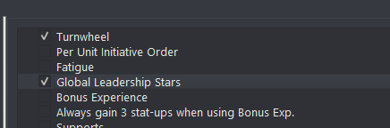
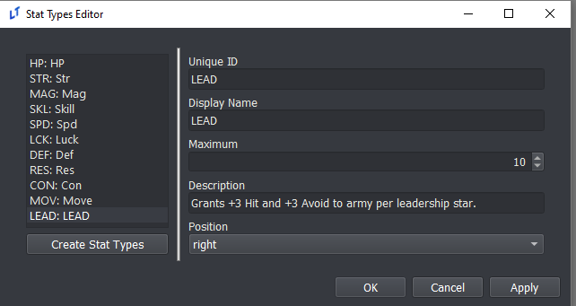
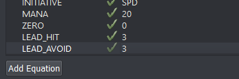

<a href="../../../index.html" class="icon icon-home">lt-maker</a>

Contents:

- <a href="../../home.html" class="reference internal">Lex Talionis
  Wiki</a>

Getting Started:

- <a href="../../getting_started/index.html"
  class="reference internal">Getting Started</a>

Editor Guides:

- <a href="../Editors-Overview.html" class="reference internal">Editors
  Overview</a>
- <a href="../index.html" class="reference internal">Editors</a>
  - <a href="../Editors-Overview.html" class="reference internal">Editors
    Overview</a>
  - <a href="../Level-Editor.html" class="reference internal">Level
    Editor</a>
  - <a href="../Overworld-Editor.html" class="reference internal">Overworld
    Editor</a>
  - <a href="../Event-Editor.html" class="reference internal">Event
    Editor</a>
  - <a href="index.html" class="reference internal">Database Editors</a>
    - <a href="Units-Editor.html" class="reference internal">Units Editor</a>
    - <a href="Teams-Editor.html" class="reference internal">Teams Editor</a>
    - <a href="Factions-Editor.html" class="reference internal">Factions
      Editor</a>
    - <a href="Party-Editor.html" class="reference internal">Party Editor</a>
    - <a href="Classes-Editor.html" class="reference internal">Classes
      Editor</a>
    - <a href="Tags-Editor.html" class="reference internal">Tags Editor</a>
    - <a href="Game-Vars-Editor.html" class="reference internal">Game Vars
      Editor</a>
    - <a href="Weapon-Types-Editor.html" class="reference internal">Weapon
      Types Editor</a>
    - <a href="Items-And-Skills-Editors.html" class="reference internal">Items
      And Skills Editors</a>
    - <a href="AI-Editor.html" class="reference internal">AI Editor</a>
    - <a href="Terrain-And-Movement-Costs-Editors.html"
      class="reference internal">Terrain and Movement Costs Editors</a>
    - <a href="Stats-Editor.html" class="reference internal">Stats Editor</a>
    - <a href="Equations-Editor.html" class="reference internal">Equations
      Editor</a>
    - <a href="Constants-Editor.html#"
      class="current reference internal">Constants Editor</a>
      - <a href="Constants-Editor.html#game-unique-identifier"
        class="reference internal">Game Unique Identifier</a>
      - <a href="Constants-Editor.html#constants-dependent-on-game-variables"
        class="reference internal">Constants Dependent On Game Variables</a>
      - <a href="Constants-Editor.html#leadership-stars"
        class="reference internal">Leadership Stars</a>
      - <a href="Constants-Editor.html#constants-dictionary"
        class="reference internal">Constants Dictionary</a>
    - <a href="Difficulty-Modes-Editor.html"
      class="reference internal">Difficulty Modes Editor</a>
    - <a href="Supports-Editor.html" class="reference internal">Supports
      Editor</a>
    - <a href="Lore-Editor.html" class="reference internal">Lore Editor</a>
    - <a href="Raw-Data-Editor.html" class="reference internal">Raw Data
      Editor</a>
    - <a href="Translations-Editor.html"
      class="reference internal">Translations Editor</a>
  - <a href="../resource-editors/index.html"
    class="reference internal">Resource Editors</a>

Events:

- <a href="../../events/index.html" class="reference internal">Events</a>

Guides:

- <a href="../../guides/Guides-Overview.html"
  class="reference internal">Guides Overview</a>
- <a href="../../guides/index.html" class="reference internal">Guides</a>

appendix:

- <a href="../../appendix/Text-Formatting-Commands.html"
  class="reference internal">Text Formatting Commands</a>
- <a href="../../appendix/Item-Component-Reference.html"
  class="reference internal">Item Component Dictionary</a>
- <a href="../../appendix/Skill-Component-Reference.html"
  class="reference internal">Skill Component Dictionary</a>
- <a href="../../appendix/Special-Variables.html"
  class="reference internal">Special Variables</a>
- <a href="../../appendix/Special-Tags.html"
  class="reference internal">Special Tags</a>
- <a href="../../appendix/trigger-reference.html"
  class="reference internal">Event Triggers</a>
- <a href="../../appendix/Random-Seed-Mechanics.html"
  class="reference internal">Random Seed Mechanics</a>
- <a href="../../appendix/FAQ.html" class="reference internal">Frequently
  Asked Questions</a>
- <a href="../../appendix/Contributing_to_the_LTWiki.html"
  class="reference internal">Contributing to the LTWiki</a>
- <a href="../../appendix/index.html" class="reference internal">Code
  Documentation</a>

[lt-maker](../../../index.html)

- 
- [Editors](../index.html)
- [Database Editors](index.html)
- Constants Editor
- <a
  href="https://gitlab.com/rainlash/lt-maker/blob/master/docs/source/editors/database-editors/Constants-Editor.md"
  class="fa fa-gitlab">Edit on GitLab</a>

------------------------------------------------------------------------

# Constants Editor<a href="Constants-Editor.html#constants-editor" class="headerlink"
title="Link to this heading"></a>

## Game Unique Identifier<a href="Constants-Editor.html#game-unique-identifier"
class="headerlink" title="Link to this heading"></a>

This ID is used to label the filenames of save files for LT games. As
such, changing this will render existing saves inoperable unless all of
their individual names are changed as well. Bear this in mind when
determining your ID before a public release.

## Constants Dependent On Game Variables<a href="Constants-Editor.html#constants-dependent-on-game-variables"
class="headerlink" title="Link to this heading"></a>

While some constants have dedicated editors, such as Overworld and
Supports, several constants require eventing to function, even when
checked off in the Constants editor. These are:

> 

>
> - `Turnwheel`: requires the turnwheel to be
>   enabled via the `enable_turnwheel` event
>   command, as well as `_max_turnwheel_uses`
>   to be set if the game is meant to impose a limit on usage.
>
> - `Fatigue`: requires the
>   `_fatigue` variable to be set to an
>   applicable value.
>
> - `Global`` ``Leadership`` ``Stars`:
>   requires a few different steps (see below).
>
> 

For more information on variables used for these constants, please refer
to <a href="../../appendix/Special-Variables.html#special-variables"
class="reference internal">Special
Variables</a>.

## Leadership Stars<a href="Constants-Editor.html#leadership-stars" class="headerlink"
title="Link to this heading"></a>

*Thracia 776* style leadership stars are available in the **Lex
Talionis** engine. To implement:

1.  Check the “Global Leadership Stars” box in the Constants menu

2.  Create a “LEAD” stat in the Stats editor. This stat will be the
    number of leadership stars a unit has.

3.  Create a LEAD_HIT and LEAD_AVOID equation in the Equations editor.
    These equations will determine the bonus hit and avoid units will
    get from leadership stars

## Constants Dictionary<a href="Constants-Editor.html#constants-dictionary" class="headerlink"
title="Link to this heading"></a>

This section lists the functionality of each constant available in the
Constants editor.

| Constant                                                         | Description                                                                                                                                                           |
|------------------------------------------------------------------|-----------------------------------------------------------------------------------------------------------------------------------------------------------------------|
| **Turnwheel**                                                    | Allows the player to access time rewind mechanic to restore the game to an earlier state within the same chapter.                                                     |
| **Per Unit Initiative Order**                                    | Causes each unit to have its own turn, removing the Player/Enemy Phase division.                                                                                      |
| **Fatigue**                                                      | Causes units to accumulate fatigue each time they are deployed on a map.                                                                                              |
| **Pair Up**                                                      | Allows units to merge into a duo where one unit is the main unit in combat and the other grants passive bonuses. Allows for pair up attacks and guard stance as well. |
| **Limit Attack Stance to first attack only**                     | Pair Up constant. Restricts the benefits of Attack Stance to only the first attack if the unit doubles.                                                               |
| **Global Leadership Stars**                                      | Adds a leadership star stat, visible through the info menu, that grants passive bonuses to all other units in the same army.                                          |
| **Bonus Experience**                                             | Allows accumulation of bonus experience that can be distributed to any unit in base.                                                                                  |
| **Always gain 3 stat-ups when using Bonus Exp.**                 | Any level gained using bonus experience will have exactly three stat increses.                                                                                        |
| **Supports**                                                     | Allows units to accumulate support ranks, granting passive bonuses to each other which can be modified based on affinity.                                             |
| **Overworld**                                                    | Enables a traversable overworld with nodes for shopping and other events.                                                                                             |
| **Unit Notes**                                                   | Makes unit notes visible in the info menu.                                                                                                                            |
| **Allow Criticals**                                              | Enables critical hits.                                                                                                                                                |
| **Can trade items on map**                                       | Allows units to trade items during a chapter while adjacent to each other.                                                                                            |
| **Can view unit growths in Info Menu**                           | The player can press the Aux button when looking at a unit’s stats to view growth rates.                                                                              |
| **Apply difficulty bonus growths to past levels**                | Non-boss enemy units gain a bonus to their stats based on the bonus growths granted by the selected difficulty.                                                       |
| **Force items and abilities to obey line of sight rules**        | Items cannot pass through walls and other terrain that break line of sight.                                                                                           |
| **Force auras to obey line of sight rules**                      | Skill auras cannot pass through walls and other terrain that break line of sight.                                                                                     |
| **Fog of War will also be affected by line of sight**            | Areas blocked by walls and other similar terrain are not revealed under fog of war.                                                                                   |
| **AI will also be affected by Fog of War**                       | Non player-controlled units follow the same rules players follow for Fog of War.                                                                                      |
| **Defender can double counterattack**                            | Allows doubling for a unit that did not initiate the attack.                                                                                                          |
| **Units will promote automatically upon reaching max level**     | Surely this one is self explanatory.                                                                                                                                  |
| **Promotion resets level back to 1**                             | When enabled, unit does not retain their level/exp when changing class through promotion and is instead reset to 1.                                                   |
| **Class Change resets level back to 1**                          | When enabled, unit does not retain their level/exp after changing class in any way.                                                                                   |
| **Generic units will be granted random feats when appropriate**  | If a generic unit would have gained a feat at its current level, it gains one of any random skill marked as a feat.                                                   |
| **Final blow on boss will use critical animation**               | Works even if the critical rate is 0 for that attack.                                                                                                                 |
| **Use battle platforms when battle backgrounds are on**          | Enables display of battle platforms when using battle backgrounds.                                                                                                    |
| **Items held by dead player units are sent to convoy**           | Also self explanatory.                                                                                                                                                |
| **Access the Repair Shop in prep and base**                      | Allows units to repair held items in the Manage section of preps and base menus.                                                                                      |
| **Unit can give a unit after taking a unit**                     | Refers to the rescue mechanic.                                                                                                                                        |
| **Mana resets to full for units upon completion of the chapter** | When disabled, mana is unchanged between chapters.                                                                                                                    |
| **When doubling, splash/aoe is applied on the second attack**    | When disabled, AoE effects only apply to the first attack when doubling.                                                                                              |
| **Enemy AI attacks even if Hit is 0**                            | Used to make the AI dumber.                                                                                                                                           |
| **Enemy AI attacks even if damage is 0**                         | Allows the AI to choose to attack even if no damage or status would be dealt.                                                                                         |
| **Show Movement as 0 if AI does not move**                       | Applies when displaying NPC movement range/threat. Changing to a different AI will update the display.                                                                |
| **Display particle effect on title screen**                      | Used for the little glimmery things that float by in the title screen.                                                                                                |
| **Restart phase music at beginning of new phase**                | Phase music plays from beginning each time phase changes.                                                                                                             |
| **Restart battle music at beginning of each combat**             | Battle music plays from the beginning for each battle.                                                                                                                |
| **Kills give double weapon exp**                                 | Very self explanatory.                                                                                                                                                |
| **Each hit when doubling grants weapon exp**                     | If disabled, only one hit per combat grants weapon exp.                                                                                                               |
| **Gain weapon exp even on miss**                                 | Still self explanatory.                                                                                                                                               |

<a href="Equations-Editor.html" class="btn btn-neutral float-left"
accesskey="p" rel="prev" title="Equations Editor"> Previous</a>
<a href="Difficulty-Modes-Editor.html"
class="btn btn-neutral float-right" accesskey="n" rel="next"
title="Difficulty Modes Editor">Next </a>

------------------------------------------------------------------------

© Copyright 2024, rainlash.

Built with [Sphinx](https://www.sphinx-doc.org/) using a
[theme](https://github.com/readthedocs/sphinx_rtd_theme) provided by
[Read the Docs](https://readthedocs.org).

