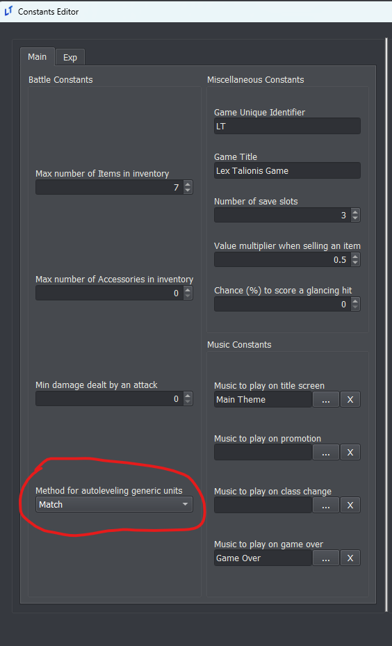

<a href="../../../index.html" class="icon icon-home">lt-maker</a>

Contents:

- <a href="../../home.html" class="reference internal">Lex Talionis
  Wiki</a>

Getting Started:

- <a href="../../getting_started/index.html"
  class="reference internal">Getting Started</a>

Editor Guides:

- <a href="../Editors-Overview.html" class="reference internal">Editors
  Overview</a>
- <a href="../index.html" class="reference internal">Editors</a>
  - <a href="../Editors-Overview.html" class="reference internal">Editors
    Overview</a>
  - <a href="../Level-Editor.html" class="reference internal">Level
    Editor</a>
  - <a href="../Overworld-Editor.html" class="reference internal">Overworld
    Editor</a>
  - <a href="../Event-Editor.html" class="reference internal">Event
    Editor</a>
  - <a href="index.html" class="reference internal">Database Editors</a>
    - <a href="Units-Editor.html" class="reference internal">Units Editor</a>
    - <a href="Teams-Editor.html" class="reference internal">Teams Editor</a>
    - <a href="Factions-Editor.html" class="reference internal">Factions
      Editor</a>
    - <a href="Party-Editor.html" class="reference internal">Party Editor</a>
    - <a href="Classes-Editor.html" class="reference internal">Classes
      Editor</a>
    - <a href="Tags-Editor.html" class="reference internal">Tags Editor</a>
    - <a href="Game-Vars-Editor.html" class="reference internal">Game Vars
      Editor</a>
    - <a href="Weapon-Types-Editor.html" class="reference internal">Weapon
      Types Editor</a>
    - <a href="Items-And-Skills-Editors.html" class="reference internal">Items
      And Skills Editors</a>
    - <a href="AI-Editor.html" class="reference internal">AI Editor</a>
    - <a href="Terrain-And-Movement-Costs-Editors.html"
      class="reference internal">Terrain and Movement Costs Editors</a>
    - <a href="Stats-Editor.html" class="reference internal">Stats Editor</a>
    - <a href="Equations-Editor.html" class="reference internal">Equations
      Editor</a>
    - <a href="Constants-Editor.html" class="reference internal">Constants
      Editor</a>
    - <a href="Difficulty-Modes-Editor.html#"
      class="current reference internal">Difficulty Modes Editor</a>
      - <a href="Difficulty-Modes-Editor.html#explanation-of-options"
        class="reference internal">Explanation of Options</a>
      - <a
        href="Difficulty-Modes-Editor.html#difficulty-using-test-current-chapter"
        class="reference internal">Difficulty Using “Test Current Chapter”</a>
      - <a href="Difficulty-Modes-Editor.html#growth-mechanics"
        class="reference internal">Growth Mechanics</a>
    - <a href="Supports-Editor.html" class="reference internal">Supports
      Editor</a>
    - <a href="Lore-Editor.html" class="reference internal">Lore Editor</a>
    - <a href="Raw-Data-Editor.html" class="reference internal">Raw Data
      Editor</a>
    - <a href="Translations-Editor.html"
      class="reference internal">Translations Editor</a>
  - <a href="../resource-editors/index.html"
    class="reference internal">Resource Editors</a>

Events:

- <a href="../../events/index.html" class="reference internal">Events</a>

Guides:

- <a href="../../guides/Guides-Overview.html"
  class="reference internal">Guides Overview</a>
- <a href="../../guides/index.html" class="reference internal">Guides</a>

appendix:

- <a href="../../appendix/Text-Formatting-Commands.html"
  class="reference internal">Text Formatting Commands</a>
- <a href="../../appendix/Item-Component-Reference.html"
  class="reference internal">Item Component Dictionary</a>
- <a href="../../appendix/Skill-Component-Reference.html"
  class="reference internal">Skill Component Dictionary</a>
- <a href="../../appendix/Special-Variables.html"
  class="reference internal">Special Variables</a>
- <a href="../../appendix/Special-Tags.html"
  class="reference internal">Special Tags</a>
- <a href="../../appendix/trigger-reference.html"
  class="reference internal">Event Triggers</a>
- <a href="../../appendix/Random-Seed-Mechanics.html"
  class="reference internal">Random Seed Mechanics</a>
- <a href="../../appendix/FAQ.html" class="reference internal">Frequently
  Asked Questions</a>
- <a href="../../appendix/Contributing_to_the_LTWiki.html"
  class="reference internal">Contributing to the LTWiki</a>
- <a href="../../appendix/index.html" class="reference internal">Code
  Documentation</a>

[lt-maker](../../../index.html)

- 
- [Editors](../index.html)
- [Database Editors](index.html)
- Difficulty Modes Editor
- <a
  href="https://gitlab.com/rainlash/lt-maker/blob/master/docs/source/editors/database-editors/Difficulty-Modes-Editor.md"
  class="fa fa-gitlab">Edit on GitLab</a>

------------------------------------------------------------------------

# Difficulty Modes Editor<a href="Difficulty-Modes-Editor.html#difficulty-modes-editor"
class="headerlink" title="Link to this heading"></a>

## Explanation of Options<a href="Difficulty-Modes-Editor.html#explanation-of-options"
class="headerlink" title="Link to this heading"></a>

### Permadeath<a href="Difficulty-Modes-Editor.html#permadeath" class="headerlink"
title="Link to this heading"></a>

- **Casual**: When a unit reaches 0 HP, they are removed from the map
  for the current chapter, but will be available next map.

- **Classic**: When a unit reaches 0 HP, they die permanently.

### Growth Method<a href="Difficulty-Modes-Editor.html#growth-method" class="headerlink"
title="Link to this heading"></a>

All units have a specific growth rate for each of their stats. This
growth rate determines the likelihood that the unit will gain a point in
that stat on level-up. A growth rate greater than or equal to 100%
guarantees a point on each level-up. A growth rate lower than 0%
indicates a chance for the unit to *lose* points in that stat on
level-up.

- **Random**: Truly random growths. For each stat, a random number is
  rolled between 0 and 99. If the number is less than the growth rate,
  that stat increases.

- **Fixed**: Units will always have their average stats. A unit with a
  50% growth rate is guaranteed to get a stat increase every other
  level.

- **Dynamic**: Like **Random**, but it applies a rubberbanding effect to
  the growth rate. If a unit fails to increase a stat on level-up, next
  level-up that stat will have a higher effective growth rate.

### RNG Method<a href="Difficulty-Modes-Editor.html#rng-method" class="headerlink"
title="Link to this heading"></a>

This determines how the engine decides whether an attack is a hit or a
miss.

- **Classic**: Used in FE1-5. No modifications. A 70% displayed chance
  to hit is exactly a 70% real chance to hit.

- **True Hit**: Used in FE6-13. The engine generates two random numbers
  and averages them. This makes displayed chances to hit above 50% more
  likely than expected, and those lower than 50% less likely than
  expected. A 70% displayed chance to hit is actually 82.3%.

- **True Hit+**: Like **True Hit**, but the engine generates *three*
  random numbers and averages them. A 70% displayed chance to hit is
  actually 88.2%.

- **Grandmaster**: All attacks hit. However, the damage an attack deals
  is multiplied by the displayed chance to hit. An attack that deals 10
  damage with a 70% displayed chance to hit will always hit, dealing 7
  damage.

## Difficulty Using “Test Current Chapter”<a
href="Difficulty-Modes-Editor.html#difficulty-using-test-current-chapter"
class="headerlink" title="Link to this heading"></a>

When testing a singular chapter via the “Test Current Chapter” option,
the difficulty mode at the top of the list is automatically used. When
testing with a “Player’s Choice” difficulty option, the default
permadeath option is Casual, while the default growths option is Fixed.

## Growth Mechanics<a href="Difficulty-Modes-Editor.html#growth-mechanics"
class="headerlink" title="Link to this heading"></a>

### Stat Gain on Level Up<a href="Difficulty-Modes-Editor.html#stat-gain-on-level-up"
class="headerlink" title="Link to this heading"></a>

The **Lex Talionis** engine implements three different methods you can
choose from for how your units will level up. You can find these options
in the DifficultyEditor.

You can choose different growth methods for the player characters and
the enemy characters. For instance, you could use the classic *Random*
growth method for player characters, and then select *Fixed* for enemy
characters to make their stats in battle more consistent.

The remaining fourth option, *Match*, is only available for non-player
units and will force them to use whatever the player units use. This
option is found in the Constants editor.

#### Random<a href="Difficulty-Modes-Editor.html#random" class="headerlink"
title="Link to this heading"></a>

This is the classic Fire Emblem experience. A unit with an
`X` growth rate in a stat, will have exactly an
`X%` chance to gain one point in that stat each
time the unit levels up.

##### Additional Notes:<a href="Difficulty-Modes-Editor.html#additional-notes"
class="headerlink" title="Link to this heading"></a>

A unit with a 100 or greater growth rate in a stat will automatically
gain at least one point in that stat. A unit with a 260 growth rate will
automatically gain two points in that stat on level up, and then has a
60% chance to gain a third point in that stat.

A unit with a negative growth rate will have a chance of losing a point
in that stat. From a -20 growth rate it follows that the unit will have
a 20% chance to lose a point in that stat on level up.

If a stat is already at it’s maximum value, it will not increase any
further. In the **Lex Talionis**engine, there is no re-roll on an empty
level up like there is in the GBA games.

#### Fixed<a href="Difficulty-Modes-Editor.html#fixed" class="headerlink"
title="Link to this heading"></a>

All units will always have their average stats. A unit with an
`X` growth rate in a stat will gain a stat
point every `100/X` levels. This keeps each
stat as close as possible to its average value for that stat.

##### Additional Notes:<a href="Difficulty-Modes-Editor.html#id1" class="headerlink"
title="Link to this heading"></a>

Units start with 50 “growth points” in each stat. On each level up, they
gain their growths in that stat. So, a unit with a 25 growth rate will
go from 50 starting growth points to 75 growth points at level 2.

If the new value would be greater than or equal to 100, the stat is
increased by 1 and then their growth points in that stat are reduced by
100.

Example:

    Growth Rate = 60
    Level 1 Growth Points = 50
    Level 2 Growth Points = 50 + 60 => 10 (Stat Increased!)
    Level 3 Growth Points = 10 + 60 => 70
    Level 4 Growth Points = 70 + 60 => 30 (Stat Increased!)
    Level 5 Growth Points = 30 + 60 => 90
    Level 6 Growth Points = 90 + 60 => 50 (Stat Increased!)
    Level 7 Growth Points = 50 + 60 => 10 (Stat Increased!)
    Level 8 Growth Points = 10 + 60 => 70
    ...

#### Dynamic<a href="Difficulty-Modes-Editor.html#dynamic" class="headerlink"
title="Link to this heading"></a>

Unit’s growth rates will fluctuate to keep their stats close to the
average value. The variance value used for this is 10. Otherwise, this
method works identically to the *Random* method.

A unit with a `X` growth rate starts with a
`X%` chance to level up their stat. The growth
rate will be modified on each level up depending on whether their stat
levels.

On success, growth rate is reduced by
`(100`` ``-`` ``true_growth_rate)`` ``/`` ``variance`.

    *Repeated Successful Level Ups*
    True Growth Rate = 60
    Level 1 Growth Rate = 60
    Level 2 Growth Rate = 60 - ((100 - 60) / 10) => 56
    Level 3 Growth Rate = 56 - ((100 - 60) / 10) => 52
    Level 4 Growth Rate = 52 - 4 => 48
    ...

On failure, growth rate is increased by
`true_growth_rate`` ``/`` ``variance`.

    *Repeated Failed Level Ups*
    True Growth Rate = 60
    Level 1 Growth Rate = 60
    Level 2 Growth Rate = 60 + (60 / 10) => 66
    Level 3 Growth Rate = 66 + (60 / 10) => 72
    Level 4 Growth Rate = 72 + 6 => 78

### Average Stats<a href="Difficulty-Modes-Editor.html#average-stats" class="headerlink"
title="Link to this heading"></a>

All methods result in the unit having the same average stat as they
level up. For instance, a level 1 unit that starts with a Speed stat of
5 and a speed growth of 40, under all three methods, will end up with,
on average, a Speed stat of 13 at level 20. The only difference is how
wide the variance on the results will be, with the *Fixed* method having
no variance, and the *Dynamic* method have reduced variance compared to
the *Random* method.

<a href="Constants-Editor.html" class="btn btn-neutral float-left"
accesskey="p" rel="prev" title="Constants Editor"> Previous</a>
<a href="Supports-Editor.html" class="btn btn-neutral float-right"
accesskey="n" rel="next" title="Supports Editor">Next </a>

------------------------------------------------------------------------

© Copyright 2024, rainlash.

Built with [Sphinx](https://www.sphinx-doc.org/) using a
[theme](https://github.com/readthedocs/sphinx_rtd_theme) provided by
[Read the Docs](https://readthedocs.org).

