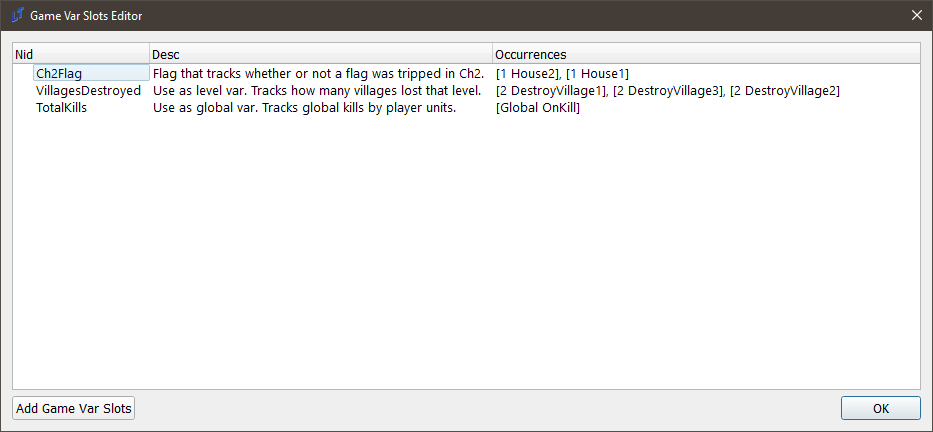
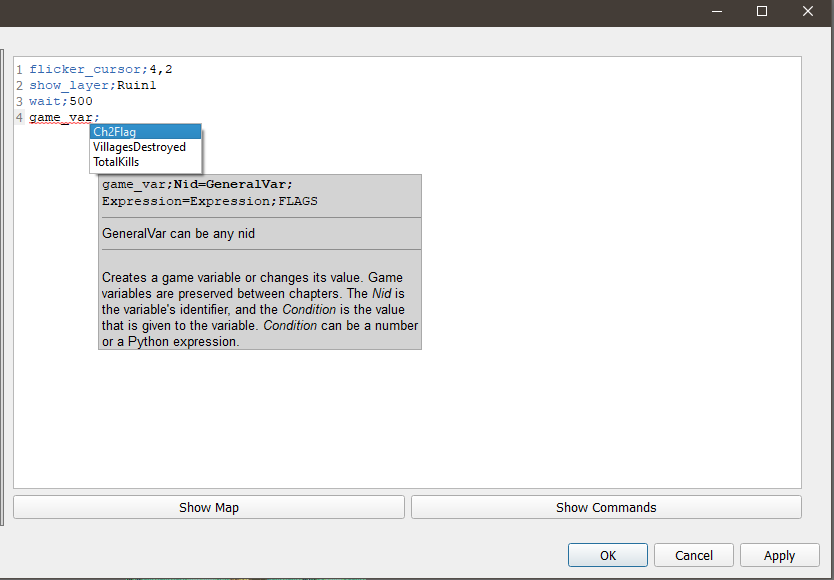
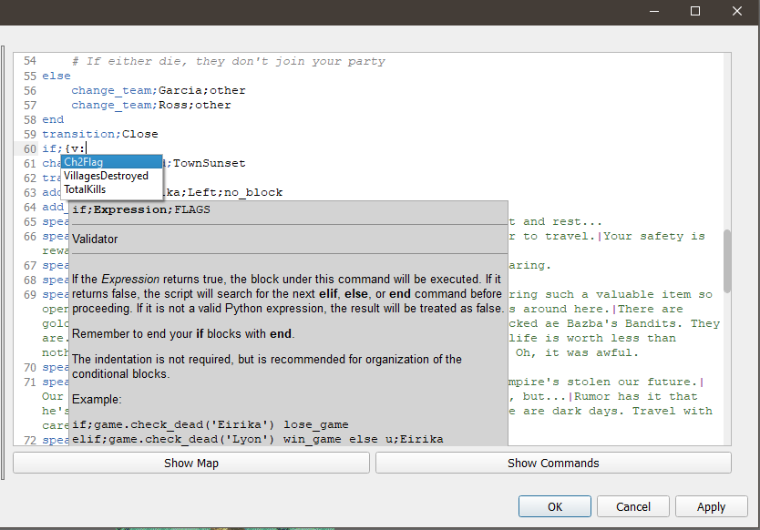

<a href="../../../index.html" class="icon icon-home">lt-maker</a>

Contents:

- <a href="../../home.html" class="reference internal">Lex Talionis
  Wiki</a>

Getting Started:

- <a href="../../getting_started/index.html"
  class="reference internal">Getting Started</a>

Editor Guides:

- <a href="../Editors-Overview.html" class="reference internal">Editors
  Overview</a>
- <a href="../index.html" class="reference internal">Editors</a>
  - <a href="../Editors-Overview.html" class="reference internal">Editors
    Overview</a>
  - <a href="../Level-Editor.html" class="reference internal">Level
    Editor</a>
  - <a href="../Overworld-Editor.html" class="reference internal">Overworld
    Editor</a>
  - <a href="../Event-Editor.html" class="reference internal">Event
    Editor</a>
  - <a href="index.html" class="reference internal">Database Editors</a>
    - <a href="Units-Editor.html" class="reference internal">Units Editor</a>
    - <a href="Teams-Editor.html" class="reference internal">Teams Editor</a>
    - <a href="Factions-Editor.html" class="reference internal">Factions
      Editor</a>
    - <a href="Party-Editor.html" class="reference internal">Party Editor</a>
    - <a href="Classes-Editor.html" class="reference internal">Classes
      Editor</a>
    - <a href="Tags-Editor.html" class="reference internal">Tags Editor</a>
    - <a href="Game-Vars-Editor.html#" class="current reference internal">Game
      Vars Editor</a>
      - <a href="Game-Vars-Editor.html#the-example-problem"
        class="reference internal">The Example Problem</a>
      - <a href="Game-Vars-Editor.html#the-var-slots"
        class="reference internal">The Var Slots</a>
      - <a href="Game-Vars-Editor.html#special-vars"
        class="reference internal">Special Vars</a>
    - <a href="Weapon-Types-Editor.html" class="reference internal">Weapon
      Types Editor</a>
    - <a href="Items-And-Skills-Editors.html" class="reference internal">Items
      And Skills Editors</a>
    - <a href="AI-Editor.html" class="reference internal">AI Editor</a>
    - <a href="Terrain-And-Movement-Costs-Editors.html"
      class="reference internal">Terrain and Movement Costs Editors</a>
    - <a href="Stats-Editor.html" class="reference internal">Stats Editor</a>
    - <a href="Equations-Editor.html" class="reference internal">Equations
      Editor</a>
    - <a href="Constants-Editor.html" class="reference internal">Constants
      Editor</a>
    - <a href="Difficulty-Modes-Editor.html"
      class="reference internal">Difficulty Modes Editor</a>
    - <a href="Supports-Editor.html" class="reference internal">Supports
      Editor</a>
    - <a href="Lore-Editor.html" class="reference internal">Lore Editor</a>
    - <a href="Raw-Data-Editor.html" class="reference internal">Raw Data
      Editor</a>
    - <a href="Translations-Editor.html"
      class="reference internal">Translations Editor</a>
  - <a href="../resource-editors/index.html"
    class="reference internal">Resource Editors</a>

Events:

- <a href="../../events/index.html" class="reference internal">Events</a>

Guides:

- <a href="../../guides/Guides-Overview.html"
  class="reference internal">Guides Overview</a>
- <a href="../../guides/index.html" class="reference internal">Guides</a>

appendix:

- <a href="../../appendix/Text-Formatting-Commands.html"
  class="reference internal">Text Formatting Commands</a>
- <a href="../../appendix/Item-Component-Reference.html"
  class="reference internal">Item Component Dictionary</a>
- <a href="../../appendix/Skill-Component-Reference.html"
  class="reference internal">Skill Component Dictionary</a>
- <a href="../../appendix/Special-Variables.html"
  class="reference internal">Special Variables</a>
- <a href="../../appendix/Special-Tags.html"
  class="reference internal">Special Tags</a>
- <a href="../../appendix/trigger-reference.html"
  class="reference internal">Event Triggers</a>
- <a href="../../appendix/Random-Seed-Mechanics.html"
  class="reference internal">Random Seed Mechanics</a>
- <a href="../../appendix/FAQ.html" class="reference internal">Frequently
  Asked Questions</a>
- <a href="../../appendix/Contributing_to_the_LTWiki.html"
  class="reference internal">Contributing to the LTWiki</a>
- <a href="../../appendix/index.html" class="reference internal">Code
  Documentation</a>

[lt-maker](../../../index.html)

- 
- [Editors](../index.html)
- [Database Editors](index.html)
- Game Vars Editor
- <a
  href="https://gitlab.com/rainlash/lt-maker/blob/master/docs/source/editors/database-editors/Game-Vars-Editor.md"
  class="fa fa-gitlab">Edit on GitLab</a>

------------------------------------------------------------------------

# Game Vars Editor<a href="Game-Vars-Editor.html#game-vars-editor" class="headerlink"
title="Link to this heading"></a>

The Game Vars editor is an editor that allows you to predefine common
`GameVar`s that you may use repeatedly
throughout the hack. The editor does not do anything on its own; rather,
it helps other editors, such as the Event Editor, function more
smoothly, by giving the editor knowledge of common variable names.

## The Example Problem<a href="Game-Vars-Editor.html#the-example-problem" class="headerlink"
title="Link to this heading"></a>

**I am making a Gaiden Chapter in my game.** If the player finds three
hidden statues in the Prologue, Chapter 5, and Chapter 12, as well as
interact with the puppy on Chapter 7, then they will unlock Chapter 19x.
The events for this may appear as follows:

    # Prologue - If UNIT finds with Statue:
    game_var;StatueFoundCh1;True

    # Chapter 5 - If UNIT finds with Statue:
    game_var;StatueFoundCh5;True

    # Chapter 7 - If UNIT interacts with Puppy:
    game_var;PuppyInteractedCh7;True

… And so on. This isn’t so bad. However, you’ve worked on this game for
a long time. There are, oh, about ~253 different variables tracking
various different flags, and you can’t be expected to remember them all,
and remember where they occur, or what they do. Worst of all - you have
to type them properly each time, or else your conditions will not work,
or some other bug will occur, and it’ll take ages to debug.

## The Var Slots<a href="Game-Vars-Editor.html#the-var-slots" class="headerlink"
title="Link to this heading"></a>

The Var Slots editor allows you to predefine all of these names. It’s
not a very complex editor - it’s mostly a glorified list of strings. But
it saves time on all of the above, if you’re a heavy eventer or your
project is large.

This is the editor. It consists of a single list with three parts: the
predefined variable name, a brief description that you can fill out, and
finally, a field that contains the locations of all references to the
predefined variable name. By filling out the first two fields, you
accomplish two things. You write down for future you the exact name of
the variable, and a note on what exactly it’s used for.

There is one final feature of this list - all predefined variables in
this list can be autocompleted anywhere a game or level variable is
referenced or required:

This should dramatically reduce the number of headaches you get from
debugging misspellings. Happy devving!

## Special Vars<a href="Game-Vars-Editor.html#special-vars" class="headerlink"
title="Link to this heading"></a>

Certain variables have hard-coded engine functionality; for more
information, please refer to
<a href="../../appendix/Special-Variables.html#special-variables"
class="reference internal">Special
Variables</a>.

<a href="Tags-Editor.html" class="btn btn-neutral float-left"
accesskey="p" rel="prev" title="Tags Editor"> Previous</a>
<a href="Weapon-Types-Editor.html" class="btn btn-neutral float-right"
accesskey="n" rel="next" title="Weapon Types Editor">Next </a>

------------------------------------------------------------------------

© Copyright 2024, rainlash.

Built with [Sphinx](https://www.sphinx-doc.org/) using a
[theme](https://github.com/readthedocs/sphinx_rtd_theme) provided by
[Read the Docs](https://readthedocs.org).

