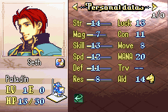

<a href="../../../index.html" class="icon icon-home">lt-maker</a>

Contents:

- <a href="../../home.html" class="reference internal">Lex Talionis
  Wiki</a>

Getting Started:

- <a href="../../getting_started/index.html"
  class="reference internal">Getting Started</a>

Editor Guides:

- <a href="../Editors-Overview.html" class="reference internal">Editors
  Overview</a>
- <a href="../index.html" class="reference internal">Editors</a>
  - <a href="../Editors-Overview.html" class="reference internal">Editors
    Overview</a>
  - <a href="../Level-Editor.html" class="reference internal">Level
    Editor</a>
  - <a href="../Overworld-Editor.html" class="reference internal">Overworld
    Editor</a>
  - <a href="../Event-Editor.html" class="reference internal">Event
    Editor</a>
  - <a href="index.html" class="reference internal">Database Editors</a>
    - <a href="Units-Editor.html" class="reference internal">Units Editor</a>
    - <a href="Teams-Editor.html" class="reference internal">Teams Editor</a>
    - <a href="Factions-Editor.html" class="reference internal">Factions
      Editor</a>
    - <a href="Party-Editor.html" class="reference internal">Party Editor</a>
    - <a href="Classes-Editor.html" class="reference internal">Classes
      Editor</a>
    - <a href="Tags-Editor.html" class="reference internal">Tags Editor</a>
    - <a href="Game-Vars-Editor.html" class="reference internal">Game Vars
      Editor</a>
    - <a href="Weapon-Types-Editor.html" class="reference internal">Weapon
      Types Editor</a>
    - <a href="Items-And-Skills-Editors.html" class="reference internal">Items
      And Skills Editors</a>
    - <a href="AI-Editor.html" class="reference internal">AI Editor</a>
    - <a href="Terrain-And-Movement-Costs-Editors.html"
      class="reference internal">Terrain and Movement Costs Editors</a>
    - <a href="Stats-Editor.html#" class="current reference internal">Stats
      Editor</a>
      - <a href="Stats-Editor.html#stat-bars" class="reference internal">Stat
        Bars</a>
    - <a href="Equations-Editor.html" class="reference internal">Equations
      Editor</a>
    - <a href="Constants-Editor.html" class="reference internal">Constants
      Editor</a>
    - <a href="Difficulty-Modes-Editor.html"
      class="reference internal">Difficulty Modes Editor</a>
    - <a href="Supports-Editor.html" class="reference internal">Supports
      Editor</a>
    - <a href="Lore-Editor.html" class="reference internal">Lore Editor</a>
    - <a href="Raw-Data-Editor.html" class="reference internal">Raw Data
      Editor</a>
    - <a href="Translations-Editor.html"
      class="reference internal">Translations Editor</a>
  - <a href="../resource-editors/index.html"
    class="reference internal">Resource Editors</a>

Events:

- <a href="../../events/index.html" class="reference internal">Events</a>

Guides:

- <a href="../../guides/Guides-Overview.html"
  class="reference internal">Guides Overview</a>
- <a href="../../guides/index.html" class="reference internal">Guides</a>

appendix:

- <a href="../../appendix/Text-Formatting-Commands.html"
  class="reference internal">Text Formatting Commands</a>
- <a href="../../appendix/Item-Component-Reference.html"
  class="reference internal">Item Component Dictionary</a>
- <a href="../../appendix/Skill-Component-Reference.html"
  class="reference internal">Skill Component Dictionary</a>
- <a href="../../appendix/Special-Variables.html"
  class="reference internal">Special Variables</a>
- <a href="../../appendix/Special-Tags.html"
  class="reference internal">Special Tags</a>
- <a href="../../appendix/trigger-reference.html"
  class="reference internal">Event Triggers</a>
- <a href="../../appendix/Random-Seed-Mechanics.html"
  class="reference internal">Random Seed Mechanics</a>
- <a href="../../appendix/FAQ.html" class="reference internal">Frequently
  Asked Questions</a>
- <a href="../../appendix/Contributing_to_the_LTWiki.html"
  class="reference internal">Contributing to the LTWiki</a>
- <a href="../../appendix/index.html" class="reference internal">Code
  Documentation</a>

[lt-maker](../../../index.html)

- 
- [Editors](../index.html)
- [Database Editors](index.html)
- Stats Editor
- <a
  href="https://gitlab.com/rainlash/lt-maker/blob/master/docs/source/editors/database-editors/Stats-Editor.md"
  class="fa fa-gitlab">Edit on GitLab</a>

------------------------------------------------------------------------

# Stats Editor<a href="Stats-Editor.html#stats-editor" class="headerlink"
title="Link to this heading"></a>

*last updated 2024-11-11*

## Stat Bars<a href="Stats-Editor.html#stat-bars" class="headerlink"
title="Link to this heading"></a>

In LT games, stat bars only display for stats on the left side of the
info menu, as shown below.

If you wish, for example, to have the stat bar for Luck display, the
stat must be moved to the left side of the display using the Position
dropdown in the editor. Alternatively, with sufficient engine knowledge
and python experience, you can change this behavior yourself by editing
the engine directly.

<a href="Terrain-And-Movement-Costs-Editors.html"
class="btn btn-neutral float-left" accesskey="p" rel="prev"
title="Terrain and Movement Costs Editors"> Previous</a>
<a href="Equations-Editor.html" class="btn btn-neutral float-right"
accesskey="n" rel="next" title="Equations Editor">Next </a>

------------------------------------------------------------------------

© Copyright 2024, rainlash.

Built with [Sphinx](https://www.sphinx-doc.org/) using a
[theme](https://github.com/readthedocs/sphinx_rtd_theme) provided by
[Read the Docs](https://readthedocs.org).

