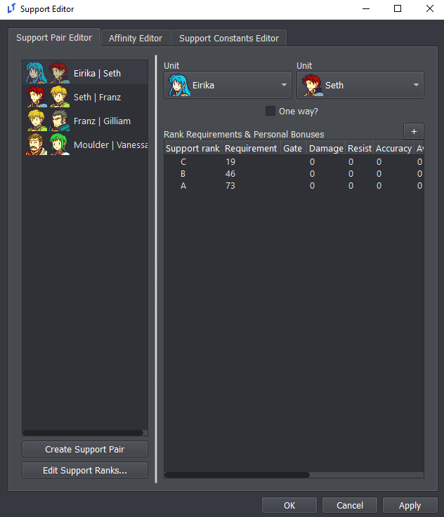
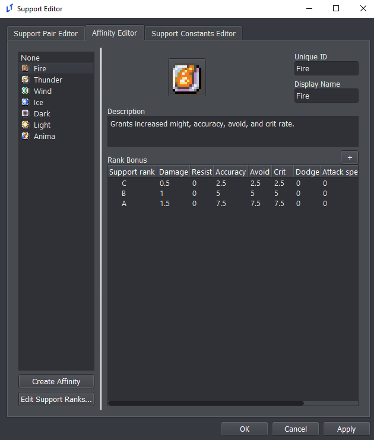
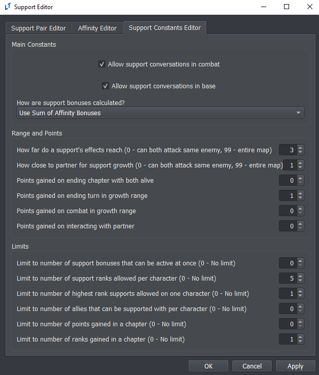
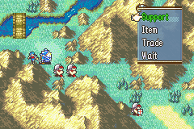

<a href="../../../index.html" class="icon icon-home">lt-maker</a>

Contents:

- <a href="../../home.html" class="reference internal">Lex Talionis
  Wiki</a>

Getting Started:

- <a href="../../getting_started/index.html"
  class="reference internal">Getting Started</a>

Editor Guides:

- <a href="../Editors-Overview.html" class="reference internal">Editors
  Overview</a>
- <a href="../index.html" class="reference internal">Editors</a>
  - <a href="../Editors-Overview.html" class="reference internal">Editors
    Overview</a>
  - <a href="../Level-Editor.html" class="reference internal">Level
    Editor</a>
  - <a href="../Overworld-Editor.html" class="reference internal">Overworld
    Editor</a>
  - <a href="../Event-Editor.html" class="reference internal">Event
    Editor</a>
  - <a href="index.html" class="reference internal">Database Editors</a>
    - <a href="Units-Editor.html" class="reference internal">Units Editor</a>
    - <a href="Teams-Editor.html" class="reference internal">Teams Editor</a>
    - <a href="Factions-Editor.html" class="reference internal">Factions
      Editor</a>
    - <a href="Party-Editor.html" class="reference internal">Party Editor</a>
    - <a href="Classes-Editor.html" class="reference internal">Classes
      Editor</a>
    - <a href="Tags-Editor.html" class="reference internal">Tags Editor</a>
    - <a href="Game-Vars-Editor.html" class="reference internal">Game Vars
      Editor</a>
    - <a href="Weapon-Types-Editor.html" class="reference internal">Weapon
      Types Editor</a>
    - <a href="Items-And-Skills-Editors.html" class="reference internal">Items
      And Skills Editors</a>
    - <a href="AI-Editor.html" class="reference internal">AI Editor</a>
    - <a href="Terrain-And-Movement-Costs-Editors.html"
      class="reference internal">Terrain and Movement Costs Editors</a>
    - <a href="Stats-Editor.html" class="reference internal">Stats Editor</a>
    - <a href="Equations-Editor.html" class="reference internal">Equations
      Editor</a>
    - <a href="Constants-Editor.html" class="reference internal">Constants
      Editor</a>
    - <a href="Difficulty-Modes-Editor.html"
      class="reference internal">Difficulty Modes Editor</a>
    - <a href="Supports-Editor.html#"
      class="current reference internal">Supports Editor</a>
      - <a href="Supports-Editor.html#enabling-supports"
        class="reference internal">Enabling Supports</a>
      - <a href="Supports-Editor.html#configuring-supports"
        class="reference internal">Configuring Supports</a>
      - <a href="Supports-Editor.html#support-conversations"
        class="reference internal">Support Conversations</a>
    - <a href="Lore-Editor.html" class="reference internal">Lore Editor</a>
    - <a href="Raw-Data-Editor.html" class="reference internal">Raw Data
      Editor</a>
    - <a href="Translations-Editor.html"
      class="reference internal">Translations Editor</a>
  - <a href="../resource-editors/index.html"
    class="reference internal">Resource Editors</a>

Events:

- <a href="../../events/index.html" class="reference internal">Events</a>

Guides:

- <a href="../../guides/Guides-Overview.html"
  class="reference internal">Guides Overview</a>
- <a href="../../guides/index.html" class="reference internal">Guides</a>

appendix:

- <a href="../../appendix/Text-Formatting-Commands.html"
  class="reference internal">Text Formatting Commands</a>
- <a href="../../appendix/Item-Component-Reference.html"
  class="reference internal">Item Component Dictionary</a>
- <a href="../../appendix/Skill-Component-Reference.html"
  class="reference internal">Skill Component Dictionary</a>
- <a href="../../appendix/Special-Variables.html"
  class="reference internal">Special Variables</a>
- <a href="../../appendix/Special-Tags.html"
  class="reference internal">Special Tags</a>
- <a href="../../appendix/trigger-reference.html"
  class="reference internal">Event Triggers</a>
- <a href="../../appendix/Random-Seed-Mechanics.html"
  class="reference internal">Random Seed Mechanics</a>
- <a href="../../appendix/FAQ.html" class="reference internal">Frequently
  Asked Questions</a>
- <a href="../../appendix/Contributing_to_the_LTWiki.html"
  class="reference internal">Contributing to the LTWiki</a>
- <a href="../../appendix/index.html" class="reference internal">Code
  Documentation</a>

[lt-maker](../../../index.html)

- 
- [Editors](../index.html)
- [Database Editors](index.html)
- Supports Editor
- <a
  href="https://gitlab.com/rainlash/lt-maker/blob/master/docs/source/editors/database-editors/Supports-Editor.md"
  class="fa fa-gitlab">Edit on GitLab</a>

------------------------------------------------------------------------

# Supports Editor<a href="Supports-Editor.html#supports-editor" class="headerlink"
title="Link to this heading"></a>

*Authored by Beccarte* *last updated 2023-02-27*

## Enabling Supports<a href="Supports-Editor.html#enabling-supports" class="headerlink"
title="Link to this heading"></a>

To enable supports, go the Constants editor and make sure **support** is
checked.

In-game, support points will not accumulate until you enable the game
variable **\_supports** in an event script:

`game_var;_supports;True`

This is useful if, for example, you don’t want support points to be
awarded until a specific point in the game. This variable only needs to
be set once unless you wish to disable supports again later on.

## Configuring Supports<a href="Supports-Editor.html#configuring-supports" class="headerlink"
title="Link to this heading"></a>

Open the Supports editor from the main menu.

1.  Support Pair Editor

This tab allows you to define supports between pairs of units (left) as
well as set rank requirements and specific support bonuses (right).
First, create/select a support pair on the left, and right-click the
panel on the right to create a new support rank. Each support rank can
be assigned the following properties:

**ID**: this is used elsewhere to reference the support rank.
**Requirement**: support points needed to unlock this rank. **Gate**: if
this is not empty, this rank is locked until a game variable with a name
matching the entered text is set to **True**. **Stats**: the remaining
fields are stat changes that are applied when this support rank is
unlocked.

Note that the stat changes are not cumulative, so changes from
previously unlocked ranks will be overridden. These stat bonuses are
applied on top of the bonuses from the units’ affinities (if any), which
are described in the next section.

2.  Affinity Editor

In the GBA Fire Emblem titles, each unit has an affinity that helps
determine the stat bonuses conferred by that unit’s support ranks. This
editor tab defines the different affinities (left) and their statistical
effects (right). Like in the Support Pair Editor, each affinity can have
multiple ranks specified on the right-hand panel. The IDs for these
support ranks should match the rank IDs in the Support Pair Editor.

Each affinity defines it’s own set of stat bonuses at each support
level. These bonuses are NOT cumulative. Each row is taken individually,
so you could easily do things like have negative bonuses for a middle
support conversation (before the characters inevitably make up).

3.  Support Constants Editor

This tab controls how the support system behaves. The top box (Main
Constants) determines when support conversations can take place, what
happens when a support partner dies, and how stat bonuses from the
Affinity Editor are calculated. Note that the stat calculation mode
defined here has no effect on the pair-specific stat bonuses in the
Support Pair Editor.

The center box (Range and Points) determines where and how support
points are gained. This includes limits on how close the support
partners must be to one another and whether they must interact. For
example, in the GBA games support points are gained each turn by units
standing near one another. In contrast, Radiant Dawn grants a single
support point if both units are deployed in a chapter and survive. If
you opt for the latter type of system, make sure the number of points
required for each rank in the Support Pair Editor is realistic.

## Support Conversations<a href="Supports-Editor.html#support-conversations" class="headerlink"
title="Link to this heading"></a>

In order for units to gain support points with one another, they must do
the actions you specified in the Support Constants editor. This could be
waiting next to one another, interacting with one another, or just being
deployed in the same chapter together.

When two units that are capable of supporting each other gain enough
points to unlock a new support rank, they’ll be able to select the
“Support” action from the menu. This action fires the
`on_support` event trigger.

Support conversations themselves are very similar to Talk conversations
in overall structure. Create an event with the
`on_support` trigger. In the script, you can
use `unit` and `unit2`
to reference the units that are in the support conversation, and
`support_rank_nid` is the ID of the support
rank.

So if you wanted an event to show when Eirika and Seth have their C
support, your condition for that event would be:

`check_pair('Seth',`` ``'Eirika')`` ``and`` ``support_rank_nid`` ``==`` ``'C'`

<a href="Difficulty-Modes-Editor.html"
class="btn btn-neutral float-left" accesskey="p" rel="prev"
title="Difficulty Modes Editor"> Previous</a>
<a href="Lore-Editor.html" class="btn btn-neutral float-right"
accesskey="n" rel="next" title="Lore Editor">Next </a>

------------------------------------------------------------------------

© Copyright 2024, rainlash.

Built with [Sphinx](https://www.sphinx-doc.org/) using a
[theme](https://github.com/readthedocs/sphinx_rtd_theme) provided by
[Read the Docs](https://readthedocs.org).

