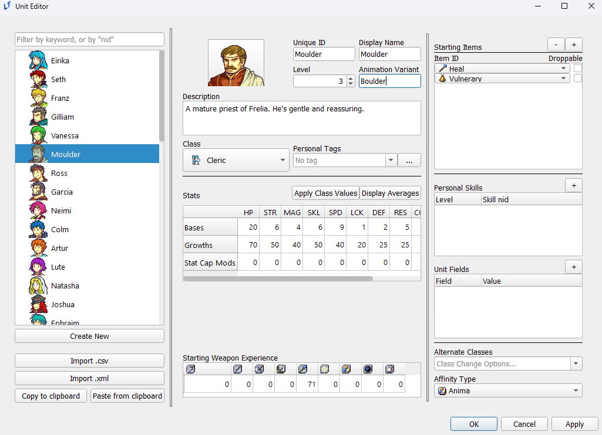
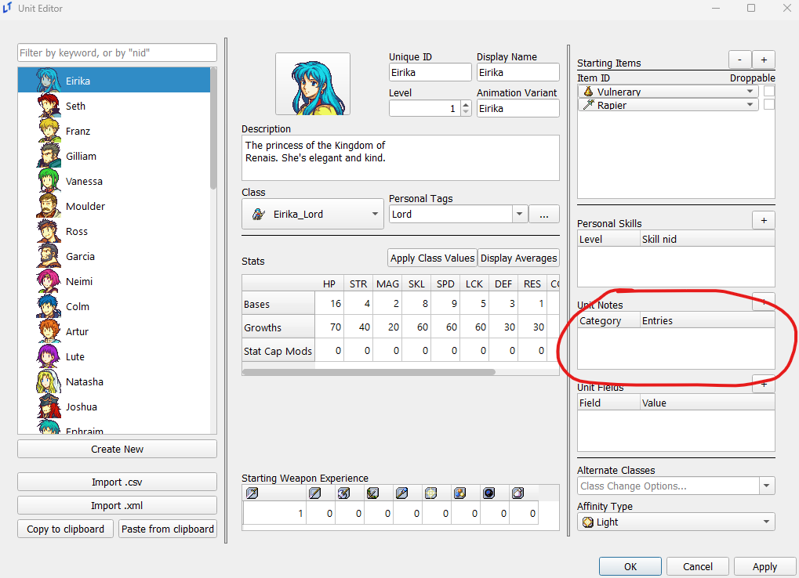
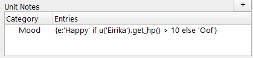
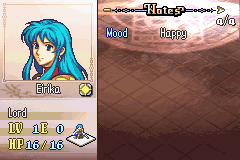

<a href="../../../index.html" class="icon icon-home">lt-maker</a>

Contents:

- <a href="../../home.html" class="reference internal">Lex Talionis
  Wiki</a>

Getting Started:

- <a href="../../getting_started/index.html"
  class="reference internal">Getting Started</a>

Editor Guides:

- <a href="../Editors-Overview.html" class="reference internal">Editors
  Overview</a>
- <a href="../index.html" class="reference internal">Editors</a>
  - <a href="../Editors-Overview.html" class="reference internal">Editors
    Overview</a>
  - <a href="../Level-Editor.html" class="reference internal">Level
    Editor</a>
  - <a href="../Overworld-Editor.html" class="reference internal">Overworld
    Editor</a>
  - <a href="../Event-Editor.html" class="reference internal">Event
    Editor</a>
  - <a href="index.html" class="reference internal">Database Editors</a>
    - <a href="Units-Editor.html#" class="current reference internal">Units
      Editor</a>
      - <a href="Units-Editor.html#animation-variants"
        class="reference internal">Animation Variants</a>
      - <a href="Units-Editor.html#unit-notes" class="reference internal">Unit
        Notes</a>
      - <a href="Units-Editor.html#unit-fields" class="reference internal">Unit
        Fields</a>
    - <a href="Teams-Editor.html" class="reference internal">Teams Editor</a>
    - <a href="Factions-Editor.html" class="reference internal">Factions
      Editor</a>
    - <a href="Party-Editor.html" class="reference internal">Party Editor</a>
    - <a href="Classes-Editor.html" class="reference internal">Classes
      Editor</a>
    - <a href="Tags-Editor.html" class="reference internal">Tags Editor</a>
    - <a href="Game-Vars-Editor.html" class="reference internal">Game Vars
      Editor</a>
    - <a href="Weapon-Types-Editor.html" class="reference internal">Weapon
      Types Editor</a>
    - <a href="Items-And-Skills-Editors.html" class="reference internal">Items
      And Skills Editors</a>
    - <a href="AI-Editor.html" class="reference internal">AI Editor</a>
    - <a href="Terrain-And-Movement-Costs-Editors.html"
      class="reference internal">Terrain and Movement Costs Editors</a>
    - <a href="Stats-Editor.html" class="reference internal">Stats Editor</a>
    - <a href="Equations-Editor.html" class="reference internal">Equations
      Editor</a>
    - <a href="Constants-Editor.html" class="reference internal">Constants
      Editor</a>
    - <a href="Difficulty-Modes-Editor.html"
      class="reference internal">Difficulty Modes Editor</a>
    - <a href="Supports-Editor.html" class="reference internal">Supports
      Editor</a>
    - <a href="Lore-Editor.html" class="reference internal">Lore Editor</a>
    - <a href="Raw-Data-Editor.html" class="reference internal">Raw Data
      Editor</a>
    - <a href="Translations-Editor.html"
      class="reference internal">Translations Editor</a>
  - <a href="../resource-editors/index.html"
    class="reference internal">Resource Editors</a>

Events:

- <a href="../../events/index.html" class="reference internal">Events</a>

Guides:

- <a href="../../guides/Guides-Overview.html"
  class="reference internal">Guides Overview</a>
- <a href="../../guides/index.html" class="reference internal">Guides</a>

appendix:

- <a href="../../appendix/Text-Formatting-Commands.html"
  class="reference internal">Text Formatting Commands</a>
- <a href="../../appendix/Item-Component-Reference.html"
  class="reference internal">Item Component Dictionary</a>
- <a href="../../appendix/Skill-Component-Reference.html"
  class="reference internal">Skill Component Dictionary</a>
- <a href="../../appendix/Special-Variables.html"
  class="reference internal">Special Variables</a>
- <a href="../../appendix/Special-Tags.html"
  class="reference internal">Special Tags</a>
- <a href="../../appendix/trigger-reference.html"
  class="reference internal">Event Triggers</a>
- <a href="../../appendix/Random-Seed-Mechanics.html"
  class="reference internal">Random Seed Mechanics</a>
- <a href="../../appendix/FAQ.html" class="reference internal">Frequently
  Asked Questions</a>
- <a href="../../appendix/Contributing_to_the_LTWiki.html"
  class="reference internal">Contributing to the LTWiki</a>
- <a href="../../appendix/index.html" class="reference internal">Code
  Documentation</a>

[lt-maker](../../../index.html)

- 
- [Editors](../index.html)
- [Database Editors](index.html)
- Units Editor
- <a
  href="https://gitlab.com/rainlash/lt-maker/blob/master/docs/source/editors/database-editors/Units-Editor.md"
  class="fa fa-gitlab">Edit on GitLab</a>

------------------------------------------------------------------------

# Units Editor<a href="Units-Editor.html#units-editor" class="headerlink"
title="Link to this heading"></a>

*last updated 2024-11-11*

## Animation Variants<a href="Units-Editor.html#animation-variants" class="headerlink"
title="Link to this heading"></a>

The Animation Variant field in the unit editor allows a specific unit to
use an alternate animation for their class, removing the need to create
an additional copy of a class for a specific unit solely for the
purposes of a bespoke animation.

The animation used will be whichever animation bears **the name of the
animation used by the unit’s class, followed immediately by the text in
this field**. For example, in the below example, we’ll assign Moulder
the `Boulder` variant.

If the name of the animation used by Moulder’s current class is
`Priest`, this will cause Moulder to instead
use the animation named `PriestBoulder`. This
applies to class changes as well; upon promoting to Bishop, if the
Bishop uses an animation named `Bishop`,
Moulder would then use the `BishopBoulder`
animation.

## Unit Notes<a href="Units-Editor.html#unit-notes" class="headerlink"
title="Link to this heading"></a>

By default, you may find the below section of your unit editor missing:

Unit notes are only displayed in the editor upon checking off the
`Unit`` ``Notes`
checkbox in the constants editor. Unit notes are displayed on the fourth
page of your info menu, again only visible when this constant is enabled
and unit notes are present. This is what is used for “Likes and
Dislikes” in many hacks, although any text can be entered here.

You can also perform evals in unit notes, like so:

## Unit Fields<a href="Units-Editor.html#unit-fields" class="headerlink"
title="Link to this heading"></a>

You can attach data to a specific unit in the form of strings via unit
fields. The average FEGBA-adjacent project will not require these, but
they can be used to assist with a variety of special game features, such
as Genealogy-style personal funds.

There are various event commands to update and remove unit fields, and
unit fields can be accessed via python expression with
`UNIT.get_field(KEY)`, where UNIT is the unit
object itself, and KEY is a string that matches the field name (whatever
is in ‘Field’ in the editor).

<a href="index.html" class="btn btn-neutral float-left" accesskey="p"
rel="prev" title="Database Editors"> Previous</a>
<a href="Teams-Editor.html" class="btn btn-neutral float-right"
accesskey="n" rel="next" title="Teams Editor">Next </a>

------------------------------------------------------------------------

© Copyright 2024, rainlash.

Built with [Sphinx](https://www.sphinx-doc.org/) using a
[theme](https://github.com/readthedocs/sphinx_rtd_theme) provided by
[Read the Docs](https://readthedocs.org).

