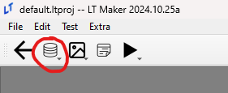
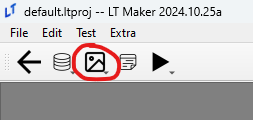

<a href="../../index.html" class="icon icon-home">lt-maker</a>

Contents:

- <a href="../home.html" class="reference internal">Lex Talionis Wiki</a>

Getting Started:

- <a href="../getting_started/index.html"
  class="reference internal">Getting Started</a>

Editor Guides:

- <a href="Editors-Overview.html" class="reference internal">Editors
  Overview</a>
- <a href="index.html#" class="current reference internal">Editors</a>
  - <a href="Editors-Overview.html" class="reference internal">Editors
    Overview</a>
  - <a href="Level-Editor.html" class="reference internal">Level Editor</a>
  - <a href="Overworld-Editor.html" class="reference internal">Overworld
    Editor</a>
  - <a href="Event-Editor.html" class="reference internal">Event Editor</a>
  - <a href="database-editors/index.html"
    class="reference internal">Database Editors</a>
  - <a href="resource-editors/index.html"
    class="reference internal">Resource Editors</a>

Events:

- <a href="../events/index.html" class="reference internal">Events</a>

Guides:

- <a href="../guides/Guides-Overview.html"
  class="reference internal">Guides Overview</a>
- <a href="../guides/index.html" class="reference internal">Guides</a>

appendix:

- <a href="../appendix/Text-Formatting-Commands.html"
  class="reference internal">Text Formatting Commands</a>
- <a href="../appendix/Item-Component-Reference.html"
  class="reference internal">Item Component Dictionary</a>
- <a href="../appendix/Skill-Component-Reference.html"
  class="reference internal">Skill Component Dictionary</a>
- <a href="../appendix/Special-Variables.html"
  class="reference internal">Special Variables</a>
- <a href="../appendix/Special-Tags.html"
  class="reference internal">Special Tags</a>
- <a href="../appendix/trigger-reference.html"
  class="reference internal">Event Triggers</a>
- <a href="../appendix/Random-Seed-Mechanics.html"
  class="reference internal">Random Seed Mechanics</a>
- <a href="../appendix/FAQ.html" class="reference internal">Frequently
  Asked Questions</a>
- <a href="../appendix/Contributing_to_the_LTWiki.html"
  class="reference internal">Contributing to the LTWiki</a>
- <a href="../appendix/index.html" class="reference internal">Code
  Documentation</a>

[lt-maker](../../index.html)

- 
- Editors
- <a
  href="https://gitlab.com/rainlash/lt-maker/blob/master/docs/source/editors/index.rst"
  class="fa fa-gitlab">Edit on GitLab</a>

------------------------------------------------------------------------

# Editors<a href="index.html#editors" class="headerlink"
title="Link to this heading"></a>

These pages will contain details pertaining to individual editors.

Contents

- <a href="Editors-Overview.html" class="reference internal">Editors
  Overview</a>
- <a href="Level-Editor.html" class="reference internal">Level Editor</a>
  - <a href="Level-Editor.html#level-music" class="reference internal">Level
    Music</a>
  - <a href="Level-Editor.html#display-formatting"
    class="reference internal">Display Formatting</a>
  - <a href="Level-Editor.html#formations-and-deployment"
    class="reference internal">Formations and Deployment</a>
  - <a href="Level-Editor.html#ai-groups" class="reference internal">AI
    Groups</a>
- <a href="Overworld-Editor.html" class="reference internal">Overworld
  Editor</a>
  - <a href="Overworld-Editor.html#overworld-editor-location-and-usage"
    class="reference internal">Overworld Editor Location and Usage</a>
  - <a href="Overworld-Editor.html#eventing-the-overworld"
    class="reference internal">Eventing the Overworld</a>
  - <a href="Overworld-Editor.html#overworld-nodes"
    class="reference internal">Overworld Nodes</a>
- <a href="Event-Editor.html" class="reference internal">Event Editor</a>

Database Editors (found in above)

- <a href="database-editors/index.html"
  class="reference internal">Database Editors</a>
  - <a href="database-editors/Units-Editor.html"
    class="reference internal">Units Editor</a>
  - <a href="database-editors/Teams-Editor.html"
    class="reference internal">Teams Editor</a>
  - <a href="database-editors/Factions-Editor.html"
    class="reference internal">Factions Editor</a>
  - <a href="database-editors/Party-Editor.html"
    class="reference internal">Party Editor</a>
  - <a href="database-editors/Classes-Editor.html"
    class="reference internal">Classes Editor</a>
  - <a href="database-editors/Tags-Editor.html"
    class="reference internal">Tags Editor</a>
  - <a href="database-editors/Game-Vars-Editor.html"
    class="reference internal">Game Vars Editor</a>
  - <a href="database-editors/Weapon-Types-Editor.html"
    class="reference internal">Weapon Types Editor</a>
  - <a href="database-editors/Items-And-Skills-Editors.html"
    class="reference internal">Items And Skills Editors</a>
  - <a href="database-editors/AI-Editor.html" class="reference internal">AI
    Editor</a>
  - <a href="database-editors/Terrain-And-Movement-Costs-Editors.html"
    class="reference internal">Terrain and Movement Costs Editors</a>
  - <a href="database-editors/Stats-Editor.html"
    class="reference internal">Stats Editor</a>
  - <a href="database-editors/Equations-Editor.html"
    class="reference internal">Equations Editor</a>
  - <a href="database-editors/Constants-Editor.html"
    class="reference internal">Constants Editor</a>
  - <a href="database-editors/Difficulty-Modes-Editor.html"
    class="reference internal">Difficulty Modes Editor</a>
  - <a href="database-editors/Supports-Editor.html"
    class="reference internal">Supports Editor</a>
  - <a href="database-editors/Lore-Editor.html"
    class="reference internal">Lore Editor</a>
  - <a href="database-editors/Raw-Data-Editor.html"
    class="reference internal">Raw Data Editor</a>
  - <a href="database-editors/Translations-Editor.html"
    class="reference internal">Translations Editor</a>

Resource Editors (found in above)

- <a href="resource-editors/index.html"
  class="reference internal">Resource Editors</a>
  - <a href="resource-editors/Icons-Editor.html"
    class="reference internal">Icons Editor</a>
  - <a href="resource-editors/Portraits-Editor.html"
    class="reference internal">Portraits Editor</a>
  - <a href="resource-editors/Map-Animations-Editor.html"
    class="reference internal">Map Animations Editor</a>
  - <a href="resource-editors/Backgrounds-Editor.html"
    class="reference internal">Backgrounds Editor</a>
  - <a href="resource-editors/Map-Sprites-Editor.html"
    class="reference internal">Map Sprites Editor</a>
  - <a href="resource-editors/Combat-Animations-Editor.html"
    class="reference internal">Combat Animations Editor</a>
  - <a href="resource-editors/Tilemaps-Editor.html"
    class="reference internal">Tilemaps Editor</a>
  - <a href="resource-editors/Sounds-Editor.html"
    class="reference internal">Sounds Editor</a>

<a href="Editors-Overview.html" class="btn btn-neutral float-left"
accesskey="p" rel="prev" title="Editors Overview"> Previous</a>
<a href="Level-Editor.html" class="btn btn-neutral float-right"
accesskey="n" rel="next" title="Level Editor">Next </a>

------------------------------------------------------------------------

© Copyright 2024, rainlash.

Built with [Sphinx](https://www.sphinx-doc.org/) using a
[theme](https://github.com/readthedocs/sphinx_rtd_theme) provided by
[Read the Docs](https://readthedocs.org).

