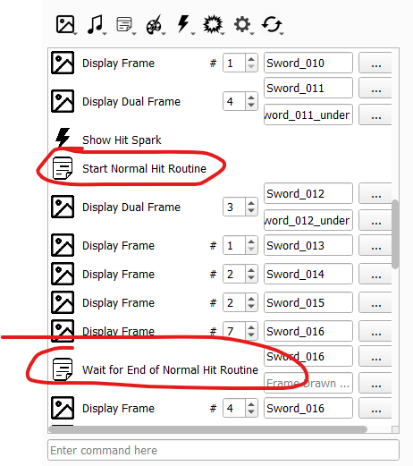
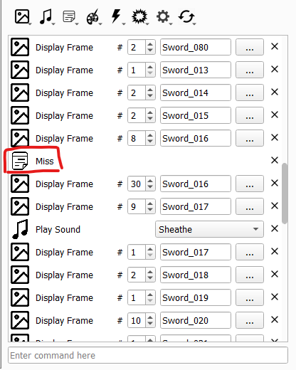
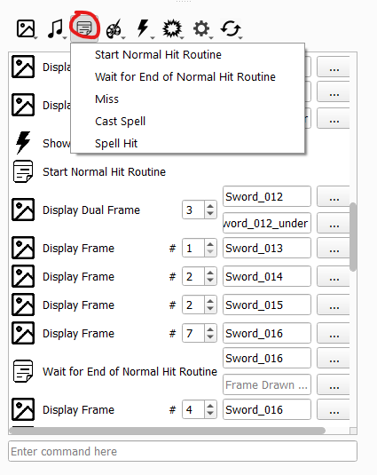

<a href="../../../index.html" class="icon icon-home">lt-maker</a>

Contents:

- <a href="../../home.html" class="reference internal">Lex Talionis
  Wiki</a>

Getting Started:

- <a href="../../getting_started/index.html"
  class="reference internal">Getting Started</a>

Editor Guides:

- <a href="../Editors-Overview.html" class="reference internal">Editors
  Overview</a>
- <a href="../index.html" class="reference internal">Editors</a>
  - <a href="../Editors-Overview.html" class="reference internal">Editors
    Overview</a>
  - <a href="../Level-Editor.html" class="reference internal">Level
    Editor</a>
  - <a href="../Overworld-Editor.html" class="reference internal">Overworld
    Editor</a>
  - <a href="../Event-Editor.html" class="reference internal">Event
    Editor</a>
  - <a href="../database-editors/index.html"
    class="reference internal">Database Editors</a>
  - <a href="index.html" class="reference internal">Resource Editors</a>
    - <a href="Icons-Editor.html" class="reference internal">Icons Editor</a>
    - <a href="Portraits-Editor.html" class="reference internal">Portraits
      Editor</a>
    - <a href="Map-Animations-Editor.html" class="reference internal">Map
      Animations Editor</a>
    - <a href="Backgrounds-Editor.html" class="reference internal">Backgrounds
      Editor</a>
    - <a href="Map-Sprites-Editor.html" class="reference internal">Map Sprites
      Editor</a>
    - <a href="Combat-Animations-Editor.html#"
      class="current reference internal">Combat Animations Editor</a>
      - <a href="Combat-Animations-Editor.html#common-issues"
        class="reference internal">Common Issues</a>
    - <a href="Tilemaps-Editor.html" class="reference internal">Tilemaps
      Editor</a>
    - <a href="Sounds-Editor.html" class="reference internal">Sounds
      Editor</a>

Events:

- <a href="../../events/index.html" class="reference internal">Events</a>

Guides:

- <a href="../../guides/Guides-Overview.html"
  class="reference internal">Guides Overview</a>
- <a href="../../guides/index.html" class="reference internal">Guides</a>

appendix:

- <a href="../../appendix/Text-Formatting-Commands.html"
  class="reference internal">Text Formatting Commands</a>
- <a href="../../appendix/Item-Component-Reference.html"
  class="reference internal">Item Component Dictionary</a>
- <a href="../../appendix/Skill-Component-Reference.html"
  class="reference internal">Skill Component Dictionary</a>
- <a href="../../appendix/Special-Variables.html"
  class="reference internal">Special Variables</a>
- <a href="../../appendix/Special-Tags.html"
  class="reference internal">Special Tags</a>
- <a href="../../appendix/trigger-reference.html"
  class="reference internal">Event Triggers</a>
- <a href="../../appendix/Random-Seed-Mechanics.html"
  class="reference internal">Random Seed Mechanics</a>
- <a href="../../appendix/FAQ.html" class="reference internal">Frequently
  Asked Questions</a>
- <a href="../../appendix/Contributing_to_the_LTWiki.html"
  class="reference internal">Contributing to the LTWiki</a>
- <a href="../../appendix/index.html" class="reference internal">Code
  Documentation</a>

[lt-maker](../../../index.html)

- 
- [Editors](../index.html)
- [Resource Editors](index.html)
- Combat Animations Editor
- <a
  href="https://gitlab.com/rainlash/lt-maker/blob/master/docs/source/editors/resource-editors/Combat-Animations-Editor.md"
  class="fa fa-gitlab">Edit on GitLab</a>

------------------------------------------------------------------------

# Combat Animations Editor<a href="Combat-Animations-Editor.html#combat-animations-editor"
class="headerlink" title="Link to this heading"></a>

*last updated 2024-11-13*

## Common Issues<a href="Combat-Animations-Editor.html#common-issues" class="headerlink"
title="Link to this heading"></a>

### Attack/Miss Import Issue<a href="Combat-Animations-Editor.html#attack-miss-import-issue"
class="headerlink" title="Link to this heading"></a>

Occasionally, a battle animation will cause your game to crash right
before hitting. Check to make sure that the animation’s
`Attack` and
`Critical` poses both start and stop the hit
routine, as below.

Alternatively, the `Miss` pose will either be
missing the miss routine, or erroneously have the start and/or stop hit
routine. Ensure it *only* has the miss routine, as seen below.

If hit/miss instructions are incorrect or missing, add them in at the
appropriate locations through the below dropdown.

### Missing Spell<a href="Combat-Animations-Editor.html#missing-spell" class="headerlink"
title="Link to this heading"></a>

If a battle animation is not playing (it defaults to map animation
despite a battle animation being set for the unit/class), it is
generally an issue fetching the spell effect for that animation.

If the battle animation is *not supposed* to use a battle cast animation
(such as for a melee weapon), ensure that the animation does *not* have
the `Cast`` ``Spell`
instruction.

If the battle animation *is* supposed to use a specific battle cast
animation, as in the case of magic tomes, check to make sure that the
item the unit is using has a valid
`Battle`` ``Cast`` ``Anim`
component.

If the battle animation is supposed to use a generic battle cast
animation, such as all bows using arrows, ensure that the effect
referenced in the
`Cast`` ``Spell`
instruction of the animation is present in the Combat Effect tab and is
not set to `None`.

<a href="Map-Sprites-Editor.html" class="btn btn-neutral float-left"
accesskey="p" rel="prev" title="Map Sprites Editor"> Previous</a>
<a href="Tilemaps-Editor.html" class="btn btn-neutral float-right"
accesskey="n" rel="next" title="Tilemaps Editor">Next </a>

------------------------------------------------------------------------

© Copyright 2024, rainlash.

Built with [Sphinx](https://www.sphinx-doc.org/) using a
[theme](https://github.com/readthedocs/sphinx_rtd_theme) provided by
[Read the Docs](https://readthedocs.org).

