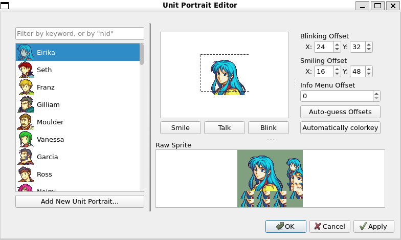
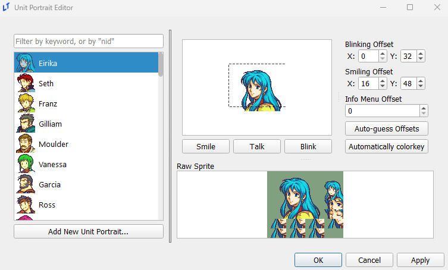
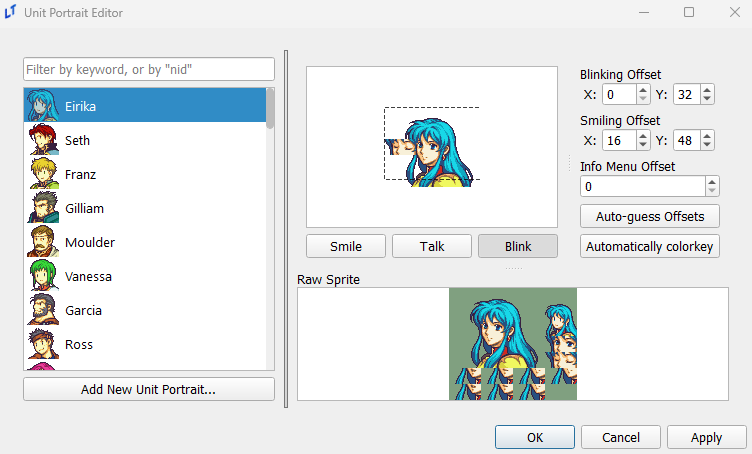

<a href="../../../index.html" class="icon icon-home">lt-maker</a>

Contents:

- <a href="../../home.html" class="reference internal">Lex Talionis
  Wiki</a>

Getting Started:

- <a href="../../getting_started/index.html"
  class="reference internal">Getting Started</a>

Editor Guides:

- <a href="../Editors-Overview.html" class="reference internal">Editors
  Overview</a>
- <a href="../index.html" class="reference internal">Editors</a>
  - <a href="../Editors-Overview.html" class="reference internal">Editors
    Overview</a>
  - <a href="../Level-Editor.html" class="reference internal">Level
    Editor</a>
  - <a href="../Overworld-Editor.html" class="reference internal">Overworld
    Editor</a>
  - <a href="../Event-Editor.html" class="reference internal">Event
    Editor</a>
  - <a href="../database-editors/index.html"
    class="reference internal">Database Editors</a>
  - <a href="index.html" class="reference internal">Resource Editors</a>
    - <a href="Icons-Editor.html" class="reference internal">Icons Editor</a>
    - <a href="Portraits-Editor.html#"
      class="current reference internal">Portraits Editor</a>
      - <a href="Portraits-Editor.html#adding-new-portraits"
        class="reference internal">Adding New Portraits</a>
      - <a href="Portraits-Editor.html#adding-a-new-portrait"
        class="reference internal">Adding a New Portrait</a>
      - <a href="Portraits-Editor.html#modifying-existing-portraits"
        class="reference internal">Modifying Existing Portraits</a>
      - <a href="Portraits-Editor.html#editor-features"
        class="reference internal">Editor Features</a>
      - <a href="Portraits-Editor.html#misc" class="reference internal">Misc</a>
    - <a href="Map-Animations-Editor.html" class="reference internal">Map
      Animations Editor</a>
    - <a href="Backgrounds-Editor.html" class="reference internal">Backgrounds
      Editor</a>
    - <a href="Map-Sprites-Editor.html" class="reference internal">Map Sprites
      Editor</a>
    - <a href="Combat-Animations-Editor.html"
      class="reference internal">Combat Animations Editor</a>
    - <a href="Tilemaps-Editor.html" class="reference internal">Tilemaps
      Editor</a>
    - <a href="Sounds-Editor.html" class="reference internal">Sounds
      Editor</a>

Events:

- <a href="../../events/index.html" class="reference internal">Events</a>

Guides:

- <a href="../../guides/Guides-Overview.html"
  class="reference internal">Guides Overview</a>
- <a href="../../guides/index.html" class="reference internal">Guides</a>

appendix:

- <a href="../../appendix/Text-Formatting-Commands.html"
  class="reference internal">Text Formatting Commands</a>
- <a href="../../appendix/Item-Component-Reference.html"
  class="reference internal">Item Component Dictionary</a>
- <a href="../../appendix/Skill-Component-Reference.html"
  class="reference internal">Skill Component Dictionary</a>
- <a href="../../appendix/Special-Variables.html"
  class="reference internal">Special Variables</a>
- <a href="../../appendix/Special-Tags.html"
  class="reference internal">Special Tags</a>
- <a href="../../appendix/trigger-reference.html"
  class="reference internal">Event Triggers</a>
- <a href="../../appendix/Random-Seed-Mechanics.html"
  class="reference internal">Random Seed Mechanics</a>
- <a href="../../appendix/FAQ.html" class="reference internal">Frequently
  Asked Questions</a>
- <a href="../../appendix/Contributing_to_the_LTWiki.html"
  class="reference internal">Contributing to the LTWiki</a>
- <a href="../../appendix/index.html" class="reference internal">Code
  Documentation</a>

[lt-maker](../../../index.html)

- 
- [Editors](../index.html)
- [Resource Editors](index.html)
- Portraits Editor
- <a
  href="https://gitlab.com/rainlash/lt-maker/blob/master/docs/source/editors/resource-editors/Portraits-Editor.md"
  class="fa fa-gitlab">Edit on GitLab</a>

------------------------------------------------------------------------

# Portraits Editor<a href="Portraits-Editor.html#portraits-editor" class="headerlink"
title="Link to this heading"></a>

*last updated 2025-04-20*

The Portraits Editor lets you add or modify portraits that can be used
for characters in the engine.

## Adding New Portraits<a href="Portraits-Editor.html#adding-new-portraits" class="headerlink"
title="Link to this heading"></a>

Portraits are imported as PNGs in a single sprite sheet. The **Raw
Sprite** preview section on the bottom right of the Portrait Editor
shows the format that the editor expects a portrait to be in. There are
a few components to the portrait format.

**Dimensions**: The editor expects sprite sheets to be 128x112 pixels.

**Background Color**: The editor wants the background color to be the
`#80a080` hex code shade of green. This is a
very specific color that the engine is set to ignore, allowing for a
transparent background in game. The editor will try to force the
background color of your imported sprite sheet to be green.

**Sections**: The image below specifies the sections expected in the
sprite sheet. There is some extra unused space at the top and bottom
right that is in the shade `#80a080`. There are
11 sections in the portrait sprite sheet, these are separated more
generally into: face, minimug, eyes, and mouth sections. The mouth
sections are split into smile frame A-C, neutral frame A-C and status
screen frame. The eye sections are split into blinking frame A-B. These
frames are overlaid onto the face to create talking and blinking
animations.

Make sure your portraits are in this specific format before you add it
to the editor. Feel free to download the above image to use as a
template for creating sprite sheets.

## Adding a New Portrait<a href="Portraits-Editor.html#adding-a-new-portrait" class="headerlink"
title="Link to this heading"></a>

You can add new portraits by clicking the
`Add`` ``New`` ``Unit`` ``Portrait...`
button. This will bring up a window for you to navigate to your PNG
sprite sheet to import it into the editor.

After importing, the editor will run two automatic steps. If the
portrait sprite sheet is given in the correct format as described above,
the editor will automatically try to place the mouth and eye frames on
the face based on image similarity. If the editor fails to find a
matching location the mouth and eye frames will be placed in the top
left. The editor will also automatically recolor the background of the
portrait sprite sheet to be `#80a080` based on
the background color of the face section.

The editor *will not* initially make a copy of the file you import. This
means that the automatic colorkey algorithm may modify the colors in the
file you import. If that is something you care about make a copy of the
portrait sprite and import the copy instead. Once you save your project
the editor will create a copy of the portrait inside of your project.

## Modifying Existing Portraits<a href="Portraits-Editor.html#modifying-existing-portraits"
class="headerlink" title="Link to this heading"></a>

Editing existing portraits is as easy as opening the PNG file associated
with each portrait imported into the editor in the image manipulation
software of your choice and editing it. The already imported portraits
can be found under
`your_project.ltproj/resources/portraits/`. You
can then click on the portrait in the editor and edit the extra
settings.

## Editor Features<a href="Portraits-Editor.html#editor-features" class="headerlink"
title="Link to this heading"></a>

The editor has a few extra features that are available for use after
importing the portrait sprite sheet. To show what they do this guide
will import the above portrait format image into the editor as a
demonstration.

You will notice that after importing the portrait sprite sheet into the
editor the background on the face section has automatically been changed
to `#80a080`. This is a feature of the editor
to make importing sprite sheets from other engines that expect a
different color background to be a slightly smoother process. If this
feature of the editor created any problems for you refer to the
<a href="Portraits-Editor.html#modifying-existing-portraits"
class="reference internal">Modifying Existing Portraits</a> section. The
editor will also automatically try to place the mouth and eye frames on
the face based on image similarity. If the editor fails to find a
matching location the mouth and eye frames will be placed in the top
left.

The
`Portrait`` ``Selector`
section of the editor on the left, you can see the minimug section is
previewed as the unit icon.

In the
`Portrait`` ``Preview`
section of the editor on the right, you can see that the editor has
overlaid the neutral frame A section of the portrait sprite sheet onto
the face section. The background is also transparent as the background
has been changed to `#80a080`.

Below the preview, you will find three buttons:
`Smile`, `Talk`, and
`Blink`. These three buttons are responsible
for controlling what is displayed in the preview section.
`Smile` will overlay smile frame A onto the
portrait. `Talk` will cycle through smile frame
A-C and overlay it onto the portrait. `Blink`
will quickly overlay blinking frame A before transitioning to blinking
frame B. These three buttons make it easy for you to position the
overlays and check what the portraits will look like in your game.

The status screen section of the portrait sprite sheet will be overlaid
at the same location as the mouth frames and will be used when
displaying the character in the info/status screen in the game.

On the right of the preview there are three settings you can adjust: the
`Blinking`` ``Offset`,
the
`Smiling`` ``Offset`
and the
`Info`` ``Menu`` ``Offset`.
The
`Blinking`` ``Offset`
controls where the mouth frames are overlaid over the face. The
`Blinking`` ``Offset`
controls where the eye frames are overlaid over the face. The
`Info`` ``Menu`` ``Offset`
controls the vertical offset of the entire portrait displayed in the
info/status screen in game.

An example of this can be seen in the image below, where the blinking
frame has been overlaid on the face by toggling the
`Blink` button and all of the offsets have been
adjusted to reasonable locations.

`Smile` and `Talk`
will use the same
`Smiling`` ``Offset`
as they are both mouth frames, so you will be able to immediately spot
if it is in the wrong position. However,
`Blinking`` ``Offset`
used by the eye frames will not be shown by default, so make sure to
toggle the `Blink` option at least once to
check.

The
`Auto-guess`` ``Offsets`
button runs an algorithm that tries to automatically overlay the mouth
and eye frames at appropriate locations on the face based on an image
similarity algorithm. If the algorithm fails you can manually adjust the
offsets in the
`Blinking`` ``Offset`
and
`Smiling`` ``Offset`
fields. This step is automatically run for new sprite sheets imported
into the editor. The
`Automatically`` ``colorkey`
button runs an algorithm that changes the background color to
`#80a080` based on the background color of the
face section. This step is also automatically run for new sprite sheets
imported into the editor.

Press `OK` or `Apply`
to save any changes.

After adding a new sprite, you can now use it as a unit portrait in the
**Unit Editor**. You can see that the portrait displayed lines up with
the
`Info`` ``Menu`` ``Offset`
selected in the portrait editor.

## Misc<a href="Portraits-Editor.html#misc" class="headerlink"
title="Link to this heading"></a>

When referencing a portrait directly in a
`speak` command, the text log feature will use
the name of the portrait within this editor as the name of the speaker
in the backlog. Remember this to avoid (or subtly place) spoilers in
your text.

<a href="Icons-Editor.html" class="btn btn-neutral float-left"
accesskey="p" rel="prev" title="Icons Editor"> Previous</a>
<a href="Map-Animations-Editor.html" class="btn btn-neutral float-right"
accesskey="n" rel="next" title="Map Animations Editor">Next </a>

------------------------------------------------------------------------

© Copyright 2024, rainlash.

Built with [Sphinx](https://www.sphinx-doc.org/) using a
[theme](https://github.com/readthedocs/sphinx_rtd_theme) provided by
[Read the Docs](https://readthedocs.org).

