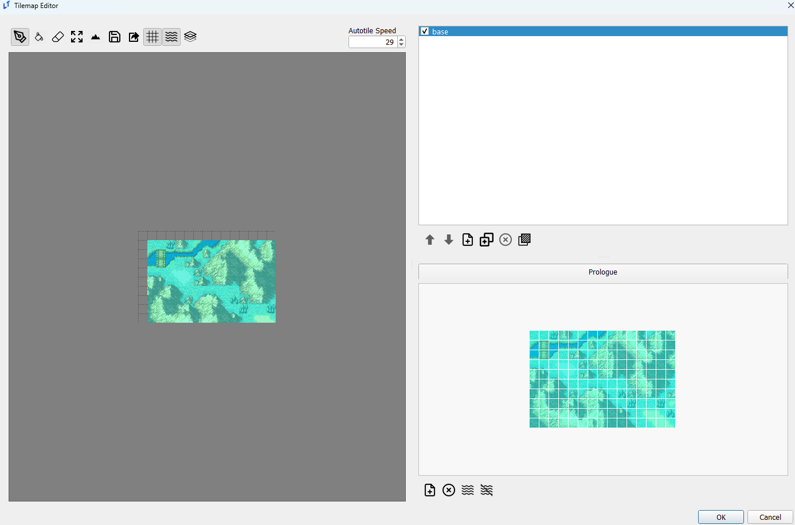
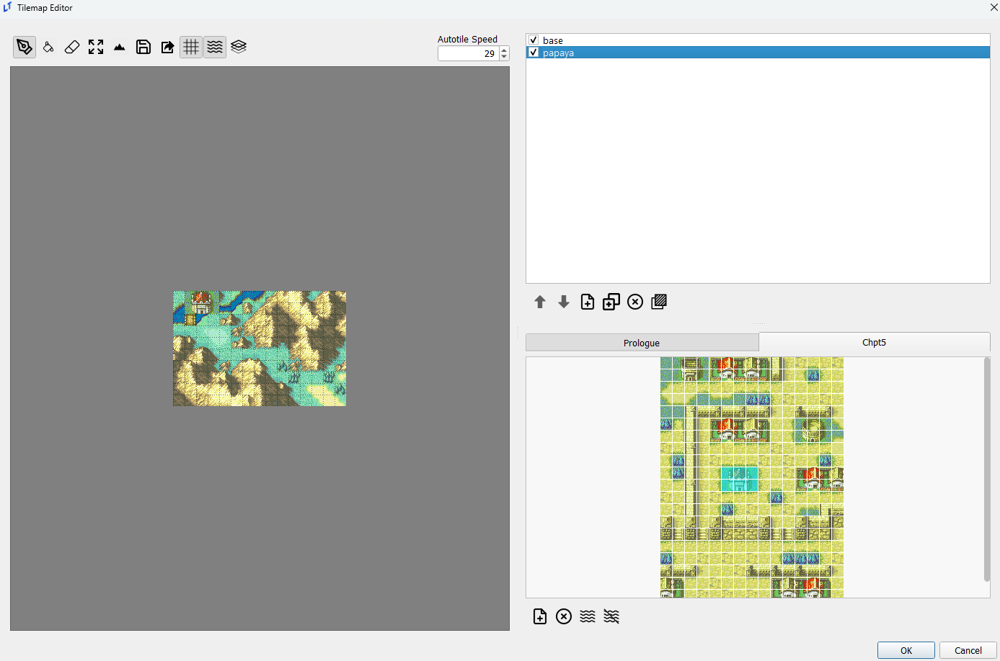
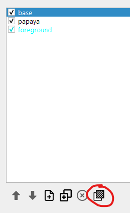
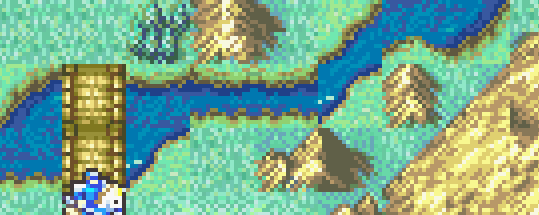
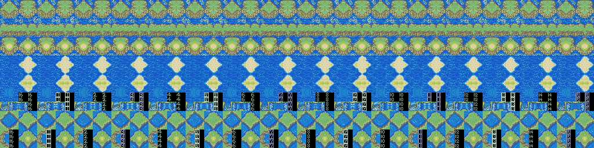
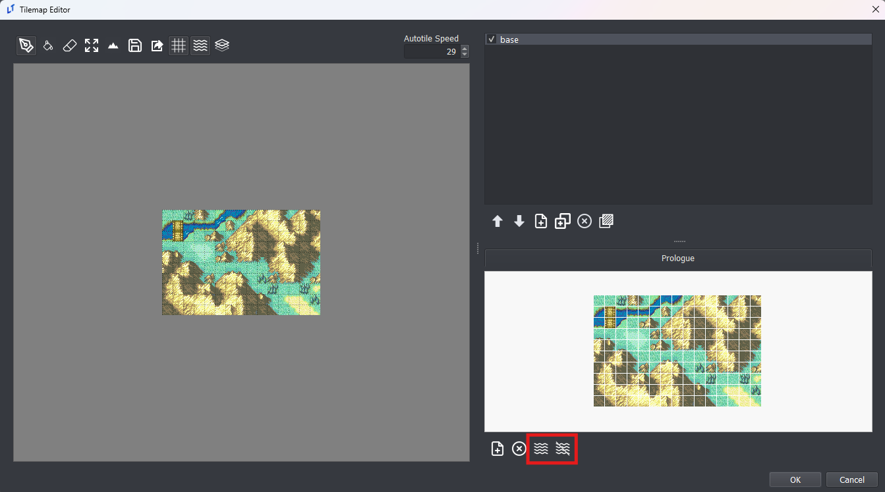
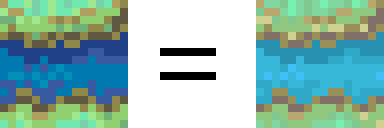

<a href="../../../index.html" class="icon icon-home">lt-maker</a>

Contents:

- <a href="../../home.html" class="reference internal">Lex Talionis
  Wiki</a>

Getting Started:

- <a href="../../getting_started/index.html"
  class="reference internal">Getting Started</a>

Editor Guides:

- <a href="../Editors-Overview.html" class="reference internal">Editors
  Overview</a>
- <a href="../index.html" class="reference internal">Editors</a>
  - <a href="../Editors-Overview.html" class="reference internal">Editors
    Overview</a>
  - <a href="../Level-Editor.html" class="reference internal">Level
    Editor</a>
  - <a href="../Overworld-Editor.html" class="reference internal">Overworld
    Editor</a>
  - <a href="../Event-Editor.html" class="reference internal">Event
    Editor</a>
  - <a href="../database-editors/index.html"
    class="reference internal">Database Editors</a>
  - <a href="index.html" class="reference internal">Resource Editors</a>
    - <a href="Icons-Editor.html" class="reference internal">Icons Editor</a>
    - <a href="Portraits-Editor.html" class="reference internal">Portraits
      Editor</a>
    - <a href="Map-Animations-Editor.html" class="reference internal">Map
      Animations Editor</a>
    - <a href="Backgrounds-Editor.html" class="reference internal">Backgrounds
      Editor</a>
    - <a href="Map-Sprites-Editor.html" class="reference internal">Map Sprites
      Editor</a>
    - <a href="Combat-Animations-Editor.html"
      class="reference internal">Combat Animations Editor</a>
    - <a href="Tilemaps-Editor.html#"
      class="current reference internal">Tilemaps Editor</a>
      - <a href="Tilemaps-Editor.html#importing"
        class="reference internal">Importing</a>
      - <a href="Tilemaps-Editor.html#layers"
        class="reference internal">Layers</a>
      - <a href="Tilemaps-Editor.html#foreground-layers"
        class="reference internal">Foreground Layers</a>
      - <a href="Tilemaps-Editor.html#autotiles"
        class="reference internal">Autotiles</a>
    - <a href="Sounds-Editor.html" class="reference internal">Sounds
      Editor</a>

Events:

- <a href="../../events/index.html" class="reference internal">Events</a>

Guides:

- <a href="../../guides/Guides-Overview.html"
  class="reference internal">Guides Overview</a>
- <a href="../../guides/index.html" class="reference internal">Guides</a>

appendix:

- <a href="../../appendix/Text-Formatting-Commands.html"
  class="reference internal">Text Formatting Commands</a>
- <a href="../../appendix/Item-Component-Reference.html"
  class="reference internal">Item Component Dictionary</a>
- <a href="../../appendix/Skill-Component-Reference.html"
  class="reference internal">Skill Component Dictionary</a>
- <a href="../../appendix/Special-Variables.html"
  class="reference internal">Special Variables</a>
- <a href="../../appendix/Special-Tags.html"
  class="reference internal">Special Tags</a>
- <a href="../../appendix/trigger-reference.html"
  class="reference internal">Event Triggers</a>
- <a href="../../appendix/Random-Seed-Mechanics.html"
  class="reference internal">Random Seed Mechanics</a>
- <a href="../../appendix/FAQ.html" class="reference internal">Frequently
  Asked Questions</a>
- <a href="../../appendix/Contributing_to_the_LTWiki.html"
  class="reference internal">Contributing to the LTWiki</a>
- <a href="../../appendix/index.html" class="reference internal">Code
  Documentation</a>

[lt-maker](../../../index.html)

- 
- [Editors](../index.html)
- [Resource Editors](index.html)
- Tilemaps Editor
- <a
  href="https://gitlab.com/rainlash/lt-maker/blob/master/docs/source/editors/resource-editors/Tilemaps-Editor.md"
  class="fa fa-gitlab">Edit on GitLab</a>

------------------------------------------------------------------------

# Tilemaps Editor<a href="Tilemaps-Editor.html#tilemaps-editor" class="headerlink"
title="Link to this heading"></a>

*last updated 2024-11-13*

## Importing<a href="Tilemaps-Editor.html#importing" class="headerlink"
title="Link to this heading"></a>

**Tilesets** can be imported from any .png image that is some multiple
of 16x16 in size. It is not possible to import **tilemaps** in this way,
but it is possible to import a .png of a tilemap as a tileset and then
use that tileset to create a map by selecting the entire tileset and
applying it to the map.

## Layers<a href="Tilemaps-Editor.html#layers" class="headerlink"
title="Link to this heading"></a>

Layers in the LT tilemap editor function as both image editing layers
and FEGBA tile changes.

Layers are displayed in *inverse* order of priority; the base layer is
at the top, while the top-most layer is at the bottom, as below.

Note that checking/unchecking layers in the tilemap editor does not do
anything in-game, and is solely meant for visual aid while editing
tilemaps. Only the base layer is visible by default in-game; use the
`show_layer` and
`hide_layer` event commands to toggle layers as
needed.

If terrain is missing for a layer, it will default to using the top-most
non-empty terrain data. A complete lack of terrain will default to the
top terrain type in the Terrain editor, NID 0, name ‘–’ in
default.ltproj.

## Foreground Layers<a href="Tilemaps-Editor.html#foreground-layers" class="headerlink"
title="Link to this heading"></a>

Pressing the foreground button pictured below while a layer is selected
will make that layer a foreground layer. You can tell which layers are
already foreground layers by their blue text.

Foreground layers are displayed above units on the map.

## Autotiles<a href="Tilemaps-Editor.html#autotiles" class="headerlink"
title="Link to this heading"></a>

### Autotiles, how do they work???<a href="Tilemaps-Editor.html#autotiles-how-do-they-work"
class="headerlink" title="Link to this heading"></a>

In the GBA games, water features such as rivers, streams, and seas all
have moving sprites to effect the illusion that there really is running
water in those pixel streams.

Every 29 frames, the sprite for the tile of water is replaced by a
slightly different predetermined tile. This is done 16 times and then
loops back around to the start. This technique is called Autotiles.

Some autotiles are included in the engine by default for your use. All
autotiles are stored in the
`resources/autotile_templates` directory. Not
every autotile used by the GBA Fire Emblem games is available by
default. LT-maker welcomes additional autotile template contributions if
you have them or can generate them.

Each tile in the autotile template must be duplicated 15 more times as
you go horizontally. The engine will take these templates and generate
an autotile tilemap for your own tilemaps, and then render that autotile
tilemap every 29 frames.

### Using Autotiles<a href="Tilemaps-Editor.html#using-autotiles" class="headerlink"
title="Link to this heading"></a>

You can add autotiles to your own maps by entering the Tilemap editor.
There are two buttons on the bottom right that will automatically
generate autotile tilemaps for your tilemaps.

In general, you should use the left button of the two. When pressed, the
editor will analyze your existing tilemap and then search through every
tile in the autotile templates to determine if any of them match the
tiles you are using in the tilemap.

The tiles do not need to match in color, but they need to match in
pattern. Once matched, the autotile template tile will be palette
shifted to match your existing tiles.

If you instead click the right button of the two, the same occurs,
except the final step where the autotile template tile is palette
shifted to match existing tiles does not occur. The autotile template
tile will keep its original color palette.

### Adding your own Autotile Templates<a href="Tilemaps-Editor.html#adding-your-own-autotile-templates"
class="headerlink" title="Link to this heading"></a>

You can use autotiles for more than just water. They can be used for
things like fire flickering on torches, or trees moving in the wind, or
whatever your heart desires.

You can add your own autotile templates easily.

1.  Make sure the editor is off.

2.  Create an image with your autotiles in the same format as existing
    autotile templates (each tile’s changes in a row horizontally).

3.  Place that image in the
    `resources/autotile_templates` directory of
    your engine.

Now your autotiles will be ready for use once you start the editor up.

<a href="Combat-Animations-Editor.html"
class="btn btn-neutral float-left" accesskey="p" rel="prev"
title="Combat Animations Editor"> Previous</a>
<a href="Sounds-Editor.html" class="btn btn-neutral float-right"
accesskey="n" rel="next" title="Sounds Editor">Next </a>

------------------------------------------------------------------------

© Copyright 2024, rainlash.

Built with [Sphinx](https://www.sphinx-doc.org/) using a
[theme](https://github.com/readthedocs/sphinx_rtd_theme) provided by
[Read the Docs](https://readthedocs.org).

