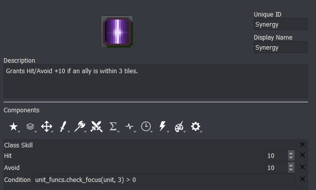
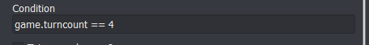

<a href="../../index.html" class="icon icon-home">lt-maker</a>

Contents:

- <a href="../home.html" class="reference internal">Lex Talionis Wiki</a>

Getting Started:

- <a href="../getting_started/index.html"
  class="reference internal">Getting Started</a>

Editor Guides:

- <a href="../editors/Editors-Overview.html"
  class="reference internal">Editors Overview</a>
- <a href="../editors/index.html" class="reference internal">Editors</a>

Events:

- <a href="index.html" class="reference internal">Events</a>
  - <a href="Event-Overview.html" class="reference internal">Event
    Overview</a>
  - <a href="Conditionals.html#"
    class="current reference internal">Conditionals</a>
    - <a href="Conditionals.html#event-objects"
      class="reference internal">Event Objects</a>
    - <a href="Conditionals.html#boolean-operators"
      class="reference internal">Boolean Operators</a>
    - <a href="Conditionals.html#list-comprehensions"
      class="reference internal">List comprehensions</a>
    - <a href="Conditionals.html#common-tasks"
      class="reference internal">Common Tasks</a>
    - <a href="Conditionals.html#full-useful-attributes-of-global-game-object"
      class="reference internal">Full Useful Attributes of Global Game
      Object</a>
  - <a href="Region-Events.html" class="reference internal">Region
    Events</a>
  - <a href="Miscellaneous-Events.html"
    class="reference internal">Miscellaneous Events</a>
  - <a href="Test-Events.html" class="reference internal">Test Events</a>
  - <a href="Python-Eventing.html" class="reference internal">Python
    Eventing</a>
  - <a href="Event-Debugger.html" class="reference internal">Debugger</a>

Guides:

- <a href="../guides/Guides-Overview.html"
  class="reference internal">Guides Overview</a>
- <a href="../guides/index.html" class="reference internal">Guides</a>

appendix:

- <a href="../appendix/Text-Formatting-Commands.html"
  class="reference internal">Text Formatting Commands</a>
- <a href="../appendix/Item-Component-Reference.html"
  class="reference internal">Item Component Dictionary</a>
- <a href="../appendix/Skill-Component-Reference.html"
  class="reference internal">Skill Component Dictionary</a>
- <a href="../appendix/Special-Variables.html"
  class="reference internal">Special Variables</a>
- <a href="../appendix/Special-Tags.html"
  class="reference internal">Special Tags</a>
- <a href="../appendix/trigger-reference.html"
  class="reference internal">Event Triggers</a>
- <a href="../appendix/Random-Seed-Mechanics.html"
  class="reference internal">Random Seed Mechanics</a>
- <a href="../appendix/FAQ.html" class="reference internal">Frequently
  Asked Questions</a>
- <a href="../appendix/Contributing_to_the_LTWiki.html"
  class="reference internal">Contributing to the LTWiki</a>
- <a href="../appendix/index.html" class="reference internal">Code
  Documentation</a>

[lt-maker](../../index.html)

- 
- [Events](index.html)
- Conditionals
- <a
  href="https://gitlab.com/rainlash/lt-maker/blob/master/docs/source/events/Conditionals.md"
  class="fa fa-gitlab">Edit on GitLab</a>

------------------------------------------------------------------------

# Conditionals<a href="Conditionals.html#conditionals" class="headerlink"
title="Link to this heading"></a>

*last updated v0.1*

Conditionals are perhaps the most powerful tool in the game designer’s
arsenal. They allow you to further refine how and when certain events
will occur, abilities can be activated, or items will behave, and much
more.

All conditionals in the **Lex Talionis** engine are evaluated at runtime
by a Python evaluation engine. As such, this means that all conditionals
must be written in valid Python. At first this may seem to have a strict
learning curve, but the minimal Python needed to write conditionals can
be learned easily. Having the conditionals evaluated by a real
programming language like Python enables them to be much more powerful
and expressive than would otherwise be possible.

## Event Objects<a href="Conditionals.html#event-objects" class="headerlink"
title="Link to this heading"></a>

While checking the conditionals for an event (whether that be through
the Condition box in the left pane of the Event Editor or through an if
statement), the event may expose certain variables with extra
information.

For instance, in a `unit_wait` event, the
`unit` variable is set to the unit that just
waited. You could use the `unit` variable now
to figure out which unit just waited, their team, their class, etc.

Each event exposes a different set of variables. Check out the Trigger
List section in the <a href="Event-Overview.html#eventoverview"
class="reference internal">Event-Overview</a> for more information.

## Boolean Operators<a href="Conditionals.html#boolean-operators" class="headerlink"
title="Link to this heading"></a>

You can use `and`,
`or`, and `not` to
combine or invert conditionals as necessary.
`A`` ``and`` ``B`
returns true if both A and B return true individually, otherwise it will
return false.
`A`` ``or`` ``B`
returns true if either A or B return true individually, otherwise it
will return false.
`not`` ``A` will
return true if A is false, and vice versa.

You can do this more than once in a chain. For instance
`(A`` ``and`` ``B)`` ``or`` ``C`
will check whether A and B are both true, or C is true. If C is false
and it is not the case that both A and B are true, then it will return
false.

Example Use Case:
`game.check_alive('Joel')`` ``and`` ``game.check_alive('Nia')`
to check that both characters are alive before giving them a post-battle
conversation.

## List comprehensions<a href="Conditionals.html#list-comprehensions" class="headerlink"
title="Link to this heading"></a>

Sometimes you need to check the values for several objects at once. You
can do this using Python *list comprehensions*.

Python list comprehensions follow a simple syntax:

    [obj for obj in list_of_objects if obj is good]

This python statement will return a list of the objects in
`list_of_objects`, filtered by the if statement
at the end, so it will only return the *good* objects. The if statement
at the end is optional and can be left off if you don’t want to filter
the object list by any property.

Example (Checks if a unit has a skill with nid
`Vantage`)

    if;'Vantage' in [skill.nid for skill in unit.skills]
        s;{unit};I have vantage!
    end

You can use the python functions `len`,
`sum`, `any`, and
`all` on list comprehensions.

Example (Checks if any player unit’s y position on the map is less than
13)

    any(unit.position[1] < 13 for unit in game.units if unit.position and unit.team == 'player')

1.  `len` returns the number of objects in the
    list

2.  `sum` adds up the objects in the list

3.  `any` returns **True** if at least one
    object in the list is true

4.  `all` returns **True** if *all* objects in
    the list are true

> 

>
> If you are new to Python, you can always find out more information by
> just googling it. These days, Python is a common first-time coders
> language, so there is lots of information out there for beginners.
>
> 

## Common Tasks<a href="Conditionals.html#common-tasks" class="headerlink"
title="Link to this heading"></a>

Check if the unit referenced by the event is a specific unit
`unit.nid`` ``==`` ``'Eirika'`

Check if the region referenced by the event is a specific region
`region.nid`` ``==`` ``'House1'`

Check if a unit is alive
`game.check_alive(unit.nid)` or
`game.check_alive('Eirika')`

Check if a unit is dead
`game.check_dead(unit.nid)` or
`game.check_dead('Eirika')`

Check the team of a unit
`unit.team`` ``==`` ``'player'`
or
`game.get_unit('Eirika').team`` ``==`` ``'player'`

Check the current turn number
`game.turncount`` ``==`` ``5`
or
`game.turncount`` ``<`` ``10`

Check nid of terrain at a position
`game.tilemap.get_terrain(position)`

Check name of terrain at a position
`DB.terrain.get(game.tilemap.get_terrain(position)).name`

Check the current mode
`game.mode.nid`` ``==`` ``'Lunatic'`

Check the current level
`game.level.nid`` ``==`` ``'Chapter`` ``2'`

Access a level variable
`game.level_vars['num_switches']`

Access a game variable
`game.game_vars['villages_saved']`

Example:

    if;game.game_vars['villages_saved'] >= 3
        give_item;Protagonist;Reward
    end

Variables can also be accessed in the following manner in the event
editor: `{v:num_switches}` or
`{v:villages_saved}`

Example:

    if;{v:villages_saved} >= 3
        give_item;Protagonist;Reward
    end

Check if a boss unit has already given their fight quote for the
challenger
`check_pair('Lyon',`` ``'Eirika')`

Check if a boss unit has already given their default fight quote.
`Eirika` and `Ephraim`
are the units with non-default fight quotes
`check_default('Lyon',`` ``['Eirika',`` ``'Ephraim'])`
or
`check_default('Batta',`` ``[])`

Check size of party
`len(game.get_units_in_party())`

Example:

    if;len(game.get_units_in_party()) < 5
        alert;You have lost too many members of your party
        lose_game
    end

## Full Useful Attributes of Global Game Object<a href="Conditionals.html#full-useful-attributes-of-global-game-object"
class="headerlink" title="Link to this heading"></a>

The game object is a very powerful source of information about the state
of the game. It keeps track of all units in the current level as well as
all non-generic units ever loaded into the game (whether alive or dead).

    game_vars: dict[str: ??]
    level_vars: dict[str: ??]
    playtime: float  # How long has the player been playing on this save file
    turncount: int
    units: list  # List of all units the game is tracking
    mode: DifficultyModeObject  # the current mode
    level: LevelObject  # the current level object
    tilemap: TileMapObject  # The current tilemap
    party: PartyObject  # the current party

    get_unit(str) -> UnitObject  # Returns a Unit with the given nid
    get_region(str) -> RegionObject  # Returns a Region with the given nid
    get_party(str) -> PartyObject # Returns the party with the given nid
    get_all_units() -> list  # Returns all alive units on the map
    get_player_units() -> list  # All alive player units on the map
    get_enemy_units() -> list  # All alive enemy units on the map
    get_all_units_in_party(str?) -> list  # All non-generic player units in the given party (defaults to current party)
    get_units_in_party(str?) -> list  # All alive non-generic player units in the given party (defaults to current party)
    check_dead(str) -> bool
    check_alive(str) -> bool
    get_money() -> int  # money of current party

<a href="Event-Overview.html" class="btn btn-neutral float-left"
accesskey="p" rel="prev" title="Event Overview"> Previous</a>
<a href="Region-Events.html" class="btn btn-neutral float-right"
accesskey="n" rel="next" title="Region Events">Next </a>

------------------------------------------------------------------------

© Copyright 2024, rainlash.

Built with [Sphinx](https://www.sphinx-doc.org/) using a
[theme](https://github.com/readthedocs/sphinx_rtd_theme) provided by
[Read the Docs](https://readthedocs.org).

