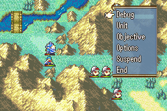
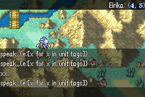

<a href="../../index.html" class="icon icon-home">lt-maker</a>

Contents:

- <a href="../home.html" class="reference internal">Lex Talionis Wiki</a>

Getting Started:

- <a href="../getting_started/index.html"
  class="reference internal">Getting Started</a>

Editor Guides:

- <a href="../editors/Editors-Overview.html"
  class="reference internal">Editors Overview</a>
- <a href="../editors/index.html" class="reference internal">Editors</a>

Events:

- <a href="index.html" class="reference internal">Events</a>
  - <a href="Event-Overview.html" class="reference internal">Event
    Overview</a>
  - <a href="Conditionals.html" class="reference internal">Conditionals</a>
  - <a href="Region-Events.html" class="reference internal">Region
    Events</a>
  - <a href="Miscellaneous-Events.html"
    class="reference internal">Miscellaneous Events</a>
  - <a href="Test-Events.html" class="reference internal">Test Events</a>
  - <a href="Python-Eventing.html" class="reference internal">Python
    Eventing</a>
  - <a href="Event-Debugger.html#"
    class="current reference internal">Debugger</a>

Guides:

- <a href="../guides/Guides-Overview.html"
  class="reference internal">Guides Overview</a>
- <a href="../guides/index.html" class="reference internal">Guides</a>

appendix:

- <a href="../appendix/Text-Formatting-Commands.html"
  class="reference internal">Text Formatting Commands</a>
- <a href="../appendix/Item-Component-Reference.html"
  class="reference internal">Item Component Dictionary</a>
- <a href="../appendix/Skill-Component-Reference.html"
  class="reference internal">Skill Component Dictionary</a>
- <a href="../appendix/Special-Variables.html"
  class="reference internal">Special Variables</a>
- <a href="../appendix/Special-Tags.html"
  class="reference internal">Special Tags</a>
- <a href="../appendix/trigger-reference.html"
  class="reference internal">Event Triggers</a>
- <a href="../appendix/Random-Seed-Mechanics.html"
  class="reference internal">Random Seed Mechanics</a>
- <a href="../appendix/FAQ.html" class="reference internal">Frequently
  Asked Questions</a>
- <a href="../appendix/Contributing_to_the_LTWiki.html"
  class="reference internal">Contributing to the LTWiki</a>
- <a href="../appendix/index.html" class="reference internal">Code
  Documentation</a>

[lt-maker](../../index.html)

- 
- [Events](index.html)
- Debugger
- <a
  href="https://gitlab.com/rainlash/lt-maker/blob/master/docs/source/events/Event-Debugger.md"
  class="fa fa-gitlab">Edit on GitLab</a>

------------------------------------------------------------------------

# Debugger<a href="Event-Debugger.html#debugger" class="headerlink"
title="Link to this heading"></a>

The debug screen is accessible via the `debug`
menu item (in the on-map option menu - the one which normally contains
`UNITS`, `OPTIONS`,
`END`` ``TURN`, etc.),
if launching the game in debug mode.

If not, the debug screen is still accessible via the same menu, but the
player must enter the following code, using directional input keys, to
open it:
`UP,`` ``UP,`` ``DOWN,`` ``DOWN,`` ``LEFT,`` ``RIGHT,`` ``LEFT,`` ``RIGHT`.

The debug screen calls a miniature event when you enter a command. That
event has access to:

> 

>
> - **unit**: the unit under the cursor
>
> - **position**: the position under the cursor
>
> 

You can see these values displayed on the top right corner of your
screen, as seen in the above screenshot. No unit will be displayed when
not hovering over a unit.

While in this menu, you may type in any event command and hit
`Enter` to have that event command be
immediately executed. Try out
`give_item;Eirika;Vulnerary` as an example.

To exit the Debug menu, press `Enter` while
there is no text in the debug command line. Do not press
`Escape` or your game window will close
entirely.

<a href="Python-Eventing.html" class="btn btn-neutral float-left"
accesskey="p" rel="prev" title="Python Eventing"> Previous</a>
<a href="../guides/Guides-Overview.html"
class="btn btn-neutral float-right" accesskey="n" rel="next"
title="Guides Overview">Next </a>

------------------------------------------------------------------------

© Copyright 2024, rainlash.

Built with [Sphinx](https://www.sphinx-doc.org/) using a
[theme](https://github.com/readthedocs/sphinx_rtd_theme) provided by
[Read the Docs](https://readthedocs.org).

