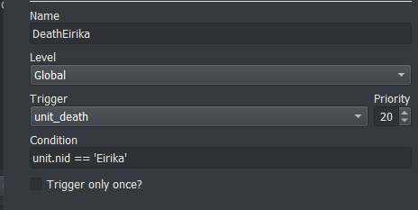
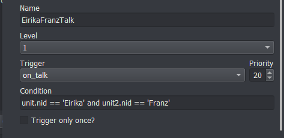
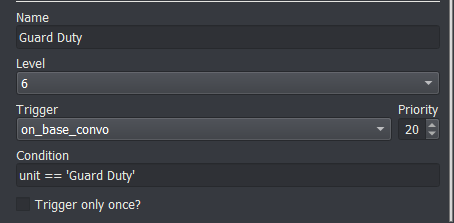

<a href="../../index.html" class="icon icon-home">lt-maker</a>

Contents:

- <a href="../home.html" class="reference internal">Lex Talionis Wiki</a>

Getting Started:

- <a href="../getting_started/index.html"
  class="reference internal">Getting Started</a>

Editor Guides:

- <a href="../editors/Editors-Overview.html"
  class="reference internal">Editors Overview</a>
- <a href="../editors/index.html" class="reference internal">Editors</a>

Events:

- <a href="index.html" class="reference internal">Events</a>
  - <a href="Event-Overview.html" class="reference internal">Event
    Overview</a>
  - <a href="Conditionals.html" class="reference internal">Conditionals</a>
  - <a href="Region-Events.html" class="reference internal">Region
    Events</a>
  - <a href="Miscellaneous-Events.html#"
    class="current reference internal">Miscellaneous Events</a>
    - <a href="Miscellaneous-Events.html#death-events"
      class="reference internal">Death Events</a>
    - <a href="Miscellaneous-Events.html#fight-events"
      class="reference internal">Fight Events</a>
      - <a href="Miscellaneous-Events.html#basic-fight-quote"
        class="reference internal">Basic Fight Quote</a>
      - <a href="Miscellaneous-Events.html#id1" class="reference internal">Basic
        Fight Quote+</a>
      - <a href="Miscellaneous-Events.html#specific-fight-quote"
        class="reference internal">Specific Fight Quote</a>
      - <a href="Miscellaneous-Events.html#default-fight-quote"
        class="reference internal">Default Fight Quote</a>
    - <a href="Miscellaneous-Events.html#talk-conversations"
      class="reference internal">Talk Conversations</a>
    - <a href="Miscellaneous-Events.html#base-conversations"
      class="reference internal">Base Conversations</a>
  - <a href="Test-Events.html" class="reference internal">Test Events</a>
  - <a href="Python-Eventing.html" class="reference internal">Python
    Eventing</a>
  - <a href="Event-Debugger.html" class="reference internal">Debugger</a>

Guides:

- <a href="../guides/Guides-Overview.html"
  class="reference internal">Guides Overview</a>
- <a href="../guides/index.html" class="reference internal">Guides</a>

appendix:

- <a href="../appendix/Text-Formatting-Commands.html"
  class="reference internal">Text Formatting Commands</a>
- <a href="../appendix/Item-Component-Reference.html"
  class="reference internal">Item Component Dictionary</a>
- <a href="../appendix/Skill-Component-Reference.html"
  class="reference internal">Skill Component Dictionary</a>
- <a href="../appendix/Special-Variables.html"
  class="reference internal">Special Variables</a>
- <a href="../appendix/Special-Tags.html"
  class="reference internal">Special Tags</a>
- <a href="../appendix/trigger-reference.html"
  class="reference internal">Event Triggers</a>
- <a href="../appendix/Random-Seed-Mechanics.html"
  class="reference internal">Random Seed Mechanics</a>
- <a href="../appendix/FAQ.html" class="reference internal">Frequently
  Asked Questions</a>
- <a href="../appendix/Contributing_to_the_LTWiki.html"
  class="reference internal">Contributing to the LTWiki</a>
- <a href="../appendix/index.html" class="reference internal">Code
  Documentation</a>

[lt-maker](../../index.html)

- 
- [Events](index.html)
- Miscellaneous Events
- <a
  href="https://gitlab.com/rainlash/lt-maker/blob/master/docs/source/events/Miscellaneous-Events.md"
  class="fa fa-gitlab">Edit on GitLab</a>

------------------------------------------------------------------------

# Miscellaneous Events<a href="Miscellaneous-Events.html#miscellaneous-events"
class="headerlink" title="Link to this heading"></a>

*last update v0.1*

## Death Events<a href="Miscellaneous-Events.html#death-events" class="headerlink"
title="Link to this heading"></a>

The `unit_death` trigger fires whenever ANY
unit dies. You can create events that happen when a certain unit dies by
catching this trigger with the right condition.

For instance, to create a death quote for Eirika’s death and then cause
the player to game over:

Condition:
`unit.nid`` ``==`` ``'Eirika'`
(We only want Eirika’s death to trigger this event)

Event Commands:

    u;Eirika;FarRight
    s;Eirika;Brother... I'm sorry
    expression;Eirika;CloseEyes
    r;Eirika
    remove_unit;Eirika
    lose_game

## Fight Events<a href="Miscellaneous-Events.html#fight-events" class="headerlink"
title="Link to this heading"></a>

To create fight quotes that happen before fighting (for instance, before
fighting a boss), you can use the `combat_end`
trigger. It fires whenever ANY interaction between units happens. So you
will need to set up the right condition to make sure your event only
happens at the right time.

### Basic Fight Quote<a href="Miscellaneous-Events.html#basic-fight-quote" class="headerlink"
title="Link to this heading"></a>

When the boss has only one quote that they say the first time they enter
combat, you can check whether either unit is the boss. Make sure the
“Only Once” box is checked, otherwise this event will fire everytime the
boss is in combat.

`unit.nid`` ``==`` ``'Lyon'`` ``or`` ``unit2.nid`` ``==`` ``'Lyon'`

### Basic Fight Quote+<a href="Miscellaneous-Events.html#id1" class="headerlink"
title="Link to this heading"></a>

If the boss could be healed or otherwise supported by his fellows, you
will want to make sure that the boss only says his lines when fighting
your characters.

`(unit.nid`` ``==`` ``'Lyon'`` ``and`` ``unit2.team`` ``==`` ``'player')`` ``or`` ``(unit.team`` ``==`` ``'player'`` ``and`` ``unit2.nid`` ``==`` ``'Lyon')`

### Specific Fight Quote<a href="Miscellaneous-Events.html#specific-fight-quote"
class="headerlink" title="Link to this heading"></a>

If the boss has a specific fight quote for a specific unit, you can use
a special function to check whether the boss is in combat with that
unit.

`check_pair('Lyon',`` ``'Eirika')`

### Default Fight Quote<a href="Miscellaneous-Events.html#default-fight-quote"
class="headerlink" title="Link to this heading"></a>

If the boss has a specific fight quote for certain units, but a default
fight quote used for all other combatants, you can use another function
to check whether the boss should be using the default. The second
argument to `check_default` should be a list of
the characters that the boss has a specific fight quote for.

`check_default('Lyon',`` ``['Eirika',`` ``'Ephraim'])`

For all of these events, make sure to check the “Only Once” box so they
only occur once (otherwise they’d get quite repetitive).

## Talk Conversations<a href="Miscellaneous-Events.html#talk-conversations"
class="headerlink" title="Link to this heading"></a>

The first step for talk conversations is to set up a potential talk
conversation. You tell the engine you’d like two characters to be able
to talk to one another.

I like to put my setup at the top of the
`level_start` event for the chapter, so I’d
write:

    add_talk;Eirika;Franz
    add_talk;Seth;Franz

This sets up a one way talk opportunity between Eirika and Franz, and
between Seth and Franz. The first character is the one that initiates
the conversation. If you want either character to be able to initiate,
just add it twice, but with the characters reversed.

    add_talk;Eirika;Franz
    add_talk;Franz;Eirika

Once that has been done, you can write the actual conversation that will
occur when the player actually selects **Talk**.

Create an event with the `on_talk` trigger, and
write the content of the conversation in the event. Since
`on_talk` fires for every talk, if you have
more than one talk conversation per level, you can specify which units
are the ones talking in the conditional. For a conversation that Seth
initiates with Franz:

`unit.nid`` ``==`` ``'Seth'`` ``and`` ``unit2.nid`` ``==`` ``'Franz'`

## Base Conversations<a href="Miscellaneous-Events.html#base-conversations"
class="headerlink" title="Link to this heading"></a>

Base conversations are very similar to Talk conversations in overall
structure. You set up a base conversation by deciding on the name of the
base conversation that will appear in the Base Convos menu. Then at the
beginning of the level, use the
`add_base_convo` command to tell the engine
that this is an available base conversation

`add_base_convo;Guard`` ``Duty`

Create an event with the `on_base_convo`
trigger, and write the content of the conversation in the event. Since
`on_base_convo` fires for every base
conversation, you need to narrow it down to the specific base
conversations you’d like this event to fire for. For the
`Guard`` ``Duty` base
conversation, you set the condition to:

`unit`` ``==`` ``'Guard`` ``Duty'`

At the end of the base conversation, you can use the
`ignore_base_convo` or
`remove_base_convo` commands to either gray out
the base conversation in the menu, or remove it altogether.

<a href="Region-Events.html" class="btn btn-neutral float-left"
accesskey="p" rel="prev" title="Region Events"> Previous</a>
<a href="Test-Events.html" class="btn btn-neutral float-right"
accesskey="n" rel="next" title="Test Events">Next </a>

------------------------------------------------------------------------

© Copyright 2024, rainlash.

Built with [Sphinx](https://www.sphinx-doc.org/) using a
[theme](https://github.com/readthedocs/sphinx_rtd_theme) provided by
[Read the Docs](https://readthedocs.org).

