

<a href="../../index.html" class="icon icon-home">lt-maker</a>

Contents:

- <a href="../home.html" class="reference internal">Lex Talionis Wiki</a>

Getting Started:

- <a href="../getting_started/index.html"
  class="reference internal">Getting Started</a>

Editor Guides:

- <a href="../editors/Editors-Overview.html"
  class="reference internal">Editors Overview</a>
- <a href="../editors/index.html" class="reference internal">Editors</a>

Events:

- <a href="index.html" class="reference internal">Events</a>
  - <a href="Event-Overview.html" class="reference internal">Event
    Overview</a>
  - <a href="Conditionals.html" class="reference internal">Conditionals</a>
  - <a href="Region-Events.html#" class="current reference internal">Region
    Events</a>
    - <a href="Region-Events.html#villages-houses"
      class="reference internal">Villages / Houses</a>
    - <a href="Region-Events.html#shops-armories"
      class="reference internal">Shops / Armories</a>
    - <a href="Region-Events.html#seize" class="reference internal">Seize</a>
    - <a href="Region-Events.html#escape"
      class="reference internal">Escape</a>
    - <a href="Region-Events.html#switch"
      class="reference internal">Switch</a>
    - <a href="Region-Events.html#chest-door" class="reference internal">Chest
      / Door</a>
  - <a href="Miscellaneous-Events.html"
    class="reference internal">Miscellaneous Events</a>
  - <a href="Test-Events.html" class="reference internal">Test Events</a>
  - <a href="Python-Eventing.html" class="reference internal">Python
    Eventing</a>
  - <a href="Event-Debugger.html" class="reference internal">Debugger</a>

Guides:

- <a href="../guides/Guides-Overview.html"
  class="reference internal">Guides Overview</a>
- <a href="../guides/index.html" class="reference internal">Guides</a>

appendix:

- <a href="../appendix/Text-Formatting-Commands.html"
  class="reference internal">Text Formatting Commands</a>
- <a href="../appendix/Item-Component-Reference.html"
  class="reference internal">Item Component Dictionary</a>
- <a href="../appendix/Skill-Component-Reference.html"
  class="reference internal">Skill Component Dictionary</a>
- <a href="../appendix/Special-Variables.html"
  class="reference internal">Special Variables</a>
- <a href="../appendix/Special-Tags.html"
  class="reference internal">Special Tags</a>
- <a href="../appendix/trigger-reference.html"
  class="reference internal">Event Triggers</a>
- <a href="../appendix/Random-Seed-Mechanics.html"
  class="reference internal">Random Seed Mechanics</a>
- <a href="../appendix/FAQ.html" class="reference internal">Frequently
  Asked Questions</a>
- <a href="../appendix/Contributing_to_the_LTWiki.html"
  class="reference internal">Contributing to the LTWiki</a>
- <a href="../appendix/index.html" class="reference internal">Code
  Documentation</a>

[lt-maker](../../index.html)

- 
- [Events](index.html)
- Region Events
- <a
  href="https://gitlab.com/rainlash/lt-maker/blob/master/docs/source/events/Region-Events.md"
  class="fa fa-gitlab">Edit on GitLab</a>

------------------------------------------------------------------------

# Region Events<a href="Region-Events.html#region-events" class="headerlink"
title="Link to this heading"></a>

*last update v0.1*

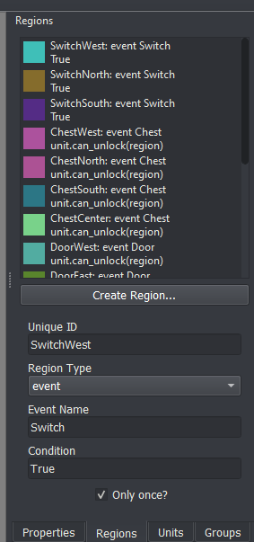

Event regions are a flexible way for the game designer to give the
player additional actions their characters can perform while on specific
regions of the map. With event regions, you can implement visiting
villages, visiting shops, seizing thrones, escaping the map, flicking
switches, and unlocking chests or doors, and much more.

The condition box in the Region pane allows you to specify which units
will be able to access that region’s action. For instance, if you only
want Eirika to be able to Seize, you can set the condition to
`unit.nid`` ``==`` ``'Eirika'`.

## Villages / Houses<a href="Region-Events.html#villages-houses" class="headerlink"
title="Link to this heading"></a>

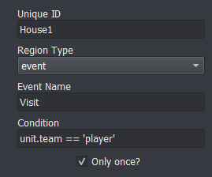

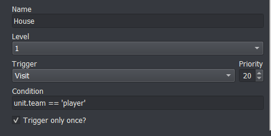

The condition in the Event Editor specifies *which* region this event
corresponds to.

A normal visit event looks something like this

    transition;Close
    change_background;House
    transition;Open
    add_portrait;{unit};Left;no_block
    add_portrait;Man;Right
    speak;Man;You'll never defeat Gharnef!
    remove_portrait;{unit};no_block
    remove_portrait;Man
    transition;Close
    change_background
    transition;Open
    give_item;{unit};Red Gem
    has_attacked;{unit}

The `has_attacked` command at the end is
important if you don’t want the unit to be able to move or attack after
visiting the village

## Shops / Armories<a href="Region-Events.html#shops-armories" class="headerlink"
title="Link to this heading"></a>

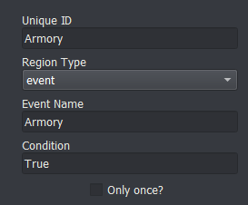

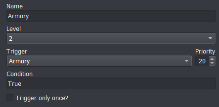

A normal shop event looks something like this

    transition;Close
    music;Armory Music
    shop;{unit};Iron Sword,Iron Lance,Iron Axe
    transition;Open

The `shop` command handles all the intricacies
of shopping for you, including making sure the unit can’t move back
after making a transaction.

## Seize<a href="Region-Events.html#seize" class="headerlink"
title="Link to this heading"></a>

A normal seize event looks something like this

    win_game

## Escape<a href="Region-Events.html#escape" class="headerlink"
title="Link to this heading"></a>

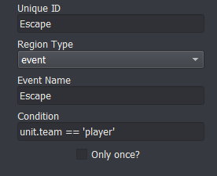

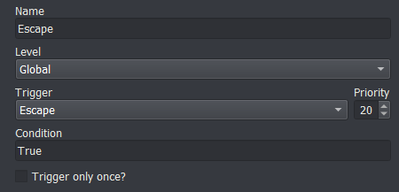

A normal escape event looks something like this

    remove_unit;{unit}
    wait;400
    if;not any(unit.team == 'player' for unit in game.units if unit.position)
        win_game
    end

## Switch<a href="Region-Events.html#switch" class="headerlink"
title="Link to this heading"></a>

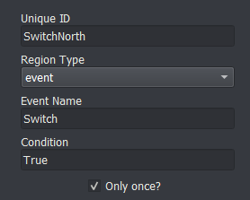

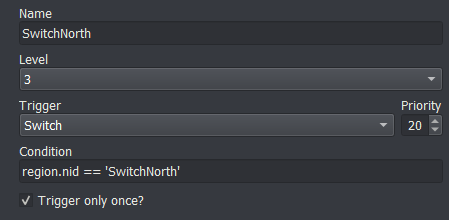

You can increment a counter every time a switch event is processed if
you want to keep track

## Chest / Door<a href="Region-Events.html#chest-door" class="headerlink"
title="Link to this heading"></a>

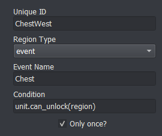

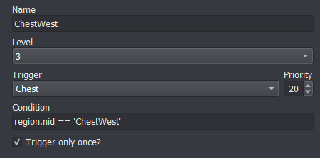

A normal chest event looks something like this

    show_layer;Chest1
    unlock;{unit}
    give_money;2000
    has_attacked;{unit}

The unlock command handles spending the unlockable you used to unlock
the chest (whether that be by a key, lockpick, or with locktouch)

<a href="Conditionals.html" class="btn btn-neutral float-left"
accesskey="p" rel="prev" title="Conditionals"> Previous</a>
<a href="Miscellaneous-Events.html" class="btn btn-neutral float-right"
accesskey="n" rel="next" title="Miscellaneous Events">Next </a>

------------------------------------------------------------------------

© Copyright 2024, rainlash.

Built with [Sphinx](https://www.sphinx-doc.org/) using a
[theme](https://github.com/readthedocs/sphinx_rtd_theme) provided by
[Read the Docs](https://readthedocs.org).

