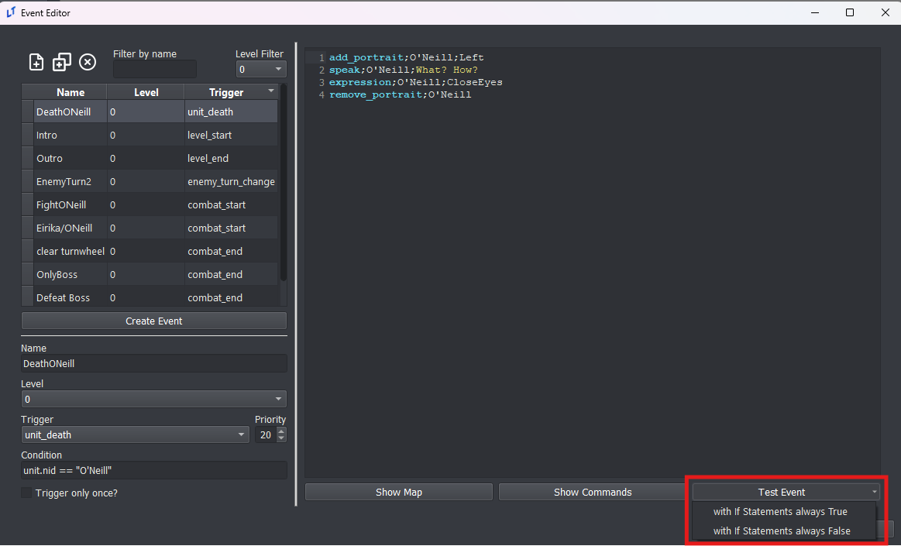
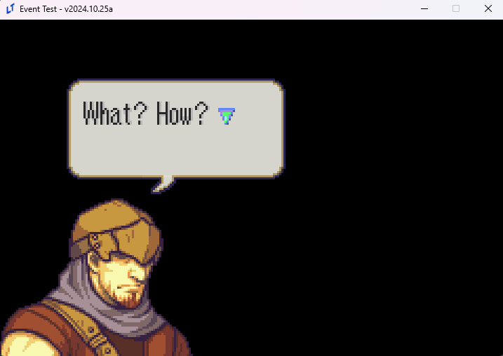
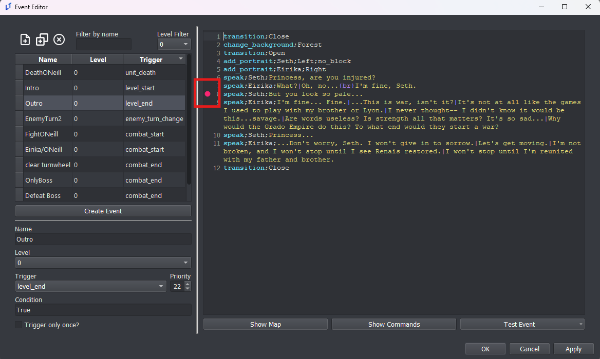
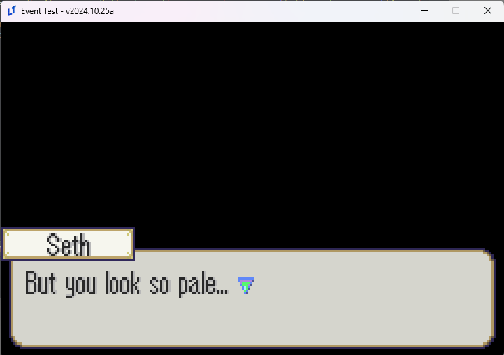

<a href="../../index.html" class="icon icon-home">lt-maker</a>

Contents:

- <a href="../home.html" class="reference internal">Lex Talionis Wiki</a>

Getting Started:

- <a href="../getting_started/index.html"
  class="reference internal">Getting Started</a>

Editor Guides:

- <a href="../editors/Editors-Overview.html"
  class="reference internal">Editors Overview</a>
- <a href="../editors/index.html" class="reference internal">Editors</a>

Events:

- <a href="index.html" class="reference internal">Events</a>
  - <a href="Event-Overview.html" class="reference internal">Event
    Overview</a>
  - <a href="Conditionals.html" class="reference internal">Conditionals</a>
  - <a href="Region-Events.html" class="reference internal">Region
    Events</a>
  - <a href="Miscellaneous-Events.html"
    class="reference internal">Miscellaneous Events</a>
  - <a href="Test-Events.html#" class="current reference internal">Test
    Events</a>
    - <a href="Test-Events.html#what-s-different-about-test-events"
      class="reference internal">What’s different about Test Events?</a>
    - <a href="Test-Events.html#test-event-at-a-specific-point"
      class="reference internal">Test Event at a Specific Point</a>
  - <a href="Python-Eventing.html" class="reference internal">Python
    Eventing</a>
  - <a href="Event-Debugger.html" class="reference internal">Debugger</a>

Guides:

- <a href="../guides/Guides-Overview.html"
  class="reference internal">Guides Overview</a>
- <a href="../guides/index.html" class="reference internal">Guides</a>

appendix:

- <a href="../appendix/Text-Formatting-Commands.html"
  class="reference internal">Text Formatting Commands</a>
- <a href="../appendix/Item-Component-Reference.html"
  class="reference internal">Item Component Dictionary</a>
- <a href="../appendix/Skill-Component-Reference.html"
  class="reference internal">Skill Component Dictionary</a>
- <a href="../appendix/Special-Variables.html"
  class="reference internal">Special Variables</a>
- <a href="../appendix/Special-Tags.html"
  class="reference internal">Special Tags</a>
- <a href="../appendix/trigger-reference.html"
  class="reference internal">Event Triggers</a>
- <a href="../appendix/Random-Seed-Mechanics.html"
  class="reference internal">Random Seed Mechanics</a>
- <a href="../appendix/FAQ.html" class="reference internal">Frequently
  Asked Questions</a>
- <a href="../appendix/Contributing_to_the_LTWiki.html"
  class="reference internal">Contributing to the LTWiki</a>
- <a href="../appendix/index.html" class="reference internal">Code
  Documentation</a>

[lt-maker](../../index.html)

- 
- [Events](index.html)
- Test Events
- <a
  href="https://gitlab.com/rainlash/lt-maker/blob/master/docs/source/events/Test-Events.md"
  class="fa fa-gitlab">Edit on GitLab</a>

------------------------------------------------------------------------

# Test Events<a href="Test-Events.html#test-events" class="headerlink"
title="Link to this heading"></a>

You can test your events from the Events Editor without having to test
your full game.

Simply press the Test Event button and then choose how you want your
conditional `if` statements to be automatically
resolved.

## What’s different about Test Events?<a href="Test-Events.html#what-s-different-about-test-events"
class="headerlink" title="Link to this heading"></a>

Many different commands **will not run** in a test event! In fact, most
event commands will not be processed and just skipped.

These are the **ONLY** commands that will run:

    "if"
    "elif"
    "end"
    "for"
    "endf"
    "finish" 
    "wait"
    "end_skip"
    "music"
    "music_clear"
    "sound"
    "stop_sound"
    "add_portrait"
    "multi_add_portrait"
    "remove_portrait"
    "multi_remove_portrait"
    "move_portrait"
    "mirror_portrait"
    "bop_portrait"
    "expression"
    "speak_style"
    "speak"
    "unhold"
    "transition"
    "change_background"
    "table"
    "remove_table"
    "draw_overlay_sprite"
    "remove_overlay_sprite"
    "location_card"
    "credits"
    "ending"
    "paired_ending"
    "pop_dialog"
    "narrate"
    "toggle_narration_mode"
    "unpause"
    "screen_shake"

In addition, you do not have access to any actual units or the game map.
If you want access to these, just test your event using the real “Test
Chapter” button in the editor. If you try to run a command that requires
the map or actual units to exist in memory, it may skip the command or
even crash.

This means the Test Event button is best used for testing your dialogue
scenes that don’t rely on the map.

## Test Event at a Specific Point<a href="Test-Events.html#test-event-at-a-specific-point"
class="headerlink" title="Link to this heading"></a>

If you don’t want to test the full event, you can instead test the event
at a specific point by clicking on the line number pane.

Once this symbol appears, now when you test your event, it will start
from that specific line.

Because the previous lines were never run, Seth’s portrait does not show
up here.

<a href="Miscellaneous-Events.html" class="btn btn-neutral float-left"
accesskey="p" rel="prev" title="Miscellaneous Events"> Previous</a>
<a href="Python-Eventing.html" class="btn btn-neutral float-right"
accesskey="n" rel="next" title="Python Eventing">Next </a>

------------------------------------------------------------------------

© Copyright 2024, rainlash.

Built with [Sphinx](https://www.sphinx-doc.org/) using a
[theme](https://github.com/readthedocs/sphinx_rtd_theme) provided by
[Read the Docs](https://readthedocs.org).

