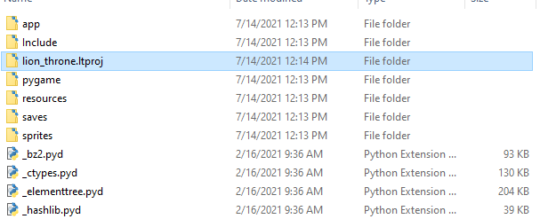

<a href="../../index.html" class="icon icon-home">lt-maker</a>

Contents:

- <a href="../home.html" class="reference internal">Lex Talionis Wiki</a>

Getting Started:

- <a href="index.html" class="reference internal">Getting Started</a>
  - <a href="Getting-Started.html" class="reference internal">Getting
    Started</a>
  - <a href="Python-Installation.html" class="reference internal">Necessary
    Installs (for Windows)</a>
  - <a href="making-a-basic-map.html" class="reference internal">The
    Basics</a>
  - <a href="Build-Engine.html#" class="current reference internal">Build
    Engine</a>
    - <a href="Build-Engine.html#non-python-process"
      class="reference internal">Non-Python Process</a>
    - <a href="Build-Engine.html#python-process"
      class="reference internal">Python Process</a>
    - <a href="Build-Engine.html#complete"
      class="reference internal">Complete!</a>

Editor Guides:

- <a href="../editors/Editors-Overview.html"
  class="reference internal">Editors Overview</a>
- <a href="../editors/index.html" class="reference internal">Editors</a>

Events:

- <a href="../events/index.html" class="reference internal">Events</a>

Guides:

- <a href="../guides/Guides-Overview.html"
  class="reference internal">Guides Overview</a>
- <a href="../guides/index.html" class="reference internal">Guides</a>

appendix:

- <a href="../appendix/Text-Formatting-Commands.html"
  class="reference internal">Text Formatting Commands</a>
- <a href="../appendix/Item-Component-Reference.html"
  class="reference internal">Item Component Dictionary</a>
- <a href="../appendix/Skill-Component-Reference.html"
  class="reference internal">Skill Component Dictionary</a>
- <a href="../appendix/Special-Variables.html"
  class="reference internal">Special Variables</a>
- <a href="../appendix/Special-Tags.html"
  class="reference internal">Special Tags</a>
- <a href="../appendix/trigger-reference.html"
  class="reference internal">Event Triggers</a>
- <a href="../appendix/Random-Seed-Mechanics.html"
  class="reference internal">Random Seed Mechanics</a>
- <a href="../appendix/FAQ.html" class="reference internal">Frequently
  Asked Questions</a>
- <a href="../appendix/Contributing_to_the_LTWiki.html"
  class="reference internal">Contributing to the LTWiki</a>
- <a href="../appendix/index.html" class="reference internal">Code
  Documentation</a>

[lt-maker](../../index.html)

- 
- [Getting Started](index.html)
- Build Engine
- <a
  href="https://gitlab.com/rainlash/lt-maker/blob/master/docs/source/getting_started/Build-Engine.md"
  class="fa fa-gitlab">Edit on GitLab</a>

------------------------------------------------------------------------

# Build Engine<a href="Build-Engine.html#build-engine" class="headerlink"
title="Link to this heading"></a>

If you want to be able to distribute an executable to others for release
and playtesting, this document will tell you how.

## Non-Python Process<a href="Build-Engine.html#non-python-process" class="headerlink"
title="Link to this heading"></a>

If you are working with an executable version of the editor, follow this
process.

You can download the current version of the standalone engine from here:
https://gitlab.com/rainlash/lt-maker/-/jobs/artifacts/release/download?job=build_engine
(Download will start automatically!)

Unzip the download, stick your `.ltproj` file
in the folder `lt_engine/lt_engine` (should be
at the same level as `app`,
`Include`, etc.), and then you should be good
to go. Test that the engine works with your project, and then re-zip it
all up for distribution to others!

## Python Process<a href="Build-Engine.html#python-process" class="headerlink"
title="Link to this heading"></a>

If are working with the Python version of the **Lex Talionis** engine,
the process is much simpler.

Open your project in the editor. Under the
`File` menu, click
`Build`` ``Project`.
This will ask you where to place the build, and will then build the
project in that location.

Afterwards, it will open the build folder.

## Complete\!<a href="Build-Engine.html#complete" class="headerlink"
title="Link to this heading"></a>

Your engine, ready for distribution, should be one directory above the
`lt-maker` directory, and named the same as
your project. Make sure to test it out first before delivering it to
others!

<a href="making-a-basic-map.html" class="btn btn-neutral float-left"
accesskey="p" rel="prev" title="The Basics"> Previous</a>
<a href="../editors/Editors-Overview.html"
class="btn btn-neutral float-right" accesskey="n" rel="next"
title="Editors Overview">Next </a>

------------------------------------------------------------------------

© Copyright 2024, rainlash.

Built with [Sphinx](https://www.sphinx-doc.org/) using a
[theme](https://github.com/readthedocs/sphinx_rtd_theme) provided by
[Read the Docs](https://readthedocs.org).

