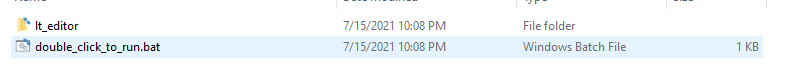
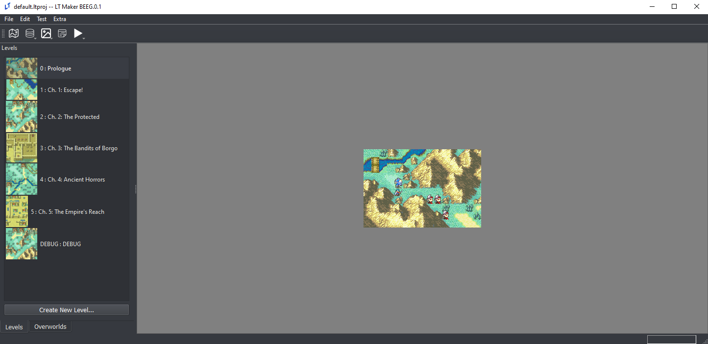
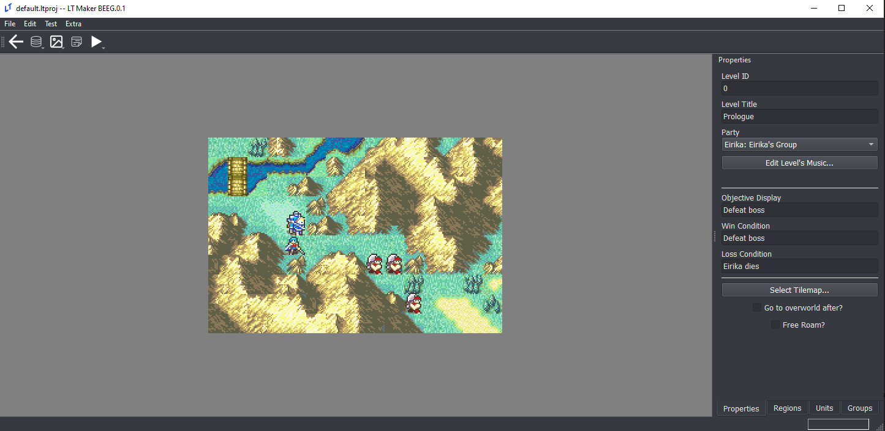
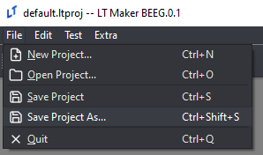

<a href="../../index.html" class="icon icon-home">lt-maker</a>

Contents:

- <a href="../home.html" class="reference internal">Lex Talionis Wiki</a>

Getting Started:

- <a href="index.html" class="reference internal">Getting Started</a>
  - <a href="Getting-Started.html#"
    class="current reference internal">Getting Started</a>
    - <a href="Getting-Started.html#level-editor"
      class="reference internal">Level Editor</a>
    - <a href="Getting-Started.html#saving-your-project"
      class="reference internal">Saving your project</a>
    - <a href="Getting-Started.html#updating-the-engine-executable"
      class="reference internal">Updating the Engine (Executable)</a>
    - <a href="Getting-Started.html#next-steps"
      class="reference internal">Next Steps</a>
  - <a href="Python-Installation.html" class="reference internal">Necessary
    Installs (for Windows)</a>
  - <a href="making-a-basic-map.html" class="reference internal">The
    Basics</a>
  - <a href="Build-Engine.html" class="reference internal">Build Engine</a>

Editor Guides:

- <a href="../editors/Editors-Overview.html"
  class="reference internal">Editors Overview</a>
- <a href="../editors/index.html" class="reference internal">Editors</a>

Events:

- <a href="../events/index.html" class="reference internal">Events</a>

Guides:

- <a href="../guides/Guides-Overview.html"
  class="reference internal">Guides Overview</a>
- <a href="../guides/index.html" class="reference internal">Guides</a>

appendix:

- <a href="../appendix/Text-Formatting-Commands.html"
  class="reference internal">Text Formatting Commands</a>
- <a href="../appendix/Item-Component-Reference.html"
  class="reference internal">Item Component Dictionary</a>
- <a href="../appendix/Skill-Component-Reference.html"
  class="reference internal">Skill Component Dictionary</a>
- <a href="../appendix/Special-Variables.html"
  class="reference internal">Special Variables</a>
- <a href="../appendix/Special-Tags.html"
  class="reference internal">Special Tags</a>
- <a href="../appendix/trigger-reference.html"
  class="reference internal">Event Triggers</a>
- <a href="../appendix/Random-Seed-Mechanics.html"
  class="reference internal">Random Seed Mechanics</a>
- <a href="../appendix/FAQ.html" class="reference internal">Frequently
  Asked Questions</a>
- <a href="../appendix/Contributing_to_the_LTWiki.html"
  class="reference internal">Contributing to the LTWiki</a>
- <a href="../appendix/index.html" class="reference internal">Code
  Documentation</a>

[lt-maker](../../index.html)

- 
- [Getting Started](index.html)
- Getting Started
- <a
  href="https://gitlab.com/rainlash/lt-maker/blob/master/docs/source/getting_started/Getting-Started.md"
  class="fa fa-gitlab">Edit on GitLab</a>

------------------------------------------------------------------------

# Getting Started<a href="Getting-Started.html#getting-started" class="headerlink"
title="Link to this heading"></a>

If you have experience working with Python and want to use the Python
version of the **Lex Talionis** engine and editor, check out the
<a href="Python-Installation.html#pyinstall"
class="reference internal">Python
Installation</a> guide in the sidebar. Otherwise, read on.

The Windows executable version of the **Lex Talionis** editor can be
downloaded at this link:
<a href="https://gitlab.com/rainlash/lt-maker/-/releases"
class="reference external">https://gitlab.com/rainlash/lt-maker/-/releases</a>

**MAKE SURE YOU DOWNLOAD THE FILE TITLED LEX_TALIONIS_MAKER**

This executable will **ONLY** work on Windows. On Mac and Linux you must
follow the Python Installation method linked above. Once you have
downloaded and unzipped the file, locate the
`double_click_to_run.bat`. Double-click it to
run the editor.

**warning: IF YOU DOWNLOAD THE WINDOWS EXECUTABLE VERSION YOU DO NOT
NEED TO PROCEED WITH ANY OTHER INSTALLATION STEPS.**

After a couple of seconds, the editor should pop up.

The editor comes with some pregenerated data in the default project
(specifically, the first six chapters of the Sacred Stones). It is
expected that you will modify this data to create your own game.

1.  Currently open project

2.  Databases: these contains the game-wide data, like the classes,
    units, items, and skills that you will have in your game

3.  Resources: these contain additional image or sound resources
    necessary to bring your game to life, like portraits, backgrounds,
    tilemaps, and music

4.  Events: Here you can create custom events to make your game
    experience unique. More information can be found at
    <a href="../events/Event-Overview.html#eventoverview"
    class="reference internal">Event
    Overview</a>.

5.  Testing: Options for testing your game

6.  Level Select: Here is where each of the chapters in your game live

7.  Check for updates and modify certain editor preferences

## Level Editor<a href="Getting-Started.html#level-editor" class="headerlink"
title="Link to this heading"></a>

If you double-click a specific level, it will start the Level Editor
mode of the editor. Here you can work specifically on the level itself.

1.  Go back to the Global Editor mode

2.  Level Properties tab (start here when you create a new level)

3.  Define and place units on the map

4.  Define special regions on the map (events, status effects, formation
    placement, etc.)

5.  Set up groups of units (generally used with events)

## Saving your project<a href="Getting-Started.html#saving-your-project" class="headerlink"
title="Link to this heading"></a>

If you’ve made changes to the default project, you can save your changes
easily as a new personal project of your own. Just click **File-\>Save
as…** and give your project a name. The engine will append the *.ltproj*
suffix onto the end of your project folder during the save process. You
can then open this project at any time to resume your work.

> 

>
> Don’t save your project as `default` or
> `autosave`. These projects are already used
> in the editor.
>
> 

## Updating the Engine (Executable)<a href="Getting-Started.html#updating-the-engine-executable"
class="headerlink" title="Link to this heading"></a>

New releases of the Lex Talionis Engine come out regularly. If you want
to update to a new version, navigate to the same place you downloaded
the engine in the first place:
<a href="https://gitlab.com/rainlash/lt-maker/-/releases"
class="reference external">https://gitlab.com/rainlash/lt-maker/-/releases</a>.
Then, just download the latest release. You can start the newly
downloaded engine and open your .ltproj just the same as the previous
version you had. Feel free to discard the old version.

## Next Steps<a href="Getting-Started.html#next-steps" class="headerlink"
title="Link to this heading"></a>

This wiki contains some helpful guides but does not and cannot cover
every possibility available to you with the editor. Visit the
<a href="https://discord.gg/dC6VWGh4sw" class="reference external">Lex
Talionis Discord Server</a> for more help if necessary.

<a href="index.html" class="btn btn-neutral float-left" accesskey="p"
rel="prev" title="Getting Started"> Previous</a>
<a href="Python-Installation.html" class="btn btn-neutral float-right"
accesskey="n" rel="next" title="Necessary Installs (for Windows)">Next
</a>

------------------------------------------------------------------------

© Copyright 2024, rainlash.

Built with [Sphinx](https://www.sphinx-doc.org/) using a
[theme](https://github.com/readthedocs/sphinx_rtd_theme) provided by
[Read the Docs](https://readthedocs.org).

