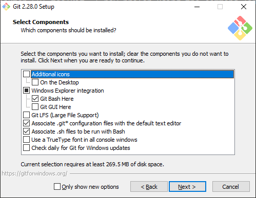
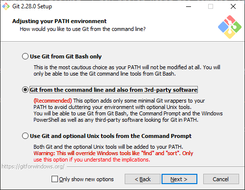
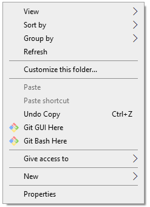
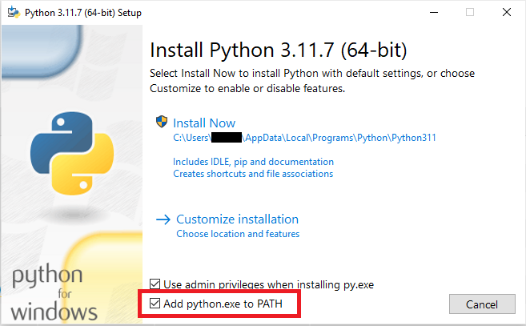
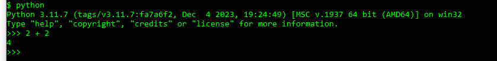
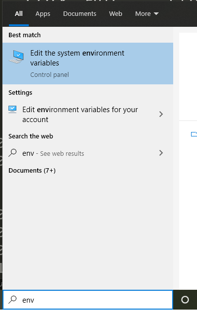
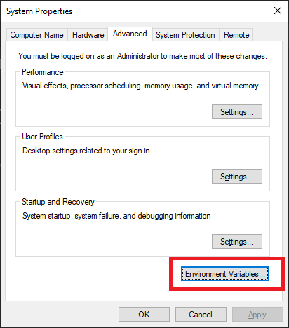
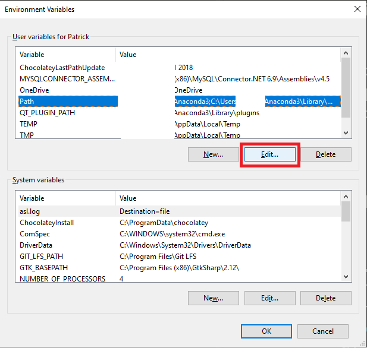
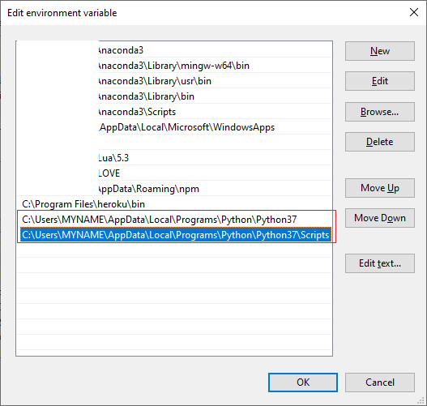
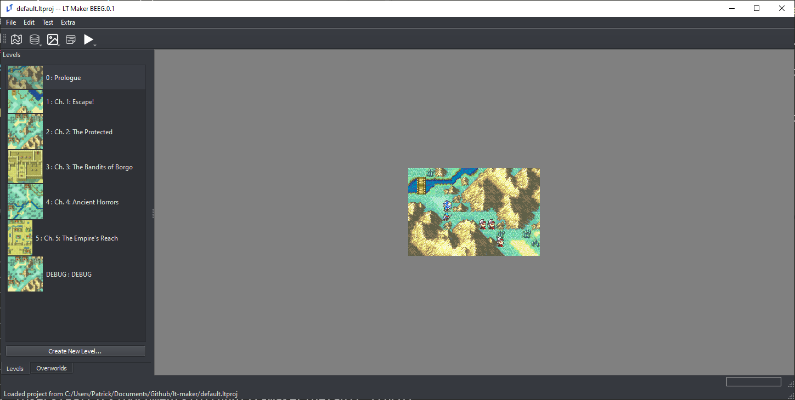

<a href="../../index.html" class="icon icon-home">lt-maker</a>

Contents:

- <a href="../home.html" class="reference internal">Lex Talionis Wiki</a>

Getting Started:

- <a href="index.html" class="reference internal">Getting Started</a>
  - <a href="Getting-Started.html" class="reference internal">Getting
    Started</a>
  - <a href="Python-Installation.html#"
    class="current reference internal">Necessary Installs (for Windows)</a>
    - <a
      href="Python-Installation.html#how-to-install-git-python-pip-pygame-and-pyqt-from-scratch-on-a-windows-machine"
      class="reference internal">How to install Git, Python, Pip, Pygame, and
      PyQt from scratch on a Windows machine</a>
    - <a href="Python-Installation.html#installing-git"
      class="reference internal">Installing Git</a>
    - <a href="Python-Installation.html#installation-process"
      class="reference internal">Installation Process</a>
    - <a href="Python-Installation.html#testing"
      class="reference internal">Testing</a>
    - <a href="Python-Installation.html#installing-python"
      class="reference internal">Installing Python</a>
    - <a href="Python-Installation.html#python-overview"
      class="reference internal">Python Overview</a>
    - <a href="Python-Installation.html#installing-pip"
      class="reference internal">Installing Pip</a>
    - <a href="Python-Installation.html#installing-requirements"
      class="reference internal">Installing Requirements</a>
    - <a href="Python-Installation.html#updating-the-engine-python-git"
      class="reference internal">Updating the Engine (Python/Git)</a>
  - <a href="making-a-basic-map.html" class="reference internal">The
    Basics</a>
  - <a href="Build-Engine.html" class="reference internal">Build Engine</a>

Editor Guides:

- <a href="../editors/Editors-Overview.html"
  class="reference internal">Editors Overview</a>
- <a href="../editors/index.html" class="reference internal">Editors</a>

Events:

- <a href="../events/index.html" class="reference internal">Events</a>

Guides:

- <a href="../guides/Guides-Overview.html"
  class="reference internal">Guides Overview</a>
- <a href="../guides/index.html" class="reference internal">Guides</a>

appendix:

- <a href="../appendix/Text-Formatting-Commands.html"
  class="reference internal">Text Formatting Commands</a>
- <a href="../appendix/Item-Component-Reference.html"
  class="reference internal">Item Component Dictionary</a>
- <a href="../appendix/Skill-Component-Reference.html"
  class="reference internal">Skill Component Dictionary</a>
- <a href="../appendix/Special-Variables.html"
  class="reference internal">Special Variables</a>
- <a href="../appendix/Special-Tags.html"
  class="reference internal">Special Tags</a>
- <a href="../appendix/trigger-reference.html"
  class="reference internal">Event Triggers</a>
- <a href="../appendix/Random-Seed-Mechanics.html"
  class="reference internal">Random Seed Mechanics</a>
- <a href="../appendix/FAQ.html" class="reference internal">Frequently
  Asked Questions</a>
- <a href="../appendix/Contributing_to_the_LTWiki.html"
  class="reference internal">Contributing to the LTWiki</a>
- <a href="../appendix/index.html" class="reference internal">Code
  Documentation</a>

[lt-maker](../../index.html)

- 
- [Getting Started](index.html)
- Necessary Installs (for Windows)
- <a
  href="https://gitlab.com/rainlash/lt-maker/blob/master/docs/source/getting_started/Python-Installation.md"
  class="fa fa-gitlab">Edit on GitLab</a>

------------------------------------------------------------------------

# Necessary Installs (for Windows)<a href="Python-Installation.html#necessary-installs-for-windows"
class="headerlink" title="Link to this heading"></a>

## How to install Git, Python, Pip, Pygame, and PyQt from scratch on a Windows machine<a
href="Python-Installation.html#how-to-install-git-python-pip-pygame-and-pyqt-from-scratch-on-a-windows-machine"
class="headerlink" title="Link to this heading"></a>

> 

>
> Make sure before installing any of these, that you’ve uninstalled any
> previous versions of these tools from your machine. Having multiple
> version of Python on your machine can be a major headache.
>
> 

## Installing Git<a href="Python-Installation.html#installing-git" class="headerlink"
title="Link to this heading"></a>

Although I started using git with the Github Desktop GUI toolkit, I now
prefer using the command line version, and that is the version that will
be installed here.

https://git-scm.com/download/win

## Installation Process<a href="Python-Installation.html#installation-process"
class="headerlink" title="Link to this heading"></a>

If I don’t mention a specific screen, just use the defaults provided.

I recommend this setup for first time git users. Being able to access
“Git Bash” from right clicking on the explorer menu is invaluable, but
Git GUI is rather useless. You shouldn’t need Git LFS for this project.

Make sure you change the text editor to your text editor of choice. I
recommend Sublime Text Editor, although many other good text editors
exist (Notepad++ is another lightweight editor)

Choose the second option under “Adjusting your PATH Environment”, unless
you are sure you never want to use git outside of Git Bash (if so,
choose the first).

Choose the defaults for the remaining options, unless you have a good
reason not to.

Now git should be installed.

## Testing<a href="Python-Installation.html#testing" class="headerlink"
title="Link to this heading"></a>

Let’s make sure git works.

You should be able to right-click in the File Explorer and open Git Bash
by left-clicking “Git Bash”

A command line terminal should pop up.

Type
`git`` ``--version` to
make sure git responds.

Then navigate to where you want the engine to live and type

    git clone --depth=1 https://gitlab.com/rainlash/lt-maker.git

This will clone the repository to your machine, where you’ll have access
to it.

## Installing Python<a href="Python-Installation.html#installing-python" class="headerlink"
title="Link to this heading"></a>

https://www.python.org/downloads/release/python-3117/

Navigate down to “Files” on that webpage and click “Windows installer
(64-bit)” (assuming you have a 64-bit Windows machine).

The download should start automatically, then run the installer
executable.

I highly highly **HIGHLY** recommend adding Python 3.11 to PATH. This
makes so many of the errors that new users of Python run into just
disappear. Make sure to click that check box. Then, click “Install Now”.
the default installation options should be fine.

Now you should have Python installed on your machine. Open a new Git
Bash somewhere on your machine and type
`python`` ``--version`
or `py`` ``--version`
or
`python3`` ``--version`
to confirm that Python works.

Whichever one works (`python` or
`py` or `python3`)
will be the command you will use in the future to call Python. In the
rest of this tutorial, I will be using `python`
because that is how it is on my machine, but if
`py` or `python3`
works for you, use that one instead.

## Python Overview<a href="Python-Installation.html#python-overview" class="headerlink"
title="Link to this heading"></a>

You can type just `python` on the Git Bash
command line to get the interactive Python REPL, which lets you enter in
python commands interactively. For instance, typing in “2 + 2” gives
you…

To run a Python script, just type `python` and
then the script’s file name. You must be in the same directory as the
script, otherwise you must give python the relative path to the script.

This means that in order to run python scripts in the lt-maker
directory, you should run python from within the lt-maker directory.

**Python Command Not Found**

If the python command is not found, and you didn’t add Python to your
PATH during installation, you will need to update your PATH so that
Windows knows where Python lives.

Newer versions of Python like the one you installed generally live in
`C:\Users\{Your`` ``User}\AppData\Local\Programs\Python\Python311`

If you navigate to there, you should see a python.exe executable. This
is the actual python you would be running if the PATH was set up
correctly.

In Windows 10, type “env” in the search bar and click the “Edit the
System Environment Variables” option.

A dialog box will pop up. Click “Environment Variables…”.

Under User Variables (the top table), click on the “Path” row, then
click “Edit…”.

Click “New” on the right. Type the location of your Python executable,
in this case:
`C:\Users\{Your`` ``User}\AppData\Local\Programs\Python\Python31`.
Hit Enter. Click New again and type in the path to the associated
Scripts directory.
`C:\Users\{Your`` ``User}\AppData\Local\Programs\Python\Python31\Scripts`.

Now click OK, exit out of the whole thing, and open a new Git Bash. Try
running
`python`` ``--version`
again, and your Python should work now.

------------------------------------------------------------------------

## Installing Pip<a href="Python-Installation.html#installing-pip" class="headerlink"
title="Link to this heading"></a>

Pip is the Python package manager. It means from here on out, we don’t
need to download stuff off random websites to get the rest of our tools.
These days, if you install Python with the defaults, pip comes bundled
with Python.

Make sure it’s available by typing

    pip --version

or

    python -m pip --version

in the command line.

> 

>
> If during any of the installations, you find that you need
> administrator privileges to install for all users, you can install for
> just yourself with
> `pip`` ``install`` ``{package_name}`` ``--user`.
>
> 

## Installing Requirements<a href="Python-Installation.html#installing-requirements"
class="headerlink" title="Link to this heading"></a>

    pip install -r requirements_editor.txt

or

    python -m pip install -r requirements_editor.txt

Wow, that was easy. It should’ve installed, along with all other
dependencies.

Test if it works

    python -m pygame.examples.aliens

Now test if the engine works by typing

    python run_engine.py

from within the “lt-maker” directory.

The engine main screen should pop up and you should be able to play the
Lion Throne.

Now test if LT-Maker works by typing

    python run_editor.py

from within the “lt-maker” directory.

The editor should pop up and you should be able to begin making your own
fangame.

> 

>
> Some users have reported that on Linux systems (specifically Ubuntu),
> PyQt5 installation does not work. In that case, try:
> `sudo`` ``apt-get`` ``install`` ``python3-pyqt5`
> instead.
>
> 

Once installed, you can follow the second part of the
<a href="Build-Engine.html" class="reference internal">Build Engine</a> guide to distribute your
project as an executable.

## Updating the Engine (Python/Git)<a href="Python-Installation.html#updating-the-engine-python-git"
class="headerlink" title="Link to this heading"></a>

If you are using Git and Python to download and run the engine, updating
the engine is simple.

When changes are made to the Lex Talionis Engine, you can update to the
newest changes by typing
`git`` ``pull` in Git
Bash while within your “lt-maker” directory. This will pull the newest
changes from the git repo on Gitlab and automatically add them to your
installation.

If you’ve made significant changes to the engine code itself, and
`git`` ``pull` no
longer works well for you, ask around on the Discord for advice.

<a href="Getting-Started.html" class="btn btn-neutral float-left"
accesskey="p" rel="prev" title="Getting Started"> Previous</a>
<a href="making-a-basic-map.html" class="btn btn-neutral float-right"
accesskey="n" rel="next" title="The Basics">Next </a>

------------------------------------------------------------------------

© Copyright 2024, rainlash.

Built with [Sphinx](https://www.sphinx-doc.org/) using a
[theme](https://github.com/readthedocs/sphinx_rtd_theme) provided by
[Read the Docs](https://readthedocs.org).

