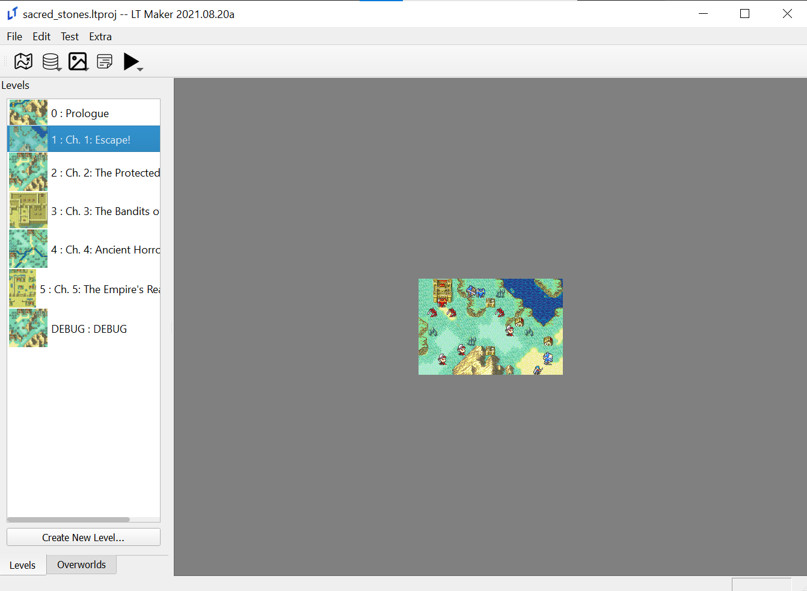
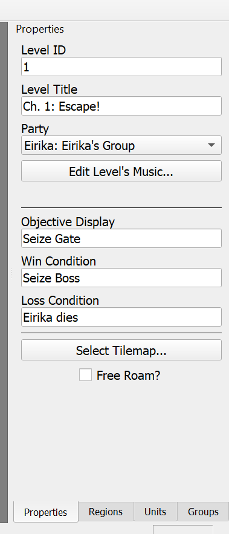
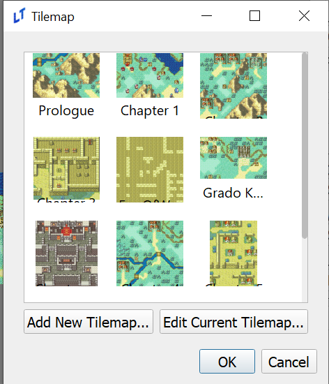
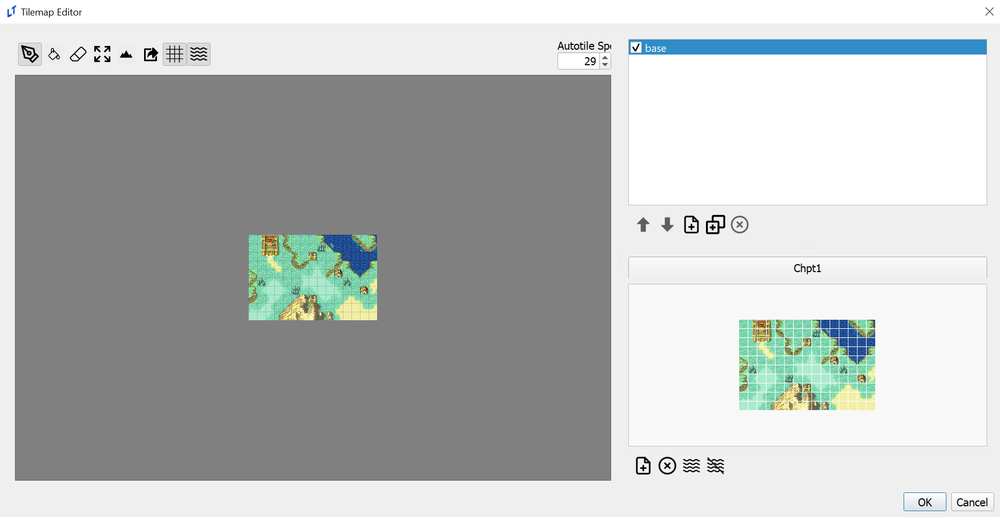
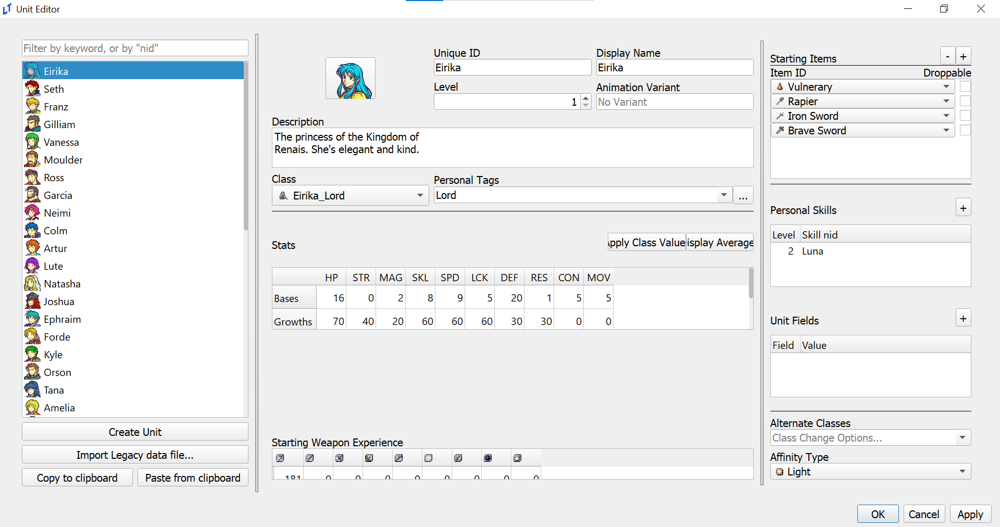
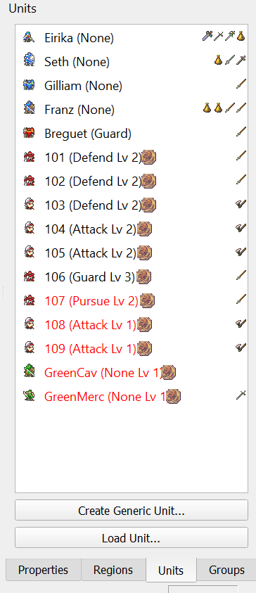
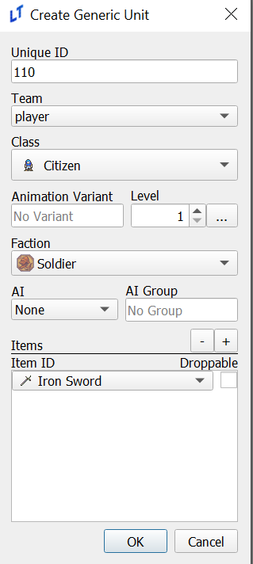
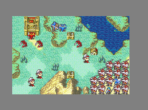

<a href="../../index.html" class="icon icon-home">lt-maker</a>

Contents:

- <a href="../home.html" class="reference internal">Lex Talionis Wiki</a>

Getting Started:

- <a href="index.html" class="reference internal">Getting Started</a>
  - <a href="Getting-Started.html" class="reference internal">Getting
    Started</a>
  - <a href="Python-Installation.html" class="reference internal">Necessary
    Installs (for Windows)</a>
  - <a href="making-a-basic-map.html#"
    class="current reference internal">The Basics</a>
  - <a href="Build-Engine.html" class="reference internal">Build Engine</a>

Editor Guides:

- <a href="../editors/Editors-Overview.html"
  class="reference internal">Editors Overview</a>
- <a href="../editors/index.html" class="reference internal">Editors</a>

Events:

- <a href="../events/index.html" class="reference internal">Events</a>

Guides:

- <a href="../guides/Guides-Overview.html"
  class="reference internal">Guides Overview</a>
- <a href="../guides/index.html" class="reference internal">Guides</a>

appendix:

- <a href="../appendix/Text-Formatting-Commands.html"
  class="reference internal">Text Formatting Commands</a>
- <a href="../appendix/Item-Component-Reference.html"
  class="reference internal">Item Component Dictionary</a>
- <a href="../appendix/Skill-Component-Reference.html"
  class="reference internal">Skill Component Dictionary</a>
- <a href="../appendix/Special-Variables.html"
  class="reference internal">Special Variables</a>
- <a href="../appendix/Special-Tags.html"
  class="reference internal">Special Tags</a>
- <a href="../appendix/trigger-reference.html"
  class="reference internal">Event Triggers</a>
- <a href="../appendix/Random-Seed-Mechanics.html"
  class="reference internal">Random Seed Mechanics</a>
- <a href="../appendix/FAQ.html" class="reference internal">Frequently
  Asked Questions</a>
- <a href="../appendix/Contributing_to_the_LTWiki.html"
  class="reference internal">Contributing to the LTWiki</a>
- <a href="../appendix/index.html" class="reference internal">Code
  Documentation</a>

[lt-maker](../../index.html)

- 
- [Getting Started](index.html)
- The Basics
- <a
  href="https://gitlab.com/rainlash/lt-maker/blob/master/docs/source/getting_started/making-a-basic-map.md"
  class="fa fa-gitlab">Edit on GitLab</a>

------------------------------------------------------------------------

# The Basics<a href="making-a-basic-map.html#the-basics" class="headerlink"
title="Link to this heading"></a>

Due to the sheer amount of editors available in Lex Talionis it can be
very easy to become overwhelmed when first starting out. This page will
provide a short guide on how to learn some of the essentials of any LT
game - interacting with level properties, editing the map, and making
and placing units.

First, go to “File” in the top left corner and select the
sacred_stones.ltproj folder in the window that appears.

Your window should now look like this:

Double click on chapter 1 to open the level editor. The right side of
the window should now look like this:

We’ll go through each piece of information, starting from the top.

1.  Level ID - The level’s number in the context of your game. It’s not
    that important, just make sure not to have two levels with the same
    ID.

2.  Level Title - This is the name the player sees when the chapter
    starts

3.  Party - If you were using split parties, like in Sacred Stones or
    Gaiden, this would be useful. Ignore it for now.

4.  Music - This button opens a new screen where the level’s music can
    be changed. You can open it if you want, but it isn’t immediately
    relevant.

5.  Objective Display, Win Condition, Loss Condition - All three of
    these have self-explanatory names, but it’s important to remember
    that these aren’t *actually* what determines the win and loss
    condition. They only determine what the player sees in the chapter.
    The win and loss condition are determined through the win_game and
    lose_game commands in events. See the events section for more
    details.

6.  Select Tilemap - This button would allow us to select and edit the
    map itself. We’ll click it in just a second.

7.  Free Roam? - This toggles the engine’s free roam feature in the
    context of this level. Free Roam works identically to Fates’ My
    Castle or Three Houses’ Monastery, but can be set at the start of
    the level as well as changed partway through it.

Now that we’ve gone through these options, click “Select Tilemap”.
That’ll open a window that looks like this:

Select the image above Chapter 1 and choose “Edit Current Tilemap”. That
will open the tilemap editor.

The window on the left side is your map preview. The box in the top
right, currently with base highlighted and checked, is your layer
selection. The map in the bottom right is your tileset. Left click on a
tile in the tileset and then left click on the map. Voila, the map has
changed!

Now we’ll add terrain to the map. Move your mouse to the top icons and
click the icon that looks like a mountain. A new bar will appear on the
left and the map will look quite colorful. Scroll through that bar and
look at the options currently available. More options can be added in
the terrain editor, but for now choose one and left click a few times on
the map. You should see that the terrain has now changed.

Let’s run a quick test. Hit “ok” in the Tilemap Editor, “ok” in the
other pop-up screen, and then hit F5. That will run the currently
selected chapter. Whatever changes you made should now appear on the
map!

Finally, we’ll look at making and placing units. In the top left of the
main window, click “Edit” and “Units”. This will bring up the Unit
editor.

There’s a lot of information here, but most is self explanatory. Try
messing around with Eirika’s stats or class, and maybe give her a few
weapons. Remember, both the character and their class must be able to
use a weapon type!

Once you’re done hit “Apply” and go back to the level editor. Click the
“Units” tab in the bottom right.

You can see a list of unit icons, names, and items. Each unit has a word
in parentheses next to their names, which corresponds to their AI
typing. Player units always have None for AI, while units here have a
mix of guard and defend. From Meinerieve:

1.  Pursue: Hunt you down across the map.

2.  Attack: If I can move and attack this or next turn I will

3.  Defend: Only attack what comes into my range

4.  Guard: Don’t move but will attack if in my item range.

Double clicking on one of these units will show information about them,
which is especially helpful for red and green generic units. Once one is
selected, right click to move them on the map.

Finally, let’s create a unit. Click the “Create Generic Unit” button at
the bottom.

You can see a lot of information here, but it’s largely the same as the
Unit editor. The key difference is that the unit will be able to use any
weapon you give them so long as their class can, and that you can’t
directly change these units’ stats. Instead, they take their class
average values at their level, plus any difficulty modifiers given to
them.

If you click on “Team” you can see four options. Most are self
explanatory, but it’s worthwhile to highlight enemy2, which are purple
units that attack both red, green, and blue units. Anyway, go ahead and
make a few, placing them down to block Eirika’s path. You’ll notice that
it saves your last settings each time you go to make a new generic unit,
making placing down a whole lot of enemies quite easy!

Mwahaha!

This is the end of our starter tutorial. You should now have all the
tools you need to create basic maps in Lex Talionis, as well as create
characters for them. As you dive deeper into the engine you’ll certainly
encounter more challenges and have more questions. The Lex Talionis
discord is the perfect place to ask them, and hopefully this wiki will
be able to provide you with some answers as well.

<a href="Python-Installation.html" class="btn btn-neutral float-left"
accesskey="p" rel="prev" title="Necessary Installs (for Windows)"> Previous</a>
<a href="Build-Engine.html" class="btn btn-neutral float-right"
accesskey="n" rel="next" title="Build Engine">Next </a>

------------------------------------------------------------------------

© Copyright 2024, rainlash.

Built with [Sphinx](https://www.sphinx-doc.org/) using a
[theme](https://github.com/readthedocs/sphinx_rtd_theme) provided by
[Read the Docs](https://readthedocs.org).

