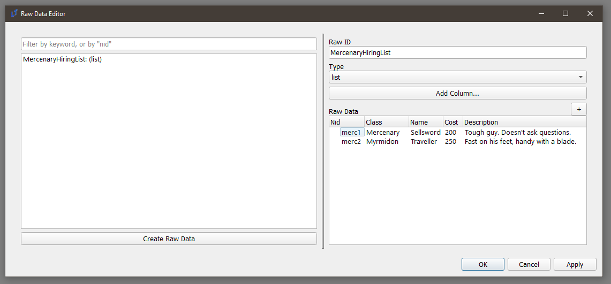
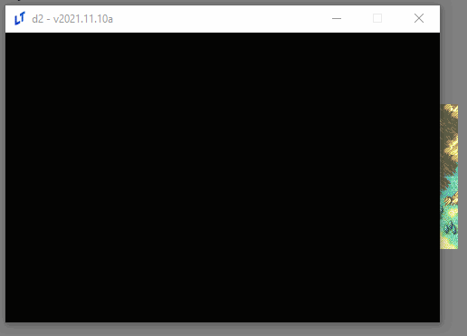
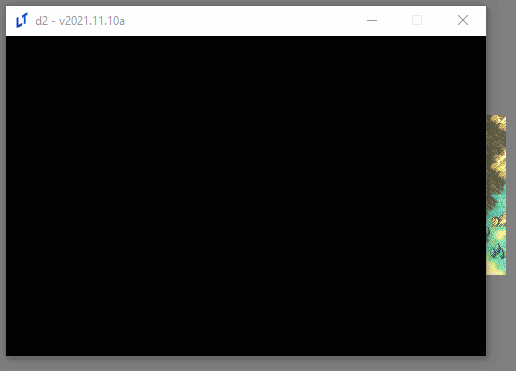
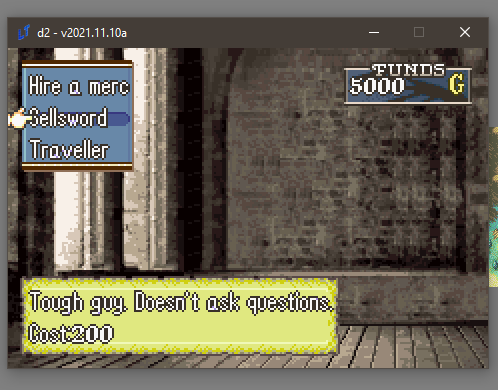
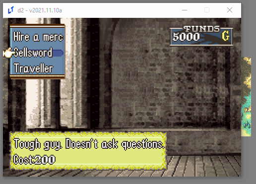

<a href="../../../index.html" class="icon icon-home">lt-maker</a>

Contents:

- <a href="../../home.html" class="reference internal">Lex Talionis
  Wiki</a>

Getting Started:

- <a href="../../getting_started/index.html"
  class="reference internal">Getting Started</a>

Editor Guides:

- <a href="../../editors/Editors-Overview.html"
  class="reference internal">Editors Overview</a>
- <a href="../../editors/index.html"
  class="reference internal">Editors</a>

Events:

- <a href="../../events/index.html" class="reference internal">Events</a>

Guides:

- <a href="../Guides-Overview.html" class="reference internal">Guides
  Overview</a>
- <a href="../index.html" class="reference internal">Guides</a>
  - <a href="../setup_tutorials/index.html"
    class="reference internal">Project Setup Tutorials</a>
  - <a href="index.html" class="reference internal">Eventing Tutorials</a>
    - <a href="Arena.html" class="reference internal">GBA-style Arena</a>
    - <a href="Breakable-Walls.html" class="reference internal">Breakable
      Walls</a>
    - <a href="Death-Quotes.html" class="reference internal">Universal Death
      Quotes Tutorial</a>
    - <a href="Choices-and-Battle-Saves.html"
      class="reference internal">Choices and Battle Saves</a>
    - <a href="Unit-Groups.html" class="reference internal">Unit Groups</a>
    - <a href="Achievements.html" class="reference internal">Achievements</a>
    - <a href="A-Simple-Mercenary-Shop.html#"
      class="current reference internal">A Simple Mercenary Shop Tutorial</a>
      - <a href="A-Simple-Mercenary-Shop.html#problem-description"
        class="reference internal">Problem Description</a>
      - <a href="A-Simple-Mercenary-Shop.html#solution"
        class="reference internal">Solution</a>
      - <a href="A-Simple-Mercenary-Shop.html#raw-data"
        class="reference internal">Raw Data</a>
      - <a href="A-Simple-Mercenary-Shop.html#choice-eventing"
        class="reference internal">Choice Eventing</a>
      - <a href="A-Simple-Mercenary-Shop.html#textboxes-for-fun-and-profit"
        class="reference internal">Textboxes for fun and profit</a>
      - <a href="A-Simple-Mercenary-Shop.html#events-from-choices"
        class="reference internal">Events from Choices</a>
      - <a href="A-Simple-Mercenary-Shop.html#reference"
        class="reference internal">Reference</a>
    - <a href="Promotion-Personal-Skills.html"
      class="reference internal">Promotion Personal Skills Tutorial</a>
  - <a href="../skill_item_tutorials/index.html"
    class="reference internal">Skill and Item Tutorials</a>

appendix:

- <a href="../../appendix/Text-Formatting-Commands.html"
  class="reference internal">Text Formatting Commands</a>
- <a href="../../appendix/Item-Component-Reference.html"
  class="reference internal">Item Component Dictionary</a>
- <a href="../../appendix/Skill-Component-Reference.html"
  class="reference internal">Skill Component Dictionary</a>
- <a href="../../appendix/Special-Variables.html"
  class="reference internal">Special Variables</a>
- <a href="../../appendix/Special-Tags.html"
  class="reference internal">Special Tags</a>
- <a href="../../appendix/trigger-reference.html"
  class="reference internal">Event Triggers</a>
- <a href="../../appendix/Random-Seed-Mechanics.html"
  class="reference internal">Random Seed Mechanics</a>
- <a href="../../appendix/FAQ.html" class="reference internal">Frequently
  Asked Questions</a>
- <a href="../../appendix/Contributing_to_the_LTWiki.html"
  class="reference internal">Contributing to the LTWiki</a>
- <a href="../../appendix/index.html" class="reference internal">Code
  Documentation</a>

[lt-maker](../../../index.html)

- 
- [Guides](../index.html)
- [Eventing Tutorials](index.html)
- A Simple Mercenary Shop Tutorial
- <a
  href="https://gitlab.com/rainlash/lt-maker/blob/master/docs/source/guides/eventing_tutorials/A-Simple-Mercenary-Shop.md"
  class="fa fa-gitlab">Edit on GitLab</a>

------------------------------------------------------------------------

# A Simple Mercenary Shop Tutorial<a href="A-Simple-Mercenary-Shop.html#a-simple-mercenary-shop-tutorial"
class="headerlink" title="Link to this heading"></a>

## Problem Description<a href="A-Simple-Mercenary-Shop.html#problem-description"
class="headerlink" title="Link to this heading"></a>

I’d like to make a
<a href="Choices-and-Battle-Saves.html" class="reference internal">choice menu</a> shop that, say, hires
mercenaries for the map to make it easier.

## Solution<a href="A-Simple-Mercenary-Shop.html#solution" class="headerlink"
title="Link to this heading"></a>

First, please read the choice menu documentation linked above for a
basic intro to choices. Having done that, this should be more or less
straightforward.

## Raw Data<a href="A-Simple-Mercenary-Shop.html#raw-data" class="headerlink"
title="Link to this heading"></a>

First, let’s do some preparatory work. We need some data first; what
classes should we use? What will their names be? How much will they
cost? Do we want flavor text? How about all of the above?

In the **Raw Data Editor**, you can write all of these down:

This is just data; it doesn’t do anything, but we can access it
elsewhere.

## Choice Eventing<a href="A-Simple-Mercenary-Shop.html#choice-eventing"
class="headerlink" title="Link to this heading"></a>

Such as in a choice command:

    choice;MercenaryHireChoice;Hire a merc;{eval:','.join([merc.nid + '|' + merc.Name for merc in game.get_data('MercenaryHiringList')])};;vert;top_left;;;persist

Let’s break this command down.

1.  `choice` - this is a
    `choice` command. You know what those are,
    right?

2.  `MercenaryHireChoice` - this is the nid
    we’re going to save our choice in.

3.  `Hire`` ``a`` ``merc` -
    this is the flavor text for the choice.

4.  `{eval:','.join([merc.nid`` ``+`` ``'|'`` ``+`` ``merc.Name`` ``for`` ``merc`` ``in`` ``game.get_data('MercenaryHiringList')])}` -
    now we’re getting somewhere. This is an eval that

    1.  Gets all of the data we write in the raw data editor (
        `game.get_data('MercenaryHiringList')`)

    2.  Iterates through it, and makes a list that looks like this:
        `['merc1|Sellsword',`` ``'merc2|Traveller']`

        1.  Note the bar notation - that means that the first thing (
            `merc1,`` ``merc2`
            ) is going to be what’s saved in the choice, while the
            second (
            `Sellsword,`` ``Traveller`)
            is what’s going to be displayed.

    3.  Turns the list into a string (
        `','.join()`) that the choice command
        understands:
        `merc1|Sellsword,merc2|Traveller`

5.  `vert;top_left` - puts makes the menu
    vertical and puts in the top-left, since having all choices in the
    center doesn’t look that great, and

6.  `persist` - makes sure that we can make
    multiple choices on this menu, like a true shop.

Let’s add a command to make sure we’ve written it all correctly
(remember, press ‘B’ to end the choice, since otherwise it won’t,
because it’s persistent):

    choice;MercenaryHireChoice;Hire a merc;{eval:','.join([merc.nid + '|' + merc.Name for merc in game.get_data('MercenaryHiringList')])};;vert;top_left;;;persist
    speak;Eirika;you chose {var:MercenaryHireChoice}

Looking good. But wait; don’t we want to know the price and our current
money, to see if we can afford it?

## Textboxes for fun and profit<a href="A-Simple-Mercenary-Shop.html#textboxes-for-fun-and-profit"
class="headerlink" title="Link to this heading"></a>

We can use textboxes, in concert with
`expression` data types and the data we wrote
earlier, to display these things. Be warned: this one’s a doozy.

    textbox;MercDescription;"{d:MercenaryHiringList.{v:MercenaryHireChoice_choice_hover}.Description}|Cost: {d:MercenaryHiringList.{v:MercenaryHireChoice_choice_hover}.Cost}";bottom;;3;;0.25;;;menu_bg_parchment;expression

You probably want to copy that into a different text editor to look at
while reading this tutorial, since it’s *long*.

Let’s break it down:

1.  `textbox` - this is just the command.

2.  `MercDescription` - this is the nid of our
    table. We’ll need to use it to delete the table after we’re done
    with it.

3.  And, the star of the show, the expression. Don’t be afraid; it’s
    long, but it’s simple.

`"{d:MercenaryHiringList.{v:MercenaryHireChoice_choice_hover}.Description}|Cost:`` ``{d:MercenaryHiringList.{v:MercenaryHireChoice_choice_hover}.Cost}"`

1.  `"{d:MercenaryHiringList.{v:MercenaryHireChoice_choice_hover}.Description}"` -
    This is a method of querying raw data. Using the
    `{d:}` command (which is shorthand for
    `{data:}`), you can fetch the
    MercenaryHiringList directly.

    1.  `{v:MercenaryHireChoice_choice_hover}` -
        We can actually access the currently-hovered choice in the
        choice with nid `MercenaryHireChoice`
        by attaching `_choice_hover` to it.
        Therefore, this resolves to either
        `merc1`, or
        `merc2`, depending on what’ being
        hovered at the moment.

    2.  Once you know that, it’s simple to see what this code block is
        doing. It resolves to something like,
        `MercenaryHiringList.merc1.Description`,
        which is a way to get the `merc1` row
        in our raw data, and getting their Description and Cost fields.

    3.  Finally, we wrap the whole thing in quotations
        `""`, since this is meant to be a
        Python string. We use a newline separator,
        `|`, to separate the cost and
        description lines. This should be familiar - you use this for
        `speak` commands, as well.

2.  `bottom` - puts the textbox in the bottom.
    Don’t want the screen to get too busy, right?

3.  `3` - this indicates the number of lines of
    the textbox.

4.  `0.25` - this is the TextSpeed. We want the
    text to display much faster, so we use a low value.

5.  `menu_bg_parchment` - let’s use a different
    menu bg for this one for aesthetics. (This actually looks uglier,
    but I needed to work bgs into a tutorial somehow).

6.  `expression`. This is the other star of the
    show. This tells the engine to constantly eval the expression that
    we wrote above, and update the table with it.

Let’s look at our work:

Great success!

We also need a gold display. This one is easy in comparison:

    textbox;GoldDisplay;game.get_money();top_right;60;;;;;;funds_display;expression

Another breakdown:

1.  `GoldDisplay` is the NID of the table.

2.  `game.get_money()` is yet another
    `expression` that returns the current gold.

3.  `60` is a field we haven’t used before, the
    `Width` field - this determines the width
    of the field. I use this here mostly for aesthetics; otherwise, the
    gold number won’t be aligned with the left side of the bg.

4.  `funds_display` is the name of the stunning
    BG you’re about to see. Unlike the others, this one is a sprite, not
    a menu_bg, and therefore doesn’t automatically resize itself.
    Choices and textboxes support both bgs. You may find that your bg is
    off-center. You’ll simply have to make new sprites that are offset
    correctly.

5.  `expression` - what would we do without
    you?

Lookin’ good!

Finally, let’s tie it all together.

## Events from Choices<a href="A-Simple-Mercenary-Shop.html#events-from-choices"
class="headerlink" title="Link to this heading"></a>

Let’s write a confirmation dialogue event, similar to the one in the
existing choice tutorial. Let’s name this **ConfirmMercHire.**

    choice;Confirmation;You sure?;Yes,No
    if;'{v:Confirmation}' == 'Yes'
        alert;You hired {d:MercenaryHiringList.{v:MercenaryHireChoice}.Name}.
        give_money;{eval: -1 * int({d:MercenaryHiringList.{v:MercenaryHireChoice}.Cost})};no_banner
        make_generic;;{d:MercenaryHiringList.{v:MercenaryHireChoice}.Class};{e:game.get_unit('Eirika').level};player;;Soldier (Soldier);;Iron Sword (Iron Sword)
        add_unit;{created_unit};(3, 4);immediate;closest
        speak;;{d:MercenaryHiringList.{v:MercenaryHireChoice}.Class}
    end

All of this should be straightforward; display an alert, remove gold via
the same expression that we’ve been using this entire time to read from
our raw data; make a generic unit with the klass from that same raw
data, and then add the newly `{created_unit}`
(the output of `make_generic`) to the map.

Let’s add this to the main command:

    choice;MercenaryHireChoice;Hire a merc;{eval:','.join([merc.nid + '|' + merc.Name for merc in game.get_data('MercenaryHiringList')])};;vert;top_left;;ConfirmMercHire;persist

Let’s see what happens now:

And we’re done.

## Reference<a href="A-Simple-Mercenary-Shop.html#reference" class="headerlink"
title="Link to this heading"></a>

Here is the code used in this tutorial:

**Main code:**

    textbox;MercDescription;"{d:MercenaryHiringList.{v:MercenaryHireChoice_choice_hover}.Description}|Cost: {d:MercenaryHiringList.{v:MercenaryHireChoice_choice_hover}.Cost}";bottom;;3;;0.25;;;menu_bg_parchment (menu_bg_parchment);expression
    textbox;GoldDisplay;game.get_money();top_right;60;;;;;;funds_display (funds_display);expression
    choice;MercenaryHireChoice;Hire a merc;{eval:','.join([merc.nid + '|' + merc.Name for merc in game.get_data('MercenaryHiringList')])};;vert;top_left;;ConfirmMercHire;persist
    remove_table;MercDescription
    remove_table;GoldDisplay

**Confirmation dialogue code (ConfirmMercHire):**

    choice;Confirmation;You sure?;Yes,No
    if;'{v:Confirmation}' == 'Yes'
        alert;You hired {d:MercenaryHiringList.{v:MercenaryHireChoice}.Name}.
        give_money;{eval: -1 * int({d:MercenaryHiringList.{v:MercenaryHireChoice}.Cost})};no_banner
        make_generic;;{d:MercenaryHiringList.{v:MercenaryHireChoice}.Class};{e:game.get_unit('Eirika').level};player;;Soldier (Soldier);;Iron Sword
        add_unit;{created_unit};(3, 4);immediate;closest
    end

<a href="Achievements.html" class="btn btn-neutral float-left"
accesskey="p" rel="prev" title="Achievements"> Previous</a>
<a href="Promotion-Personal-Skills.html"
class="btn btn-neutral float-right" accesskey="n" rel="next"
title="Promotion Personal Skills Tutorial">Next </a>

------------------------------------------------------------------------

© Copyright 2024, rainlash.

Built with [Sphinx](https://www.sphinx-doc.org/) using a
[theme](https://github.com/readthedocs/sphinx_rtd_theme) provided by
[Read the Docs](https://readthedocs.org).

