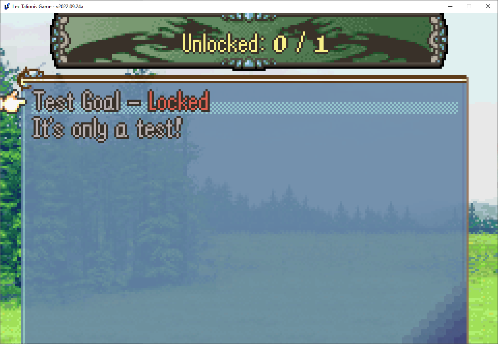
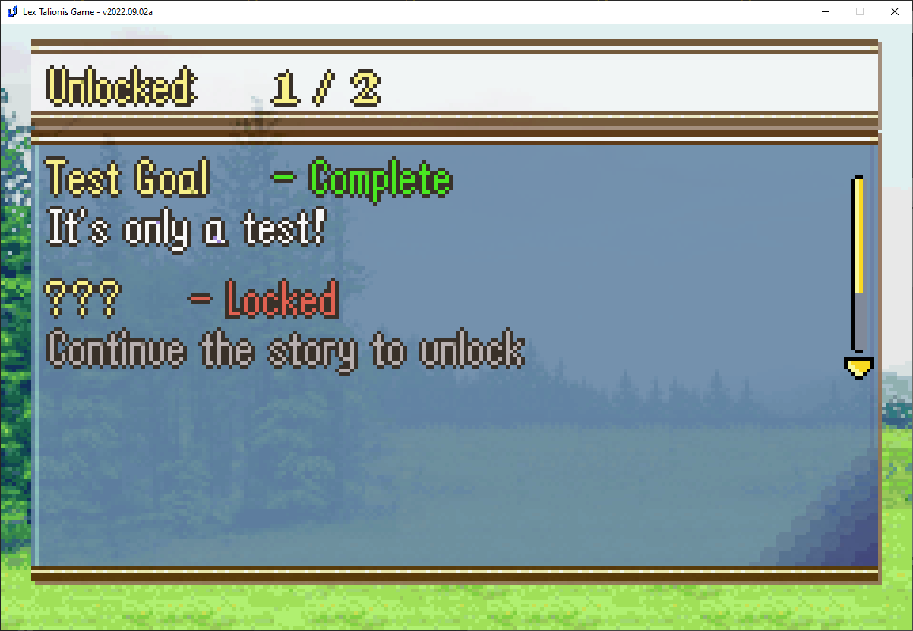
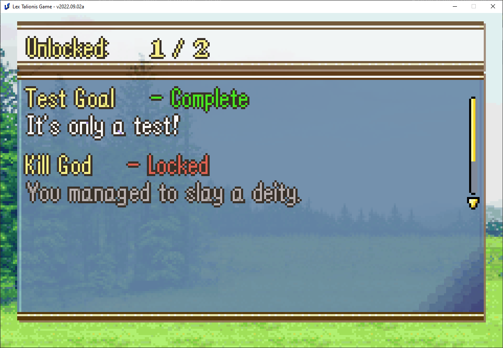

<a href="../../../index.html" class="icon icon-home">lt-maker</a>

Contents:

- <a href="../../home.html" class="reference internal">Lex Talionis
  Wiki</a>

Getting Started:

- <a href="../../getting_started/index.html"
  class="reference internal">Getting Started</a>

Editor Guides:

- <a href="../../editors/Editors-Overview.html"
  class="reference internal">Editors Overview</a>
- <a href="../../editors/index.html"
  class="reference internal">Editors</a>

Events:

- <a href="../../events/index.html" class="reference internal">Events</a>

Guides:

- <a href="../Guides-Overview.html" class="reference internal">Guides
  Overview</a>
- <a href="../index.html" class="reference internal">Guides</a>
  - <a href="../setup_tutorials/index.html"
    class="reference internal">Project Setup Tutorials</a>
  - <a href="index.html" class="reference internal">Eventing Tutorials</a>
    - <a href="Arena.html" class="reference internal">GBA-style Arena</a>
    - <a href="Breakable-Walls.html" class="reference internal">Breakable
      Walls</a>
    - <a href="Death-Quotes.html" class="reference internal">Universal Death
      Quotes Tutorial</a>
    - <a href="Choices-and-Battle-Saves.html"
      class="reference internal">Choices and Battle Saves</a>
    - <a href="Unit-Groups.html" class="reference internal">Unit Groups</a>
    - <a href="Achievements.html#"
      class="current reference internal">Achievements</a>
      - <a href="Achievements.html#basic-functionality"
        class="reference internal">Basic Functionality</a>
      - <a href="Achievements.html#secret-achievements"
        class="reference internal">Secret Achievements</a>
      - <a href="Achievements.html#player-record-storage"
        class="reference internal">Player record storage</a>
    - <a href="A-Simple-Mercenary-Shop.html" class="reference internal">A
      Simple Mercenary Shop Tutorial</a>
    - <a href="Promotion-Personal-Skills.html"
      class="reference internal">Promotion Personal Skills Tutorial</a>
  - <a href="../skill_item_tutorials/index.html"
    class="reference internal">Skill and Item Tutorials</a>

appendix:

- <a href="../../appendix/Text-Formatting-Commands.html"
  class="reference internal">Text Formatting Commands</a>
- <a href="../../appendix/Item-Component-Reference.html"
  class="reference internal">Item Component Dictionary</a>
- <a href="../../appendix/Skill-Component-Reference.html"
  class="reference internal">Skill Component Dictionary</a>
- <a href="../../appendix/Special-Variables.html"
  class="reference internal">Special Variables</a>
- <a href="../../appendix/Special-Tags.html"
  class="reference internal">Special Tags</a>
- <a href="../../appendix/trigger-reference.html"
  class="reference internal">Event Triggers</a>
- <a href="../../appendix/Random-Seed-Mechanics.html"
  class="reference internal">Random Seed Mechanics</a>
- <a href="../../appendix/FAQ.html" class="reference internal">Frequently
  Asked Questions</a>
- <a href="../../appendix/Contributing_to_the_LTWiki.html"
  class="reference internal">Contributing to the LTWiki</a>
- <a href="../../appendix/index.html" class="reference internal">Code
  Documentation</a>

[lt-maker](../../../index.html)

- 
- [Guides](../index.html)
- [Eventing Tutorials](index.html)
- Achievements
- <a
  href="https://gitlab.com/rainlash/lt-maker/blob/master/docs/source/guides/eventing_tutorials/Achievements.md"
  class="fa fa-gitlab">Edit on GitLab</a>

------------------------------------------------------------------------

# Achievements<a href="Achievements.html#achievements" class="headerlink"
title="Link to this heading"></a>

You may wish to create an achievement system for your game.
Alternatively, you may simply want to save content outside of a given
save file. This could be for a New Game+ feature, an Undertale-like
playthrough system, or timeline shenanigans. This guide will cover all
of these potential use cases.

## Basic Functionality<a href="Achievements.html#basic-functionality" class="headerlink"
title="Link to this heading"></a>

The create_achievement command creates a new achievement with the given
specifications and saves it to saves/PROJECTID-achievements.p.

`create_achievement;Sample;Test`` ``Goal;It's`` ``only`` ``a`` ``test!`

Try it out by putting this line before a base event command in any given
level. Test the level and go to Codex \> Achievements.

Voila! You have an incomplete achievement listed there. Of course, we’d
like to have the player be able to complete that achievement.

In any event you’d like, place this command:

`complete_achievement;Sample;1`

Where Sample is the NID of the achievement you created above. Run that
event then check the records screen again - the achievement will be
complete!

## Secret Achievements<a href="Achievements.html#secret-achievements" class="headerlink"
title="Link to this heading"></a>

Many games have achievements for defeating endgame bosses. In order to
avoid spoilers for those bosses, we’d like to hide some achievement
information from the player.

The first option we have is to only run the create_achievement command
when the boss is first defeated. That way the achievement won’t appear
in the Records menu early, since it won’t exist.

Most game platforms, like Steam, display certain achievements as
“Locked” prior to their completion. Let’s implement a system for our
game.

Create a new achievement.

`create_achievement;KillGodOrSomething;???;Continue`` ``the`` ``story`` ``to`` ``unlock;hidden`

Players can see that they haven’t unlocked all achievements, but will
naturally later on. We can use the update_achievement command to change
the details of the displayed achievement.

`update_achievement;KillGodOrSomething;Kill`` ``God;You`` ``managed`` ``to`` ``slay`` ``a`` ``deity.`

The details of the achievement have been updated.

## Player record storage<a href="Achievements.html#player-record-storage" class="headerlink"
title="Link to this heading"></a>

I’d like to remember if the player has completed the game. I can’t keep
that data tied to a particular save file, so the persistent record
system is perfect here.

Similarly to achievements, we’ll create a new record first.

`create_record;CompleteGame;False`

When you create or update a new record, remember that you must provide
it a valid Python expression after the name. It is therefore recommended
that you provide one of True, False, or a number unless you are
confident you know what you’re doing.

Similar to achievements, you can use update_record or replace_record to
change the value later. You can also check the value of records, as seen
below.

    if;RECORDS.get("CompleteGame")
        speak;Eirika;I've won before
    else
        speak;Eirika;I haven't won yet.
    end

<a href="Unit-Groups.html" class="btn btn-neutral float-left"
accesskey="p" rel="prev" title="Unit Groups"> Previous</a>
<a href="A-Simple-Mercenary-Shop.html"
class="btn btn-neutral float-right" accesskey="n" rel="next"
title="A Simple Mercenary Shop Tutorial">Next </a>

------------------------------------------------------------------------

© Copyright 2024, rainlash.

Built with [Sphinx](https://www.sphinx-doc.org/) using a
[theme](https://github.com/readthedocs/sphinx_rtd_theme) provided by
[Read the Docs](https://readthedocs.org).

