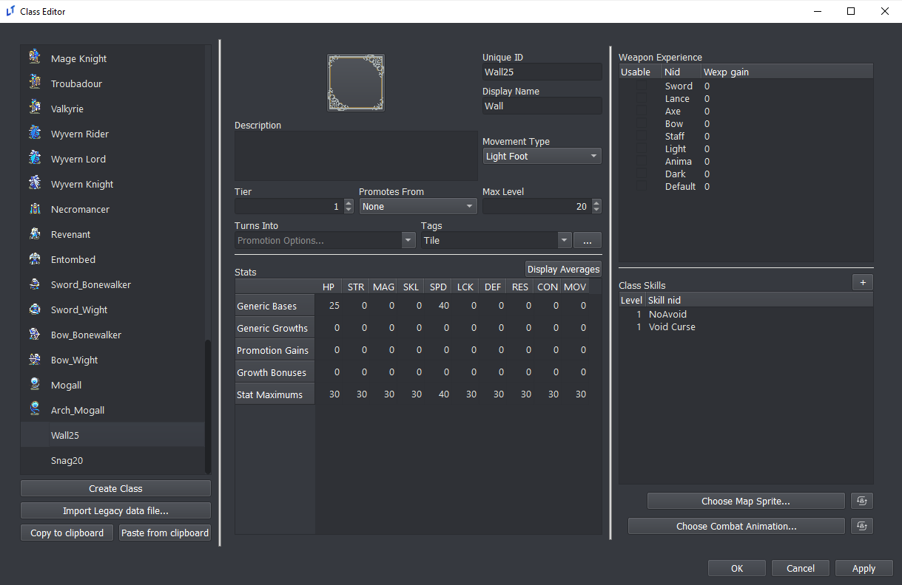
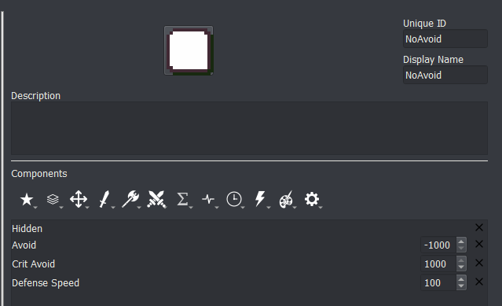
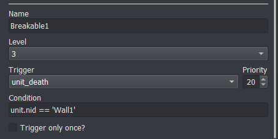

<a href="../../../index.html" class="icon icon-home">lt-maker</a>

Contents:

- <a href="../../home.html" class="reference internal">Lex Talionis
  Wiki</a>

Getting Started:

- <a href="../../getting_started/index.html"
  class="reference internal">Getting Started</a>

Editor Guides:

- <a href="../../editors/Editors-Overview.html"
  class="reference internal">Editors Overview</a>
- <a href="../../editors/index.html"
  class="reference internal">Editors</a>

Events:

- <a href="../../events/index.html" class="reference internal">Events</a>

Guides:

- <a href="../Guides-Overview.html" class="reference internal">Guides
  Overview</a>
- <a href="../index.html" class="reference internal">Guides</a>
  - <a href="../setup_tutorials/index.html"
    class="reference internal">Project Setup Tutorials</a>
  - <a href="index.html" class="reference internal">Eventing Tutorials</a>
    - <a href="Arena.html" class="reference internal">GBA-style Arena</a>
    - <a href="Breakable-Walls.html#"
      class="current reference internal">Breakable Walls</a>
      - <a href="Breakable-Walls.html#creating-a-breakable-wall"
        class="reference internal">Creating a breakable wall</a>
    - <a href="Death-Quotes.html" class="reference internal">Universal Death
      Quotes Tutorial</a>
    - <a href="Choices-and-Battle-Saves.html"
      class="reference internal">Choices and Battle Saves</a>
    - <a href="Unit-Groups.html" class="reference internal">Unit Groups</a>
    - <a href="Achievements.html" class="reference internal">Achievements</a>
    - <a href="A-Simple-Mercenary-Shop.html" class="reference internal">A
      Simple Mercenary Shop Tutorial</a>
    - <a href="Promotion-Personal-Skills.html"
      class="reference internal">Promotion Personal Skills Tutorial</a>
  - <a href="../skill_item_tutorials/index.html"
    class="reference internal">Skill and Item Tutorials</a>

appendix:

- <a href="../../appendix/Text-Formatting-Commands.html"
  class="reference internal">Text Formatting Commands</a>
- <a href="../../appendix/Item-Component-Reference.html"
  class="reference internal">Item Component Dictionary</a>
- <a href="../../appendix/Skill-Component-Reference.html"
  class="reference internal">Skill Component Dictionary</a>
- <a href="../../appendix/Special-Variables.html"
  class="reference internal">Special Variables</a>
- <a href="../../appendix/Special-Tags.html"
  class="reference internal">Special Tags</a>
- <a href="../../appendix/trigger-reference.html"
  class="reference internal">Event Triggers</a>
- <a href="../../appendix/Random-Seed-Mechanics.html"
  class="reference internal">Random Seed Mechanics</a>
- <a href="../../appendix/FAQ.html" class="reference internal">Frequently
  Asked Questions</a>
- <a href="../../appendix/Contributing_to_the_LTWiki.html"
  class="reference internal">Contributing to the LTWiki</a>
- <a href="../../appendix/index.html" class="reference internal">Code
  Documentation</a>

[lt-maker](../../../index.html)

- 
- [Guides](../index.html)
- [Eventing Tutorials](index.html)
- Breakable Walls
- <a
  href="https://gitlab.com/rainlash/lt-maker/blob/master/docs/source/guides/eventing_tutorials/Breakable-Walls.md"
  class="fa fa-gitlab">Edit on GitLab</a>

------------------------------------------------------------------------

# Breakable Walls<a href="Breakable-Walls.html#breakable-walls" class="headerlink"
title="Link to this heading"></a>

*last updated v0.1*

Weirdly enough, breakable walls in the **Lex Talionis** are not created
using tiles or regions, but rather are invisible units you place on the
map on top of the wall tile.

Since the breakable wall is a unit, it can interact in interesting ways
with all the items and skills you have in your game.

## Creating a breakable wall<a href="Breakable-Walls.html#creating-a-breakable-wall"
class="headerlink" title="Link to this heading"></a>

1.  Create a “Wall” class. The wall class should use an invisible map
    sprite. The HP of the “Wall” class determines the HP of the
    resulting breakable wall.

2.  If you want the “Wall” to behave like a GBA wall where it can’t be
    doubled, can’t be crit, and cannot avoid attacks, you’ll need to
    give it a skill that gives it a lot of defense speed, a lot of crit
    avoid and a negative amount of regular avoid.

3.  For the chapter you want the wall to be present in, create a generic
    unit of the “Wall” class for each wall.

4.  Now, you just need to catch the wall’s death event and do something
    when the wall dies.

    # Show destruction anim
    map_anim;Snag;{position}
    # Show the new layer
    show_layer;Breakable1

<a href="Arena.html" class="btn btn-neutral float-left" accesskey="p"
rel="prev" title="GBA-style Arena"> Previous</a>
<a href="Death-Quotes.html" class="btn btn-neutral float-right"
accesskey="n" rel="next" title="Universal Death Quotes Tutorial">Next
</a>

------------------------------------------------------------------------

© Copyright 2024, rainlash.

Built with [Sphinx](https://www.sphinx-doc.org/) using a
[theme](https://github.com/readthedocs/sphinx_rtd_theme) provided by
[Read the Docs](https://readthedocs.org).

