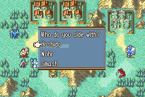
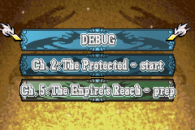

<a href="../../../index.html" class="icon icon-home">lt-maker</a>

Contents:

- <a href="../../home.html" class="reference internal">Lex Talionis
  Wiki</a>

Getting Started:

- <a href="../../getting_started/index.html"
  class="reference internal">Getting Started</a>

Editor Guides:

- <a href="../../editors/Editors-Overview.html"
  class="reference internal">Editors Overview</a>
- <a href="../../editors/index.html"
  class="reference internal">Editors</a>

Events:

- <a href="../../events/index.html" class="reference internal">Events</a>

Guides:

- <a href="../Guides-Overview.html" class="reference internal">Guides
  Overview</a>
- <a href="../index.html" class="reference internal">Guides</a>
  - <a href="../setup_tutorials/index.html"
    class="reference internal">Project Setup Tutorials</a>
  - <a href="index.html" class="reference internal">Eventing Tutorials</a>
    - <a href="Arena.html" class="reference internal">GBA-style Arena</a>
    - <a href="Breakable-Walls.html" class="reference internal">Breakable
      Walls</a>
    - <a href="Death-Quotes.html" class="reference internal">Universal Death
      Quotes Tutorial</a>
    - <a href="Choices-and-Battle-Saves.html#"
      class="current reference internal">Choices and Battle Saves</a>
      - <a href="Choices-and-Battle-Saves.html#choices"
        class="reference internal">Choices</a>
      - <a href="Choices-and-Battle-Saves.html#battle-saves"
        class="reference internal">Battle Saves</a>
    - <a href="Unit-Groups.html" class="reference internal">Unit Groups</a>
    - <a href="Achievements.html" class="reference internal">Achievements</a>
    - <a href="A-Simple-Mercenary-Shop.html" class="reference internal">A
      Simple Mercenary Shop Tutorial</a>
    - <a href="Promotion-Personal-Skills.html"
      class="reference internal">Promotion Personal Skills Tutorial</a>
  - <a href="../skill_item_tutorials/index.html"
    class="reference internal">Skill and Item Tutorials</a>

appendix:

- <a href="../../appendix/Text-Formatting-Commands.html"
  class="reference internal">Text Formatting Commands</a>
- <a href="../../appendix/Item-Component-Reference.html"
  class="reference internal">Item Component Dictionary</a>
- <a href="../../appendix/Skill-Component-Reference.html"
  class="reference internal">Skill Component Dictionary</a>
- <a href="../../appendix/Special-Variables.html"
  class="reference internal">Special Variables</a>
- <a href="../../appendix/Special-Tags.html"
  class="reference internal">Special Tags</a>
- <a href="../../appendix/trigger-reference.html"
  class="reference internal">Event Triggers</a>
- <a href="../../appendix/Random-Seed-Mechanics.html"
  class="reference internal">Random Seed Mechanics</a>
- <a href="../../appendix/FAQ.html" class="reference internal">Frequently
  Asked Questions</a>
- <a href="../../appendix/Contributing_to_the_LTWiki.html"
  class="reference internal">Contributing to the LTWiki</a>
- <a href="../../appendix/index.html" class="reference internal">Code
  Documentation</a>

[lt-maker](../../../index.html)

- 
- [Guides](../index.html)
- [Eventing Tutorials](index.html)
- Choices and Battle Saves
- <a
  href="https://gitlab.com/rainlash/lt-maker/blob/master/docs/source/guides/eventing_tutorials/Choices-and-Battle-Saves.md"
  class="fa fa-gitlab">Edit on GitLab</a>

------------------------------------------------------------------------

# Choices and Battle Saves<a href="Choices-and-Battle-Saves.html#choices-and-battle-saves"
class="headerlink" title="Link to this heading"></a>

*last updated v0.1*

## Choices<a href="Choices-and-Battle-Saves.html#choices" class="headerlink"
title="Link to this heading"></a>

You can give the player a choice in an event. This is done through the
use of the `choice` command.

The choice command takes in three required arguments:

1.  The name of the choice

2.  The choice text or question

3.  A comma-delimited list of available options

Example:
`choice;fates;Who`` ``do`` ``you`` ``side`` ``with?;Hoshido,Nohr,Smash`

The choice that the player chooses will be saved in the game_vars under
the name you gave the choice. The most recent choice made is also saved
in game_vars under `_last_choice`. So you can
access their choice with
`game.game_vars['fates']` or
`game.game_vars['_last_choice']`.

    if;'{v:_last_choice}' == 'Smash'
        u;Corrin;Left
        s;Corrin;I choose to SMASH!
        r;Corrin
    end

## Battle Saves<a href="Choices-and-Battle-Saves.html#battle-saves" class="headerlink"
title="Link to this heading"></a>

Battle saves give the player the opportunity to make a save while in the
middle of a chapter. You can use this to give the player a save after
completing a tough objective. Or perhaps you give the player the
opportunity to battle save only at the beginning of every fifth turn. Or
you have certain save point regions that when activated allow the player
to save the game. There are lots of possibilities.

The `battle_save` event command tells the
engine to create a battle save after the event is complete.

You can give the player a choice too!

    choice;battle_save;Would you like to save?;Yes,No;h
    if;'{v:battle_save}' == 'Yes'
        battle_save
    end

<a href="Death-Quotes.html" class="btn btn-neutral float-left"
accesskey="p" rel="prev" title="Universal Death Quotes Tutorial"> Previous</a>
<a href="Unit-Groups.html" class="btn btn-neutral float-right"
accesskey="n" rel="next" title="Unit Groups">Next </a>

------------------------------------------------------------------------

© Copyright 2024, rainlash.

Built with [Sphinx](https://www.sphinx-doc.org/) using a
[theme](https://github.com/readthedocs/sphinx_rtd_theme) provided by
[Read the Docs](https://readthedocs.org).

