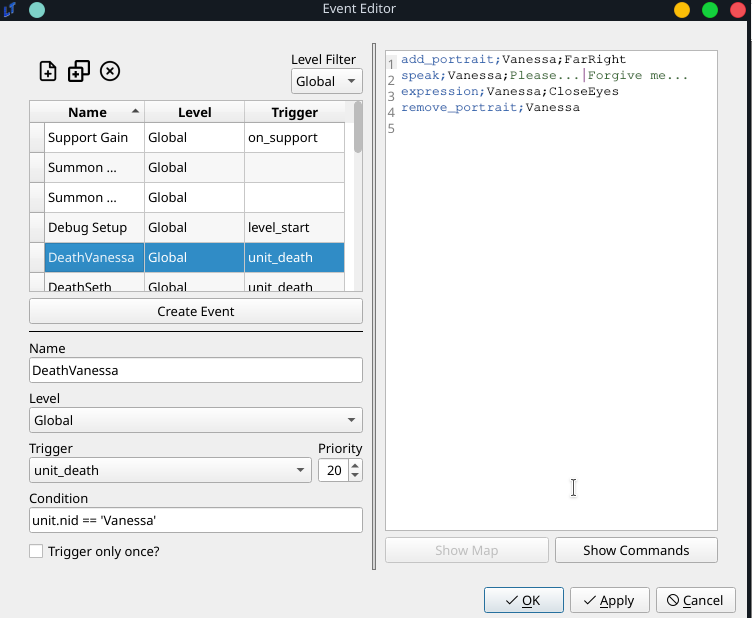
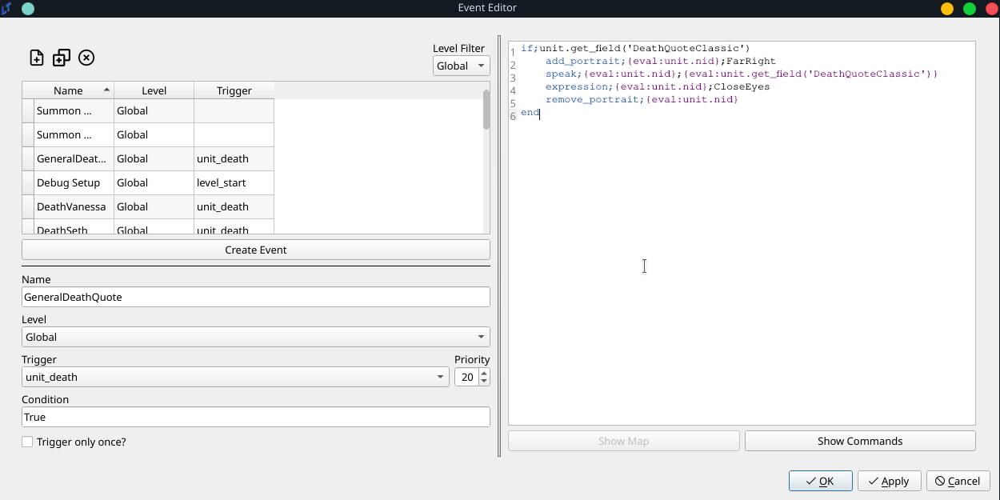

<a href="../../../index.html" class="icon icon-home">lt-maker</a>

Contents:

- <a href="../../home.html" class="reference internal">Lex Talionis
  Wiki</a>

Getting Started:

- <a href="../../getting_started/index.html"
  class="reference internal">Getting Started</a>

Editor Guides:

- <a href="../../editors/Editors-Overview.html"
  class="reference internal">Editors Overview</a>
- <a href="../../editors/index.html"
  class="reference internal">Editors</a>

Events:

- <a href="../../events/index.html" class="reference internal">Events</a>

Guides:

- <a href="../Guides-Overview.html" class="reference internal">Guides
  Overview</a>
- <a href="../index.html" class="reference internal">Guides</a>
  - <a href="../setup_tutorials/index.html"
    class="reference internal">Project Setup Tutorials</a>
  - <a href="index.html" class="reference internal">Eventing Tutorials</a>
    - <a href="Arena.html" class="reference internal">GBA-style Arena</a>
    - <a href="Breakable-Walls.html" class="reference internal">Breakable
      Walls</a>
    - <a href="Death-Quotes.html#"
      class="current reference internal">Universal Death Quotes Tutorial</a>
      - <a href="Death-Quotes.html#problem-description"
        class="reference internal">Problem Description</a>
      - <a href="Death-Quotes.html#solution"
        class="reference internal">Solution</a>
    - <a href="Choices-and-Battle-Saves.html"
      class="reference internal">Choices and Battle Saves</a>
    - <a href="Unit-Groups.html" class="reference internal">Unit Groups</a>
    - <a href="Achievements.html" class="reference internal">Achievements</a>
    - <a href="A-Simple-Mercenary-Shop.html" class="reference internal">A
      Simple Mercenary Shop Tutorial</a>
    - <a href="Promotion-Personal-Skills.html"
      class="reference internal">Promotion Personal Skills Tutorial</a>
  - <a href="../skill_item_tutorials/index.html"
    class="reference internal">Skill and Item Tutorials</a>

appendix:

- <a href="../../appendix/Text-Formatting-Commands.html"
  class="reference internal">Text Formatting Commands</a>
- <a href="../../appendix/Item-Component-Reference.html"
  class="reference internal">Item Component Dictionary</a>
- <a href="../../appendix/Skill-Component-Reference.html"
  class="reference internal">Skill Component Dictionary</a>
- <a href="../../appendix/Special-Variables.html"
  class="reference internal">Special Variables</a>
- <a href="../../appendix/Special-Tags.html"
  class="reference internal">Special Tags</a>
- <a href="../../appendix/trigger-reference.html"
  class="reference internal">Event Triggers</a>
- <a href="../../appendix/Random-Seed-Mechanics.html"
  class="reference internal">Random Seed Mechanics</a>
- <a href="../../appendix/FAQ.html" class="reference internal">Frequently
  Asked Questions</a>
- <a href="../../appendix/Contributing_to_the_LTWiki.html"
  class="reference internal">Contributing to the LTWiki</a>
- <a href="../../appendix/index.html" class="reference internal">Code
  Documentation</a>

[lt-maker](../../../index.html)

- 
- [Guides](../index.html)
- [Eventing Tutorials](index.html)
- Universal Death Quotes Tutorial
- <a
  href="https://gitlab.com/rainlash/lt-maker/blob/master/docs/source/guides/eventing_tutorials/Death-Quotes.md"
  class="fa fa-gitlab">Edit on GitLab</a>

------------------------------------------------------------------------

# Universal Death Quotes Tutorial<a href="Death-Quotes.html#universal-death-quotes-tutorial"
class="headerlink" title="Link to this heading"></a>

## Problem Description<a href="Death-Quotes.html#problem-description" class="headerlink"
title="Link to this heading"></a>

I want to introduce death quotes into my game.

## Solution<a href="Death-Quotes.html#solution" class="headerlink"
title="Link to this heading"></a>

There are two ways of going about this, both using events. One is on an
individual level. The second is on a general level. Which solution you
choose depends on how you wish to implement the death sequences in your
game.

### Individual Solution<a href="Death-Quotes.html#individual-solution" class="headerlink"
title="Link to this heading"></a>

This solution already exists implemented in
`default.ltproj`. This solution involves using
an event that is triggered on the death of each unit. The event is as
follows:

This event is fairly basic.

- It is a `global` event, meaning it can
  potentially trigger in any level.

- It triggers on `unit_death`, with a condition
  of
  `unit.nid`` ``==`` ``'Vanessa'`,
  meaning that when the unit with NID “Vanessa” dies, this event will
  play.

- Technically, this event is not bound to trigger once, based on the
  `Trigger`` ``only`` ``once?`
  checkbox. But since units should only be dying once, it doesn’t
  matter.

To sum, at any point in the game, if Vanessa dies, this event will play.
The event is a very straightforward talk event. It will display
Vanessa’s portrait, play a dialogue, and then remove her portrait. But
as they say, the sky’s the limit. If you want extremely elaborate death
sequences, that might involve multiple characters, giving items,
whatever crazy thing you come up with, this is the solution for you. One
drawback of this solution is that this requires a separate event for
every single unit.

### General solution<a href="Death-Quotes.html#general-solution" class="headerlink"
title="Link to this heading"></a>

The vast majority of the death quotes in the game will be much simpler,
following the above format - the portrait flashes, the character says
their dying line, and finally, the portrait disappears. The following
event makes use of Unit Fields to reduce event count and simplify the
process. It is as follows:

It’s pretty much the same, except that there is no condition attached.
This will trigger every single time a unit dies.

The meat of its functionality is in the eventing:

    if;unit.get_field('DeathQuote')
        add_portrait;{eval:unit.nid};FarRight
        speak;{eval:unit.nid};{eval:unit.get_field('DeathQuote')}
        expression;{eval:unit.nid};CloseEyes
        remove_portrait;{eval:unit.nid}
    end

For those who are unfamiliar with Unit Fields, I would recommend reading
both the other tutorials and the
<a href="../../events/Conditionals.html"
class="reference internal">eval
documentation</a>. To put it simply, however, this will check if
the unit that died possesses a field called
`DeathQuote`, and if so, it will play a scene
of the unit appearing, speaking the exact contents of their DeathQuote,
and then disappearing - exactly the same as the above scene.

<a href="Breakable-Walls.html" class="btn btn-neutral float-left"
accesskey="p" rel="prev" title="Breakable Walls"> Previous</a>
<a href="Choices-and-Battle-Saves.html"
class="btn btn-neutral float-right" accesskey="n" rel="next"
title="Choices and Battle Saves">Next </a>

------------------------------------------------------------------------

© Copyright 2024, rainlash.

Built with [Sphinx](https://www.sphinx-doc.org/) using a
[theme](https://github.com/readthedocs/sphinx_rtd_theme) provided by
[Read the Docs](https://readthedocs.org).

