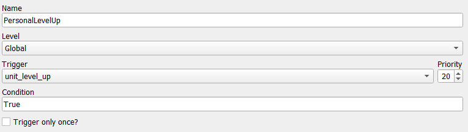
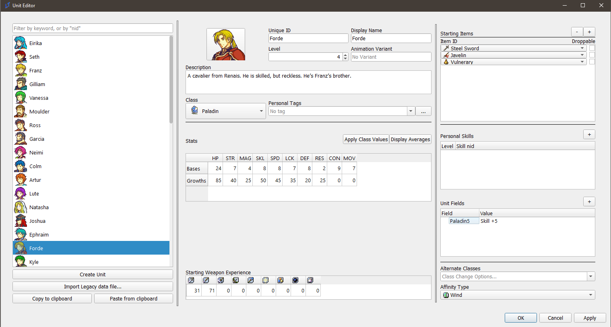
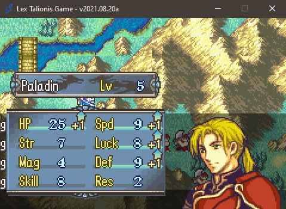
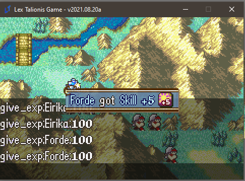

<a href="../../../index.html" class="icon icon-home">lt-maker</a>

Contents:

- <a href="../../home.html" class="reference internal">Lex Talionis
  Wiki</a>

Getting Started:

- <a href="../../getting_started/index.html"
  class="reference internal">Getting Started</a>

Editor Guides:

- <a href="../../editors/Editors-Overview.html"
  class="reference internal">Editors Overview</a>
- <a href="../../editors/index.html"
  class="reference internal">Editors</a>

Events:

- <a href="../../events/index.html" class="reference internal">Events</a>

Guides:

- <a href="../Guides-Overview.html" class="reference internal">Guides
  Overview</a>
- <a href="../index.html" class="reference internal">Guides</a>
  - <a href="../setup_tutorials/index.html"
    class="reference internal">Project Setup Tutorials</a>
  - <a href="index.html" class="reference internal">Eventing Tutorials</a>
    - <a href="Arena.html" class="reference internal">GBA-style Arena</a>
    - <a href="Breakable-Walls.html" class="reference internal">Breakable
      Walls</a>
    - <a href="Death-Quotes.html" class="reference internal">Universal Death
      Quotes Tutorial</a>
    - <a href="Choices-and-Battle-Saves.html"
      class="reference internal">Choices and Battle Saves</a>
    - <a href="Unit-Groups.html" class="reference internal">Unit Groups</a>
    - <a href="Achievements.html" class="reference internal">Achievements</a>
    - <a href="A-Simple-Mercenary-Shop.html" class="reference internal">A
      Simple Mercenary Shop Tutorial</a>
    - <a href="Promotion-Personal-Skills.html#"
      class="current reference internal">Promotion Personal Skills
      Tutorial</a>
      - <a href="Promotion-Personal-Skills.html#problem-description"
        class="reference internal">Problem Description</a>
      - <a href="Promotion-Personal-Skills.html#solution"
        class="reference internal">Solution</a>
  - <a href="../skill_item_tutorials/index.html"
    class="reference internal">Skill and Item Tutorials</a>

appendix:

- <a href="../../appendix/Text-Formatting-Commands.html"
  class="reference internal">Text Formatting Commands</a>
- <a href="../../appendix/Item-Component-Reference.html"
  class="reference internal">Item Component Dictionary</a>
- <a href="../../appendix/Skill-Component-Reference.html"
  class="reference internal">Skill Component Dictionary</a>
- <a href="../../appendix/Special-Variables.html"
  class="reference internal">Special Variables</a>
- <a href="../../appendix/Special-Tags.html"
  class="reference internal">Special Tags</a>
- <a href="../../appendix/trigger-reference.html"
  class="reference internal">Event Triggers</a>
- <a href="../../appendix/Random-Seed-Mechanics.html"
  class="reference internal">Random Seed Mechanics</a>
- <a href="../../appendix/FAQ.html" class="reference internal">Frequently
  Asked Questions</a>
- <a href="../../appendix/Contributing_to_the_LTWiki.html"
  class="reference internal">Contributing to the LTWiki</a>
- <a href="../../appendix/index.html" class="reference internal">Code
  Documentation</a>

[lt-maker](../../../index.html)

- 
- [Guides](../index.html)
- [Eventing Tutorials](index.html)
- Promotion Personal Skills Tutorial
- <a
  href="https://gitlab.com/rainlash/lt-maker/blob/master/docs/source/guides/eventing_tutorials/Promotion-Personal-Skills.md"
  class="fa fa-gitlab">Edit on GitLab</a>

------------------------------------------------------------------------

# Promotion Personal Skills Tutorial<a
href="Promotion-Personal-Skills.html#promotion-personal-skills-tutorial"
class="headerlink" title="Link to this heading"></a>

## Problem Description<a href="Promotion-Personal-Skills.html#problem-description"
class="headerlink" title="Link to this heading"></a>

I would like to add personal skills that are gated behind promotions.
**For example, I want Franz to learn Aegis at Paladin level 5, and
Pavise at Great Knight level 5. However, I want Forde to learn Astra at
Paladin 5, and Sol at Great Knight 5.** The current system of class and
personal skills cannot approximate this behavior - personal skills will
trigger on any class of a certain unit, whereas class skills will be
learned by every character who is of that class - even generics.

## Solution<a href="Promotion-Personal-Skills.html#solution" class="headerlink"
title="Link to this heading"></a>

Eventing. The solution is always eventing. Via the
`give_skill` event command, we can give skills
conditionally to any unit. The event will be as follows.

    if;unit.get_field(unit.klass + str(unit.level)) and unit.get_field(unit.klass + str(unit.level)) not in [skill.nid for skill in unit.skills]
        give_skill;{unit};{eval:unit.get_field(unit.klass + str(unit.level))}
    end

This event is fairly basic. Every time any UNIT levels up, this event
will check if the UNIT has a field named its klass nid plus its level.
For instance, if Forde is a Paladin, and levels up to level 5, then this
event will trigger, checking if Forde has a field called Paladin5. If
Forde does not, then the event deactivates. If Forde does, then the
event will check if Forde already has the skill named in the field.
Finally, if Forde has the Paladin5 field, and he does not have the skill
in the field, the event will grant him the skill named in the field.

**Note**: You must use the correct NIDs for both the class name and the
skill in the fields, otherwise it will not work, for obvious reasons.

Like so (please ignore the debug terminal in the background):

Voila!

<a href="A-Simple-Mercenary-Shop.html"
class="btn btn-neutral float-left" accesskey="p" rel="prev"
title="A Simple Mercenary Shop Tutorial"> Previous</a>
<a href="../skill_item_tutorials/index.html"
class="btn btn-neutral float-right" accesskey="n" rel="next"
title="Skill and Item Tutorials">Next </a>

------------------------------------------------------------------------

© Copyright 2024, rainlash.

Built with [Sphinx](https://www.sphinx-doc.org/) using a
[theme](https://github.com/readthedocs/sphinx_rtd_theme) provided by
[Read the Docs](https://readthedocs.org).

