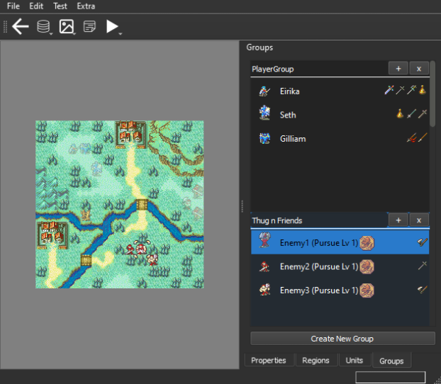
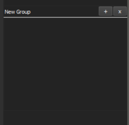
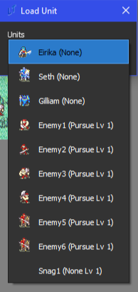

<a href="../../../index.html" class="icon icon-home">lt-maker</a>

Contents:

- <a href="../../home.html" class="reference internal">Lex Talionis
  Wiki</a>

Getting Started:

- <a href="../../getting_started/index.html"
  class="reference internal">Getting Started</a>

Editor Guides:

- <a href="../../editors/Editors-Overview.html"
  class="reference internal">Editors Overview</a>
- <a href="../../editors/index.html"
  class="reference internal">Editors</a>

Events:

- <a href="../../events/index.html" class="reference internal">Events</a>

Guides:

- <a href="../Guides-Overview.html" class="reference internal">Guides
  Overview</a>
- <a href="../index.html" class="reference internal">Guides</a>
  - <a href="../setup_tutorials/index.html"
    class="reference internal">Project Setup Tutorials</a>
  - <a href="index.html" class="reference internal">Eventing Tutorials</a>
    - <a href="Arena.html" class="reference internal">GBA-style Arena</a>
    - <a href="Breakable-Walls.html" class="reference internal">Breakable
      Walls</a>
    - <a href="Death-Quotes.html" class="reference internal">Universal Death
      Quotes Tutorial</a>
    - <a href="Choices-and-Battle-Saves.html"
      class="reference internal">Choices and Battle Saves</a>
    - <a href="Unit-Groups.html#" class="current reference internal">Unit
      Groups</a>
      - <a href="Unit-Groups.html#unit-group-commands"
        class="reference internal">Unit Group Commands</a>
    - <a href="Achievements.html" class="reference internal">Achievements</a>
    - <a href="A-Simple-Mercenary-Shop.html" class="reference internal">A
      Simple Mercenary Shop Tutorial</a>
    - <a href="Promotion-Personal-Skills.html"
      class="reference internal">Promotion Personal Skills Tutorial</a>
  - <a href="../skill_item_tutorials/index.html"
    class="reference internal">Skill and Item Tutorials</a>

appendix:

- <a href="../../appendix/Text-Formatting-Commands.html"
  class="reference internal">Text Formatting Commands</a>
- <a href="../../appendix/Item-Component-Reference.html"
  class="reference internal">Item Component Dictionary</a>
- <a href="../../appendix/Skill-Component-Reference.html"
  class="reference internal">Skill Component Dictionary</a>
- <a href="../../appendix/Special-Variables.html"
  class="reference internal">Special Variables</a>
- <a href="../../appendix/Special-Tags.html"
  class="reference internal">Special Tags</a>
- <a href="../../appendix/trigger-reference.html"
  class="reference internal">Event Triggers</a>
- <a href="../../appendix/Random-Seed-Mechanics.html"
  class="reference internal">Random Seed Mechanics</a>
- <a href="../../appendix/FAQ.html" class="reference internal">Frequently
  Asked Questions</a>
- <a href="../../appendix/Contributing_to_the_LTWiki.html"
  class="reference internal">Contributing to the LTWiki</a>
- <a href="../../appendix/index.html" class="reference internal">Code
  Documentation</a>

[lt-maker](../../../index.html)

- 
- [Guides](../index.html)
- [Eventing Tutorials](index.html)
- Unit Groups
- <a
  href="https://gitlab.com/rainlash/lt-maker/blob/master/docs/source/guides/eventing_tutorials/Unit-Groups.md"
  class="fa fa-gitlab">Edit on GitLab</a>

------------------------------------------------------------------------

# Unit Groups<a href="Unit-Groups.html#unit-groups" class="headerlink"
title="Link to this heading"></a>

Suppose that you’re working on a map, and you want to have a part where
a bunch of units spawn together and move together at the same time
during some part in a cutscene.

If you were to do this one-by-one, only dealing with individual units,
you would have to write several lines of event commands for each one.
It’s not long before this gets out of hand.

    # Spawns our gang of enemies
    add_unit;Enemy1;x,y
    add_unit;Enemy2;x,y
    add_unit;Enemy3;x,y
    # Moves them to their starting positions simultaneously
    move_unit;Enemy1;x,y;no_block
    move_unit;Enemy2;x,y;no_block
    move_unit;Enemy3;x,y

You have to use a command to add each unit, then you need to use a move
command on each one to get the effect of them all moving together.

There has to be a better way, right?

The solution is to use Unit Groups.

When viewing a single Chapter’s tilemap and units, you’ll see four tabs
on the bottom left corner of the editor. As the name suggests, the
Groups tab deals with user-defined groups of units.

A unit group can consist of any units loaded on the map, no matter what
team they are on. To create a group, click the Create New Group button
at the bottom of the Groups list.

A blank group should appear on the list. You can rename the group by
clicking on the New Group text.

You can add a unit by clicking the + button next to the text box.
Pressing it will give you this prompt. You can select any unit you have
loaded on the map to add them to the group.

Placing each unit works much like the Unit field in the Level Editor.
Unit positions are allowed to overlap, making them useful for
reinforcements and cutscenes.

Using events, we can move each group with only one command.

Before, we had to use a bunch of individual lines to handle multiple
units:

    # Spawns our gang of enemies
    add_unit;Enemy1;x,y
    add_unit;Enemy2;x,y
    add_unit;Enemy3;x,y
    # Moves them to their starting positions simultaneously
    move_unit;Enemy1;x,y;no_block
    move_unit;Enemy2;x,y;no_block
    move_unit;Enemy3;x,y

But now, this statement becomes much simpler:

    # Spawns the enemies
    spawn_group;Thug n Friends;south;Thug n Friends;fade
    # Moves them to their starting positions
    move_group;Thug n Friends;Starting

## Unit Group Commands<a href="Unit-Groups.html#unit-group-commands" class="headerlink"
title="Link to this heading"></a>

All unit group related event commands:

    # Adds a group of units to the map. StartingGroup determines the spawn positions of each unit
    # in Group.
    add_group;Group;StartingGroup;EntryType;Placement;flags

    # This command also adds a group, but causes them to spawn at one of the edges of the 
    # screen specified by the CardinalDirection argument. Group specifies which units to spawn. 
    # StartingGroup specifies where to spawn those units.
    spawn_group;Group;CardinalDirection;StartingGroup;EntryType;Placement;flags

    # Moves each unit in Group to their corresponding position in StartingGroup
    move_group;Group;StartingGroup

    # Removes the specified group from the map
    remove_group;Group

<a href="Choices-and-Battle-Saves.html"
class="btn btn-neutral float-left" accesskey="p" rel="prev"
title="Choices and Battle Saves"> Previous</a>
<a href="Achievements.html" class="btn btn-neutral float-right"
accesskey="n" rel="next" title="Achievements">Next </a>

------------------------------------------------------------------------

© Copyright 2024, rainlash.

Built with [Sphinx](https://www.sphinx-doc.org/) using a
[theme](https://github.com/readthedocs/sphinx_rtd_theme) provided by
[Read the Docs](https://readthedocs.org).

