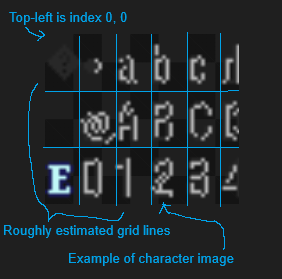
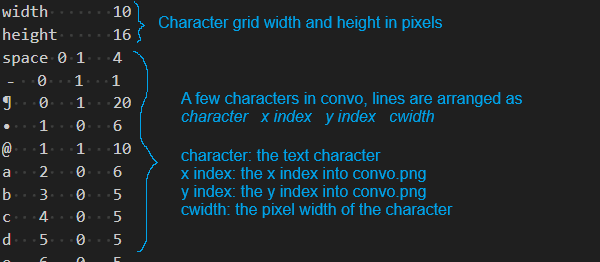
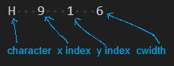
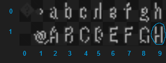

<a href="../../../index.html" class="icon icon-home">lt-maker</a>

Contents:

- <a href="../../home.html" class="reference internal">Lex Talionis
  Wiki</a>

Getting Started:

- <a href="../../getting_started/index.html"
  class="reference internal">Getting Started</a>

Editor Guides:

- <a href="../../editors/Editors-Overview.html"
  class="reference internal">Editors Overview</a>
- <a href="../../editors/index.html"
  class="reference internal">Editors</a>

Events:

- <a href="../../events/index.html" class="reference internal">Events</a>

Guides:

- <a href="../Guides-Overview.html" class="reference internal">Guides
  Overview</a>
- <a href="../index.html" class="reference internal">Guides</a>
  - <a href="index.html" class="reference internal">Project Setup
    Tutorials</a>
    - <a href="Title-Screen.html" class="reference internal">Title Screen</a>
    - <a href="Shop-Portraits.html" class="reference internal">Shop
      Portraits</a>
    - <a href="Fonts-And-Languages.html#"
      class="current reference internal">Working with Fonts and Languages</a>
      - <a href="Fonts-And-Languages.html#where-to-find-fonts"
        class="reference internal">Where to find fonts</a>
      - <a href="Fonts-And-Languages.html#what-are-png-and-idx-files"
        class="reference internal">What are PNG and IDX files?</a>
      - <a href="Fonts-And-Languages.html#anatomy-of-a-png-file"
        class="reference internal">Anatomy of a PNG file</a>
      - <a href="Fonts-And-Languages.html#anatomy-of-a-idx-file"
        class="reference internal">Anatomy of a IDX file</a>
      - <a href="Fonts-And-Languages.html#a-worked-example"
        class="reference internal">A worked example</a>
      - <a href="Fonts-And-Languages.html#modifying-existing-characters"
        class="reference internal">Modifying existing characters</a>
      - <a href="Fonts-And-Languages.html#adding-new-characters"
        class="reference internal">Adding new characters</a>
      - <a href="Fonts-And-Languages.html#adding-new-fonts"
        class="reference internal">Adding new fonts</a>
      - <a href="Fonts-And-Languages.html#adding-language-support"
        class="reference internal">Adding Language Support</a>
      - <a href="Fonts-And-Languages.html#special-notes"
        class="reference internal">Special Notes</a>
    - <a href="Custom-Components-And-Sprites.html"
      class="reference internal">Custom Components and Sprites</a>
  - <a href="../eventing_tutorials/index.html"
    class="reference internal">Eventing Tutorials</a>
  - <a href="../skill_item_tutorials/index.html"
    class="reference internal">Skill and Item Tutorials</a>

appendix:

- <a href="../../appendix/Text-Formatting-Commands.html"
  class="reference internal">Text Formatting Commands</a>
- <a href="../../appendix/Item-Component-Reference.html"
  class="reference internal">Item Component Dictionary</a>
- <a href="../../appendix/Skill-Component-Reference.html"
  class="reference internal">Skill Component Dictionary</a>
- <a href="../../appendix/Special-Variables.html"
  class="reference internal">Special Variables</a>
- <a href="../../appendix/Special-Tags.html"
  class="reference internal">Special Tags</a>
- <a href="../../appendix/trigger-reference.html"
  class="reference internal">Event Triggers</a>
- <a href="../../appendix/Random-Seed-Mechanics.html"
  class="reference internal">Random Seed Mechanics</a>
- <a href="../../appendix/FAQ.html" class="reference internal">Frequently
  Asked Questions</a>
- <a href="../../appendix/Contributing_to_the_LTWiki.html"
  class="reference internal">Contributing to the LTWiki</a>
- <a href="../../appendix/index.html" class="reference internal">Code
  Documentation</a>

[lt-maker](../../../index.html)

- 
- [Guides](../index.html)
- [Project Setup Tutorials](index.html)
- Working with Fonts and Languages
- <a
  href="https://gitlab.com/rainlash/lt-maker/blob/master/docs/source/guides/setup_tutorials/Fonts-And-Languages.md"
  class="fa fa-gitlab">Edit on GitLab</a>

------------------------------------------------------------------------

# Working with Fonts and Languages<a href="Fonts-And-Languages.html#working-with-fonts-and-languages"
class="headerlink" title="Link to this heading"></a>

If you wish to add a new font or modify existing fonts, you can do so by
directly modifying the font files in your project. Adding language
support for non-alphabetical systems works the same way.

## Where to find fonts<a href="Fonts-And-Languages.html#where-to-find-fonts"
class="headerlink" title="Link to this heading"></a>

Under `<your_project.ltproj>/resources/fonts/`
you will find two types of files: `.png` files
and `.idx` files. These files are loaded into
the engine at startup and are responsible for the text fonts that are
available for you to use.

## What are PNG and IDX files?<a href="Fonts-And-Languages.html#what-are-png-and-idx-files"
class="headerlink" title="Link to this heading"></a>

PNG files are font character maps. These are essentially files that
contain the character images that will be directly drawn onto the game
screen. The characters in the file are lined up in a grid. When you
create text in your game, the engine will open this file and fetch the
corresponding character image in the PNG based on its location in the
grid, also called its index. The text that it fetches corresponds to the
text you have put in your game. The engine knows where each character is
by looking at the IDX file. The IDX file contains information on the
pixel width and height of each box in the PNG grid, a mapping of each
character available for use to a grid index, as well as the width of
specific characters so you can adjust your kerning.

## Anatomy of a PNG file<a href="Fonts-And-Languages.html#anatomy-of-a-png-file"
class="headerlink" title="Link to this heading"></a>

## Anatomy of a IDX file<a href="Fonts-And-Languages.html#anatomy-of-a-idx-file"
class="headerlink" title="Link to this heading"></a>

## A worked example<a href="Fonts-And-Languages.html#a-worked-example" class="headerlink"
title="Link to this heading"></a>

In the default project, you will find convo as one of the available
fonts. This font has its corresponding
`convo.png` and
`convo.idx` files, already shown in the above
sections. When you have a line of text (called a string) such as “Hi”
displayed in your game, the engine will look at each character in the
string and then look in `convo.idx` to tell at
which `x,`` ``y`
indices it will find the character image in
`convo.png`. It will then multiply these
indices by the `width` and
`height` found in
`convo.idx` to get the exact top-left pixel
location in `convo.png`. It will use the
character image it finds at that location by directly drawing what it
finds in a
`height`` ``x`` ``cwidth`
box.

For example, for the character “H” the exact pixel location of the
character will can be found by taking the
`x,`` ``y` index in
`convo.idx`
(`9,`` ``1`). The
width and height of grid boxes in `convo.idx`
is `16` and `10`
respectively. By multiplying the
`x,`` ``y` and the
`width,`` ``height`,
the exact top-left pixel location of “H” can be found at
`144,`` ``10`. When
the engine goes and draws the “H”, it will check
`cwidth` and find it is
`6`. It will then draw every pixel in a
`height`` ``x`` ``cwidth`
at the pixel location, which is a
`16`` ``x`` ``6`
box at `144,`` ``10`.

## Modifying existing characters<a href="Fonts-And-Languages.html#modifying-existing-characters"
class="headerlink" title="Link to this heading"></a>

You can modify existing characters by redrawing them in the PNG file in
your favorite art software. You can also swap mappings of characters
however you see fit in the IDX file.

## Adding new characters<a href="Fonts-And-Languages.html#adding-new-characters"
class="headerlink" title="Link to this heading"></a>

You can add new characters by adding them to an empty location the PNG
file and then setting up the correct mapping in the IDX file.

## Adding new fonts<a href="Fonts-And-Languages.html#adding-new-fonts" class="headerlink"
title="Link to this heading"></a>

You can add new fonts by creating new PNG and IDX files and then
correctly setting them up based on the scheme described in previous
sections.

## Adding Language Support<a href="Fonts-And-Languages.html#adding-language-support"
class="headerlink" title="Link to this heading"></a>

Some LT games are made for languages using non-Latin alphabets. While LT
does not have native support for these alphabets, it’s straightforward
to add them.

> 

>
> NOTA BENE: You **must** have your editor **closed** while doing this,
> otherwise there is risk of data corruption.
>
> 

First, download a font which supports the alphabet of your choice. Below
are a few recommendations - some of the developers have personally
tested these and confirmed them to be suitable for use in LT.

| Language             | Font                                                                            |
|----------------------|---------------------------------------------------------------------------------|
| **Mandarin Chinese** | <a                                                                              
                        href="https://github.com/rougier/freetype-gl/blob/master/fonts/fireflysung.ttf"  
                        class="reference external">Firefly Sung</a>                                      |
| **Japanese**         | <a href="https://itouhiro.hatenablog.com/entry/20130602/font"                   
                        class="reference external">PixelMPlus</a>                                        |

Next, move the font into your project’s fonts folder, located at
`MyProject.ltproj/resources/fonts`.

Finally, open up the `fonts.json` file in that
directory. You will see a list of entries like this:

    {
            "nid": "bconvo",
            "fallback_ttf": null,
            "fallback_size": 16,
            "default_color": "black",
            "outline_font": false,
            "palettes": {
                "black": [
                    [
                        40,
                        40,
                        40,
                        255
                    ],
                    [
                        184,
                        184,
                        184,
                        255
                    ]
                ]
            }
    }

In order to add your new font (let’s say you decided to download
`fireflysung.ttf`), you will change the
`fallback_ttf` field to
`fireflysung.ttf`. You may also need to play
with the `fallback_size` field in order to
ensure your font renders correctly: for example, the
`PixelMPlus` font comes in a 10-pixel and
12-pixel version, and will render very badly if you do not set the size
accordingly.

Once you change those two fields, you’re done!

## Special Notes<a href="Fonts-And-Languages.html#special-notes" class="headerlink"
title="Link to this heading"></a>

Some fonts in the game render with outlines. We support these as well!
However, it requires additional work for certain font-styles. You must
set the `outline_font` to
`true` for these fonts (although this has
already been set for the most common outlined fonts), and you must order
each color in the palette such that the primary text color is the first
RGBA value (in the example above, `black` has a
primary color of
`40,`` ``40,`` ``40,`` ``255`),
and the secondary text color is the second RGBA value (again, in the
example above, the secondary color is
`184,`` ``184,`` ``184,`` ``255`).
The primary will be used for the main text body, while the secondary
will be used as the outline.

<a href="Shop-Portraits.html" class="btn btn-neutral float-left"
accesskey="p" rel="prev" title="Shop Portraits"> Previous</a>
<a href="Custom-Components-And-Sprites.html"
class="btn btn-neutral float-right" accesskey="n" rel="next"
title="Custom Components and Sprites">Next </a>

------------------------------------------------------------------------

© Copyright 2024, rainlash.

Built with [Sphinx](https://www.sphinx-doc.org/) using a
[theme](https://github.com/readthedocs/sphinx_rtd_theme) provided by
[Read the Docs](https://readthedocs.org).

