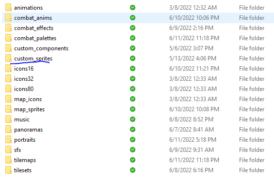
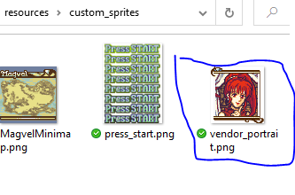
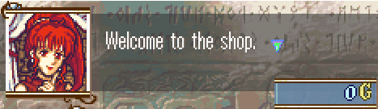

<a href="../../../index.html" class="icon icon-home">lt-maker</a>

Contents:

- <a href="../../home.html" class="reference internal">Lex Talionis
  Wiki</a>

Getting Started:

- <a href="../../getting_started/index.html"
  class="reference internal">Getting Started</a>

Editor Guides:

- <a href="../../editors/Editors-Overview.html"
  class="reference internal">Editors Overview</a>
- <a href="../../editors/index.html"
  class="reference internal">Editors</a>

Events:

- <a href="../../events/index.html" class="reference internal">Events</a>

Guides:

- <a href="../Guides-Overview.html" class="reference internal">Guides
  Overview</a>
- <a href="../index.html" class="reference internal">Guides</a>
  - <a href="index.html" class="reference internal">Project Setup
    Tutorials</a>
    - <a href="Title-Screen.html" class="reference internal">Title Screen</a>
    - <a href="Shop-Portraits.html#" class="current reference internal">Shop
      Portraits</a>
    - <a href="Fonts-And-Languages.html" class="reference internal">Working
      with Fonts and Languages</a>
    - <a href="Custom-Components-And-Sprites.html"
      class="reference internal">Custom Components and Sprites</a>
  - <a href="../eventing_tutorials/index.html"
    class="reference internal">Eventing Tutorials</a>
  - <a href="../skill_item_tutorials/index.html"
    class="reference internal">Skill and Item Tutorials</a>

appendix:

- <a href="../../appendix/Text-Formatting-Commands.html"
  class="reference internal">Text Formatting Commands</a>
- <a href="../../appendix/Item-Component-Reference.html"
  class="reference internal">Item Component Dictionary</a>
- <a href="../../appendix/Skill-Component-Reference.html"
  class="reference internal">Skill Component Dictionary</a>
- <a href="../../appendix/Special-Variables.html"
  class="reference internal">Special Variables</a>
- <a href="../../appendix/Special-Tags.html"
  class="reference internal">Special Tags</a>
- <a href="../../appendix/trigger-reference.html"
  class="reference internal">Event Triggers</a>
- <a href="../../appendix/Random-Seed-Mechanics.html"
  class="reference internal">Random Seed Mechanics</a>
- <a href="../../appendix/FAQ.html" class="reference internal">Frequently
  Asked Questions</a>
- <a href="../../appendix/Contributing_to_the_LTWiki.html"
  class="reference internal">Contributing to the LTWiki</a>
- <a href="../../appendix/index.html" class="reference internal">Code
  Documentation</a>

[lt-maker](../../../index.html)

- 
- [Guides](../index.html)
- [Project Setup Tutorials](index.html)
- Shop Portraits
- <a
  href="https://gitlab.com/rainlash/lt-maker/blob/master/docs/source/guides/setup_tutorials/Shop-Portraits.md"
  class="fa fa-gitlab">Edit on GitLab</a>

------------------------------------------------------------------------

# Shop Portraits<a href="Shop-Portraits.html#shop-portraits" class="headerlink"
title="Link to this heading"></a>

This guide will very swiftly illustrate how to update the three special
shop portraits in LT maker: armory, vendor, and arena.

These portraits are not stored in the same way as standard unit
portraits. Instead, to update these portraits, you must use the
**resources/custom_sprites** directory in your project. If a
**custom_sprites** directory does not already exist for your project,
create one (make sure it’s named exactly **custom_sprites**).

Then, place the portrait you wish to use in this directory and name it
one of the following file names to replace its respective default
portrait:

**arena_portrait.png**  
**armory_portrait.png**  
**vendor_portrait.png**

Now when you set up a shop of that type in a shop event, you should see
your replaced portrait.

<a href="Title-Screen.html" class="btn btn-neutral float-left"
accesskey="p" rel="prev" title="Title Screen"> Previous</a>
<a href="Fonts-And-Languages.html" class="btn btn-neutral float-right"
accesskey="n" rel="next" title="Working with Fonts and Languages">Next
</a>

------------------------------------------------------------------------

© Copyright 2024, rainlash.

Built with [Sphinx](https://www.sphinx-doc.org/) using a
[theme](https://github.com/readthedocs/sphinx_rtd_theme) provided by
[Read the Docs](https://readthedocs.org).

