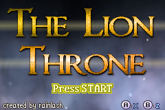
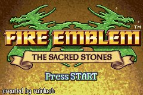
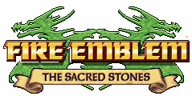
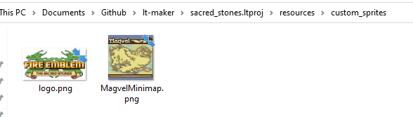
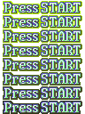
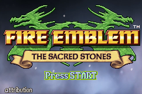
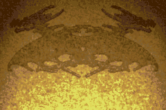
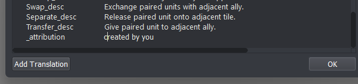

<a href="../../../index.html" class="icon icon-home">lt-maker</a>

Contents:

- <a href="../../home.html" class="reference internal">Lex Talionis
  Wiki</a>

Getting Started:

- <a href="../../getting_started/index.html"
  class="reference internal">Getting Started</a>

Editor Guides:

- <a href="../../editors/Editors-Overview.html"
  class="reference internal">Editors Overview</a>
- <a href="../../editors/index.html"
  class="reference internal">Editors</a>

Events:

- <a href="../../events/index.html" class="reference internal">Events</a>

Guides:

- <a href="../Guides-Overview.html" class="reference internal">Guides
  Overview</a>
- <a href="../index.html" class="reference internal">Guides</a>
  - <a href="index.html" class="reference internal">Project Setup
    Tutorials</a>
    - <a href="Title-Screen.html#" class="current reference internal">Title
      Screen</a>
      - <a href="Title-Screen.html#logo" class="reference internal">Logo</a>
      - <a href="Title-Screen.html#press-start" class="reference internal">Press
        Start</a>
      - <a href="Title-Screen.html#background"
        class="reference internal">Background</a>
      - <a href="Title-Screen.html#attribution"
        class="reference internal">Attribution</a>
      - <a href="Title-Screen.html#complete"
        class="reference internal">Complete!</a>
    - <a href="Shop-Portraits.html" class="reference internal">Shop
      Portraits</a>
    - <a href="Fonts-And-Languages.html" class="reference internal">Working
      with Fonts and Languages</a>
    - <a href="Custom-Components-And-Sprites.html"
      class="reference internal">Custom Components and Sprites</a>
  - <a href="../eventing_tutorials/index.html"
    class="reference internal">Eventing Tutorials</a>
  - <a href="../skill_item_tutorials/index.html"
    class="reference internal">Skill and Item Tutorials</a>

appendix:

- <a href="../../appendix/Text-Formatting-Commands.html"
  class="reference internal">Text Formatting Commands</a>
- <a href="../../appendix/Item-Component-Reference.html"
  class="reference internal">Item Component Dictionary</a>
- <a href="../../appendix/Skill-Component-Reference.html"
  class="reference internal">Skill Component Dictionary</a>
- <a href="../../appendix/Special-Variables.html"
  class="reference internal">Special Variables</a>
- <a href="../../appendix/Special-Tags.html"
  class="reference internal">Special Tags</a>
- <a href="../../appendix/trigger-reference.html"
  class="reference internal">Event Triggers</a>
- <a href="../../appendix/Random-Seed-Mechanics.html"
  class="reference internal">Random Seed Mechanics</a>
- <a href="../../appendix/FAQ.html" class="reference internal">Frequently
  Asked Questions</a>
- <a href="../../appendix/Contributing_to_the_LTWiki.html"
  class="reference internal">Contributing to the LTWiki</a>
- <a href="../../appendix/index.html" class="reference internal">Code
  Documentation</a>

[lt-maker](../../../index.html)

- 
- [Guides](../index.html)
- [Project Setup Tutorials](index.html)
- Title Screen
- <a
  href="https://gitlab.com/rainlash/lt-maker/blob/master/docs/source/guides/setup_tutorials/Title-Screen.md"
  class="fa fa-gitlab">Edit on GitLab</a>

------------------------------------------------------------------------

# Title Screen<a href="Title-Screen.html#title-screen" class="headerlink"
title="Link to this heading"></a>

In this section, we will change the default *The Lion Throne* title
screen to the one used by the *The Sacred Stones*. Once you understand
how to do that, changing the title menu to use your own custom images
should be easy.

There are four main components to the title screen that you can change.

1.  Logo

2.  Press Start Icon

3.  Background

4.  Attribution

## Logo<a href="Title-Screen.html#logo" class="headerlink"
title="Link to this heading"></a>

Download the new Sacred Stones logo:

To do these changes, we will have to delve into your project’s
**resources/custom_sprites** directory. If a **custom_sprites**
directory does not already exist for your project, create one (make sure
it’s named exactly **custom_sprites**). Then, put the Sacred Stones logo
PNG file into that directory with the exact name **logo.png**.

## Press Start<a href="Title-Screen.html#press-start" class="headerlink"
title="Link to this heading"></a>

This works similarly. If you have a new Press Start animation you want
to show, you can add the PNG file to the **custom_sprites** directory in
your project’s **resources**. Make sure it’s named exactly
**press_start.png**.

## Background<a href="Title-Screen.html#background" class="headerlink"
title="Link to this heading"></a>

Switching out the background is also a simple affair. Open up the
Panoramas editor and locate the **title_background** panorama. Delete
it. Now you can import your own background. It can be a static
background like Sacred Stones uses, or you can import several png files
at the same time as long as they have numbers at the end of their
filenames (like **title_background0.png**, **title_background1.png**,
etc.)

## Attribution<a href="Title-Screen.html#attribution" class="headerlink"
title="Link to this heading"></a>

On the bottom left hand corner of the title screen is the attribution.
You can change what it says in the Translations editor. Find the key
`_attribution` and change the value to whatever
you’d like the title screen to say, such as
`created`` ``by`` ``you`.
If the key does not exist in the translations editor, create a new
Translation with the key first.

## Complete\!<a href="Title-Screen.html#complete" class="headerlink"
title="Link to this heading"></a>

Now you can pull up the game and check out the new and improved title
screen!

<a href="index.html" class="btn btn-neutral float-left" accesskey="p"
rel="prev" title="Project Setup Tutorials"> Previous</a>
<a href="Shop-Portraits.html" class="btn btn-neutral float-right"
accesskey="n" rel="next" title="Shop Portraits">Next </a>

------------------------------------------------------------------------

© Copyright 2024, rainlash.

Built with [Sphinx](https://www.sphinx-doc.org/) using a
[theme](https://github.com/readthedocs/sphinx_rtd_theme) provided by
[Read the Docs](https://readthedocs.org).

