

<a href="../../../index.html" class="icon icon-home">lt-maker</a>

Contents:

- <a href="../../home.html" class="reference internal">Lex Talionis
  Wiki</a>

Getting Started:

- <a href="../../getting_started/index.html"
  class="reference internal">Getting Started</a>

Editor Guides:

- <a href="../../editors/Editors-Overview.html"
  class="reference internal">Editors Overview</a>
- <a href="../../editors/index.html"
  class="reference internal">Editors</a>

Events:

- <a href="../../events/index.html" class="reference internal">Events</a>

Guides:

- <a href="../Guides-Overview.html" class="reference internal">Guides
  Overview</a>
- <a href="../index.html" class="reference internal">Guides</a>
  - <a href="../setup_tutorials/index.html"
    class="reference internal">Project Setup Tutorials</a>
  - <a href="../eventing_tutorials/index.html"
    class="reference internal">Eventing Tutorials</a>
  - <a href="index.html" class="reference internal">Skill and Item
    Tutorials</a>
    - <a href="Creating-Items.html" class="reference internal">0. Creating
      Items</a>
    - <a href="Direct-Passives.html" class="reference internal">1. Direct
      Passives - Hit +20, MAG +2 and Gamble</a>
    - <a href="Conditional-Passives-I.html" class="reference internal">2.
      Conditional Passives I - Lucky Seven, Odd Rhythm, Wrath and Quick
      Burn</a>
    - <a href="Conditional-Passives-II.html" class="reference internal">4.
      Conditional Passives II - Warding Blow, Rainlashslayer</a>
    - <a href="Conditional-Passives-III.html" class="reference internal">3.
      Conditional Passives III - Tomefaire, Axe Breaker and Wyrmbane</a>
    - <a href="Tile-Passives.html" class="reference internal">4. Tile Oriented
      Passives - Outdoor Fighter and Indoor Fighter</a>
    - <a href="Auras.html#" class="current reference internal">3. Auras - Hex,
      Bond and Focus</a>
      - <a href="Auras.html#required-editors-and-components"
        class="reference internal">Required editors and components</a>
      - <a href="Auras.html#skill-descriptions" class="reference internal">Skill
        descriptions</a>
      - <a href="Auras.html#step-1-create-a-class-skill-an-an-effect-skill"
        class="reference internal">Step 1: Create a Class Skill an an ‘Effect
        Skill’</a>
      - <a href="Auras.html#step-2-a-add-the-aura-component-to-the-class-skill"
        class="reference internal">Step 2.A: Add the Aura component to the Class
        Skill</a>
      - <a href="Auras.html#step-3-add-the-other-components-to-the-effect-skill"
        class="reference internal">Step 3: Add the other components to the
        ‘Effect Skill’</a>
      - <a
        href="Auras.html#step-2-b-3-c-focus-add-the-condition-component-to-the-class-skill"
        class="reference internal">Step 2.B → 3.C: [Focus] Add the Condition
        component to the Class Skill</a>
      - <a
        href="Auras.html#step-4-test-the-stat-alterations-and-effects-in-game"
        class="reference internal">Step 4: Test the stat alterations and effects
        in-game</a>
      - <a
        href="Auras.html#optional-step-add-the-hidden-component-to-the-effect-skill"
        class="reference internal">Optional Step: Add the Hidden component to
        the ‘Effect Skill’</a>
    - <a href="Skill-Swap.html" class="reference internal">[System] Skill
      Swap</a>
    - <a href="Creating-Capture.html" class="reference internal">Capture
      skill</a>
    - <a href="Recruit-Skill.html" class="reference internal">Recruit
      Skill</a>
    - <a href="Summoning.html" class="reference internal">Summoning</a>
    - <a href="Shelter-Skill.html" class="reference internal">Shelter
      Skill</a>
    - <a href="Multi-Items.html" class="reference internal">Multi Items</a>
    - <a href="Nihil.html" class="reference internal">Nihil</a>

appendix:

- <a href="../../appendix/Text-Formatting-Commands.html"
  class="reference internal">Text Formatting Commands</a>
- <a href="../../appendix/Item-Component-Reference.html"
  class="reference internal">Item Component Dictionary</a>
- <a href="../../appendix/Skill-Component-Reference.html"
  class="reference internal">Skill Component Dictionary</a>
- <a href="../../appendix/Special-Variables.html"
  class="reference internal">Special Variables</a>
- <a href="../../appendix/Special-Tags.html"
  class="reference internal">Special Tags</a>
- <a href="../../appendix/trigger-reference.html"
  class="reference internal">Event Triggers</a>
- <a href="../../appendix/Random-Seed-Mechanics.html"
  class="reference internal">Random Seed Mechanics</a>
- <a href="../../appendix/FAQ.html" class="reference internal">Frequently
  Asked Questions</a>
- <a href="../../appendix/Contributing_to_the_LTWiki.html"
  class="reference internal">Contributing to the LTWiki</a>
- <a href="../../appendix/index.html" class="reference internal">Code
  Documentation</a>

[lt-maker](../../../index.html)

- 
- [Guides](../index.html)
- [Skill and Item Tutorials](index.html)
- 3\. Auras - Hex, Bond and Focus
- <a
  href="https://gitlab.com/rainlash/lt-maker/blob/master/docs/source/guides/skill_item_tutorials/Auras.md"
  class="fa fa-gitlab">Edit on GitLab</a>

------------------------------------------------------------------------

`Originally`` ``written`` ``by`` ``Hillgarm.`` ``Last`` ``Updated`` ``2022-09-01`

# 3. Auras - Hex, Bond and Focus<a href="Auras.html#auras-hex-bond-and-focus" class="headerlink"
title="Link to this heading"></a>

Auras are passive effects that apply to all units of a given type within
a radius, targeting either allies or enemies. Once the unit leaves the
radius, they no longer get the effects from the aura.

In this guide we will make an an ally based aura, an enemy based aura,
and a passive that checks how many enemies are within a radius.

**INDEX**

- **Required editors and components**

- **Skill descriptions**

- **Step 1: Create a Class Skill an an ‘Effect Skill’**

- **Step 2.A: Add the an Aura component to the Class Skill**

- **Step 3: Add the other components to the ‘Effect Skill’**

  - Step 3.A: **\[Hex\]** Add the Hit component

  - Step 3.B: **\[Bond\]** Add the Upkeep Damage component

- **Step 2.B → 3.C: \[Focus\] Add the Condition component to Class
  Skill**

- **Step 4: Test the stat alterations and effects in-game**

- **Optional Step: Add the Hidden component to the ‘Effect Skill’**

## Required editors and components<a href="Auras.html#required-editors-and-components" class="headerlink"
title="Link to this heading"></a>

- Skills:

  - Attribute components - Class Skills, **Hidden (optional)**

  - Combat components - Hit

  - Advanced components - Condition

  - **Status components - Aura, Aura Radius, Aura Target, and Upkeep
    Damage**

- Objects, Attributes and Properties:

  - **unit_funcs - check_focus(unit, {integer})**

## Skill descriptions<a href="Auras.html#skill-descriptions" class="headerlink"
title="Link to this heading"></a>

- **Hex** - Adjacent enemies have -15 Hit.

- **Bond** - At the start of your phase, restore 10 HP of all allies
  within 3 spaces.

- **Focus** - Critical +10 while no ally is within 3 spaces.

## Step 1: Create a Class Skill an an ‘Effect Skill’<a href="Auras.html#step-1-create-a-class-skill-an-an-effect-skill"
class="headerlink" title="Link to this heading"></a>

This time we will need two different skill entries to create a single
skill effect. Only one of them will have the **Class Skill component**.

As usual, we need different **Unique IDs** for both. The naming
convention is up to your personal preference. In this tutorial, I will
be using *SKILLNAME* for the **Class Skill** and *SKILLNAME_EFFECT* for
the *‘Effect Skill’*.

We also want our skills to have the same **Display Name** and **Icon**.

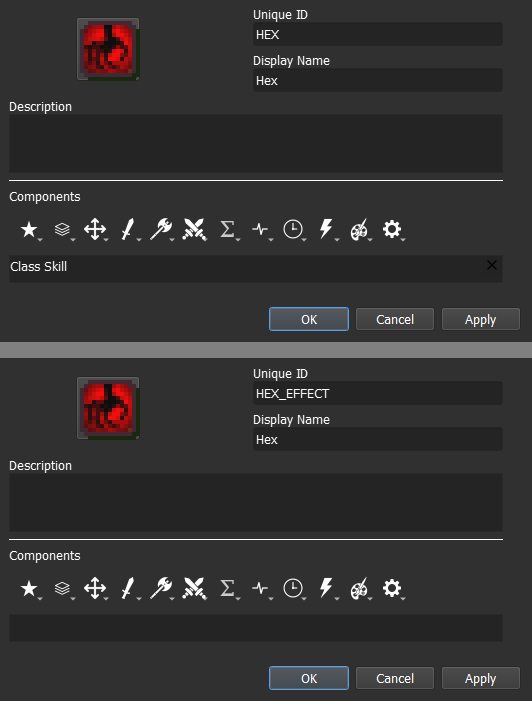

The **Description** can also be the same, but you may remove the
distance from it.

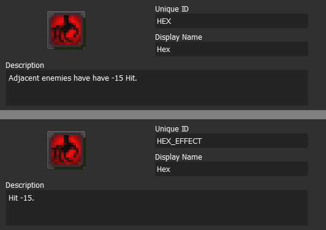

## Step 2.A: Add the Aura component to the Class Skill<a href="Auras.html#step-2-a-add-the-aura-component-to-the-class-skill"
class="headerlink" title="Link to this heading"></a>

Auras are composed of three components - **Aura component**, **Aura
Range component** and **Aura Target component**. All of them can be
found within the **Status Components** menu, represented by the **Sharp
Sound Wave icon**.

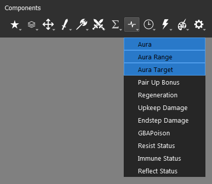

Once you add one of them, the other two will be added as well, and the
same applies to removal.

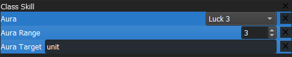

| Component Name  | Description                                          | Value                                                          |
|-----------------|------------------------------------------------------|----------------------------------------------------------------|
| **Aura**        | Defines the effect (**Skill**) that will be applied. | Skill                                                          |
| **Aura Range**  | Defines the radius of the aura, in a rhombus shape.  | Integer                                                        |
| **Aura Target** | Defines if the aura will target allies or enemies.   | Object - **ally**, **enemy** or **unit** (both ally and enemy) |

For the **Aura component**, we want to set it to the ID of the other
skill we created. We also need to set the **Aura Range component** to
the corresponding distance - 1 for *Hex* and 3 for *Bond* and *Focus*.
At last, the Aura Target should take *enemy* for *Hex* and *ally* for
*Bond*. Focus will be assigned once we get into its dedicated step.

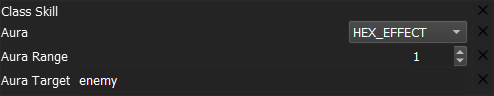

The SKILL will be displayed as any other skill in the **unit information
window**, meanwhile the effect will be displayed in the status section
for every unit that is affected.

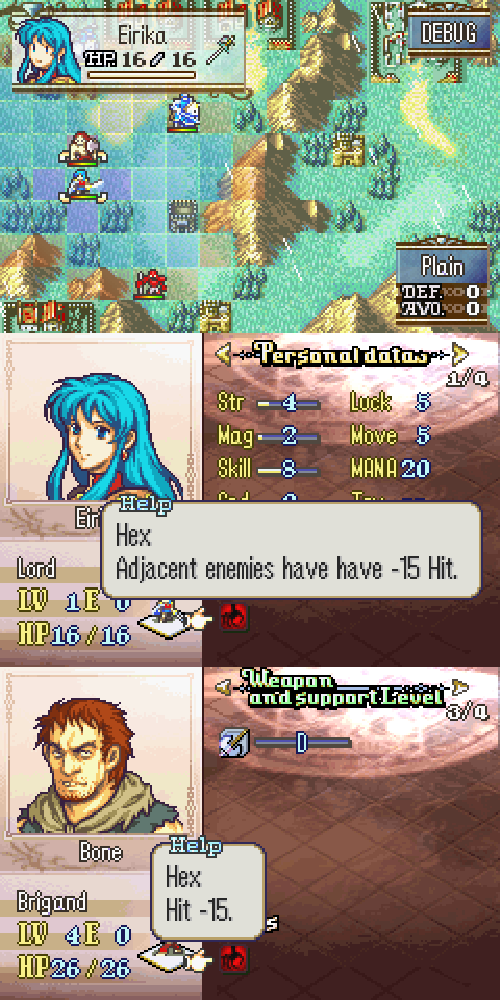

## Step 3: Add the other components to the ‘Effect Skill’<a href="Auras.html#step-3-add-the-other-components-to-the-effect-skill"
class="headerlink" title="Link to this heading"></a>

### Step 3.A: \[Hex\]( Add the Hit component<a href="Auras.md#step-3-a-hex-add-the-hit-component"
class="headerlink" title="Link to this heading"></a>

The end result should look like this:

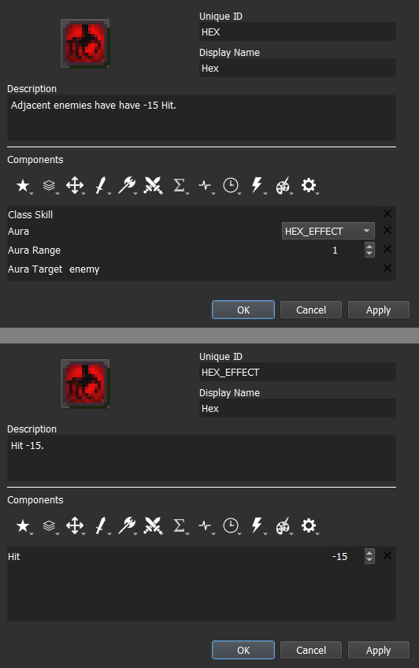

### Step 3.B: \[Bond\]( Add the Upkeep Damage component<a href="Auras.md#step-3-b-bond-add-the-upkeep-damage-component"
class="headerlink" title="Link to this heading"></a>

The **Upkeep Damage component** can also be found within the **Status
Component** menu.

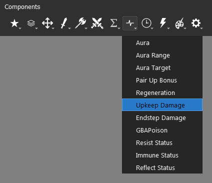

**Upkeep** is the term used to refer to the beginning of the phase. For
instance, a player unit’s upkeep is the beginning of the player phase,
and an enemy unit’s upkeep is the beginning of the enemy phase.

We can convert this component into a healing effect by assigning a
negative value. The end result should look like this:

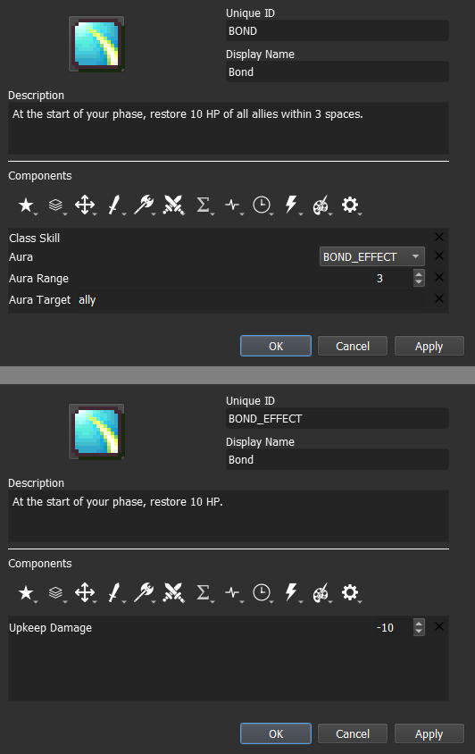

## Step 2.B → 3.C: \[Focus\] Add the Condition component to the Class Skill<a
href="Auras.html#step-2-b-3-c-focus-add-the-condition-component-to-the-class-skill"
class="headerlink" title="Link to this heading"></a>

Focus will be significantly different from the other two. We don’t
actually need the **Aura component** for this skill, since this skill
does not affect other units. Its only role here will be aesthetic, to
show the range of the at which focus is gained.

The only requirement to make it into a tracker is to set the **Aura
Target component** value to *None*.

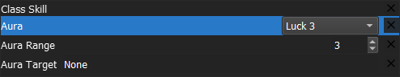

Ideally, we should also set the **Aura component** value to a ‘*generic
empty skill*’ instead of a dedicated *‘Effect Skill’*, as it can be
reused for any other range tracker.

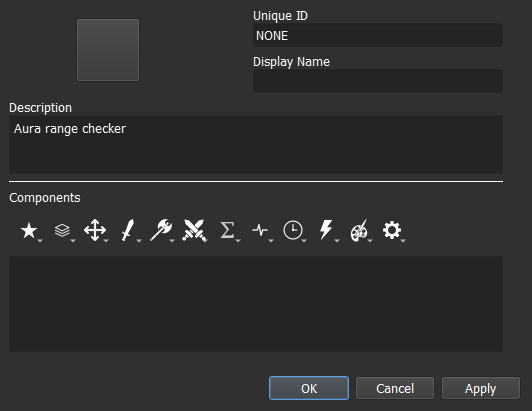

For our condition, we need to use a method that comes with the **Lex
Talionis** engine. The file **unit_funcs** (*Unit Functions*) contains
some methods that expand on the **unit** object scope and/or interact
with other objects outside it.

To check how many enemy units are within the user radius, we can use the
method **unit_funcs.check_focus(unit, {integer})**. This method can take
two values, the first is a **unit** and the second should be an integer
number greater than 0. The {integer} value is set to 3 by default if no
value is assigned. Our line should be:

    unit_funcs.check_focus(unit, 3)

**or**

    unit_funcs.check_focus(unit)

Now we add our conditional operator to check whether there are exactly 0
ally units within a range of 3:

    unit_funcs.check_focus(unit, 3) == 0

The end result should look like this:

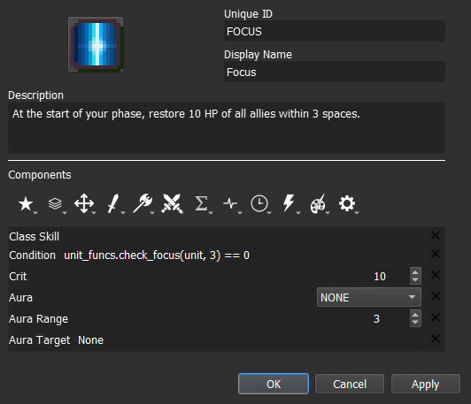

## Step 4: Test the stat alterations and effects in-game<a
href="Auras.html#step-4-test-the-stat-alterations-and-effects-in-game"
class="headerlink" title="Link to this heading"></a>

For auras in particular, we need more units to be on our testing map.
Set at least one ally and one enemy unit, then move the unit with the
aura skill to check if the effects are applied when the ally or enemy is
inside the aura radius.

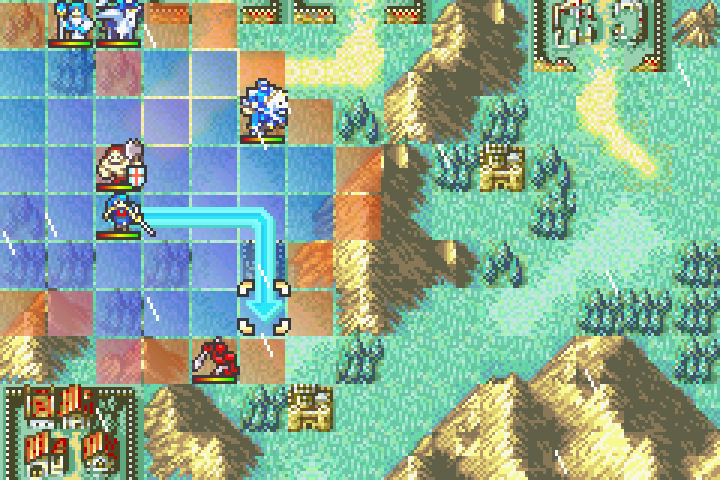

The aura radius will also be displayed whenever you hover over any unit
that carries an aura, even enemy units.

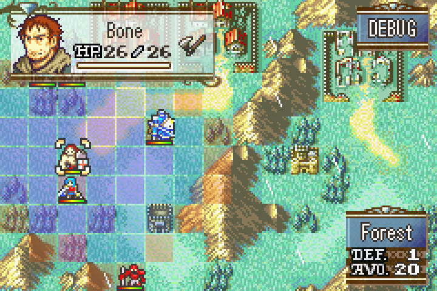

## Optional Step: Add the Hidden component to the ‘Effect Skill’<a
href="Auras.html#optional-step-add-the-hidden-component-to-the-effect-skill"
class="headerlink" title="Link to this heading"></a>

By default, every skill added to an unit will be displayed as an
inspectable element, either as a class skill or as a status, in the
**unit information window**. We can disable that property by adding the
**Hidden component**, found within the **Attribute Components** menu.

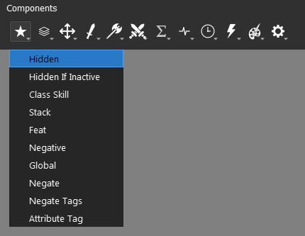

<a href="Tile-Passives.html" class="btn btn-neutral float-left"
accesskey="p" rel="prev"
title="4. Tile Oriented Passives - Outdoor Fighter and Indoor Fighter"> Previous</a>
<a href="Skill-Swap.html" class="btn btn-neutral float-right"
accesskey="n" rel="next" title="[System] Skill Swap">Next </a>

------------------------------------------------------------------------

© Copyright 2024, rainlash.

Built with [Sphinx](https://www.sphinx-doc.org/) using a
[theme](https://github.com/readthedocs/sphinx_rtd_theme) provided by
[Read the Docs](https://readthedocs.org).

