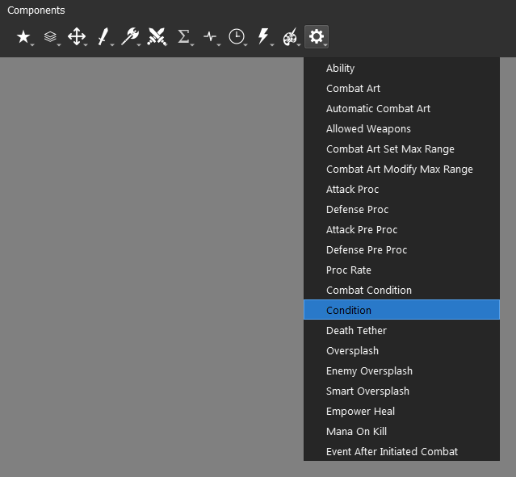
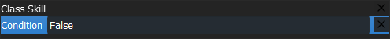
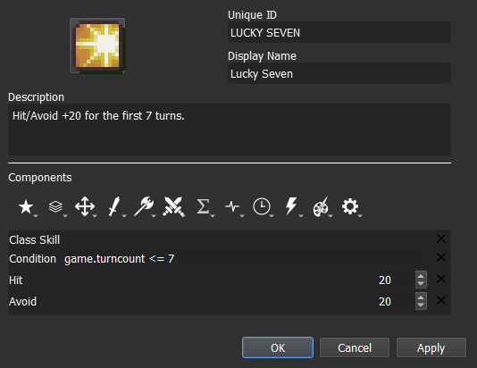
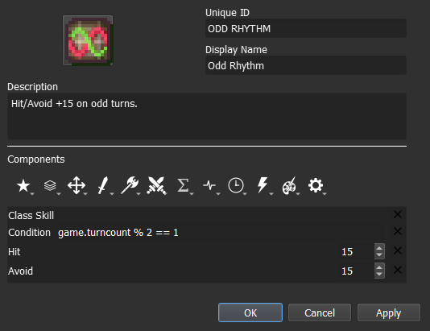
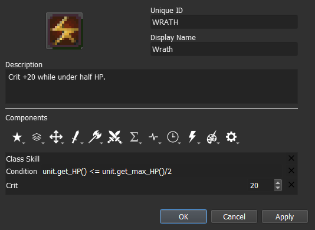
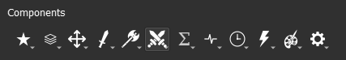
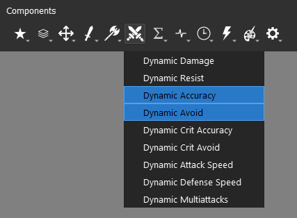
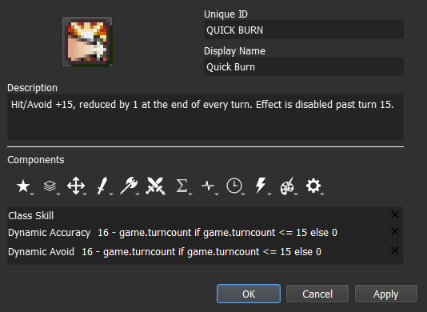
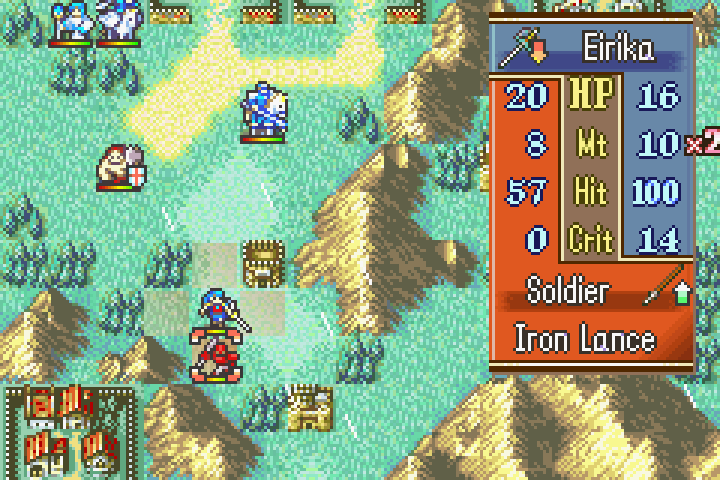

<a href="../../../index.html" class="icon icon-home">lt-maker</a>

Contents:

- <a href="../../home.html" class="reference internal">Lex Talionis
  Wiki</a>

Getting Started:

- <a href="../../getting_started/index.html"
  class="reference internal">Getting Started</a>

Editor Guides:

- <a href="../../editors/Editors-Overview.html"
  class="reference internal">Editors Overview</a>
- <a href="../../editors/index.html"
  class="reference internal">Editors</a>

Events:

- <a href="../../events/index.html" class="reference internal">Events</a>

Guides:

- <a href="../Guides-Overview.html" class="reference internal">Guides
  Overview</a>
- <a href="../index.html" class="reference internal">Guides</a>
  - <a href="../setup_tutorials/index.html"
    class="reference internal">Project Setup Tutorials</a>
  - <a href="../eventing_tutorials/index.html"
    class="reference internal">Eventing Tutorials</a>
  - <a href="index.html" class="reference internal">Skill and Item
    Tutorials</a>
    - <a href="Creating-Items.html" class="reference internal">0. Creating
      Items</a>
    - <a href="Direct-Passives.html" class="reference internal">1. Direct
      Passives - Hit +20, MAG +2 and Gamble</a>
    - <a href="Conditional-Passives-I.html#"
      class="current reference internal">2. Conditional Passives I - Lucky
      Seven, Odd Rhythm, Wrath and Quick Burn</a>
      - <a href="Conditional-Passives-I.html#required-editors-and-components"
        class="reference internal">Required editors and components</a>
      - <a href="Conditional-Passives-I.html#skill-descriptions"
        class="reference internal">Skill descriptions</a>
      - <a href="Conditional-Passives-I.html#step-1-create-a-class-skill"
        class="reference internal">Step 1: Create a Class Skill</a>
      - <a href="Conditional-Passives-I.html#step-2-a-add-the-combat-components"
        class="reference internal">Step 2.A: Add the combat components</a>
      - <a href="Conditional-Passives-I.html#step-3-add-the-condition-component"
        class="reference internal">Step 3: Add the Condition component</a>
      - <a href="Conditional-Passives-I.html#step-4-set-the-condition"
        class="reference internal">Step 4: Set the condition</a>
      - <a
        href="Conditional-Passives-I.html#step-2-b-4-d-quick-burn-add-the-dynamic-components"
        class="reference internal">Step 2.B → 4.D: [Quick Burn] Add the Dynamic
        Components</a>
      - <a
        href="Conditional-Passives-I.html#step-5-test-the-stat-alterations-in-game"
        class="reference internal">Step 5: Test the stat alterations in-game</a>
    - <a href="Conditional-Passives-II.html" class="reference internal">4.
      Conditional Passives II - Warding Blow, Rainlashslayer</a>
    - <a href="Conditional-Passives-III.html" class="reference internal">3.
      Conditional Passives III - Tomefaire, Axe Breaker and Wyrmbane</a>
    - <a href="Tile-Passives.html" class="reference internal">4. Tile Oriented
      Passives - Outdoor Fighter and Indoor Fighter</a>
    - <a href="Auras.html" class="reference internal">3. Auras - Hex, Bond and
      Focus</a>
    - <a href="Skill-Swap.html" class="reference internal">[System] Skill
      Swap</a>
    - <a href="Creating-Capture.html" class="reference internal">Capture
      skill</a>
    - <a href="Recruit-Skill.html" class="reference internal">Recruit
      Skill</a>
    - <a href="Summoning.html" class="reference internal">Summoning</a>
    - <a href="Shelter-Skill.html" class="reference internal">Shelter
      Skill</a>
    - <a href="Multi-Items.html" class="reference internal">Multi Items</a>
    - <a href="Nihil.html" class="reference internal">Nihil</a>

appendix:

- <a href="../../appendix/Text-Formatting-Commands.html"
  class="reference internal">Text Formatting Commands</a>
- <a href="../../appendix/Item-Component-Reference.html"
  class="reference internal">Item Component Dictionary</a>
- <a href="../../appendix/Skill-Component-Reference.html"
  class="reference internal">Skill Component Dictionary</a>
- <a href="../../appendix/Special-Variables.html"
  class="reference internal">Special Variables</a>
- <a href="../../appendix/Special-Tags.html"
  class="reference internal">Special Tags</a>
- <a href="../../appendix/trigger-reference.html"
  class="reference internal">Event Triggers</a>
- <a href="../../appendix/Random-Seed-Mechanics.html"
  class="reference internal">Random Seed Mechanics</a>
- <a href="../../appendix/FAQ.html" class="reference internal">Frequently
  Asked Questions</a>
- <a href="../../appendix/Contributing_to_the_LTWiki.html"
  class="reference internal">Contributing to the LTWiki</a>
- <a href="../../appendix/index.html" class="reference internal">Code
  Documentation</a>

[lt-maker](../../../index.html)

- 
- [Guides](../index.html)
- [Skill and Item Tutorials](index.html)
- 2\. Conditional Passives I - Lucky Seven, Odd Rhythm, Wrath and Quick
  Burn
- <a
  href="https://gitlab.com/rainlash/lt-maker/blob/master/docs/source/guides/skill_item_tutorials/Conditional-Passives-I.md"
  class="fa fa-gitlab">Edit on GitLab</a>

------------------------------------------------------------------------

`Originally`` ``written`` ``by`` ``Hillgarm.`` ``Last`` ``Updated`` ``2022-09-01`

# 2. Conditional Passives I - Lucky Seven, Odd Rhythm, Wrath and Quick Burn<a
href="Conditional-Passives-I.html#conditional-passives-i-lucky-seven-odd-rhythm-wrath-and-quick-burn"
class="headerlink" title="Link to this heading"></a>

Many skills have conditions to be activated, even the ones that have
passive effects. In this guide we will take a look at the basic
conditions for passive skills.

As a reminder, **Lex Talionis** is developed in **Python**, so the
conditions set by the user will also be subject to the same syntax.

**INDEX**

- **Required editors and components**

- **Skill descriptions**

- **Step 1: Create a Class Skill**

- **Step 2.A: Add the combat components**

- **Step 3: Add the Condition component**

- **Step 4: Set the condition**

  - Step 4.A: **\[Lucky Seven\]** Set a simple condition

  - Step 4.B: **\[Odd Rhythm\]** Set a condition with an expression

  - Step 4.C: **\[Wrath\]** Set a condition with an expression using
    properties

- **Step 2.B → 4.D: \[Quick Burn\] Add the dynamic components**

- **Step 5: Test the stat alterations in-game**

## Required editors and components<a href="Conditional-Passives-I.html#required-editors-and-components"
class="headerlink" title="Link to this heading"></a>

- Skills:

  - Attribute components - Class Skills

  - Combat components - Avoid, Hit and Crit

  - **Advanced components - Condition**

  - **Dynamic components - Avoid and Accuracy**

- **Objects, Attributes and Properties:**

  - **game - turncounter**

  - **unit - get_HP() and get_max_HP()**

## Skill descriptions<a href="Conditional-Passives-I.html#skill-descriptions"
class="headerlink" title="Link to this heading"></a>

- **Lucky Seven** - Hit/Avoid +20 for the first 7 turns.

- **Odd Rhythm** - Hit/Avoid +15 on odd numbered turns.

- **Wrath** - Crit +20 while under half HP.

- **Quick Burn** - Hit/Avoid +15, reduced by 1 at the end of every turn.
  Effect is disabled past turn 15.

## Step 1: Create a Class Skill<a href="Conditional-Passives-I.html#step-1-create-a-class-skill"
class="headerlink" title="Link to this heading"></a>

## Step 2.A: Add the combat components<a href="Conditional-Passives-I.html#step-2-a-add-the-combat-components"
class="headerlink" title="Link to this heading"></a>

## Step 3: Add the Condition component<a href="Conditional-Passives-I.html#step-3-add-the-condition-component"
class="headerlink" title="Link to this heading"></a>

There are many conditional and trigger components, for this tutorial we
will use the **Condition component** that can be found within the
**Advanced Components** menu, represented by the **Gear icon**.

The **Condition component** requires a statement. If the condition is
true, then the rest of the skill takes effect. If the condition is
false, then the rest of the skill is disabled.

Here are some few illustrative examples:

| Statement               | Output          |
|-------------------------|-----------------|
| Orange is Fruit         | True            |
| Orange is not Fruit     | False           |
| Orange is not Vegetable | True            |
| 4 + 2 == 6              | True            |
| 6 == 4 - 2              | False           |
| 3 + 0 \> 1              | True            |
| Orange is Angry         | Invalid, return |
| Orange == Apple         | False           |
| Orange \> Apple         | Invalid, return |

Very basic components like **Class Skill**, **Negative**, and **Hidden**
won’t be affected by it. It is highly recommended to test if the
**Condition component** is interacting with whichever other component
you may use.

## Step 4: Set the condition<a href="Conditional-Passives-I.html#step-4-set-the-condition"
class="headerlink" title="Link to this heading"></a>

Conditions can be done by doing a direct comparison or adding
expressions to either, or even both, of the sides. The required elements
will be dependent on the type of *variables* you need to access and
which operations can be performed with them.

Both *Lucky Seven* and *Odd Rhythm* will need the information regarding
the current turn. This value is stored in the attribute **turncount**,
found in the class **game**, and is updated automatically after the
enemy phase.

We can reference it with the following syntax:

    game.turncount

### Step 4.A: \[Lucky Seven\] Set a simple condition<a
href="Conditional-Passives-I.html#step-4-a-lucky-seven-set-a-simple-condition"
class="headerlink" title="Link to this heading"></a>

Simple conditions only take the bare minimum for it to work, two
elements and one operator. Some of these conditions may have multiple
syntaxes.

The syntax for **conditions** is:

    {A} <operator> {B}

Here’s the list of all **operators**:

| Operator | Explanation                | Notes                 |
|----------|----------------------------|-----------------------|
| ==       | A is equal to B            | \-                    |
| !=       | A is different from B      | \-                    |
| \>       | A is greater than B        | Numeric only          |
| \<       | A is smaller than B        | Numeric only          |
| \>=      | A is greater or equal to B | Numeric only          |
| \<=      | A is smaller or equal to B | Numeric only          |
| is       | A is equal to B            | Object only           |
| is not   | A is different from B      | Object only           |
| in       | A exist in B               | B must be an iterable |
| not in   | A doesn’t exist in B       | B must be an iterable |

Now that we know all the syntaxes, it’s time to list all our pieces.

- The **turn counter** variable stores the number corresponding to the
  current turn.

- *Lucky Seven* effect only applies for the **first 7 turns**

- We need **two elements** to settle a condition

These will converge in the following **condition**, where the skill will
be active for the first 7 turns, and then disable afterwards:

    game.turncount <= 7

Our skill should end up like this:

### Step 4.B: \[Odd Rhythm\] Set a condition with an expression<a
href="Conditional-Passives-I.html#step-4-b-odd-rhythm-set-a-condition-with-an-expression"
class="headerlink" title="Link to this heading"></a>

We’ll expand from where we left at the previous step. The major change
will be the **expression** used as a replacement for one of our
elements, along a different **operator** that fits our requirements.

**Expressions** use operators similar to regular mathematics operators,
with some few distinctions.

The syntax for **expressions** is:

    {A} <operator> {B}

Here’s the list of all **operators**:

| Operator | Explanation    | Notes                                |
|----------|----------------|--------------------------------------|
| \+       | Addition       |                                      |
| \-       | Subtraction    |                                      |
| \*       | Multiplication |                                      |
| \*\*     | Exponentiation |                                      |
| /        | Division       |                                      |
| //       | Floor division | Will return an integer, rounded down |
| %        | Modulus        | Returns the remainder of a division  |

By definition, and odd number is a number that has a remainder when
divided by 2. So our **expression**, and **condition**, should be:

    game.turncount % 2 == 1

Our skill should end up like this:

### Step 4.C: \[Wrath\] Set a condition with an expression using properties<a
href="Conditional-Passives-I.html#step-4-c-wrath-set-a-condition-with-an-expression-using-properties"
class="headerlink" title="Link to this heading"></a>

Again, we will expand from where we left at previous side step. This
time, we’ll use expressions in both sides of our condition, and they
will use two new variables.

For *Wrath*, we’ll need to retrieve information regarding the skill
holder. To do so, we need to call the **unit** object. This object is
used to reference the holder/wielder/user of a **skill** or **item**. It
takes the direct unit using it which may or not be the actual target of
the **skill** or **item**.

For **current HP** and **maximum HP** values, we need to call the
respective methods from the **unit** object:

    get_hp()

and

    get_max_hp()

With these in hand, we can finally set our **condition** as:

    unit.get_hp() <= unit.get_max_hp() / 2

Our skill should end up like this:

## Step 2.B → 4.D: \[Quick Burn\] Add the Dynamic Components<a
href="Conditional-Passives-I.html#step-2-b-4-d-quick-burn-add-the-dynamic-components"
class="headerlink" title="Link to this heading"></a>

At last, we will get into a new type of component that can handle a
non-fixed value. Instead of a static number, it can take formulas or
other attributes as its value, such as the user level, the number of
allies within a given range or even an unrelated different stat.
**Dynamic Components** can also carry **condition**, including
**expressions**, within them, which allows it to provide two different
outputs depending on the result.

Dynamic battle components are represented by the **Crossed Swords
icon**. The only exception is the **Dynamic Damage Multiplier
component**, found within the **Combat Components**.

For *Quick Burn*, we will need to use the closest approximation
available. These will be **Dynamic Accuracy component** as the **Hit
component** replacement and **Dynamic Avoid component** as the **Avoid
component** replacement.

We can then add our formula using the elements from steps 3 and 4.

Since it should only matter for the first 15 turns, it will end up as
something like:

    game.turncount <= 15

Since we are using **Dynamic components**, we can chose between using
the **Condition component** or adding the condition to the **Dynamic
component** itself.

In this particular case, it can be a matter of preference but we will
add it to the **Dynamic component** to expand our reach of
possibilities.

The syntax will be different from what we did so far as it needs the
whole If-Else statement to work.

It uses the following structure:

    {True value} if {condition} else {False value}

Now we add our values and condition to get:

    16 - game.turncount if game.turncount <= 15 else 0

or

    max(0, 16 - game.turncount)

Either one will work. Our skill should end up like this:

One important thing to know about **Dynamic Components** is that they
won’t be displayed in on the **unit information window** when inspected.
They are only added once the game calculates the attack. You need to
declare an attack in order to see the stats change. There’s no need to
execute it however.

## Step 5: Test the stat alterations in-game<a
href="Conditional-Passives-I.html#step-5-test-the-stat-alterations-in-game"
class="headerlink" title="Link to this heading"></a>

<a href="Direct-Passives.html" class="btn btn-neutral float-left"
accesskey="p" rel="prev"
title="1. Direct Passives - Hit +20, MAG +2 and Gamble"> Previous</a>
<a href="Conditional-Passives-II.html"
class="btn btn-neutral float-right" accesskey="n" rel="next"
title="4. Conditional Passives II - Warding Blow, Rainlashslayer">Next
</a>

------------------------------------------------------------------------

© Copyright 2024, rainlash.

Built with [Sphinx](https://www.sphinx-doc.org/) using a
[theme](https://github.com/readthedocs/sphinx_rtd_theme) provided by
[Read the Docs](https://readthedocs.org).

