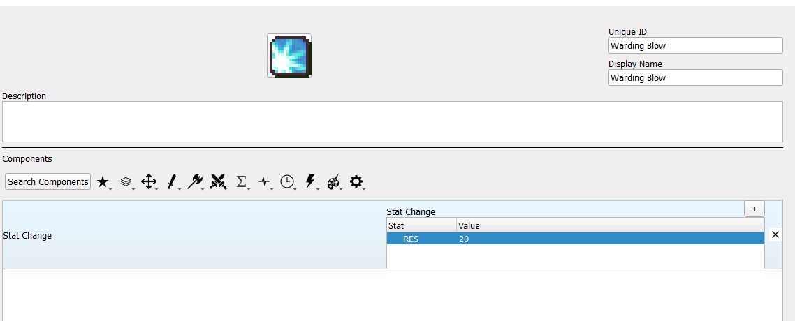
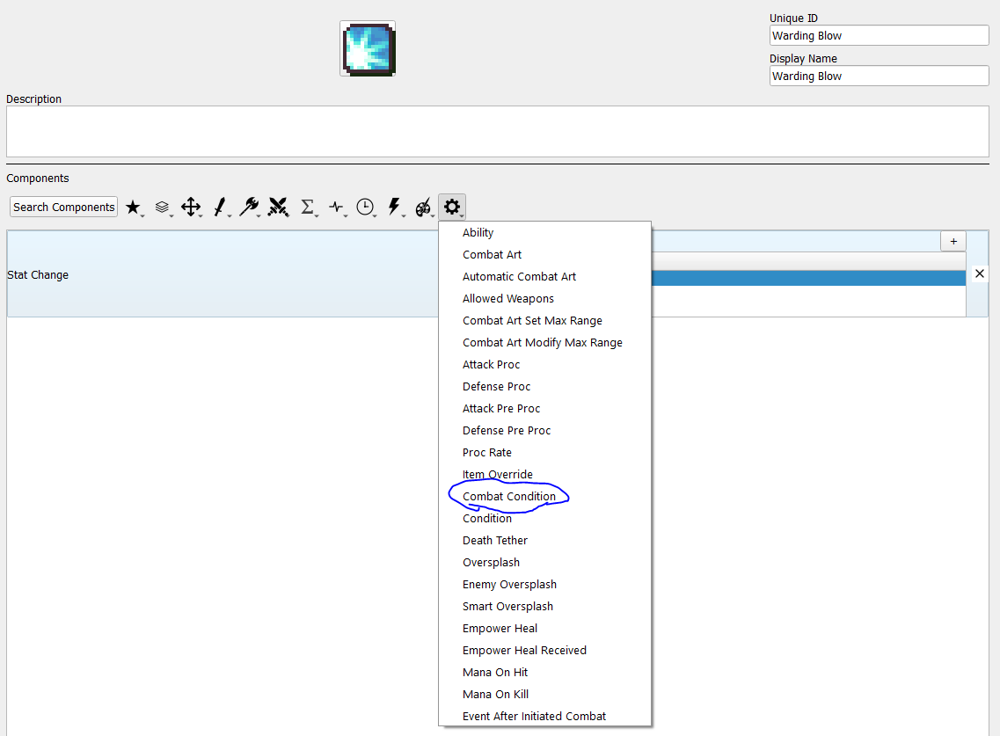
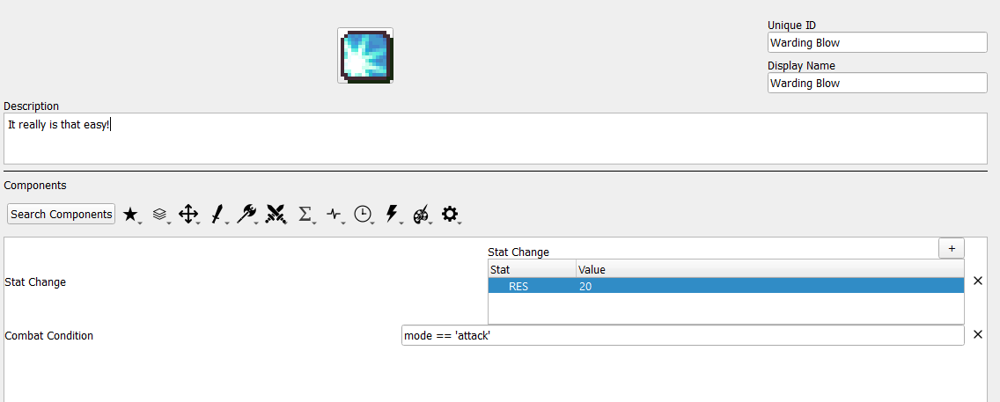
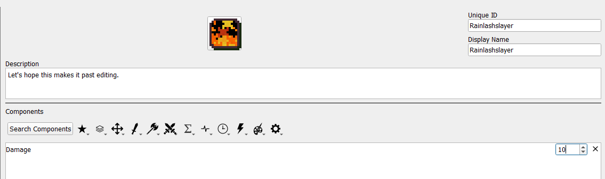
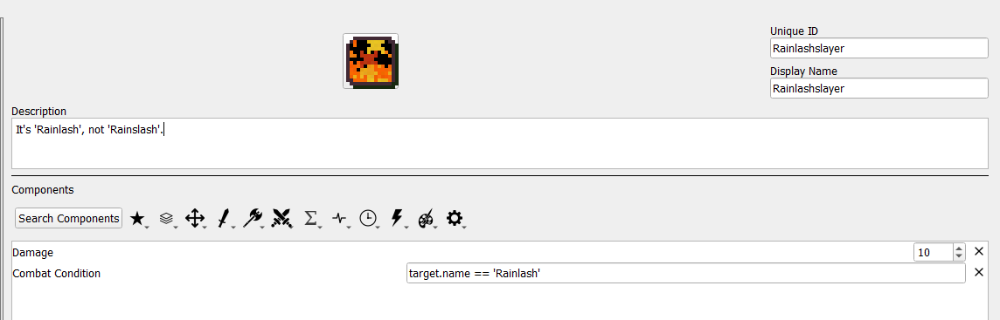

<a href="../../../index.html" class="icon icon-home">lt-maker</a>

Contents:

- <a href="../../home.html" class="reference internal">Lex Talionis
  Wiki</a>

Getting Started:

- <a href="../../getting_started/index.html"
  class="reference internal">Getting Started</a>

Editor Guides:

- <a href="../../editors/Editors-Overview.html"
  class="reference internal">Editors Overview</a>
- <a href="../../editors/index.html"
  class="reference internal">Editors</a>

Events:

- <a href="../../events/index.html" class="reference internal">Events</a>

Guides:

- <a href="../Guides-Overview.html" class="reference internal">Guides
  Overview</a>
- <a href="../index.html" class="reference internal">Guides</a>
  - <a href="../setup_tutorials/index.html"
    class="reference internal">Project Setup Tutorials</a>
  - <a href="../eventing_tutorials/index.html"
    class="reference internal">Eventing Tutorials</a>
  - <a href="index.html" class="reference internal">Skill and Item
    Tutorials</a>
    - <a href="Creating-Items.html" class="reference internal">0. Creating
      Items</a>
    - <a href="Direct-Passives.html" class="reference internal">1. Direct
      Passives - Hit +20, MAG +2 and Gamble</a>
    - <a href="Conditional-Passives-I.html" class="reference internal">2.
      Conditional Passives I - Lucky Seven, Odd Rhythm, Wrath and Quick
      Burn</a>
    - <a href="Conditional-Passives-II.html#"
      class="current reference internal">4. Conditional Passives II - Warding
      Blow, Rainlashslayer</a>
      - <a href="Conditional-Passives-II.html#required-editors-and-components"
        class="reference internal">Required editors and components</a>
      - <a href="Conditional-Passives-II.html#skill-descriptions"
        class="reference internal">Skill descriptions</a>
      - <a href="Conditional-Passives-II.html#combat-condition-overview"
        class="reference internal">Combat Condition Overview</a>
      - <a href="Conditional-Passives-II.html#warding-blow"
        class="reference internal">Warding Blow</a>
      - <a href="Conditional-Passives-II.html#rainlashslayer"
        class="reference internal">Rainlashslayer</a>
    - <a href="Conditional-Passives-III.html" class="reference internal">3.
      Conditional Passives III - Tomefaire, Axe Breaker and Wyrmbane</a>
    - <a href="Tile-Passives.html" class="reference internal">4. Tile Oriented
      Passives - Outdoor Fighter and Indoor Fighter</a>
    - <a href="Auras.html" class="reference internal">3. Auras - Hex, Bond and
      Focus</a>
    - <a href="Skill-Swap.html" class="reference internal">[System] Skill
      Swap</a>
    - <a href="Creating-Capture.html" class="reference internal">Capture
      skill</a>
    - <a href="Recruit-Skill.html" class="reference internal">Recruit
      Skill</a>
    - <a href="Summoning.html" class="reference internal">Summoning</a>
    - <a href="Shelter-Skill.html" class="reference internal">Shelter
      Skill</a>
    - <a href="Multi-Items.html" class="reference internal">Multi Items</a>
    - <a href="Nihil.html" class="reference internal">Nihil</a>

appendix:

- <a href="../../appendix/Text-Formatting-Commands.html"
  class="reference internal">Text Formatting Commands</a>
- <a href="../../appendix/Item-Component-Reference.html"
  class="reference internal">Item Component Dictionary</a>
- <a href="../../appendix/Skill-Component-Reference.html"
  class="reference internal">Skill Component Dictionary</a>
- <a href="../../appendix/Special-Variables.html"
  class="reference internal">Special Variables</a>
- <a href="../../appendix/Special-Tags.html"
  class="reference internal">Special Tags</a>
- <a href="../../appendix/trigger-reference.html"
  class="reference internal">Event Triggers</a>
- <a href="../../appendix/Random-Seed-Mechanics.html"
  class="reference internal">Random Seed Mechanics</a>
- <a href="../../appendix/FAQ.html" class="reference internal">Frequently
  Asked Questions</a>
- <a href="../../appendix/Contributing_to_the_LTWiki.html"
  class="reference internal">Contributing to the LTWiki</a>
- <a href="../../appendix/index.html" class="reference internal">Code
  Documentation</a>

[lt-maker](../../../index.html)

- 
- [Guides](../index.html)
- [Skill and Item Tutorials](index.html)
- 4\. Conditional Passives II - Warding Blow, Rainlashslayer
- <a
  href="https://gitlab.com/rainlash/lt-maker/blob/master/docs/source/guides/skill_item_tutorials/Conditional-Passives-II.md"
  class="fa fa-gitlab">Edit on GitLab</a>

------------------------------------------------------------------------

# 4. Conditional Passives II - Warding Blow, Rainlashslayer<a
href="Conditional-Passives-II.html#conditional-passives-ii-warding-blow-rainlashslayer"
class="headerlink" title="Link to this heading"></a>

Some skills have conditions that have combat-specific conditions that
must be met before becoming active. This guide illustrates how to set up
skills of that nature.

This section assumes you have already read and understood Conditional
Passives I.

## Required editors and components<a href="Conditional-Passives-II.html#required-editors-and-components"
class="headerlink" title="Link to this heading"></a>

- Skills:

  - Attribute components - Class Skills

  - Combat components - Damage, Stat Change

  - **Advanced components - Combat Condition**

- **Objects, Attributes and Properties:**

  - **mode**

  - **unit - name**

## Skill descriptions<a href="Conditional-Passives-II.html#skill-descriptions"
class="headerlink" title="Link to this heading"></a>

- **Warding Blow** - +20 RES when attacking.

- **Rainlashslayer** - +10 damage against units named Rainlash.

## Combat Condition Overview<a href="Conditional-Passives-II.html#combat-condition-overview"
class="headerlink" title="Link to this heading"></a>

The Combat Condition component gives access to additional information
available only during combat. However, a skill with this component is
always treated as inactive outside of combat.

The additional information granted by this component is: the target of
the attack and the mode of the attack.

The target available in the Combat Condition is a unit object, so you
can use any information from the target that you could use from your own
unit, such as the get_hp() and get_max_hp() used in the Wrath tutorial.

The mode is one of two values: ‘attack’ if the holder of the skill
initiated combat, and ‘defense’ if the target initiated combat.

## Warding Blow<a href="Conditional-Passives-II.html#warding-blow" class="headerlink"
title="Link to this heading"></a>

The first step is to set up what your skill is supposed to do when it’s
active. In the case of Warding Blow, when it’s active, it gives +20 RES.
Your skill should look like this to start:

Since Warding Blow only activates while attacking, you need a variable
that tracks whether the unit with Warding Blow is attacking or not,
which is the ‘mode’ mentioned above. First, you need to include the
Combat Condition component.

Since Warding Blow is active when attacking, the condition you need to
check is mode == ‘attack’, so just toss that in and you’re done!

## Rainlashslayer<a href="Conditional-Passives-II.html#rainlashslayer" class="headerlink"
title="Link to this heading"></a>

Once again, we begin with an empty template and add what the skill does
when it’s active. In this case, the skill will grant +10 damage when
active.

As before, since this skill activates only when there is another
combatant, we need to use the Combat Condition component to get
information about that combatant.

In this case, we want our skill to trigger any time the target is named
Rainlash. For this, we will not check the target’s nid as there can be
multiple unique units all named Rainlash. Instead, we can use the
target’s name field.

As mentioned earlier, any of the target’s fields can be used in this
component, such as their class, stats, and even favorite foods (if you
bother to set up Unit Notes).

As with any conditional, it is possible to create more complex setups if
needed, such as a skill that occurs only if the unit is attacking and
the target’s name is Rainlash. Go nuts.

<a href="Conditional-Passives-I.html" class="btn btn-neutral float-left"
accesskey="p" rel="prev"
title="2. Conditional Passives I - Lucky Seven, Odd Rhythm, Wrath and Quick Burn"> Previous</a>
<a href="Conditional-Passives-III.html"
class="btn btn-neutral float-right" accesskey="n" rel="next"
title="3. Conditional Passives III - Tomefaire, Axe Breaker and Wyrmbane">Next
</a>

------------------------------------------------------------------------

© Copyright 2024, rainlash.

Built with [Sphinx](https://www.sphinx-doc.org/) using a
[theme](https://github.com/readthedocs/sphinx_rtd_theme) provided by
[Read the Docs](https://readthedocs.org).

