

<a href="../../../index.html" class="icon icon-home">lt-maker</a>

Contents:

- <a href="../../home.html" class="reference internal">Lex Talionis
  Wiki</a>

Getting Started:

- <a href="../../getting_started/index.html"
  class="reference internal">Getting Started</a>

Editor Guides:

- <a href="../../editors/Editors-Overview.html"
  class="reference internal">Editors Overview</a>
- <a href="../../editors/index.html"
  class="reference internal">Editors</a>

Events:

- <a href="../../events/index.html" class="reference internal">Events</a>

Guides:

- <a href="../Guides-Overview.html" class="reference internal">Guides
  Overview</a>
- <a href="../index.html" class="reference internal">Guides</a>
  - <a href="../setup_tutorials/index.html"
    class="reference internal">Project Setup Tutorials</a>
  - <a href="../eventing_tutorials/index.html"
    class="reference internal">Eventing Tutorials</a>
  - <a href="index.html" class="reference internal">Skill and Item
    Tutorials</a>
    - <a href="Creating-Items.html" class="reference internal">0. Creating
      Items</a>
    - <a href="Direct-Passives.html" class="reference internal">1. Direct
      Passives - Hit +20, MAG +2 and Gamble</a>
    - <a href="Conditional-Passives-I.html" class="reference internal">2.
      Conditional Passives I - Lucky Seven, Odd Rhythm, Wrath and Quick
      Burn</a>
    - <a href="Conditional-Passives-II.html" class="reference internal">4.
      Conditional Passives II - Warding Blow, Rainlashslayer</a>
    - <a href="Conditional-Passives-III.html#"
      class="current reference internal">3. Conditional Passives III -
      Tomefaire, Axe Breaker and Wyrmbane</a>
      - <a href="Conditional-Passives-III.html#required-editors-and-components"
        class="reference internal">Required editors and components</a>
      - <a href="Conditional-Passives-III.html#skill-descriptions"
        class="reference internal">Skill descriptions</a>
      - <a
        href="Conditional-Passives-III.html#step-1-check-and-adjust-the-weapon-types-in-your-project"
        class="reference internal">Step 1: Check and adjust the Weapon Types in
        your project</a>
      - <a href="Conditional-Passives-III.html#step-2-create-a-class-skill"
        class="reference internal">Step 2: Create a Class Skill</a>
      - <a href="Conditional-Passives-III.html#step-3-add-the-combat-components"
        class="reference internal">Step 3: Add the Combat Components</a>
      - <a
        href="Conditional-Passives-III.html#step-4-add-a-conditional-component"
        class="reference internal">Step 4: Add a conditional component</a>
      - <a
        href="Conditional-Passives-III.html#step-5-test-the-stat-alterations-in-game"
        class="reference internal">Step 5: Test the stat alterations in-game</a>
    - <a href="Tile-Passives.html" class="reference internal">4. Tile Oriented
      Passives - Outdoor Fighter and Indoor Fighter</a>
    - <a href="Auras.html" class="reference internal">3. Auras - Hex, Bond and
      Focus</a>
    - <a href="Skill-Swap.html" class="reference internal">[System] Skill
      Swap</a>
    - <a href="Creating-Capture.html" class="reference internal">Capture
      skill</a>
    - <a href="Recruit-Skill.html" class="reference internal">Recruit
      Skill</a>
    - <a href="Summoning.html" class="reference internal">Summoning</a>
    - <a href="Shelter-Skill.html" class="reference internal">Shelter
      Skill</a>
    - <a href="Multi-Items.html" class="reference internal">Multi Items</a>
    - <a href="Nihil.html" class="reference internal">Nihil</a>

appendix:

- <a href="../../appendix/Text-Formatting-Commands.html"
  class="reference internal">Text Formatting Commands</a>
- <a href="../../appendix/Item-Component-Reference.html"
  class="reference internal">Item Component Dictionary</a>
- <a href="../../appendix/Skill-Component-Reference.html"
  class="reference internal">Skill Component Dictionary</a>
- <a href="../../appendix/Special-Variables.html"
  class="reference internal">Special Variables</a>
- <a href="../../appendix/Special-Tags.html"
  class="reference internal">Special Tags</a>
- <a href="../../appendix/trigger-reference.html"
  class="reference internal">Event Triggers</a>
- <a href="../../appendix/Random-Seed-Mechanics.html"
  class="reference internal">Random Seed Mechanics</a>
- <a href="../../appendix/FAQ.html" class="reference internal">Frequently
  Asked Questions</a>
- <a href="../../appendix/Contributing_to_the_LTWiki.html"
  class="reference internal">Contributing to the LTWiki</a>
- <a href="../../appendix/index.html" class="reference internal">Code
  Documentation</a>

[lt-maker](../../../index.html)

- 
- [Guides](../index.html)
- [Skill and Item Tutorials](index.html)
- 3\. Conditional Passives III - Tomefaire, Axe Breaker and Wyrmbane
- <a
  href="https://gitlab.com/rainlash/lt-maker/blob/master/docs/source/guides/skill_item_tutorials/Conditional-Passives-III.md"
  class="fa fa-gitlab">Edit on GitLab</a>

------------------------------------------------------------------------

`Originally`` ``written`` ``by`` ``Hillgarm.`` ``Last`` ``Updated`` ``2022-09-01`

# 3. Conditional Passives III - Tomefaire, Axe Breaker and Wyrmbane<a
href="Conditional-Passives-III.html#conditional-passives-iii-tomefaire-axe-breaker-and-wyrmbane"
class="headerlink" title="Link to this heading"></a>

This guide is a follow up on **Conditional Passives I - Lucky Seven, Odd
Rhythm, Wrath and Quick Burn**, and will cover other common elements
used for conditions.

By the end of it, you should be able to create the majority of the
iconic passive skills in any Fire Emblem game.

**INDEX**

- **Required editors and components**

- **Skill descriptions**

- **Step 1: Check and adjust the Weapon Types in your project**

  - Step 1.A: Create a new Weapon Type

  - Step 1.B: Replace Anima, Light and Dark with Tome

- **Step 2: Create a Class Skill**

- **Step 3: Add the Combat Components**

- **Step 4: Add a conditional component**

  - Step 4.A: **\[Tomefaire\]** Add and set the Condition component

  - Step 4.B: **\[Axe Breaker\]** Add and set the Combat Condition
    component

  - Step 4.C: **\[Wyrmbane\]** Add and set the Combat Condition and the
    Condition component

- **Step 5: Test the stat alterations in-game**

## Required editors and components<a href="Conditional-Passives-III.html#required-editors-and-components"
class="headerlink" title="Link to this heading"></a>

- Skills:

  - Attribute components - Class Skills

  - Combat components - Avoid, Hit, Crit and **Damage** and **Damage
    Multiplier**

  - Advanced components - Condition and **Combat Condition**

- **Weapon Types**

- Classes

- Objects, Attributes and Methods:

  - unit - **get_weapon()**

  - **target** - **get_weapon()** and **tags**

  - **item_system** - **weapon_type({unit object}, {item object})**

## Skill descriptions<a href="Conditional-Passives-III.html#skill-descriptions"
class="headerlink" title="Link to this heading"></a>

- **Tomefaire** - Might +5 when equipped with a tome.

- **Axe Breaker** - Hit/Avoid +50 when enemy is equipped with an axe.

- **Wyrmbane** - Deals effective damage to dragon units while the user
  is a (transformed) Manakete.

## Step 1: Check and adjust the Weapon Types in your project<a
href="Conditional-Passives-III.html#step-1-check-and-adjust-the-weapon-types-in-your-project"
class="headerlink" title="Link to this heading"></a>

Depending on how much you changed your project, it might be a good idea
to check certain elements in order to ensure they will work properly
with any tutorial. It is mandatory for you to know the exact **Unique
ID** of the referenced elements or else engine won’t be able to retrieve
the data nor interact with it.

We’ll need to ensure our **Weapon Types** are compatible with what we
will use, create a new one for *Wyrmbane* and merge all magic into Tome
to create *Tomefaire*.

I will also cover an option for *Anima*, *Dark* and *Light* but it’s
highly recommended to do so in advance for the *Shadowgift* guide, tough
you may replace it with any other kind of sub weapon. You may skip this
step completely if you haven’t changed any of the default **Weapon
types** nor need to add a new one.

The **Weapon Types Editor** can be found within the **Edit Menu**.

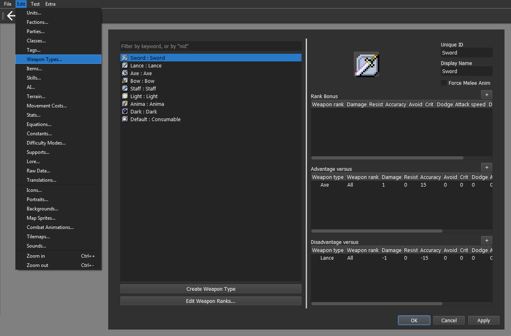

### Step 1.A: Create a new Weapon Type<a
href="Conditional-Passives-III.html#step-1-a-create-a-new-weapon-type"
class="headerlink" title="Link to this heading"></a>

We can now create a new Weapon Type. For this guide, we will create
Dragonstone and set its **Unique ID** to *Wyrm*.

It should look like this:

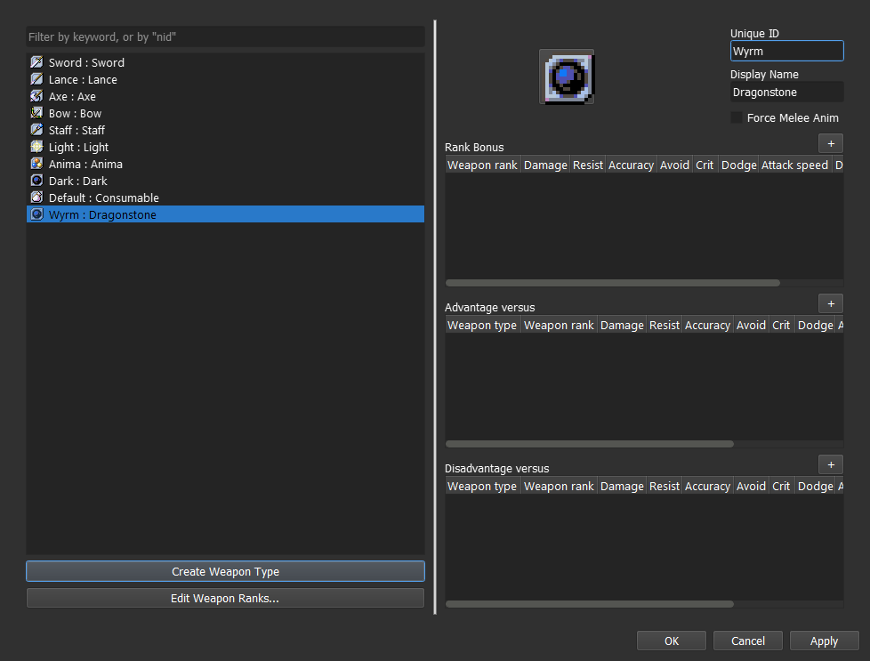

There’s also the option to create a Manakate class instead but that
isn’t the best option to replicate the effects. If that’s how you want
to do it, check the guide that covers the *Dance* ability.

### Step 1.B: Replace Anima, Light and Dark with Tome<a
href="Conditional-Passives-III.html#step-1-b-replace-anima-light-and-dark-with-tome"
class="headerlink" title="Link to this heading"></a>

For this guide, we’ll be changing *Light* **Unique ID** to *Tome* and
remove all of the advantages and disadvantages. You can do it by right
clicking on them.

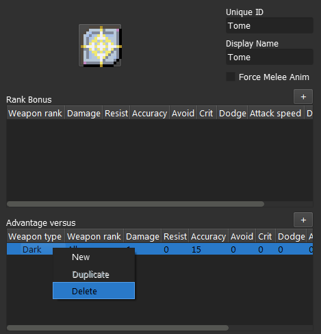

Next, we got to delete *Anima* and *Dark*, also by right clicking on
them, and set *Tome* as their replacement.

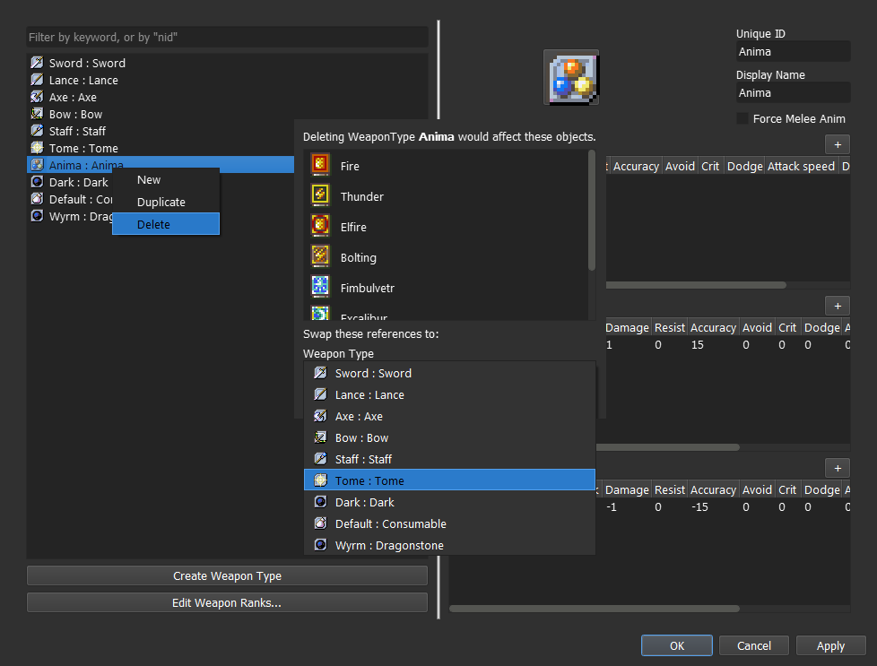

It should look like this:

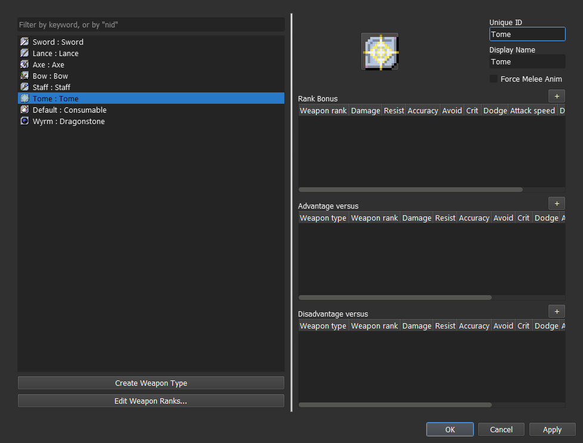

## Step 2: Create a Class Skill<a href="Conditional-Passives-III.html#step-2-create-a-class-skill"
class="headerlink" title="Link to this heading"></a>

## Step 3: Add the Combat Components<a href="Conditional-Passives-III.html#step-3-add-the-combat-components"
class="headerlink" title="Link to this heading"></a>

For *Wyrmbane* and *Tomefaire*, we will need the **Damage component**,
found within the **Combat Components** menu.

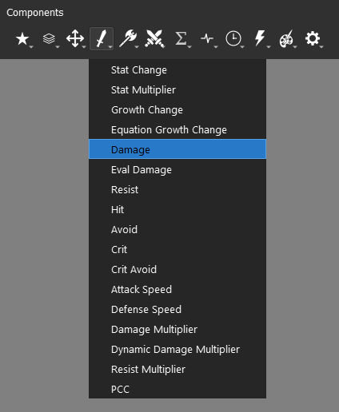

The **Damage component** will increase the **atk** stat by the set
amount, which can be checked in the **unit information window**.

We also have the option to use the **Damage Multiplier component** for
*Wyrmbane*, also within the **Combat Components** menu.

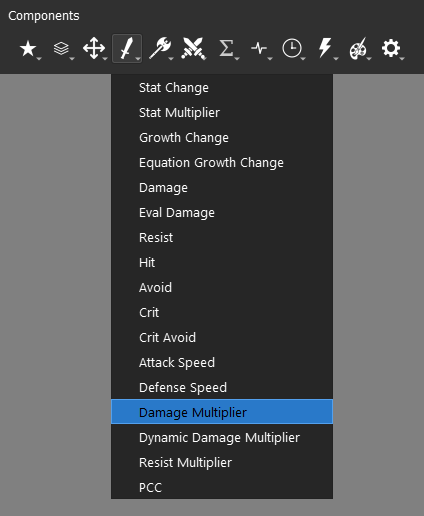

Unlike the direct counterpart, it will only manifest itself when an
attack is calculated.

When it comes to weapon effective damage, the standard is flat damage
bonus, and it isn’t an unified value either. For the sake of
consistency, you’d want to use the **Damage component** for our skill,
but you may use instead **Damage Multiplier component** if that suits
your preferences.

We’ll use 5 damage as our bonus for *Wyrmbane*.

## Step 4: Add a conditional component<a
href="Conditional-Passives-III.html#step-4-add-a-conditional-component"
class="headerlink" title="Link to this heading"></a>

All the three skills in this guide need two or more conditions to be
set, mostly to ensure any potential bug. In order to do that, we need to
know the three **logical operators** - **‘and’**, **‘or’** and
**‘not’**.

We use them by adding them between two conditions, tying them together.
The syntax is:

    <condition A> <logical operator> <condition B>
    <condition A> <logical operator> <condition B> <logical operator> <condition C>
    <condition A> <logical operator> <condition B> <logical operator> <condition C> ... <logical operator> <condition H> ... ∞

The exception is **not**, applied before any logical element.

    not {logical element}
    not <condition>

**‘And’** is the one responsible for combining all of the conditions
into a larger one, which will return **False** if any of the conditions
within isn’t fulfilled.

| Operator ‘and’ | A is True | A is False |
|----------------|-----------|------------|
| **B is True**  | True      | False      |
| **B is False** | False     | False      |

**‘Or’** also combines conditions but it will returning the **True**
value if any of the conditions within is fulfilled.

| Operator ‘or’  | A is True | A is False |
|----------------|-----------|------------|
| **B is True**  | True      | True       |
| **B is False** | True      | False      |

**‘Not’** whole deal is to reverse the value of any logical element or
condition.

| Operator ‘not’ | Result |
|----------------|--------|
| **A is True**  | False  |
| **A is False** | True   |

We can combine these into larger conditions and have distinct results.
You may tie as many of them as you want, but they will always follow the
hierarchy **not** → **and** → **or**, which can be manipulated by
setting parenthesis.

We can then set three illustrative examples and calculate the output.

    Orange is not Color and Orange is Vegetable and Orange is Round or Orange is Sour
    not True and False and True or True
    False and False and True or True
    (False and False and True) or True        <<<        solving hierarchy
    False or True
    True

Now we add parenthesis.

    (Orange is not Color and Orange is Vegetable) and (Orange is Round or Orange is Sour)
    (not True and True) and (True or True)
    (False and False) and (True or True)
    False and True
    False

At last, we set a **not** at the start of our first conditional block.

    not (Orange is not Color and Orange is Vegetable) and (Orange is Round or Orange is Sour)
    not (not True and True) and (True or True)
    not (False and False) and (True or True)
    not False and True
    True and True
    True

We could go further by adding more conditions and more parenthesis, but
we’d be here forever. These are all the tools we need to create our
conditions.

### Step 4.A: \[Tomefaire\] Add and set the Condition component<a
href="Conditional-Passives-III.html#step-4-a-tomefaire-add-and-set-the-condition-component"
class="headerlink" title="Link to this heading"></a>

For *Tomefaire*, we will be using the **unit object** and **item_system
object**. The **item_system object** is responsible for handling
multiple methods that connect **units** to their inventory **items**.

The method that retrieves the currently equipped weapon is
**get_weapon()**, and it belongs to the **unit object**. It will always
return the **item object** equipped if any is available, otherwise it
will return **None**.

    unit.get_weapon()

We can then use that method to check if that same weapon matches our
skill type. For this, we need the **weapon_type(,)** method within the
**item_system** object.

    item_system.weapon_type({unit object}, {item object})

The **item_system** is a mediator and has no internal data regarding the
**unit object** nor the **item object**. We need to specify the unit and
item in order to use it.

Since our skill is based on the own user, we will set **unit** as our
**unit object** and **unit.get_weapon()** as our **item object**.

    item_system.weapon_type(unit, unit.get_weapon())

Next, we specify the **Unique ID** from our required **Weapon Type** in
the condition.

    item_system.weapon_type(unit, unit.get_weapon()) == 'Tome'

In case you need to provide a list of **Weapon Types**, the syntax
change to:

    item_system.weapon_type(unit, unit.get_weapon()) in ('Weapon Type A', 'Weapon Type B', 'Weapon Type C', ... 'Weapon Type G', ... ∞)

For the standard magic split, we should take it as:

    item_system.weapon_type(unit, unit.get_weapon()) in ('Anima', 'Light', 'Dark')

In practice, this should be enough, but this might lead to some bugs if
the skill owner doesn’t has an equipable weapon of if its inventory is
empty. We can use the get_weapon() method to check that information, and
abort it immediately if **None** is found.

    unit.get_weapon() and item_system.weapon_type(unit, unit.get_weapon()) == 'Tome'
                                or
    unit.get_weapon() and item_system.weapon_type(unit, unit.get_weapon()) in ('Anima', 'Light', 'Dark')

The end result should look like this:

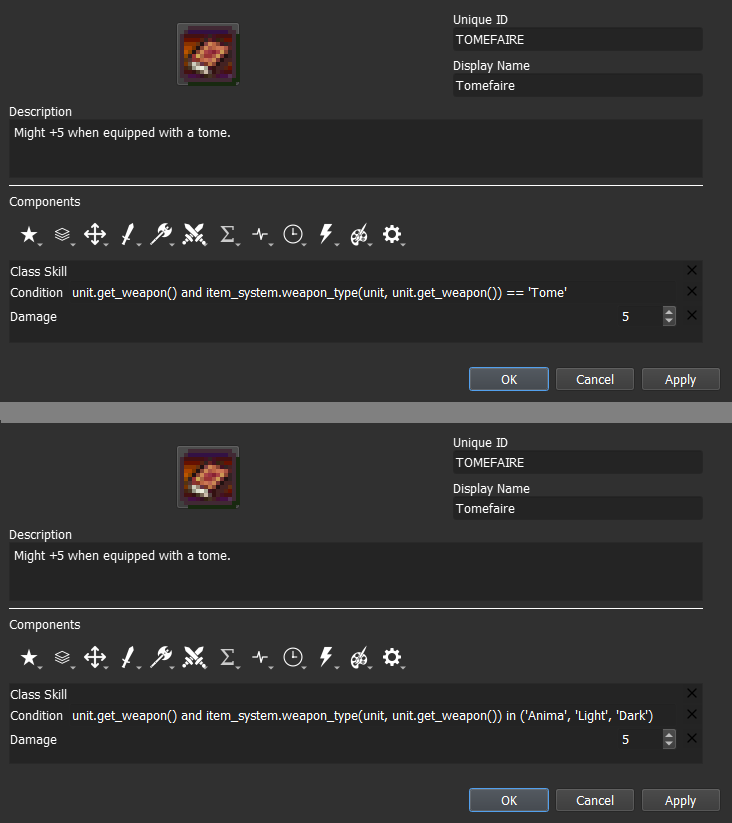

### Step 4.B: \[Axe Breaker\] Add and set the Combat Condition component<a
href="Conditional-Passives-III.html#step-4-b-axe-breaker-add-and-set-the-combat-condition-component"
class="headerlink" title="Link to this heading"></a>

The **Condition component** can only interact with the user and global
objects, along their respective methods and attributes. To access other
units, we need to use the **Combat Condition component** instead, which
can be found within the **Advanced Components** menu.

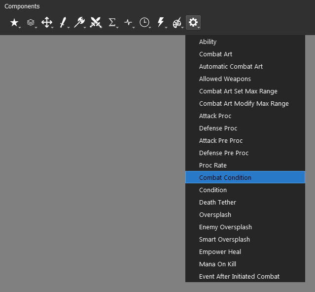

Whenever we need to reference an unit that is selected by an action, we
need to use the **target object**. The **target object** is an instance
of an **unit object** and will have all the same attributes and methods.
You can just replace the referenced object in your syntax.

There can’t be a **target object** without an **unit object** to target
it and different **units** can have different **targets** at the time.
**Targets** can be allies, enemies or even the user itself. It all
depends on the context.

When it comes to direct combat, the **target** of the *attacker* will be
the *defender*, and the **target** of the *defender* will be the
*attacker*.

By replacing the **unit object** and our **Weapon Type** to ‘Axe’, we
will get the following:

    target.get_weapon() and item_system.weapon_type(target, target.get_weapon()) == 'Axe'

The end result should look like this:

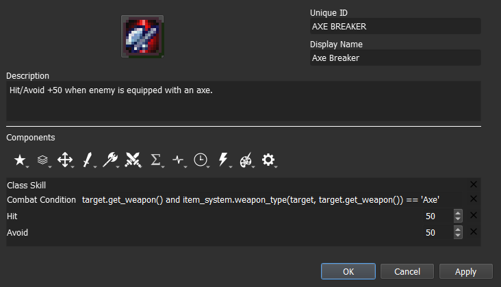

### Step 4.C: \[Wyrmbane\] Add and set the Combat Condition and the Condition component<a
href="Conditional-Passives-III.html#step-4-c-wyrmbane-add-and-set-the-combat-condition-and-the-condition-component"
class="headerlink" title="Link to this heading"></a>

At last, we will do the same using both conditional components. It can
be done using a single component but it’s easier to maintain and adjust
by using the two of them. The engine will be computed as if they had the
**‘and’** operator connecting them.

    <condition component> and <combat condition component>

Effective damage tied to unit **tags**. We can get that information by
accessing the **tags** attribute found within **unit object**. Since
what matters is the enemy, we will reference **target object** in the
**Combat Condition component**.

    'Tag' in target.tags

In a default project, the **tag** we are looking for is ‘Dragon’, which
results in:

    'Dragon' in target.tags

Next, we need to add our weapon restriction. It’s the same as the -faire
type skills. The **Unique ID** of our new **Weapon Type** was ‘Wyrm’,
and that’s all we need to replace from step 4.A.

    unit.get_weapon() and item_system.weapon_type(unit, unit.get_weapon()) == 'Wyrm'

The end result should look like this:

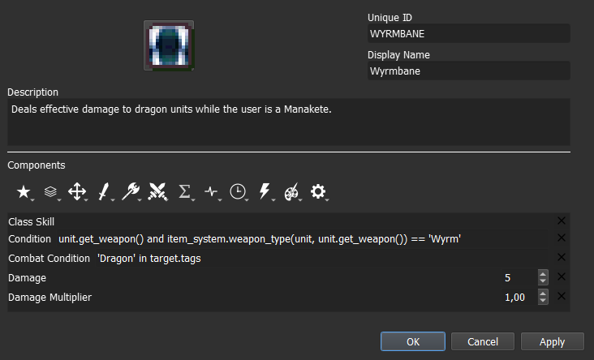

You can see that the **Damage Multiplier component** is present, but it
shouldn’t be present in the final skill. The only reason it is kept is
because the skill can be tested and tuned with either of the options.

We can virtually disable it by setting it at 1,00, and the same can be
done to the **Damage component** if we set it to 0. This is just a
convenient way to adjust skills before picking the definitive iteration.

## Step 5: Test the stat alterations in-game<a
href="Conditional-Passives-III.html#step-5-test-the-stat-alterations-in-game"
class="headerlink" title="Link to this heading"></a>

<a href="Conditional-Passives-II.html"
class="btn btn-neutral float-left" accesskey="p" rel="prev"
title="4. Conditional Passives II - Warding Blow, Rainlashslayer"> Previous</a>
<a href="Tile-Passives.html" class="btn btn-neutral float-right"
accesskey="n" rel="next"
title="4. Tile Oriented Passives - Outdoor Fighter and Indoor Fighter">Next
</a>

------------------------------------------------------------------------

© Copyright 2024, rainlash.

Built with [Sphinx](https://www.sphinx-doc.org/) using a
[theme](https://github.com/readthedocs/sphinx_rtd_theme) provided by
[Read the Docs](https://readthedocs.org).

