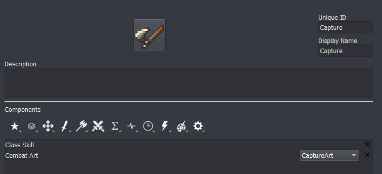
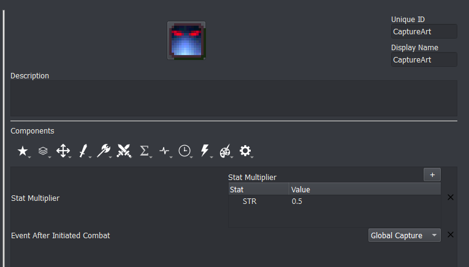
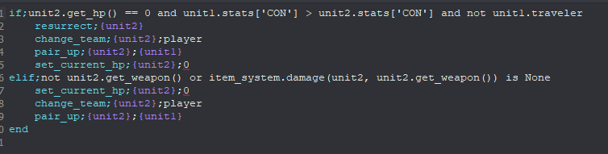
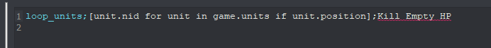
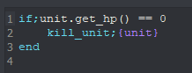
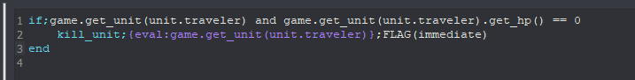
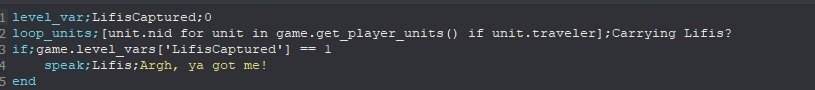
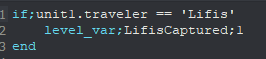

<a href="../../../index.html" class="icon icon-home">lt-maker</a>

Contents:

- <a href="../../home.html" class="reference internal">Lex Talionis
  Wiki</a>

Getting Started:

- <a href="../../getting_started/index.html"
  class="reference internal">Getting Started</a>

Editor Guides:

- <a href="../../editors/Editors-Overview.html"
  class="reference internal">Editors Overview</a>
- <a href="../../editors/index.html"
  class="reference internal">Editors</a>

Events:

- <a href="../../events/index.html" class="reference internal">Events</a>

Guides:

- <a href="../Guides-Overview.html" class="reference internal">Guides
  Overview</a>
- <a href="../index.html" class="reference internal">Guides</a>
  - <a href="../setup_tutorials/index.html"
    class="reference internal">Project Setup Tutorials</a>
  - <a href="../eventing_tutorials/index.html"
    class="reference internal">Eventing Tutorials</a>
  - <a href="index.html" class="reference internal">Skill and Item
    Tutorials</a>
    - <a href="Creating-Items.html" class="reference internal">0. Creating
      Items</a>
    - <a href="Direct-Passives.html" class="reference internal">1. Direct
      Passives - Hit +20, MAG +2 and Gamble</a>
    - <a href="Conditional-Passives-I.html" class="reference internal">2.
      Conditional Passives I - Lucky Seven, Odd Rhythm, Wrath and Quick
      Burn</a>
    - <a href="Conditional-Passives-II.html" class="reference internal">4.
      Conditional Passives II - Warding Blow, Rainlashslayer</a>
    - <a href="Conditional-Passives-III.html" class="reference internal">3.
      Conditional Passives III - Tomefaire, Axe Breaker and Wyrmbane</a>
    - <a href="Tile-Passives.html" class="reference internal">4. Tile Oriented
      Passives - Outdoor Fighter and Indoor Fighter</a>
    - <a href="Auras.html" class="reference internal">3. Auras - Hex, Bond and
      Focus</a>
    - <a href="Skill-Swap.html" class="reference internal">[System] Skill
      Swap</a>
    - <a href="Creating-Capture.html#"
      class="current reference internal">Capture skill</a>
    - <a href="Recruit-Skill.html" class="reference internal">Recruit
      Skill</a>
    - <a href="Summoning.html" class="reference internal">Summoning</a>
    - <a href="Shelter-Skill.html" class="reference internal">Shelter
      Skill</a>
    - <a href="Multi-Items.html" class="reference internal">Multi Items</a>
    - <a href="Nihil.html" class="reference internal">Nihil</a>

appendix:

- <a href="../../appendix/Text-Formatting-Commands.html"
  class="reference internal">Text Formatting Commands</a>
- <a href="../../appendix/Item-Component-Reference.html"
  class="reference internal">Item Component Dictionary</a>
- <a href="../../appendix/Skill-Component-Reference.html"
  class="reference internal">Skill Component Dictionary</a>
- <a href="../../appendix/Special-Variables.html"
  class="reference internal">Special Variables</a>
- <a href="../../appendix/Special-Tags.html"
  class="reference internal">Special Tags</a>
- <a href="../../appendix/trigger-reference.html"
  class="reference internal">Event Triggers</a>
- <a href="../../appendix/Random-Seed-Mechanics.html"
  class="reference internal">Random Seed Mechanics</a>
- <a href="../../appendix/FAQ.html" class="reference internal">Frequently
  Asked Questions</a>
- <a href="../../appendix/Contributing_to_the_LTWiki.html"
  class="reference internal">Contributing to the LTWiki</a>
- <a href="../../appendix/index.html" class="reference internal">Code
  Documentation</a>

[lt-maker](../../../index.html)

- 
- [Guides](../index.html)
- [Skill and Item Tutorials](index.html)
- Capture skill
- <a
  href="https://gitlab.com/rainlash/lt-maker/blob/master/docs/source/guides/skill_item_tutorials/Creating-Capture.md"
  class="fa fa-gitlab">Edit on GitLab</a>

------------------------------------------------------------------------

# Capture skill<a href="Creating-Capture.html#capture-skill" class="headerlink"
title="Link to this heading"></a>

This tutorial will teach you how to create the capture mechanic from
Thracia 776. If you are looking for capture from Fates this will also be
a good place to start.

In Thracia 776, capture works the following way: An attack is initiated
with stats halved. If the attack reduces the enemy to 0 or less HP, and
if the enemy’s CON is less than the attacker’s CON, the attacker
essentially ‘rescues’ the enemy unit that it’s capturing–and can then
trade away their items.

We will implement this in Lex Talionis. First, we’ll create the capture
skill.

Combat Art “CaptureArt” refers to the following skill:

Event After Initiated Combat “Global Capture” refers to an event named
Capture in the global section that we’ll create later.

Following our desired implementation, attacking with the Capture command
will have the unit initiate an attack with their strength, magic, skill,
luck, and speed halved. After the battle, the Capture event will be
called. Here’s what that event looks like:

The Level for this event is Global and the Trigger is None. Let’s walk
through what’s happening here.

In the if statement the event is checking that the defending unit died
after combat. After all, we only want to capture units we kill. It then
uses an “and” statement to check that the attacker’s constitution is
greater than the enemy’s constitution, again in line with Thracia 776.
If you’re looking for a more Fates-like capture or aren’t using CON,
remove this part. Finally, we’ll make sure that the attacker isn’t
already rescuing someone. Alternatively, this could be in a Condition
component in the Capture skill.

Within the if statement, a few things happen. First, the dead defender
is resurrected. They become a player team unit. The pair_up command
might seem confusing - after all, we’re capturing, not pairing up - but
pair_up can actually be used to rescue a unit if pair up is turned off
in Constants. Since the same syntax is used make sure that {unit2} (the
defender) is the first parameter. Finally, we set the current health of
the now revived defender to 0. That might surprise you, but there’s a
reason why.

Remember, we need a captured enemy to die when dropped. Units with 0 HP
don’t actually die until after they are next in combat. Since we’ll be
keeping our new friend rescued they won’t ever be in combat. The next
thing we’ll do is make sure they die when dropped. You might not, for
whatever reason, want units at 0 HP to instantly die while on the field.
If that’s the case, change the set_current_hp command to set_name and
input an appropriate name.

The elif statement denotes a special edge case in Thracia: when an enemy
is not wielding a weapon or has a staff equipped. We check to see if the
enemy is completely unarmed or has a weapon equipped that cannot deal
damage. If so, we capture them no matter what.

We’ll now create a new event in the Global level. I called mine “Search
for Empty HP” and gave it a trigger of unit_wait.

This is the only line in the event. Loop units can sometimes be hard to
understand, so let’s break it down. The first parameter (the one
surrounded by square brackets) gives the command a list of units that
are on the map. The second parameter refers to an event we’re about to
write named “Kill Empty HP”.

**NOTE: Do not let the event editor autofill the second parameter for
you!**

Again in the global level, create an event named “Kill Empty HP” with a
Trigger of None. The contents of the command should be simple:

If the given unit is at 0 HP, kill it. If you chose to replace the
set_current_hp command with set_name before, change the if statement to
`if;unit.name`` ``==`` ``'NAMEYOUCHOSEEARLIER'`

Now, a problem might arise if you ended the chapter while holding a
captured unit (namely, it would recruit them). Luckily, this shouldn’t
be a difficult fix. You’ll want to find the events in your level where
win_game (the command to end the chapter) is called. Prior to the
win_game call, add the following line:
`loop_units;[unit.nid`` ``for`` ``unit`` ``in`` ``game.get_player_units()`` ``if`` ``unit.traveler];Kill`` ``0`` ``HP`` ``Travelers`

Where Kill 0 HP Travelers refers to the following event in the Global
level:

    if;game.get_unit(unit.traveler) and game.get_unit(unit.traveler).get_hp() == 0
        kill_unit;{eval:game.get_unit(unit.traveler)};immediate
    end

And that’s it! You should now have a Thracia-style capture system. You
can trade with captured units and transfer them between party members,
as well as release them to remove them from the map.

If you want to check for the status of a unit at the end of a chapter
(i.e., if Lifis is captured by the player at the end of 2x) you’ll want
to use a similar loop_units setup. Create a game_var or level_var and
set it to 0. Construct a block of event code that looks similar to this:

You can see that it refers to another event. That event contains the
following:

With this, the game will check if anyone is carrying Lifis!

<a href="Skill-Swap.html" class="btn btn-neutral float-left"
accesskey="p" rel="prev" title="[System] Skill Swap"> Previous</a>
<a href="Recruit-Skill.html" class="btn btn-neutral float-right"
accesskey="n" rel="next" title="Recruit Skill">Next </a>

------------------------------------------------------------------------

© Copyright 2024, rainlash.

Built with [Sphinx](https://www.sphinx-doc.org/) using a
[theme](https://github.com/readthedocs/sphinx_rtd_theme) provided by
[Read the Docs](https://readthedocs.org).

