

<a href="../../../index.html" class="icon icon-home">lt-maker</a>

Contents:

- <a href="../../home.html" class="reference internal">Lex Talionis
  Wiki</a>

Getting Started:

- <a href="../../getting_started/index.html"
  class="reference internal">Getting Started</a>

Editor Guides:

- <a href="../../editors/Editors-Overview.html"
  class="reference internal">Editors Overview</a>
- <a href="../../editors/index.html"
  class="reference internal">Editors</a>

Events:

- <a href="../../events/index.html" class="reference internal">Events</a>

Guides:

- <a href="../Guides-Overview.html" class="reference internal">Guides
  Overview</a>
- <a href="../index.html" class="reference internal">Guides</a>
  - <a href="../setup_tutorials/index.html"
    class="reference internal">Project Setup Tutorials</a>
  - <a href="../eventing_tutorials/index.html"
    class="reference internal">Eventing Tutorials</a>
  - <a href="index.html" class="reference internal">Skill and Item
    Tutorials</a>
    - <a href="Creating-Items.html#" class="current reference internal">0.
      Creating Items</a>
      - <a href="Creating-Items.html#item-1-boss-killer-sword"
        class="reference internal">Item 1 - Boss Killer Sword</a>
      - <a href="Creating-Items.html#item-2-multi-unit-healing-staff"
        class="reference internal">Item 2 - Multi-unit Healing Staff</a>
      - <a href="Creating-Items.html#item-3-the-warp-staff"
        class="reference internal">Item 3 - The Warp Staff</a>
      - <a href="Creating-Items.html#item-4-iron-shield"
        class="reference internal">Item 4 - Iron Shield</a>
      - <a href="Creating-Items.html#item-5-three-houses-magic-system"
        class="reference internal">Item 5 - Three Houses Magic System</a>
      - <a href="Creating-Items.html#item-6-devil-axe"
        class="reference internal">Item 6 - Devil Axe</a>
      - <a href="Creating-Items.html#conclusion"
        class="reference internal">Conclusion</a>
    - <a href="Direct-Passives.html" class="reference internal">1. Direct
      Passives - Hit +20, MAG +2 and Gamble</a>
    - <a href="Conditional-Passives-I.html" class="reference internal">2.
      Conditional Passives I - Lucky Seven, Odd Rhythm, Wrath and Quick
      Burn</a>
    - <a href="Conditional-Passives-II.html" class="reference internal">4.
      Conditional Passives II - Warding Blow, Rainlashslayer</a>
    - <a href="Conditional-Passives-III.html" class="reference internal">3.
      Conditional Passives III - Tomefaire, Axe Breaker and Wyrmbane</a>
    - <a href="Tile-Passives.html" class="reference internal">4. Tile Oriented
      Passives - Outdoor Fighter and Indoor Fighter</a>
    - <a href="Auras.html" class="reference internal">3. Auras - Hex, Bond and
      Focus</a>
    - <a href="Skill-Swap.html" class="reference internal">[System] Skill
      Swap</a>
    - <a href="Creating-Capture.html" class="reference internal">Capture
      skill</a>
    - <a href="Recruit-Skill.html" class="reference internal">Recruit
      Skill</a>
    - <a href="Summoning.html" class="reference internal">Summoning</a>
    - <a href="Shelter-Skill.html" class="reference internal">Shelter
      Skill</a>
    - <a href="Multi-Items.html" class="reference internal">Multi Items</a>
    - <a href="Nihil.html" class="reference internal">Nihil</a>

appendix:

- <a href="../../appendix/Text-Formatting-Commands.html"
  class="reference internal">Text Formatting Commands</a>
- <a href="../../appendix/Item-Component-Reference.html"
  class="reference internal">Item Component Dictionary</a>
- <a href="../../appendix/Skill-Component-Reference.html"
  class="reference internal">Skill Component Dictionary</a>
- <a href="../../appendix/Special-Variables.html"
  class="reference internal">Special Variables</a>
- <a href="../../appendix/Special-Tags.html"
  class="reference internal">Special Tags</a>
- <a href="../../appendix/trigger-reference.html"
  class="reference internal">Event Triggers</a>
- <a href="../../appendix/Random-Seed-Mechanics.html"
  class="reference internal">Random Seed Mechanics</a>
- <a href="../../appendix/FAQ.html" class="reference internal">Frequently
  Asked Questions</a>
- <a href="../../appendix/Contributing_to_the_LTWiki.html"
  class="reference internal">Contributing to the LTWiki</a>
- <a href="../../appendix/index.html" class="reference internal">Code
  Documentation</a>

[lt-maker](../../../index.html)

- 
- [Guides](../index.html)
- [Skill and Item Tutorials](index.html)
- 0\. Creating Items
- <a
  href="https://gitlab.com/rainlash/lt-maker/blob/master/docs/source/guides/skill_item_tutorials/Creating-Items.md"
  class="fa fa-gitlab">Edit on GitLab</a>

------------------------------------------------------------------------

# 0. Creating Items<a href="Creating-Items.html#creating-items" class="headerlink"
title="Link to this heading"></a>

The item and skill editor are some of the most expansive parts of Lex
Talionis. However, due to the wide array of options they can often be
daunting to new users.

This guide will create five example items that will hopefully provide
helpful examples on how some of the more exotic components can be used.

Before you continue reading, scroll through the items already included
in the Sacred Stones project. Many desired items already exist either
there or in the Lion Throne.

## Item 1 - Boss Killer Sword<a href="Creating-Items.html#item-1-boss-killer-sword"
class="headerlink" title="Link to this heading"></a>

We’ll start with a simple tool to help you kill your boss.

From the item editor, click the “Create Item” button. A new item will be
created.

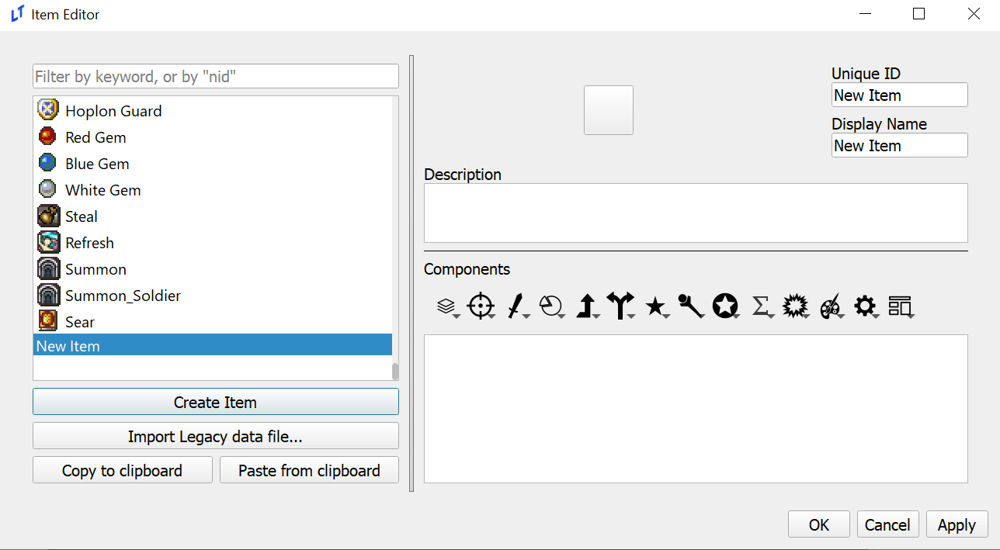

We’ll start from the top right and work our way down. First, fill out
the sword’s unique ID slot. You’ll notice that whatever you type in
unique ID is copied into the name, but not vice versa. The unique ID
acts as the weapon’s “true name”. When referring to an item or skill in
events you’ll want to make sure that you’re calling it’s ID, rather than
it’s name.

To the left of those two text boxes is a while square. Click on it to
bring up the icon selector. Depending on if you’ve used the icon
selector previously, you might not have any icons to choose from. If
that is the case, click “Add New Icon Sheet” and add the following
image. You can find more like this in the default or sacred_stones
resource/icons16 folder.

Choose an icon you like and hit okay. Once the window closes, type a
description in the box below.

Your item should now look something like this:

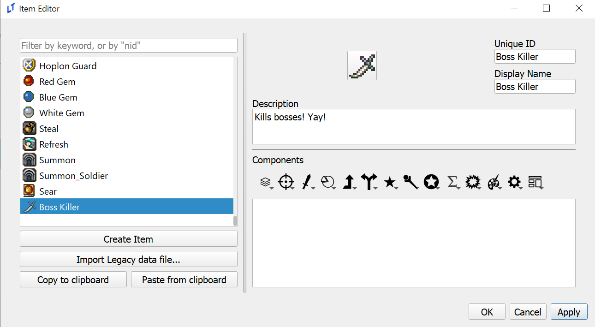

Click “Apply” in the bottom right. In Lex Talionis, apply equivalent to
the save button. Always make sure that you apply changes before you
close an editor!

From now on, each item and skill covered in tutorials will assume that
you’ve done the previous steps.

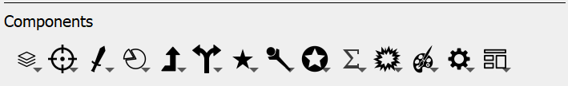

This list of item components is the essential elements of every item in
the game. Each of these icons has a number of components contained
within. Before you get too daunted, click the icon on the far right and
choose “Weapon Template”. The templates will be a helpful guide to the
items we’ll make in this tutorial.

Choosing weapon template will apply a number of self-explanatory
components to the weapon. If you’re confused about any of them, hover
over the component. A short text box will appear explaining what it
does. Set whatever values you want for the new components.

Now click on the start icon in the middle. At the top of the list,
choose the “Effective” Component. If you scroll down using the sidebar,
you should see that two new components have been added.

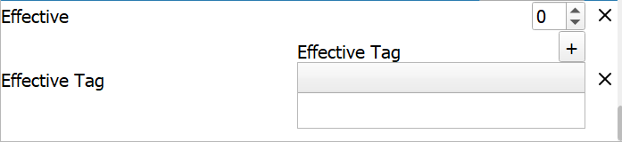

The Effective component decides what the might of the weapon becomes
when it is effective against a target. It is **not a multiplier**, it is
an addition. I will set mine to 15 - for a total of 5 + 15 base might
against an effective target.

Now go to Effective Tag. These determine the tags which this weapon is
effective against. The plus in the top right adds a tag to the list.
Double click on the newly created tag and choose “Boss” in the popup
menu. If you would like, you can press the plus again to add more tags.
Further tags can be created in the tag editor and assigned to classes in
the class editor. For now, my final item looks like this (weapon and
value components are cut off at the top):

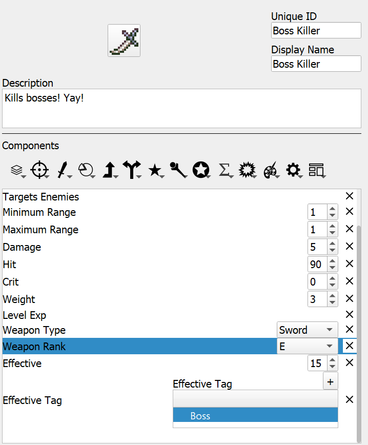

## Item 2 - Multi-unit Healing Staff<a href="Creating-Items.html#item-2-multi-unit-healing-staff"
class="headerlink" title="Link to this heading"></a>

In Absolution, ZessDynamite’s Lex Talionis project, he has a staff
called Symbiosis that can heal two units at once. We’ll create something
similar. First, set up the name, icon, and description of the staff,
similar to the last item.

Now, go to the template icon and choose “Spell Template”. Change the
weapon type to Staff. By default, minimum range is 0. That allows the
unit to heal themselves with the staff. Change it if you wish.

However, delete the maximum range component. Click the reticle icon and
choose “Maximum Equation Range”. While Maximum Range is a fixed integer,
maximum equation range can refer to an equation defined in the equations
editor. If you’re working off the sacred stones project I would set
MAGIC_RANGE as the equation to refer to. If not, you can either make
your own equation or choose another one.

Clicking the reticle again, choose “Target Allies”. The pie icon
contains “Uses” and “Chapter Uses”. Uses acts like normal Fire Emblem
uses, while chapter uses refresh at the end of the chapter. Choose what
you’d prefer and set it to the value you desire.

The single up arrow icon contains exp components. Heal EXP makes sense
here, as well as WEXP for that glorious staff rank. These components
would normally be included in a weapon template, but the spell template
is a bit broader.

Finally, click the staff icon and choose between “Heal” and “Magic
Heal”. Heal only ever heals the amount specified in the item, while
magic heal heals the amount specified plus the value of a HEAL equation
in the equations editor.

Finally, click the gear icon on the far right and choose “Multi Target”.
This will finish your item. Go ahead and test it!

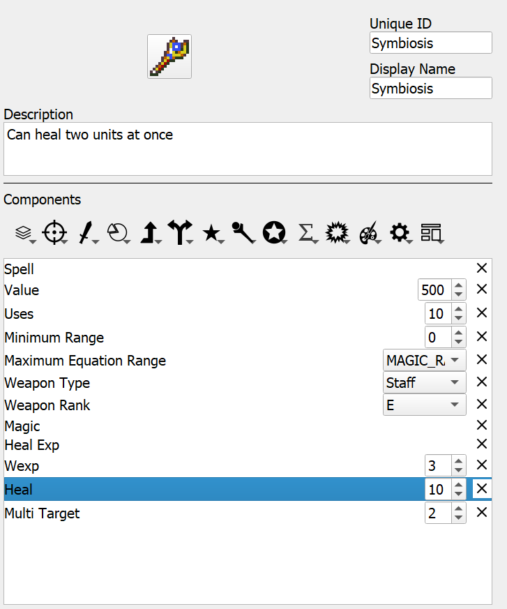

## Item 3 - The Warp Staff<a href="Creating-Items.html#item-3-the-warp-staff" class="headerlink"
title="Link to this heading"></a>

The Sacred Stones project already has a warp staff implemented, so
instead of creating our own I’ll be explaining how sequence item (the
component that makes warp staves possible) works.

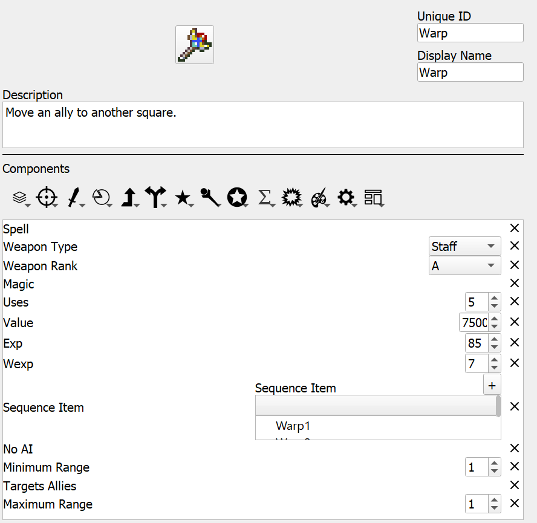

Compared to what we saw with the Symbiosis staff there are two new
components here. The first, and simplest, is “No AI”. The AI in Lex
Talionis currently cannot handle sequence items. As such, any item with
the sequence item component must either be given the no AI component or
kept away from the AI.

The sequence item component is the core of the warp and rescue staves.
Sequence item refers to a certain amount of sub-items that exist when
the main item is used. In warp’s case, Warp1 is the first sub-item that
is called. It’s a simple item overall, but contains the “Store Unit”
component. This component simply has the game remember the unit that
this item selects. Once Warp1 is used Warp2 is called. Notice that Warp2
targets all tiles, rather than Warp1’s allies, and has the “Unload Unit”
command, which places the unit on the selected tile.

Hopefully, this sheds a bit of light on how sequence items work and why
they’re important. If you have an item that does two different things
sequence items can be a useful way to implement them. If you’re looking
for more examples, the Rescue staff is a good reference.

## Item 4 - Iron Shield<a href="Creating-Items.html#item-4-iron-shield" class="headerlink"
title="Link to this heading"></a>

Shadows of Valentia used non-weapon accessories as an additional way of
augmenting units. This can be done in the Lex Talionis engine through
accessories.

First, open the constants editor. On the left you should see a box
labeled “Max number of Accessories in inventory”. Increase that number
to at least one. Hit apply, then ok.

Set up the description and name. Then, choose the farthest left icon and
select the “Accessory” component. Click the star component and choose
“Status on Hold”. The list next to this component shows a list of all
skills in your project. The Sacred Stones project has Defense +5 as a
base skill, so we’ll use that. Give it to a unit, and test it out! You
should notice a nice +5 next to your unit’s defense.

However, if you scroll to the unit’s inventory, you might notice
something weird. The Iron Shield doesn’t seem to be there!

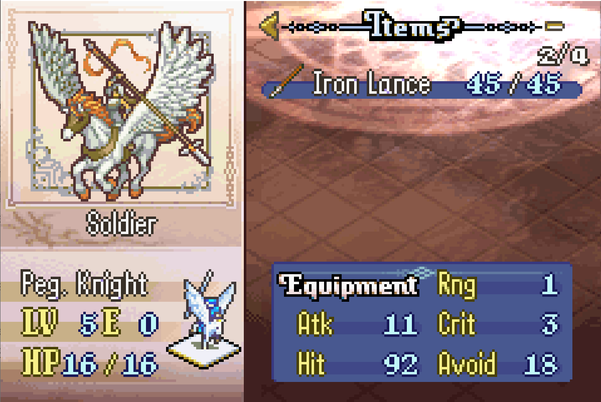

The unit UI currently only has space to display five items. Remember how
we increased accessory number to one? That means that the Iron Shield is
currently taking up the sixth item slot. Reducing the max number of
weapons in a unit’s inventory fixes this issue.

## Item 5 - Three Houses Magic System<a href="Creating-Items.html#item-5-three-houses-magic-system"
class="headerlink" title="Link to this heading"></a>

Three Houses took a rather unique approach to its magic system. Rather
than having tomes that share inventory with other weapons, 3H tomes
recharged at the end of each chapter and had a separate inventory space.
While we can’t delineate an *entirely* new space for tomes, we can get
pretty close through the power of the Multi Item component.

As always, create a new item with a name, description, and icon. Click
the gear icon and choose “Multi Item”. This will add a component with a
space similar to the sequence item or effective tag components. You can
add previously made weapons, like fire or thunder, to be included in
this multi item.

And… that’s it! If you really want to go full Three Houses, replace the
uses component in the tomes you added with the chapter uses component.
The add_item_to_multiitem event command can be a useful way to add
spells to an individual unit’s multi item, allowing you to make
completely unique spellcasters! For more information, check out the
documentation on the command in the event editor.

## Item 6 - Devil Axe<a href="Creating-Items.html#item-6-devil-axe" class="headerlink"
title="Link to this heading"></a>

In vanilla Fire Emblem GBA games, the Devil Axe is a high-risk weapon
that can backfire, damaging its wielder instead of the enemy. We’ll
recreate this mechanic in Lex Talionis using equations, skills, and item
components. The first step is to create an equation that determines the
backfire chance. Open the Equation Editor and create a new equation
called DEVIL_CHANCE. Set its expression to 31 - SKL

Next we need to create the actual backfire effect as a skill. Open the
Skill Editor and make a new skill called Devil_Effect_child. Click the
battle axe icon to add the “Devil Axe GBA” component, making sure it’s
set to Affect attacks done by unit (so the damage is dealt to the
wielder).

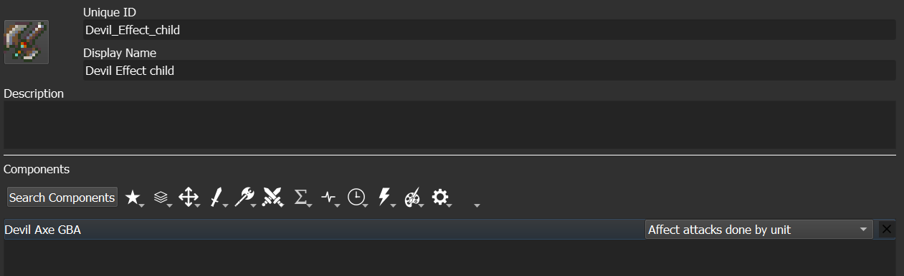

Now we need to create the skill that will randomly trigger this effect.
Make another new skill called Devil_Effect. From the cogwheel icon
section, add two components: First add the “Proc Rate” component and set
it to use our DEVIL_CHANCE equation. Then add the “Attack Proc”
component and set it to trigger the Devil_Effect_child skill we just
made.

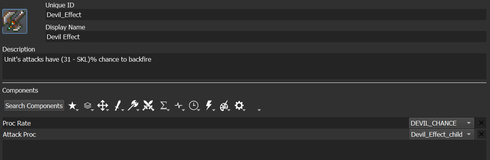

Finally we’ll create the actual Devil Axe item. Open the Item Editor and
make a new weapon. Give it an appropriate nid, display name, description
and icon. In the template icon section, apply the “Weapon Template” to
set up basic weapon properties. The crucial step is adding the “Status
on Equip” component from the star icon section and selecting our
Devil_Effect skill. This means any unit equipping the axe will gain the
chance to hurt themselves when attacking.

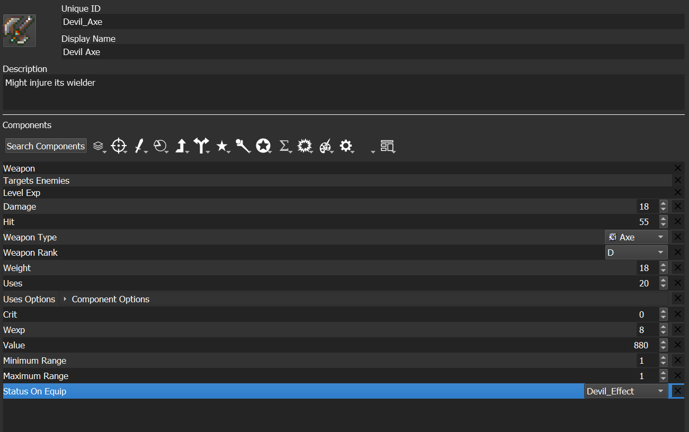

When implemented correctly, units wielding this axe will have a
percentage chance equal to (31 minus their Skill stat) to damage
themselves instead of their target.

## Conclusion<a href="Creating-Items.html#conclusion" class="headerlink"
title="Link to this heading"></a>

Hopefully this has given you a basic overview of what you can do with
Lex Talionis’ item components. A following post will detail each
component in detail, and the discord server as well as other LT projects
are great resources to turn to for more information.

<a href="index.html" class="btn btn-neutral float-left" accesskey="p"
rel="prev" title="Skill and Item Tutorials"> Previous</a>
<a href="Direct-Passives.html" class="btn btn-neutral float-right"
accesskey="n" rel="next"
title="1. Direct Passives - Hit +20, MAG +2 and Gamble">Next </a>

------------------------------------------------------------------------

© Copyright 2024, rainlash.

Built with [Sphinx](https://www.sphinx-doc.org/) using a
[theme](https://github.com/readthedocs/sphinx_rtd_theme) provided by
[Read the Docs](https://readthedocs.org).

