

<a href="../../../index.html" class="icon icon-home">lt-maker</a>

Contents:

- <a href="../../home.html" class="reference internal">Lex Talionis
  Wiki</a>

Getting Started:

- <a href="../../getting_started/index.html"
  class="reference internal">Getting Started</a>

Editor Guides:

- <a href="../../editors/Editors-Overview.html"
  class="reference internal">Editors Overview</a>
- <a href="../../editors/index.html"
  class="reference internal">Editors</a>

Events:

- <a href="../../events/index.html" class="reference internal">Events</a>

Guides:

- <a href="../Guides-Overview.html" class="reference internal">Guides
  Overview</a>
- <a href="../index.html" class="reference internal">Guides</a>
  - <a href="../setup_tutorials/index.html"
    class="reference internal">Project Setup Tutorials</a>
  - <a href="../eventing_tutorials/index.html"
    class="reference internal">Eventing Tutorials</a>
  - <a href="index.html" class="reference internal">Skill and Item
    Tutorials</a>
    - <a href="Creating-Items.html" class="reference internal">0. Creating
      Items</a>
    - <a href="Direct-Passives.html#" class="current reference internal">1.
      Direct Passives - Hit +20, MAG +2 and Gamble</a>
      - <a href="Direct-Passives.html#required-editors-and-components"
        class="reference internal">Required editors and components</a>
      - <a href="Direct-Passives.html#skill-descriptions"
        class="reference internal">Skill descriptions</a>
      - <a href="Direct-Passives.html#step-1-create-a-skill"
        class="reference internal">Step 1: Create a Skill</a>
      - <a href="Direct-Passives.html#step-2-assign-the-skill"
        class="reference internal">Step 2: Assign the Skill</a>
      - <a href="Direct-Passives.html#step-3-add-combat-component"
        class="reference internal">Step 3: Add combat component</a>
      - <a href="Direct-Passives.html#step-4-test-the-stat-alterations-in-game"
        class="reference internal">Step 4: Test the stat alterations in-game</a>
    - <a href="Conditional-Passives-I.html" class="reference internal">2.
      Conditional Passives I - Lucky Seven, Odd Rhythm, Wrath and Quick
      Burn</a>
    - <a href="Conditional-Passives-II.html" class="reference internal">4.
      Conditional Passives II - Warding Blow, Rainlashslayer</a>
    - <a href="Conditional-Passives-III.html" class="reference internal">3.
      Conditional Passives III - Tomefaire, Axe Breaker and Wyrmbane</a>
    - <a href="Tile-Passives.html" class="reference internal">4. Tile Oriented
      Passives - Outdoor Fighter and Indoor Fighter</a>
    - <a href="Auras.html" class="reference internal">3. Auras - Hex, Bond and
      Focus</a>
    - <a href="Skill-Swap.html" class="reference internal">[System] Skill
      Swap</a>
    - <a href="Creating-Capture.html" class="reference internal">Capture
      skill</a>
    - <a href="Recruit-Skill.html" class="reference internal">Recruit
      Skill</a>
    - <a href="Summoning.html" class="reference internal">Summoning</a>
    - <a href="Shelter-Skill.html" class="reference internal">Shelter
      Skill</a>
    - <a href="Multi-Items.html" class="reference internal">Multi Items</a>
    - <a href="Nihil.html" class="reference internal">Nihil</a>

appendix:

- <a href="../../appendix/Text-Formatting-Commands.html"
  class="reference internal">Text Formatting Commands</a>
- <a href="../../appendix/Item-Component-Reference.html"
  class="reference internal">Item Component Dictionary</a>
- <a href="../../appendix/Skill-Component-Reference.html"
  class="reference internal">Skill Component Dictionary</a>
- <a href="../../appendix/Special-Variables.html"
  class="reference internal">Special Variables</a>
- <a href="../../appendix/Special-Tags.html"
  class="reference internal">Special Tags</a>
- <a href="../../appendix/trigger-reference.html"
  class="reference internal">Event Triggers</a>
- <a href="../../appendix/Random-Seed-Mechanics.html"
  class="reference internal">Random Seed Mechanics</a>
- <a href="../../appendix/FAQ.html" class="reference internal">Frequently
  Asked Questions</a>
- <a href="../../appendix/Contributing_to_the_LTWiki.html"
  class="reference internal">Contributing to the LTWiki</a>
- <a href="../../appendix/index.html" class="reference internal">Code
  Documentation</a>

[lt-maker](../../../index.html)

- 
- [Guides](../index.html)
- [Skill and Item Tutorials](index.html)
- 1\. Direct Passives - Hit +20, MAG +2 and Gamble
- <a
  href="https://gitlab.com/rainlash/lt-maker/blob/master/docs/source/guides/skill_item_tutorials/Direct-Passives.md"
  class="fa fa-gitlab">Edit on GitLab</a>

------------------------------------------------------------------------

`Originally`` ``written`` ``by`` ``Hillgarm.`` ``Last`` ``Updated`` ``2022-09-01`

# 1. Direct Passives - Hit +20, MAG +2 and Gamble<a href="Direct-Passives.html#direct-passives-hit-20-mag-2-and-gamble"
class="headerlink" title="Link to this heading"></a>

Despite the name, skills are actually effects, which covers everything
from statuses (buffs/debuffs) to skills and additional actions. They can
be applied into units or terrain, and be triggered by other skills,
items, or events. In this tutorial series we will focus on class skills
as these can be less intuitive to make.

All of the elements used will be listed at the start of each guide, with
the new items written in **bold**. Each step will be fully described at
the first time, all following occurrences will be listed as the step
name instead.

**INDEX**

- **Required editors and components**

- **Skill descriptions**

- **Step 1: Create a Skill**

  - Step 1.1: Create a Class Skill

- **Step 2: Assign the Skill**

  - Step 2.1A: Assign the Skill to an Unit

  - Step 2.1B: Assign the Skill to a Class

  - Step 2.2: Inspect the skill in-game

- **Step 3: Add a combat components**

  - Step 3.A: **\[Hit +20\]** Add a Hit component

  - Step 3.B: **\[MAG +2\]** Add a Stat Change component

  - Step 3.C: **\[Gamble\]** Add a Stat Change component and a Crit
    component

- **Step 4: Check the stat alterations in-game**

- **Conclusion**

## Required editors and components<a href="Direct-Passives.html#required-editors-and-components"
class="headerlink" title="Link to this heading"></a>

- **Skills:**

  - **Attribute components - Class Skills**

  - **Combat components - Stat Change, Hit and Crit**

- **Units**

- **Classes**

## Skill descriptions<a href="Direct-Passives.html#skill-descriptions" class="headerlink"
title="Link to this heading"></a>

- **Hit +20** - Grants +20 Hit.

- **MAG +2** - Grants +2 Magic.

- **Gamble** - Grants -5 Hit and +10 Crit.

## Step 1: Create a Skill<a href="Direct-Passives.html#step-1-create-a-skill" class="headerlink"
title="Link to this heading"></a>

Open the **Skill Editor** in the **Edit Menu** and create a new
**Skill**.

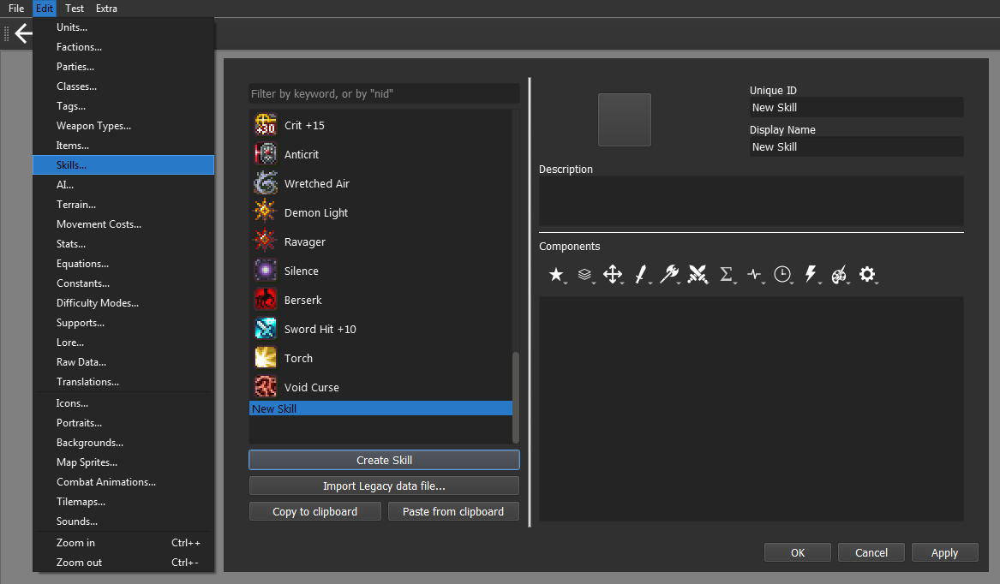

Our new skill has to have a completely unique name for the **Unique ID**
field. This will be how the engine will identify which skill is being
used or called. By default, the engine will auto fill the **Display
Name** with the **Unique ID** value, but you may change it at will. I’ll
be changing my skill name to be in lower case.

We can also give our skill a **Description** and an **Icon**, these are
important for in-game inspection.

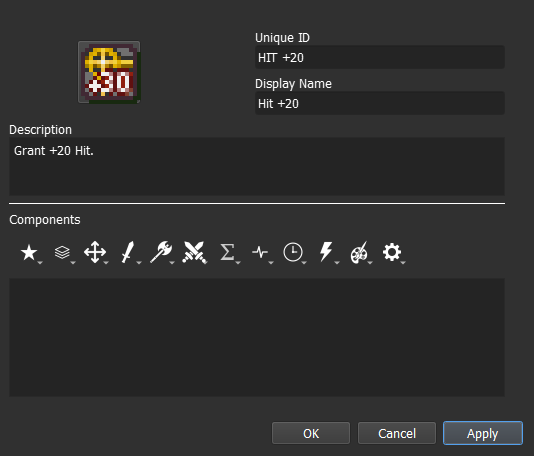

For our skill to do anything, we need to assign **Components**. You can
do it by clicking on the icons below the description box, which will
open a menu with multiple options to pick from.

### Step 1.1: Create a Class Skill<a href="Direct-Passives.html#step-1-1-create-a-class-skill"
class="headerlink" title="Link to this heading"></a>

To make our skill into a proper class skill, we need to give it the
**Class Skill** component. The option can be found within the
**Attribute Components** menu, represented by the **Star icon**.

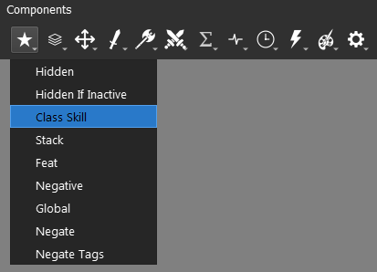

Skills that have the **Class Skill component** will show an inspectable
icon under the character’s stats. It is recommended to use this
component on all personal and class skills.

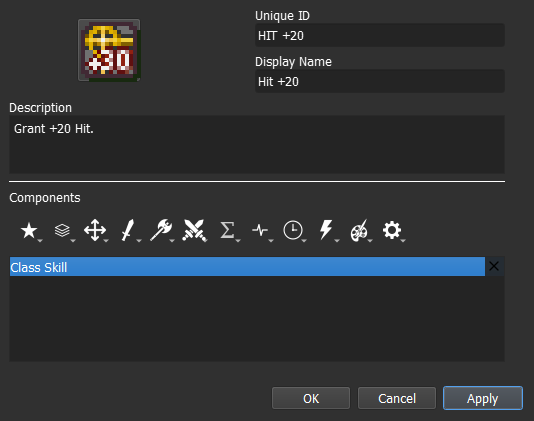

All the added **components** will be displayed individually within the
component box. Skills can have as many components as you see fit but
only one of each. They can also be reordered by dragging them up and
down the box.

You can get some additional information on any given component by
hovering over them, both in menu and once they are added. It’s a great
feature to know if you want to swim on your own.

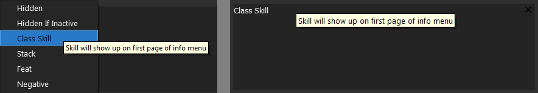

## Step 2: Assign the Skill<a href="Direct-Passives.html#step-2-assign-the-skill"
class="headerlink" title="Link to this heading"></a>

Before we get our skill to do anything, we need to know how to assign
our skill to a unit for testing purposes. There are a couple of options
available but for this tutorial we will stick to the **Class** and
**Unit** options. You may choose which one of these methods to use.

We will be using Eirika as our target unit for the following steps.

### Step 2.1A: Assign the skill to an Unit<a href="Direct-Passives.html#step-2-1a-assign-the-skill-to-an-unit"
class="headerlink" title="Link to this heading"></a>

Open the **Units Editor** in the **Edit Menu** and select the unit that
will get the skill. For this tutorial I will select the default **unit**
Eirika.

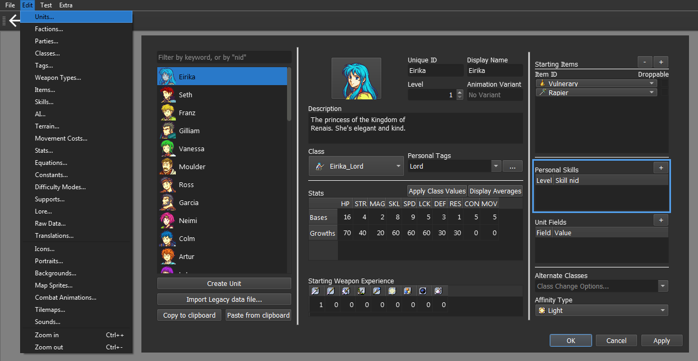

Click on the **+** button on the **Personal Skill** division to give
your unit a new skill, then select the desired skill. Keep the **Level**
parameter at 1 for testing purposes.

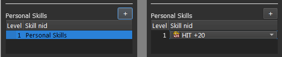

### Step 2.1B: Assign the skill to an Unit<a href="Direct-Passives.html#step-2-1b-assign-the-skill-to-an-unit"
class="headerlink" title="Link to this heading"></a>

Open the **Classes Editor** in the **Edit Menu** and select the class
that will get the skill. For this tutorial I will select the default
**class** Eirika_Lord.

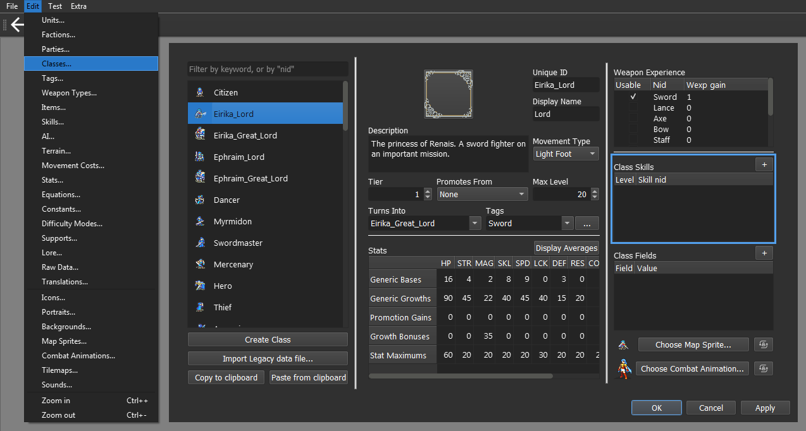

Click on the **+** button on the **Class Skill** division to give it a
new skill, then select the desired skill. You may change the **Level**
parameter in case you want to test other interactions.

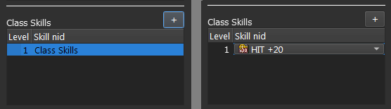

### Step 2.2: Inspect the skill in-game<a href="Direct-Passives.html#step-2-2-inspect-the-skill-in-game"
class="headerlink" title="Link to this heading"></a>

Select the desired chapter for testing. This chapter must contain at
least one unit that had the skill assigned by the chosen method.

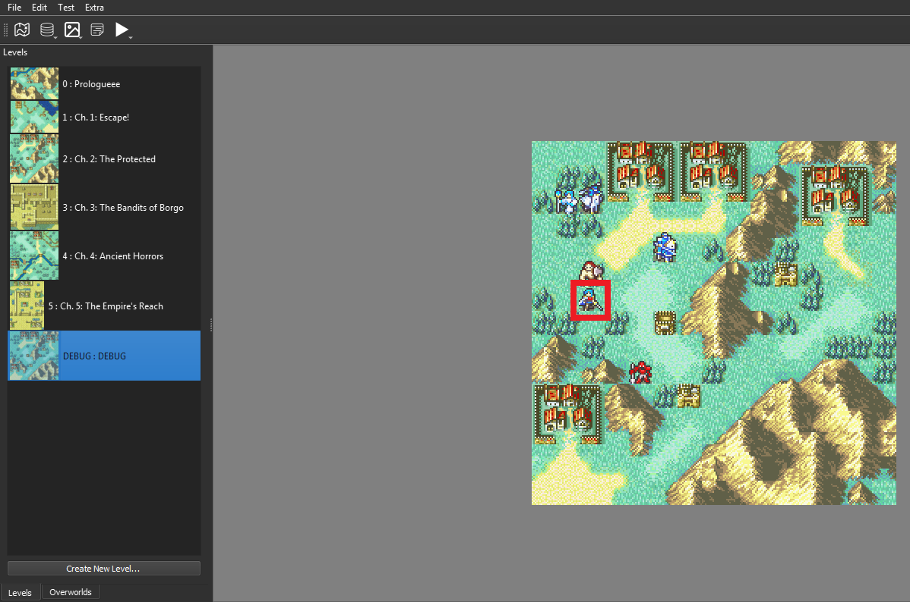

Click on the **Test Current Chapter** (F5) button in the **Test Menu**
to run it.

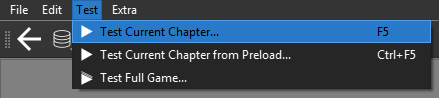

With the game running, we can now inspect the unit with the **Info
Key**. The default inputs for it are the **scroll button** (mouse) or
the **C key** (keyboard).

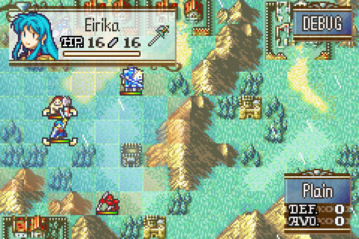

This will open the **unit information window**, allowing you to check
which effects are active.

If you assigned the **Class Skill component** to the skill, the icon
will displayed at page 1, at the bottom of the screen. Otherwise, it
will be displayed at page 3, within the status division, also at the
bottom.

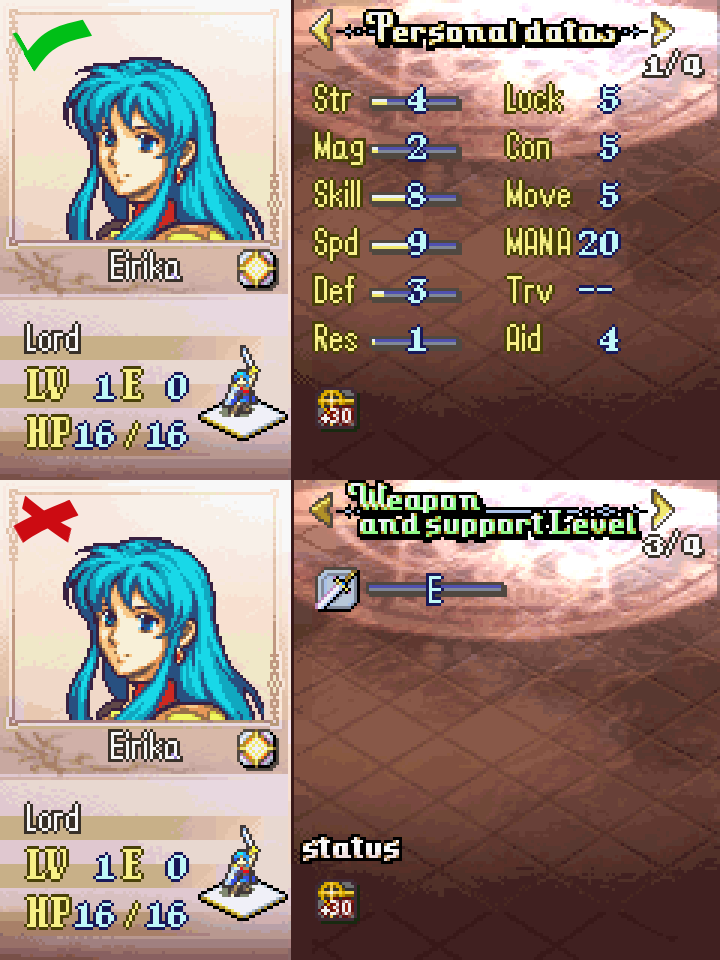

Use the **Info Key** again to check the name and description of your
skill.

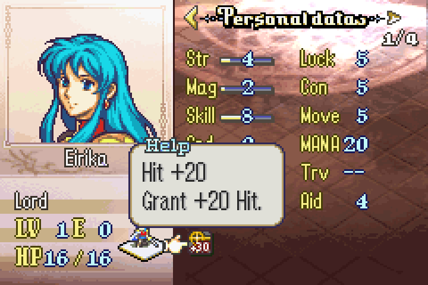

## Step 3: Add combat component<a href="Direct-Passives.html#step-3-add-combat-component"
class="headerlink" title="Link to this heading"></a>

All the components we will use in this tutorial belong to the **Combat
Components** menu, represented by the **(Single) Sword icon**.

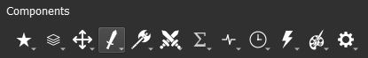

### Step 3.A: \[Hit +20\]( Add a Hit component<a href="Direct-Passives.md#step-3-a-hit-20-add-a-hit-component"
class="headerlink" title="Link to this heading"></a>

For *Hit +20*, we will need the **Hit component**. This component is an
individual integer type. It will only apply an increment to the **Hit
stat**.

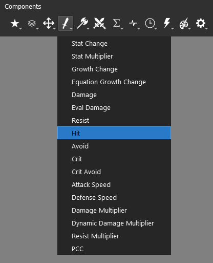

By default, the component will add the value to the **Hit stat**, always
being positive, but it can be negative if specified. Set the value to
20.

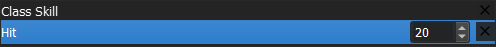

The end result should look like this:

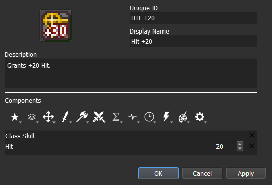

In-game, the **Hit stat** value is always displayed as its total sum. To
check if it is working properly, you can enable and disable the skill
comparing the stat changes for both scenarios.

### Step 3.B: \[MAG +2\] Add a Stat Change component<a
href="Direct-Passives.html#step-3-b-mag-2-add-a-stat-change-component"
class="headerlink" title="Link to this heading"></a>

For *MAG +2*, we will need the **Stat Change component**.

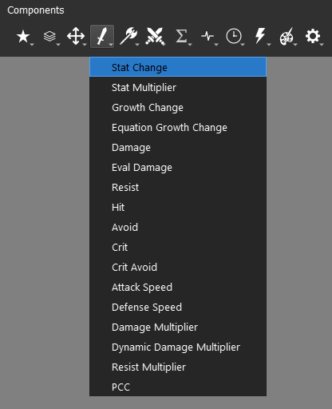

The **Stat Change component** is the one responsible for handling
additive **base stats** operations. It is similar to the **Hit
component** but instead of being a single stat, it is a list of all base
stats. We can add multiple stats to this component.

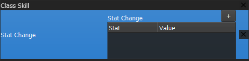

To add a new stat, click on the **+** button. Select the MAG **Stat**
and assign its **Value** to 2.

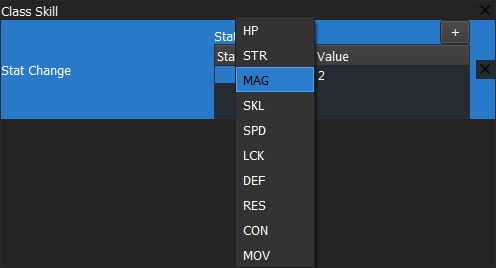

The end result should look like this:

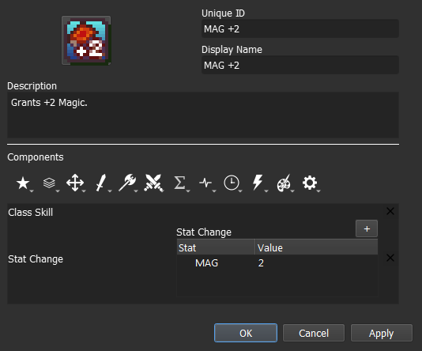

The majority of the **base stats** will have their value split into
**base value** and **bonus value** (in green). We can easily check it
in-game by inspecting the unit.

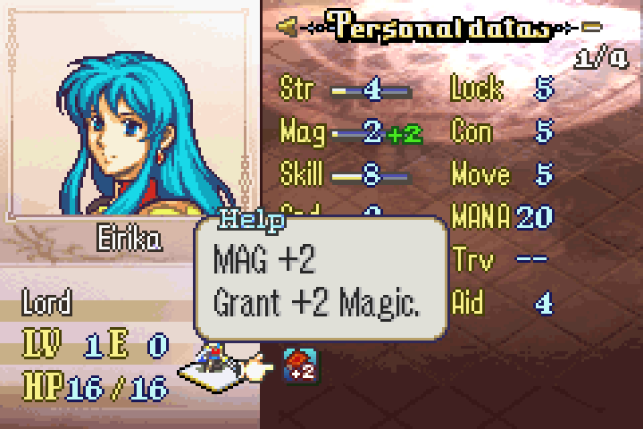

### Step 3.C: \[Gamble\] Add a Hit component and a Crit component<a
href="Direct-Passives.html#step-3-c-gamble-add-a-hit-component-and-a-crit-component"
class="headerlink" title="Link to this heading"></a>

For Gamble, we need to add both the **Hit component** and the **Crit
component**.

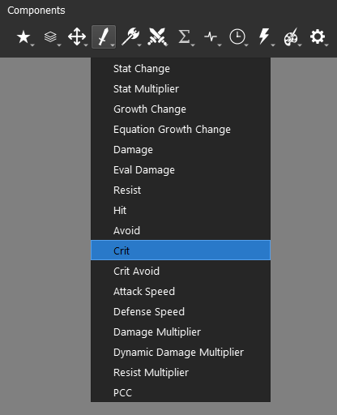

This time we will give **Hit component** a negative value. The end
result should look like this:

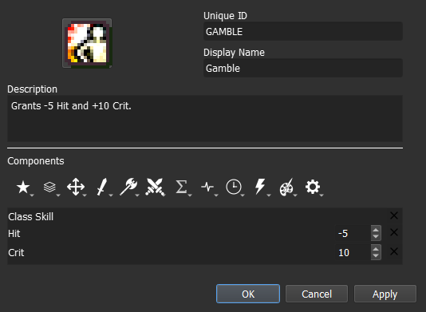

## Step 4: Test the stat alterations in-game<a href="Direct-Passives.html#step-4-test-the-stat-alterations-in-game"
class="headerlink" title="Link to this heading"></a>

All we have left is to check if our skill is working or not. Run a Test
where your playable unit has the skill and check the stats, then do the
same without the skill.

<a href="Creating-Items.html" class="btn btn-neutral float-left"
accesskey="p" rel="prev" title="0. Creating Items"> Previous</a>
<a href="Conditional-Passives-I.html"
class="btn btn-neutral float-right" accesskey="n" rel="next"
title="2. Conditional Passives I - Lucky Seven, Odd Rhythm, Wrath and Quick Burn">Next
</a>

------------------------------------------------------------------------

© Copyright 2024, rainlash.

Built with [Sphinx](https://www.sphinx-doc.org/) using a
[theme](https://github.com/readthedocs/sphinx_rtd_theme) provided by
[Read the Docs](https://readthedocs.org).

